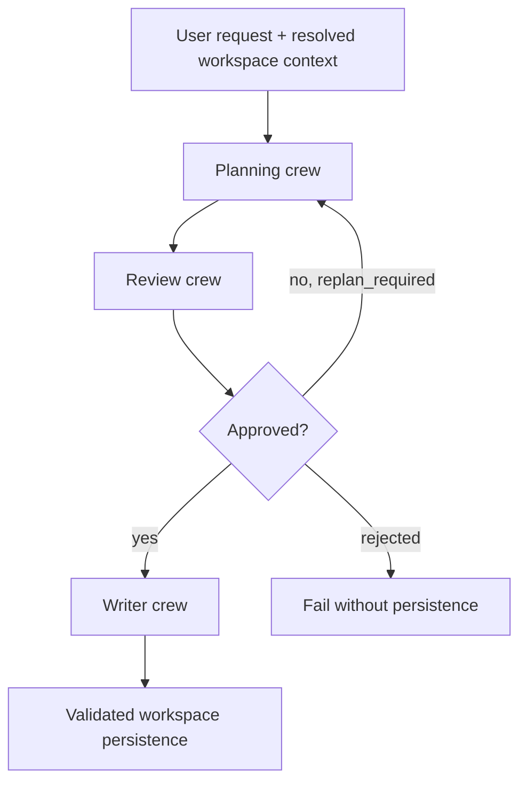
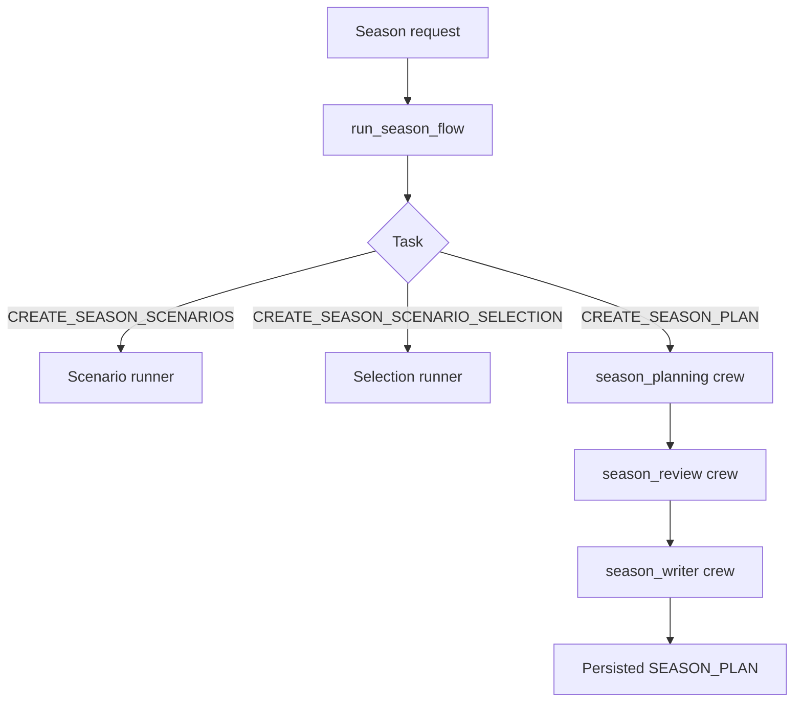
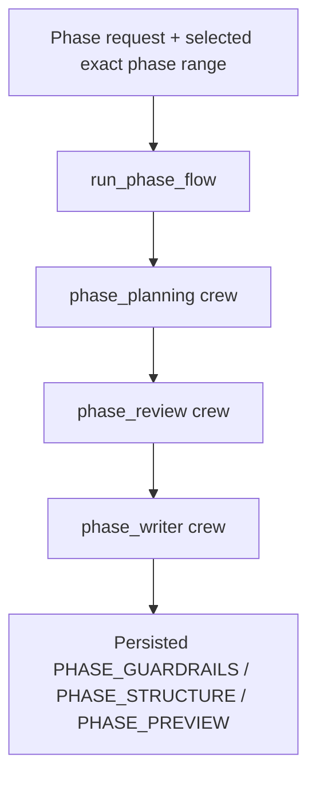
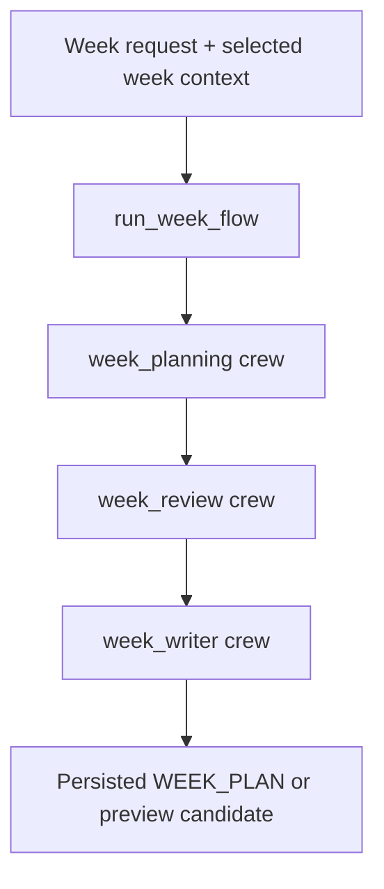
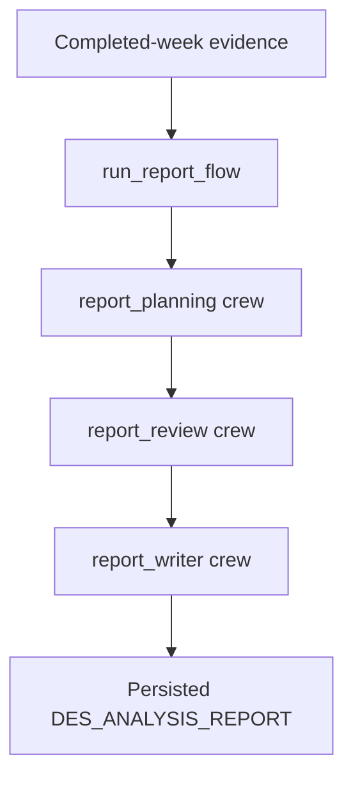
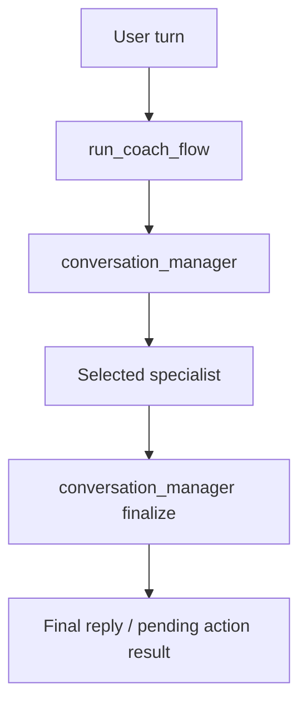

# CrewAI Flows and Specialist Crews

This document is the canonical catalog of CrewAI flow entrypoints, inner crews,
and runtime boundaries.

Use this together with:
- [doc/architecture/agents.md](agents.md)
- [doc/architecture/crewai_skills_attachment.md](crewai_skills_attachment.md)
- [doc/architecture/system_architecture.md](system_architecture.md)
- [doc/adr/ADR-048-skills-first-multi-crew-planning-runtime.md](../adr/ADR-048-skills-first-multi-crew-planning-runtime.md)
- [doc/adr/ADR-049-single-method-skill-attachment.md](../adr/ADR-049-single-method-skill-attachment.md)

## Runtime Policy Layers

The CrewAI runtime is split into explicit policy/config layers:

- `config/crewai/agents.yaml`
- `config/crewai/tasks.yaml`
- `config/crewai/skills.yaml`
- `config/crewai/knowledge_sources.yaml`
- `config/crewai/memory_policy.yaml`
- `config/crewai/task_policies.yaml`
- `config/crewai/runtime_profiles.yaml`
- `config/crewai/flow_persistence.yaml`

Boundary rules:
- validated workspace artifacts remain authoritative truth
- prompts contain runtime-local framing only
- skills own planning methodology
- deterministic helpers own availability-capacity and S5 load-band calculations
- `knowledge_sources` provide factual retrieval corpora only
- review stages decide `approved | replan_required | rejected`
- writer stages serialize only approved outputs

## Outer Flow Catalog

| Flow | Entry function | Runtime shape | Outputs |
| --- | --- | --- | --- |
| Season Flow | `run_season_flow(...)` | `season_scenarios` / `season_scenario_selection` single-step runners; `season_plan` multi-stage planning/review/writer path | `SEASON_SCENARIOS`, `SEASON_SCENARIO_SELECTION`, `SEASON_PLAN` |
| Phase Flow | `run_phase_flow(...)` | multi-stage planning/review/writer path backed by `run_phase_bundle_crewai(...)` | `PHASE_GUARDRAILS`, `PHASE_STRUCTURE`, `PHASE_PREVIEW`, optional `PHASE_FEED_FORWARD` |
| Week Flow | `run_week_flow(...)` | multi-stage planning/review/writer path, optionally preview-only | `WEEK_PLAN` or preview-only candidate |
| Report Flow | `run_report_flow(...)` | multi-stage planning/review/writer path around advisory report execution | `DES_ANALYSIS_REPORT` |
| Feed Forward Flow | `run_feed_forward_flow(...)` | ordered advisory chain: report -> season feed-forward -> phase feed-forward | `DES_ANALYSIS_REPORT`, `SEASON_PHASE_FEED_FORWARD`, `PHASE_FEED_FORWARD` |
| Coach Flow | `run_coach_flow(...)` | one conversational turn wrapper for routing, telemetry, and bounded operations | final reply plus optional pending/apply side effects |

## Planning Runtime Pattern

The binding planning domains now follow one standard pattern:

Notes:
- bounded replan loops are enforced in backend/runtime policy
- writer stages never invent new planning decisions
- preview-only week/chat operations stop before final persistence
- Season, Phase, Week, Report, and Coach receive deterministic planning context before reasoning. `src/rps/planning/deterministic_context.py` is the shared registry/renderer layer. Load context is produced by `src/rps/planning/load_bands.py` and includes availability capacity, `IF_ref_load`, logistics constraints, and S5 bands where a season corridor is available. Season scenario generation receives deterministic last-event horizon and cadence-option math from `src/rps/planning/season_structure.py`. Season planning receives selected-scenario structure and a phase-slot skeleton with fixed ids, ISO-week ranges, lengths, and shortened-slot flags.

## Season Flow

### Season Runtime Shape

### Season Planning Crew

- `season_context_specialist`
- `scenario_interpreter`
- `event_priority_specialist`
- `peak_window_specialist`
- `macrocycle_architect`
- `season_constraint_specialist`
- `season_historical_context_specialist`
- `season_kpi_guidance_specialist`
- `season_load_corridor_specialist`
- `season_progression_specialist`
- `season_plan_manager`

Purpose:
- produce one internal season planning bundle
- keep planning methodology inside season skills, not in prompts
- set realistic season corridors and cadence using injected availability-capacity constraints
- use selected-scenario phase math as the reference for phase count and shortened-phase handling

### Season Review Crew

- `season_plan_auditor`
- `season_governance_auditor`
- `season_constraints_reviewer`
- `season_review_manager`

Purpose:
- review macrocycle coherence, event priority logic, season corridor realism,
  and binding constraints
- decide approve, reject, or bounded replan
- reject schema-invalid cycles, cadence/deload contradictions, and unrealistic corridors above deterministic capacity unless the plan explicitly requests rework

### Season Writer Crew

- `season_artifact_writer`

Purpose:
- serialize only the approved `SEASON_PLAN` envelope

## Phase Flow

### Phase Runtime Shape

### Phase Planning Crew

- `phase_context_specialist`
- `phase_guardrail_band_specialist`
- `phase_execution_rules_specialist`
- `phase_structure_specialist`
- `phase_cadence_recovery_specialist`
- `phase_intensity_distribution_specialist`
- `phase_event_integration_specialist`
- `phase_preview_synthesizer`
- `phase_bundle_manager`

Purpose:
- build one internal `PhaseBundle`
- translate season authority into exact-range phase outputs
- copy injected deterministic S5 bands into phase load guardrails without widening or recalculation
- use `Deterministic Phase Execution Context` for exact required ISO weeks, phase length, target-week position, cycle, deload intent, phase events, fixed rest days, and S5 trace

### Phase Review Crew

- `phase_constraint_auditor`
- `phase_governance_auditor`
- `phase_structure_reviewer`
- `phase_preview_reviewer`
- `phase_review_manager`

Purpose:
- check constraint consistency, corridor realism, structure coherence, and
  preview derivation
- block phase guardrails whose weekly kJ bands contradict deterministic S5 bands
- block phase structure outputs whose emitted weeks do not match the injected phase ISO-week range

### Phase Writer Crew

- `phase_artifact_writer`

Purpose:
- serialize only approved phase envelopes

## Week Flow

### Week Runtime Shape

### Week Planning Crew

- `week_context_specialist`
- `week_constraint_specialist`
- `week_load_target_specialist`
- `week_recommendation_specialist`
- `week_revision_specialist`
- `week_workout_authoring_specialist`
- `week_plan_manager`

Purpose:
- turn phase guardrails and week constraints into one internal `WeekPlanBundle`
- support both normal planning and preview-only conversational reuse
- reconcile week load against the active Phase/S5 band with duration-first, recovery-protecting adjustments
- use `Deterministic Week Calendar and Availability Context` for exact Mon-Sun dates, day availability, fixed rest days, logistics/events per day, active S5 band, phase role, and event proximity

### Week Review Crew

- `week_consistency_auditor`
- `week_load_governance_reviewer`
- `week_workout_syntax_reviewer`
- `week_review_manager`

Purpose:
- reject role/load mismatches, corridor violations, and syntax/export issues
- block stored week plans whose `planned_weekly_load_kj` is outside the active corridor or whose workout payload is not exportable

### Week Writer Crew

- `week_artifact_writer`

Purpose:
- serialize only the approved `WEEK_PLAN` envelope

## Report Flow

### Report Runtime Shape

### Report Crews

Planning:
- `performance_context_specialist`
- `des_diagnostic_specialist`

Review:
- `des_review_manager`

Writer:
- `report_artifact_writer`

Purpose:
- keep DES analysis diagnostic-only
- separate report review from final serialization
- use `Deterministic Report Evidence Context` for completed-week activity versions, missing-data flags, and explicit no-direct-plan-change boundary

## Conversational Runtime

Coach and Workout Editor reuse week-domain logic but do not own planning
artifacts directly.

### Shared Conversational Flow Shape

Specialist pool:
- `week_context_specialist`
- `week_recommendation_specialist`
- `week_revision_specialist`
- `week_workout_authoring_specialist`
- `pending_resolution_specialist`

Rules:
- preview/apply semantics stay bounded to tools
- `Deterministic Coach Operation Context` declares selected athlete/week, allowed operations, pending status, and confirmation requirements
- conversational flows can reuse week methodology but do not bypass writer or
  store guardrails for normal plan generation

## Skills, Knowledge, and Memory

### Skills

- one method skill per agent
- crew-level skills are operational only
- `SKILL.md` is the primary method summary
- `references/` are supplemental

Canonical config:
- `config/crewai/skills.yaml`

### Knowledge Sources

Static factual corpora are configured in:
- `config/crewai/knowledge_sources.yaml`

These are retrieval aids, not the primary planning-method source.

### Memory

Shared/scoped memory is configured in:
- `config/crewai/memory_policy.yaml`

Rules:
- memory is assistive only
- artifact truth stays in validated workspace artifacts
- CrewAI memory embedder config now inherits `RPS_LLM_*` OpenAI credentials

### Runtime Profiles

Crew planning, agent reasoning, and model routing are configured in:
- `config/crewai/runtime_profiles.yaml`

Rules:
- CrewAI planning is crew-level only
- reasoning is agent-level only
- review and writer crews stay planning-free by default

## Persistence Boundaries

Persistence authority is code-owned and explicit:

- preview-only paths do not write final artifacts
- writer crews serialize approved documents only
- validated workspace persistence happens after normalization/guardrails

Examples:
- `run_week_flow(..., preview_only=True)` -> candidate only
- standard planning flow -> writer result -> validated store
- Coach/Workout Editor preview tools -> pending preview only until apply

## Related Files

- Outer flow wrappers: `src/rps/crewai_runtime/flows.py`
- CrewAI backend orchestration: `src/rps/agents/crewai_backend.py`
- Agent registry: `config/crewai/agents.yaml`
- Task registry: `config/crewai/tasks.yaml`
- Skill attachment model: `config/crewai/skills.yaml`
- Runtime policy: `config/crewai/runtime_profiles.yaml`
- Knowledge sources: `config/crewai/knowledge_sources.yaml`
- Memory policy: `config/crewai/memory_policy.yaml`
