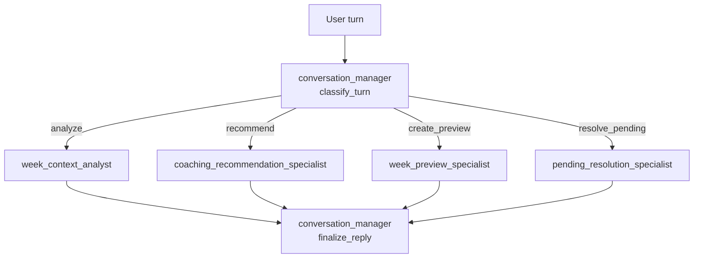

# CrewAI Flows and Specialist Crews

This document is the canonical catalog of CrewAI flow entrypoints, their responsibilities, participating agents, inputs, tool surfaces, and outputs.

Use this together with:
- [doc/architecture/agents.md](agents.md) for the top-level agent registry
- [doc/architecture/system_architecture.md](system_architecture.md) for the broader system context
- [doc/adr/ADR-045-coach-hierarchical-conversational-crew.md](../adr/ADR-045-coach-hierarchical-conversational-crew.md) for the Coach/Workout conversational runtime decision

## Purpose

The repository now uses two layers of orchestration:

1. Outer CrewAI Flows in `src/rps/crewai_runtime/flows.py`
   - These wrap major runtime entrypoints for telemetry, sequencing, and state transitions.
2. Inner agent execution
   - Persisted-artifact agents for planning/reporting
   - Hierarchical specialist crews for Coach and Workout Editor conversational turns

The distinction matters:
- the outer flow decides sequencing and telemetry boundaries
- the inner agent or crew decides domain reasoning and tool usage within that boundary

## Outer Flow Catalog

| Flow | Entry function | Primary job | Inner execution | Inputs | Outputs | Side effects |
| --- | --- | --- | --- | --- | --- | --- |
| Season Flow | `run_season_flow(...)` | Run one season-mode outer step | Single season agent task via `run_agent_multi_output(...)` | `AgentTask`, `user_input`, athlete workspace context, optional model overrides | result map with `ok`, `produced`, artifact payloads | Persists `SEASON_SCENARIOS`, `SEASON_SCENARIO_SELECTION`, or `SEASON_PLAN` depending on task |
| Phase Flow | `run_phase_flow(...)` | Run the phase bundle for one selected phase range | Hierarchical phase bundle via `run_phase_bundle_crewai(...)` | task list, `user_input`, selected phase context, optional model overrides | result map with produced phase artifacts | Persists `PHASE_GUARDRAILS`, `PHASE_STRUCTURE`, `PHASE_PREVIEW`, optionally `PHASE_FEED_FORWARD` |
| Week Flow | `run_week_flow(...)` | Create or revise one week plan | Week planner via `run_agent_multi_output(...)` or preview runner | task list, `user_input`, selected week context, optional `preview_only` | result map with produced `WEEK_PLAN` payload | Persists `WEEK_PLAN` on normal path; preview path returns candidate document without persistence |
| Report Flow | `run_report_flow(...)` | Run one advisory report step | Callback runner provided by caller | report callback, run metadata | result map for advisory report | Persists `DES_ANALYSIS_REPORT` through delegated runner |
| Feed Forward Flow | `run_feed_forward_flow(...)` | Chain report -> season delta -> phase delta | Three callbacks executed in order | report callback, season-phase callback, phase callback | `{report_result, season_phase_result, phase_result}` | Persists advisory chain artifacts when each stage succeeds |
| Coach Flow | `run_coach_flow(...)` | Wrap one conversational turn for telemetry and routing | Shared conversational crew runner via `chat_runner()` | `user_message`, chat history embedded by caller, workspace/run metadata | `{route, response}` | No direct persistence at wrapper level; inner tools may create previews or apply changes |

## Outer Flow Responsibilities

### Season Flow

- File: `src/rps/crewai_runtime/flows.py`
- Supported actions:
  - `season_scenarios`
  - `season_scenario_selection`
  - `season_plan`
- Route decision is deterministic from `AgentTask`.
- Tool surface is not defined in the flow itself. It comes from the `season_scenario` or `season_planner_manager` runtime/tool wiring.

Operational contract:
- input is one selected season task plus one natural-language `user_input`
- output is one persisted-artifact result map
- no multi-stage branching inside the outer flow

### Phase Flow

- File: `src/rps/crewai_runtime/flows.py`
- Delegates to `run_phase_bundle_crewai(...)`
- Treats the phase run as one bundle even if several phase outputs are requested

Operational contract:
- input is a list of phase tasks for one exact phase range
- output is one result map containing produced phase artifacts
- persistence remains deterministic after the manager consolidates the internal bundle

### Week Flow

- File: `src/rps/crewai_runtime/flows.py`
- Always routes to `week_plan`
- Supports `preview_only=True`

Operational contract:
- standard mode:
  - creates or revises persisted `WEEK_PLAN`
- preview mode:
  - runs the same week-planning reasoning path but returns a preview-only candidate `WEEK_PLAN`
  - caller decides whether that candidate becomes a pending preview or is discarded

### Report Flow

- File: `src/rps/crewai_runtime/flows.py`
- Thin telemetry wrapper around a provided report runner

Operational contract:
- no routing complexity
- one report callback in, one report result out

### Feed Forward Flow

- File: `src/rps/crewai_runtime/flows.py`
- Ordered chain:
  1. report
  2. season phase feed-forward
  3. phase feed-forward
- later stages are skipped when the previous stage is not `ok`

Operational contract:
- preserves deterministic sequencing between advisory outputs
- returns a structured three-part result even when later stages are skipped

### Coach Flow

- File: `src/rps/crewai_runtime/flows.py`
- Current route name is always `conversational_turn`
- The wrapper exists for:
  - telemetry
  - stable turn boundary
  - future route extension if needed

Operational contract:
- the wrapper does not interpret preview/apply/discard semantics
- all conversational reasoning is delegated into the shared specialist crew

## Shared Conversational Crew

The Coach and Workout Editor both use the shared runtime in `src/rps/crewai_runtime/coach_chat.py`.

### Shared Runtime Shape

### Turn Lifecycle

1. `conversation_manager` classifies the turn.
2. Exactly one specialist owns the main task.
3. The manager finalizes the reply in the user's language.
4. Persisted state changes happen only through specialist tools.

## Conversational Specialists

| Specialist | Primary task | Inputs | Tools | Output model | Knowledge focus |
| --- | --- | --- | --- | --- | --- |
| `conversation_manager` | classify and finalize one turn | surface context, chat history, current user message, specialist output | none by default | `TurnModeModel` for classification; plain text final reply for finalization | traceability + orchestration rules |
| `week_context_analyst` | summarize selected-week context | selected-week snapshots, read context, user question | read-only context tools | `WeekContextAssessmentModel` | interface/spec context only |
| `coaching_recommendation_specialist` | produce advice or adjustment intent | `WeekContextAssessmentModel`, user ask | normally no tools | `CoachingRecommendationModel` or `AdjustmentIntentModel` | planning principles, load estimation, overload policy, KPI signal policy |
| `week_preview_specialist` | create one bounded preview | `AdjustmentIntentModel`, selected-week context, pending preview context if present | preview tools only | `CoachPreviewSummaryModel` | week/preview operation rules |
| `pending_resolution_specialist` | inspect, apply, or discard existing preview | user turn, pending preview state | pending lifecycle tools only | `PendingResolutionResultModel` | apply/discard/show semantics |

## Conversational Tasks

The task definitions live in `config/crewai/tasks.yaml`.

| Task | Agent | Purpose | Output |
| --- | --- | --- | --- |
| `classify_turn` | `conversation_manager` | Route one turn to `analyze`, `recommend`, `create_preview`, or `resolve_pending` | `turn_mode` |
| `analyze_week_context` | `week_context_analyst` | Summarize current selected-week plan, actuals, and constraints | `week_context_assessment` |
| `form_recommendation_or_intent` | `coaching_recommendation_specialist` | Produce coaching advice or a structured adjustment intent | `coaching_recommendation` or `adjustment_intent` |
| `create_week_preview` | `week_preview_specialist` | Create exactly one preview from one intent | `coach_preview_result` |
| `resolve_pending_operation` | `pending_resolution_specialist` | Show, apply, or discard the active pending operation | `pending_resolution_result` |
| `finalize_reply` | `conversation_manager` | Convert specialist result into the final user-facing answer | final text |

## Surface-Specific Tool Visibility

Tool visibility is assigned by the page-level surface wiring, not by the outer flow.

### Coach Surface

Defined in `src/rps/ui/pages/coach.py`.

| Specialist | Tools |
| --- | --- |
| `week_context_analyst` | `read_current_plan_context`, `list_current_week_plan_workouts` |
| `coaching_recommendation_specialist` | none |
| `week_preview_specialist` | `preview_scoped_week_replan` |
| `pending_resolution_specialist` | `show_pending_coach_operation`, `apply_pending_coach_operation`, `discard_pending_coach_operation` |

Additional bounded Coach operations still exist in the page implementation for other surfaces of Coach functionality, including report/feed-forward previews and low-level edit operations. The shared conversational crew only receives the subset that is deliberately exposed for the current surface.

### Workout Editor Surface

Defined in `src/rps/ui/pages/plan/workouts.py`.

| Specialist | Tools |
| --- | --- |
| `week_context_analyst` | `list_current_week_plan_workouts` |
| `coaching_recommendation_specialist` | none |
| `week_preview_specialist` | `preview_move_workout`, `preview_change_start_time`, `preview_update_workout_text` |
| `pending_resolution_specialist` | `show_pending_week_plan_edit`, `apply_pending_week_plan_edit`, `discard_pending_week_plan_edit` |

## Knowledge Injection by Specialist

Knowledge injection is configured in `config/agent_knowledge_injection.yaml`.

| Specialist | Injected emphasis |
| --- | --- |
| `conversation_manager` | traceability and file-naming rules only |
| `week_context_analyst` | interface-level athlete/event/logistics/availability/wellness specs |
| `coaching_recommendation_specialist` | load estimation, durability-first principles, durability evidence, overload policy, KPI signal policy |
| `week_preview_specialist` | phase/week and week/export contracts plus mandatory week output spec |
| `pending_resolution_specialist` | traceability only |

This split is intentional:
- domain coaching knowledge is concentrated in the recommendation specialist
- operational preview/apply specialists stay narrow
- the manager does not become a second broad planning model

## Inputs and Outputs by Flow Family

### Planning flows

| Flow family | Main inputs | Main outputs |
| --- | --- | --- |
| Season | athlete profile, planning events, logistics, availability, wellness, KPI profile, optional scenarios/selection | `SEASON_SCENARIOS`, `SEASON_SCENARIO_SELECTION`, `SEASON_PLAN`, optional `SEASON_PHASE_FEED_FORWARD` |
| Phase | `SEASON_PLAN`, selected phase range, availability, wellness, zone model, planning events, logistics, optional season feed-forward | `PHASE_GUARDRAILS`, `PHASE_STRUCTURE`, `PHASE_PREVIEW`, optional `PHASE_FEED_FORWARD` |
| Week | `PHASE_GUARDRAILS`, `PHASE_STRUCTURE`, availability, wellness, planning events, logistics, optional existing `WEEK_PLAN` | `WEEK_PLAN` or preview-only candidate `WEEK_PLAN` |

### Advisory flows

| Flow family | Main inputs | Main outputs |
| --- | --- | --- |
| Report | `ACTIVITIES_ACTUAL`, `ACTIVITIES_TREND`, wellness, optional season context | `DES_ANALYSIS_REPORT` |
| Feed Forward | report result, season context, phase context | `SEASON_PHASE_FEED_FORWARD`, `PHASE_FEED_FORWARD` |

### Conversational flows

| Surface | Main inputs | Main outputs |
| --- | --- | --- |
| Coach | chat history, selected-week snapshot memory, current-week status snapshot, pending coach operation, user message | final reply, optional pending preview mutations, optional persisted `WEEK_PLAN` / `INTERVALS_WORKOUTS` / advisory outputs via bounded tools |
| Workout Editor | chat history, selected `WEEK_PLAN`, pending week-plan edit, user message | final reply, optional pending week-plan edit mutations, optional persisted `WEEK_PLAN` + `INTERVALS_WORKOUTS` |

## Persistence Boundaries

The important boundary is not the manager/specialist split. It is whether the invoked tool or runner is preview-only or apply/persist.

- Preview-only examples:
  - `preview_scoped_week_replan`
  - `preview_move_workout`
  - `preview_change_start_time`
  - `preview_update_workout_text`
- Persist/apply examples:
  - `apply_pending_coach_operation`
  - `apply_pending_week_plan_edit`
  - standard `run_week_flow(..., preview_only=False)`

Safe behavior expectations:
- preview tools must not claim persistence
- apply tools must be the only point that writes final artifacts for the conversational surfaces
- outer flow wrappers should remain thin and not duplicate conversational decision logic

## Related Files

- Outer flows: `src/rps/crewai_runtime/flows.py`
- Shared conversational runtime: `src/rps/crewai_runtime/coach_chat.py`
- Agent definitions: `config/crewai/agents.yaml`
- Task definitions: `config/crewai/tasks.yaml`
- Knowledge injection: `config/agent_knowledge_injection.yaml`
- Coach surface wiring: `src/rps/ui/pages/coach.py`
- Workout Editor surface wiring: `src/rps/ui/pages/plan/workouts.py`
