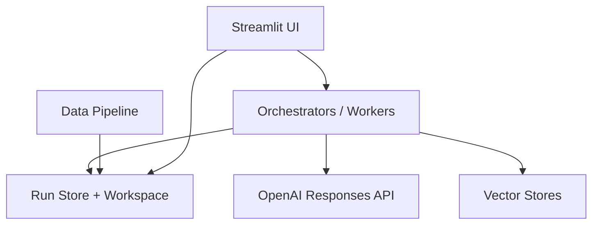
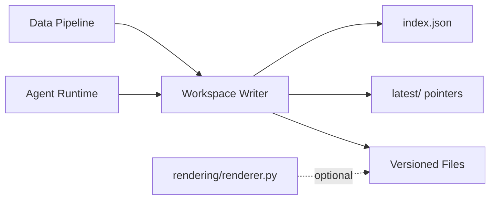

# System Architecture

Version: 2.3  
Status: Updated  
Last-Updated: 2026-02-06

---

Note: In this documentation, “season” refers to season-level planning. The season plan is the season artefact.

## 1. Purpose & Scope

This document describes the technical architecture of the training planning system.
It covers:

- system components and responsibilities
- artifact contracts and validation
- prompt and knowledge delivery
- runtime storage and traceability

It is a system document, not a coaching manual.
See `doc/adr/README.md` for architecture decisions.

---

## 2. System Overview

The system decomposes planning into specialized roles with strict authority boundaries.
Agents communicate via validated artifacts and never share implicit state.

### 2.1 End-to-End Flow (High Level)

```mermaid
flowchart TD
  AP[athlete_profile] --> SS[Season-Scenario-Agent]
  KP[kpi_profile] --> SS
  SS --> SC[season_scenarios]
  SC -. advisory .-> MA[Season-Planner]
  KP --> MA
  PE[planning_events] -. info .-> SS
  LG[logistics] -. info .-> SS
  PE -. info .-> MA
  LG -. info .-> MA
  MA --> MO[season_plan]
  MA -. optional .-> SPFF[season_phase_feed_forward]

  MO --> ME[Phase-Architect]
  SPFF -. optional .-> ME
  ME --> BG[phase_guardrails]
  ME --> BEA[phase_structure]
  ME -. optional .-> BEP[phase_preview]

  BG --> MI[Week-Planner]
  BEA --> MI
  MI --> WP[week_plan]
  WP --> WB[Workout-Builder]
  WB --> WJ[workouts_yyyy-ww.json]
  WJ --> POST[Post to Intervals (commit)]

  DP[Data Pipeline\nparse-intervals] --> AA[activities_actual]
  DP --> AT[activities_trend]
  DP --> ZM[zone_model]
  DP --> WL[wellness]
  VA[Validation\nvalidate_outputs.py] -. checks .-> AA
  VA -. checks .-> AT
  AA --> PA[Performance-Analyst]
  AT --> PA
  ZM -. info .-> ME
  ZM -. info .-> MI
  WL -. info .-> MA
  WL -. info .-> ME
  PA --> DR[des_analysis_report]
  DR -. advisory .-> MA
```

**Core components**

1. **LLM Responses Runtime**
   - Tool-calling loop (knowledge_search + function tools).
2. **Local Vector Stores**
   - Local knowledge base (sources in repo; embeddings built locally).
3. **Prompt Loader**
   - Shared system prompt + per-agent prompt from `prompts/`.
4. **Workspace Storage**
   - Local file store under `var/athletes/` with versioned artifacts and `index.json`.
5. **Schema Validation**
   - JSON schema validation for all artifacts (envelope or raw payload).
6. **Orchestrator (optional)**
   - `plan-week` for Season → Phase → Week → Builder → Analysis sequencing.
7. **Run Store**
   - Per-run JSON state under `runs/<run_id>/run.json`, `steps.json`, and `events.jsonl`.
   - Background jobs (data pipeline, housekeeping, agent reports) also write run records with `process_type`/`process_subtype`.
   - Use the background run tracker helper to standardize status updates.
   - Scheduling guards block concurrent runs sharing the same type/subtype and prevent lower-priority planning runs while higher-priority ones are active.
8. **Streamlit UI (optional)**
   - Browser control surface: `PYTHONPATH=src streamlit run src/rps/ui/streamlit_app.py`.
   - Multi-page UI with Plan Hub, Plan subpages, Analyse, Athlete Profile, and System tooling.
   - Performance readiness (DES analysis / performance report) is surfaced on Performance pages (Feed Forward + Report), not in Plan Hub planning readiness.
   - Planning runs are initiated from Plan Hub; Plan → Week is read-only, Plan → Season only handles scenario selection.

---

## C4 Diagrams

This section provides system-level C4 views. UI flows are documented separately in `doc/ui/ui_spec.md`.

### C4: Container View (Simplified)



---

## 3. Agent Roles & Responsibilities

See `doc/architecture/agents.md` for the canonical registry of agents, modes, and IO.

### 3.1 Performance-Analyst
- Diagnostic only, advisory output.
- Consumes factual data + planning context.
- Produces `des_analysis_report` (advisory).

### 3.1.1 Data Pipeline (Assumed)

- Deterministic scripts ingest external activity data.
- Writes `activities_actual`, `activities_trend`, `zone_model`, and `wellness` into the athlete workspace.
- `availability` is a user-managed input (manual edits + optional legacy import).
- Updates `latest/` so planners and the Plan Hub always read the freshest factual data.
- Pipeline entrypoint: `python -m rps.main parse-intervals`.
- Legacy Season Brief availability parser: `python -m rps.main parse-availability` (deprecated).
- Validation helper: `scripts/validate_outputs.py`.
- Outputs are CSV+JSON under `data/` plus mirrored `latest/` copies.

### 3.2 Season-Scenario-Agent
- Produces `season_scenarios` (informational).
- Uses Athlete Profile + Planning Events + Logistics + KPI Profile + Availability to propose A/B/C options.
- No planning decisions; Season-Planner remains binding authority.

### 3.3 Season-Planner
- Defines long-term intent (8–32 weeks).
- Produces `season_plan` and optional `season_phase_feed_forward`.
- Uses wellness `body_mass_kg` + Availability to anchor kJ corridor math.
- **Important:** Season phases define ISO week ranges, but MUST NOT define phase-artefact outputs.

### 3.4 Phase-Architect
- Converts season phase intent into phase guardrails and phase structure.
- **Phase ranges are derived from season phases**, not calendar alignment.

### 3.5 Week-Planner
- Produces weekly execution plan (`week_plan`).
- Must comply with governance + phase structure.

### 3.6 Workout-Builder
- Deterministic conversion into Intervals.icu JSON (raw export payload).
- No planning decisions.

---

## 4. Knowledge Delivery

- **Prompts** live in `prompts/` and are loaded at runtime.
- **Knowledge sources** live in `knowledge/` and are synced to a local Qdrant vector store.
- At runtime, agents use the `knowledge_search` function tool for retrieval.

### 4.1 Vector Stores

#### 4.1.1 Stores, Purpose, and Contents

The system uses a single shared store for all agents:

- `vs_rps_all_agents`: unified knowledge store containing all specs, contracts,
  policies, schemas, and prompts used across agents.

Knowledge sources live under `knowledge/_shared/` and are listed in
`knowledge/all_agents/manifest.yaml`. The vector store itself is local state.

```mermaid
flowchart LR
  SRC[knowledge/all_agents/manifest.yaml] --> SYNC[background sync (Streamlit)]
  SYNC --> VS[(Qdrant Local)]
  VS --> FS[knowledge_search tool]
  FS --> AG[Agent Runtime]
```

#### 4.1.2 Handling (Init / Update / Delete)

Vector stores are rebuilt locally during background sync when the manifest hash changes.
Manual verification uses `python scripts/smoke_vectorstores.py`.

#### 4.1.3 Background Sync (Streamlit)

Streamlit startup performs a background sync check using a deterministic
manifest hash (manifest + source file hashes). If the hash differs from the
last synced hash stored in `.cache/vectorstores_state.json`, the store is reset
and fully re-synced. This is tracked as a background run with
`process_type=system_housekeeping` and `process_subtype=vectorstore_sync`.

Environment controls:

```
RPS_VECTORSTORE_SYNC_INTERVAL_MINUTES=60
RPS_DISABLE_VECTORSTORE_SYNC=1
```

Example:

Local Qdrant collections are rebuilt during sync from the manifest and source files.

Notes:
- The sync writes `.cache/vectorstores_state.json` to map store names to local collection IDs.
- Collections are rebuilt locally when the manifest hash changes.

#### 4.1.3 Vector Store Attributes and Filters

During sync, each source file is annotated with attributes derived from its
YAML header (Markdown) or schema/meta fields (JSON). These attributes are used
to filter `knowledge_search` results.

Common attributes:
- `type`, `specification_for`, `specification_id`
- `interface_for`, `interface_id`
- `template_for`, `template_id`
- `contract_name`, `status`
- `scope`, `authority`, `version`
- `applies_to`, `explicitly_not_for`
- `normative_role`, `decision_authority`
- `doc_type`, `schema_id`, `schema_title`, `schema_for`

Example filters:
- Specs/policies/principles: `type=Specification` + `specification_for=WORKOUT_POLICY`
- Interfaces: `type=InterfaceSpecification` + `interface_for=ATHLETE_PROFILE`
- Templates: `type=Template` + `template_for=ATHLETE_PROFILE`
- Schemas: `doc_type=JsonSchema` + `schema_id=week_plan.schema.json`

`knowledge_search` is for static knowledge sources only. Runtime athlete artifacts
are fetched via workspace tools.

#### 4.1.4 Agent Access Hints (Summary)

These are runtime access expectations per agent/mode. Knowledge sources should be
queried via `knowledge_search` with attribute filters; athlete artefacts come from
workspace tools.

Season-Planner
- Mode A: Athlete profile + planning events + logistics via `workspace_get_input`, KPI via `workspace_get_latest(KPI_PROFILE)`.
- Mode B: Athlete profile + planning events + logistics, KPI, existing season plan via `workspace_get_latest(SEASON_PLAN)`.
- Mode C: DES report via `workspace_get_latest(DES_ANALYSIS_REPORT)` plus planning events/logistics (optional context).

Phase-Architect
- Mode A (new phase): `workspace_get_phase_context(year, week)` and optional `offset_phases=1`; optional `SEASON_PHASE_FEED_FORWARD`, `ACTIVITIES_TREND`, planning events/logistics.
- Mode B (update): `workspace_get_phase_context`, optional `SEASON_PHASE_FEED_FORWARD`, `ACTIVITIES_ACTUAL`, planning events/logistics.
- Mode C (no-change): `workspace_get_phase_context`, optional planning events/logistics.

Week-Planner
- Mode A/B: `workspace_get_phase_context`, optional planning events/logistics.
- Mode C: `workspace_get_phase_context`, optional `PHASE_FEED_FORWARD`, planning events/logistics.

Performance-Analyst
- Required: `ACTIVITIES_ACTUAL`, `ACTIVITIES_TREND`, `KPI_PROFILE` via `workspace_get_latest`.
- Optional: `SEASON_PLAN`, `workspace_get_phase_context`, planning events/logistics.

Workout-Builder
- Required: `WEEK_PLAN` via `workspace_get_latest` (or `workspace_get_version` for a specific week).

#### 4.1.5 Per-Agent Mapping and Available Tools

Each agent attaches a single store at runtime:

- Single shared store for all agents (`vs_rps_all_agents`)

Tools available to agents:

- `knowledge_search` (with `vector_store_ids=[agent]`)
- Workspace read tools:
  - `workspace_get_latest`
  - `workspace_get_version`
  - `workspace_list_versions`
  - `workspace_get_phase_context`
  - `workspace_get_input` (athlete_profile, planning_events, logistics)
- Strict store tools (one per output artefact, schema-bound)

These tool sets are wired by the runtime and are consistent across agents.
File search is forced by default; use `--no-file-search` if you need to disable it.

### 4.2 Runtime Knowledge Injection (Base + Mode Bundles)

In addition to `knowledge_search`, the runtime injects selected knowledge files
directly into the system prompt.

Configuration:
- `config/agent_knowledge_injection.yaml`

Model:
- Base phase (always injected): `agents.<agent>.inject`
- Mode phase (one bundle per run):
  - `agents.<agent>.modes.<mode>.bundle_id`
  - `agents.<agent>.bundles[].inject`

Effective injection for a run:
- base `inject` + selected bundle `inject` (+ any mode-specific `inject`)
- duplicates are removed while preserving order

Modes are chosen by the orchestrator/runner based on the task
(for example: `season_plan` vs `feed_forward`, or
`phase_guardrails` vs `phase_structure`, or `coach`).

#### 4.1.4 Operational Limits

- Keep single files reasonably small (split large PDFs into chapters).
- Prefer fewer, higher-signal sources over many redundant files.
- Avoid frequent full resyncs; use delta upload in `sync_vectorstores.py` when running manual recovery.
- Remember that chunking and embeddings are managed by OpenAI (remote state).

#### 4.1.5 Data Sensitivity

- Never upload private or licensed material without explicit permission.
- Keep athlete-specific data out of vector stores; use `var/athletes/`.
- Avoid placing any API keys or secrets in `knowledge/`.

#### 4.1.6 Incident Playbook

If a store gets out of sync or corrupted:

1. Re-run `python scripts/sync_vectorstores.py` (deprecated; use only for manual recovery).
2. If needed, use `--prune` to remove remote files missing locally.
3. If a store must be rebuilt:
   - Create a new store name.
   - Update `manifest.yaml` and re-sync.
   - Update `.env` or `.cache/vectorstores_state.json`.

---

## 5. Workspace & Traceability

### 5.1 Workspace Handling (Local Files)

The workspace is a **local, append-only file store** under `var/athletes/<athlete_id>/`.
It is the single source of truth for planning artefacts and factual data in dev.

**Directory layout**

```
var/athletes/<athlete_id>/
  data/
    plans/season/
    plans/phase/
    plans/week/
    analysis/
    exports/
    YYYY/WW/
  latest/
  index.json
  logs/
```



**Key rules**

- Every write creates a **versioned file** (e.g. `phase_structure_2026-05--2026-08.json`).
- `latest/` holds the most recent version per artefact type.
- `index.json` tracks per-version metadata for routing and exact range lookups.
- Streamlit startup prunes missing index entries and orphaned rendered sidecars in the background to keep `index.json`, `latest/`, and `rendered/` consistent.
- The workspace is **gitignored** and should never be committed.

**Data pipeline outputs**

The data pipeline writes factual artefacts and mirrors them to `latest/`:

- `activities_actual_yyyy-ww.json`
- `activities_trend_yyyy-ww.json`

These are validated against schemas and indexed for downstream analysis.

**Rendering (optional)**

Use `rps.rendering.renderer.render_json_sidecar` to generate human-readable sidecars from JSON.

---

Artifacts are stored under `var/athletes/<athlete_id>/data/`:

- `data/plans/season/`, `data/plans/phase/`, `data/plans/week/`, `data/analysis/`, `data/exports/`
- `data/YYYY/WW/` holds data pipeline snapshots (CSV + JSON)
- `latest/` contains the most recent artifact per type.
- `index.json` records per-version metadata for lookup and routing.

All artifacts are **append-only**; updates are new versions with new run IDs.

---

## 6. Validation & Contracts

- Artifacts are validated against schemas under `schemas/`.
- Envelope artifacts use `{ "meta": { ... }, "data": { ... } }`.
- Raw payloads (e.g., Intervals export) are validated against their raw schema.

Authority values are enforced by schema (Binding/Derived/Informational/Factual).
The local store normalizes legacy labels (e.g., Structural → Derived).

## 6.1 Artefact Renderer

- Module: `src/rps/rendering/renderer.py`
- Templates: `src/rps/rendering/templates/*.md.j2`
- Purpose: produce human-readable `.md` sidecars (informational only).

---

## 7. Orchestration (Optional)

The `plan-week` command runs a staged plan if required artifacts are missing:

1. Season
2. Phase (phase guardrails + execution arch)
3. Week (weekly plan)
4. Builder (Intervals export)
5. Analysis (DES report)

Routing uses:
- Season phase → phase range resolution
- `index.json` for exact range matching

---

## 8. Design Principles

- **Contract-first:** inputs/outputs are explicit.
- **Deterministic storage:** local workspace is append-only.
- **Separation of concerns:** knowledge vs runtime data.
- **Strict validation:** schema compliance before persistence.
- **Traceability:** every artifact records run ID and upstream references.

---

## 9. Non-Goals

- Automatic scheduling without explicit artifacts.
- Silent edits of existing artifacts.
- Embeddings or vector store state inside the repo.

---

## 10. Build & Setup Checklist

Use this checklist to initialize a fresh environment:

1. Copy `.env.example` to `.env` and set `RPS_LLM_API_KEY`, `ATHLETE_ID`,
   `API_KEY`, and `BASE_URL`.
2. Install dependencies: `pip install -r requirements.txt` or `pip install -e .`
   (depending on how you set up the repo).
3. Add knowledge sources under `knowledge/_shared/sources/` and update `knowledge/all_agents/manifest.yaml`.
4. Build bundled schemas: `python scripts/bundle_schemas.py`.
5. Vector store sync runs in the UI background (auto-rebuild on manifest changes).
6. (Optional) Run smoke test: `python scripts/smoke_vectorstores.py --store vs_rps_all_agents`.
7. Run data pipeline: `python -m rps.main parse-intervals`.
8. Validate outputs: `python scripts/validate_outputs.py`.

---

## End
