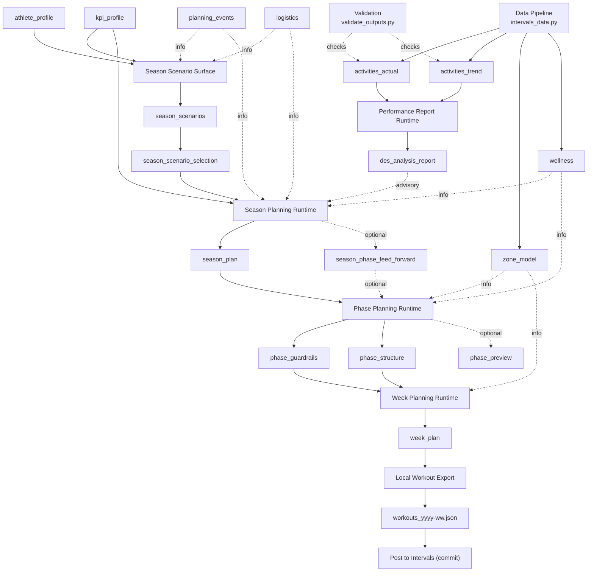
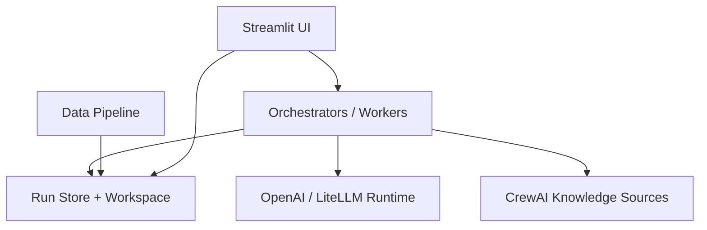
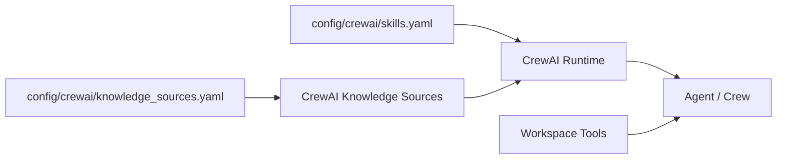
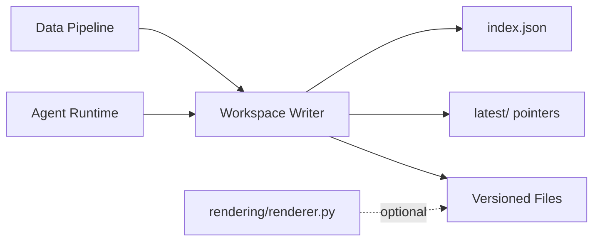

# System Architecture

Note: In this documentation, “season” refers to season-level planning. The season plan is the season artefact.

## 1. Purpose & Scope

This document describes the technical architecture of the training planning system.
It covers:

- system components and responsibilities
- artifact contracts and validation
- prompt and knowledge delivery
- runtime storage and traceability

It is a system document, not a coaching manual.
See [doc/adr/README.md](../adr/README.md) for architecture decisions. See [doc/architecture/crewai_flows.md](crewai_flows.md) for the canonical CrewAI flow and specialist-crew catalog.

---

## 2. System Overview

The system decomposes planning into specialized roles with strict authority boundaries.
Agents communicate via validated artifacts and never share implicit state.

### 2.1 End-to-End Flow (High Level)



**Core components**

1. **CrewAI Runtime**
   - CrewAI Agent/Task execution with typed outputs and workspace tools.
   - Outer Season, Phase, Week, Report, Feed-Forward, and Coach turn routing now runs through CrewAI Flow wrappers.
   - Season, Phase, Week, and Report use planning/review/writer staging internally.
   - Specialist agents are single-method skill carriers; writer agents serialize only final envelopes.
2. **CrewAI Knowledge Sources**
   - Static knowledge base declared in `config/crewai/knowledge_sources.yaml`.
3. **Prompt Loader**
   - Shared system prompt + per-agent prompt from `prompts/`.
4. **Workspace Storage**
   - Local file store under `runtime/athletes/` with versioned artifacts and `index.json`.
5. **Schema Validation**
   - JSON schema validation for all artifacts (envelope or raw payload).
6. **Orchestrator (optional)**
  - `plan-week` for Season → Phase → Week → Builder → Analysis sequencing.
  - Season, Phase, Week, Report, and Feed-Forward entrypoints use CrewAI Flow wrappers while guarded store and deterministic export remain code-owned boundaries.
7. **Run Store**
  - Per-run JSON state under `runtime/athletes/<athlete_id>/runs/<run_id>/run.json`, `steps.json`, and `events.jsonl`.
  - Direct foreground Coach and page-triggered CrewAI runs now map CrewAI-native Flow/Crew/Task/Tool events through a central event-listener adapter into additive `FLOW_*`, `CREW_*`, `TOOL_*`, and `ARTEFACT_WRITTEN` rows in `events.jsonl`, with compact normalized crew/task/tool labels for readable diagnostics.
   - Background jobs (data pipeline, housekeeping, agent reports) also write run records with `process_type`/`process_subtype`.
   - Use the background run tracker helper to standardize status updates.
   - Scheduling guards block concurrent runs sharing the same type/subtype and prevent lower-priority planning runs while higher-priority ones are active.
8. **Streamlit UI (optional)**
   - Browser control surface: `PYTHONPATH=src streamlit run src/rps/ui/streamlit_app.py`.
   - Multi-page UI with Plan Hub, Plan subpages, Analyse, Athlete Profile, and System tooling.
   - Performance readiness (DES analysis / performance report) is surfaced on Performance pages (Feed Forward + Report), not in Plan Hub planning readiness.
   - Planning runs are initiated from Plan Hub; Plan → Week is read-only, Plan → Season only handles scenario selection.

---

## C4 Diagrams

This section provides system-level C4 views. UI flows are documented separately in [doc/ui/ui_spec.md](../ui/ui_spec.md).

### C4: Container View (Simplified)



---

## 3. Agent Roles & Responsibilities

See [doc/architecture/agents.md](agents.md) for the canonical registry of agents, modes, and IO, and [doc/architecture/crewai_flows.md](crewai_flows.md) for flow responsibilities, specialist usage, tool surfaces, and outputs.

### 3.1 Performance Report Runtime
- Diagnostic only, advisory output.
- Consumes factual data + planning context.
- Produces `des_analysis_report` (advisory).
- Does not own season/phase governance artefacts or feed-forward authority.

### 3.1.1 Data Pipeline (Assumed)

- Deterministic scripts ingest external activity data.
- Writes `activities_actual`, `activities_trend`, `zone_model`, and `wellness` into the athlete workspace.
- `availability` is a user-managed input (manual edits).
- Updates `latest/` so planners and the Plan Hub always read the freshest factual data.
- Pipeline entrypoint: `PYTHONPATH=src python3 src/rps/data_pipeline/intervals_data.py` (or UI refresh).
- Validation helper: `scripts/validate_outputs.py`.
- Outputs are CSV+JSON under `data/` plus mirrored `latest/` copies.

### 3.2 Season Scenario Surface
- Produces `season_scenarios` (informational).
- Produces `season_scenario_selection` as the selected scenario state.
- Uses Athlete Profile + Planning Events + Logistics + KPI Profile + Availability to propose scenario options.
- No binding planning decisions; season planning runtime remains binding authority.

### 3.3 Season Planning Runtime
- Defines long-term intent (8–32 weeks).
- Produces `season_plan` and optional `season_phase_feed_forward`.
- Uses wellness `body_mass_kg` + Availability to anchor kJ corridor math.
- Is the first binding planning authority after advisory season scenarios.
- Owns final cadence selection, macrocycle structure, and season-level feed-forward decisions.
- Uses planning crew -> review crew -> writer crew internally.
- **Important:** Season phases define ISO week ranges, but MUST NOT define phase-artefact outputs.

### 3.4 Phase Planning Runtime
- Converts season phase intent into phase guardrails and phase structure.
- Applies the season-selected cadence within the exact phase range and must not invent a new default cadence.
- Owns phase-level deltas via `phase_feed_forward`.
- Uses planning crew -> review crew -> writer crew internally.
- **Phase ranges are derived from season phases**, not calendar alignment.

### 3.5 Week Planning Runtime
- Produces weekly execution plan (`week_plan`).
- Must comply with governance + phase structure.
- Must not introduce progression or deload logic of its own.
- Uses planning crew -> review crew -> writer crew internally.

### 3.6 Workout Export
- Deterministic conversion into Intervals.icu JSON (raw export payload).
- No planning decisions.

---

## 4. Knowledge Delivery

- **Prompts** live in `prompts/` and are loaded at runtime.
- **Knowledge sources** live in `specs/knowledge/` and are attached through CrewAI runtime configuration.
- Athlete-specific runtime data is loaded through workspace tools, never through static knowledge retrieval.

### 4.1 Runtime Knowledge Sources

The runtime separates static reference knowledge from athlete workspace state. Static sources are declared in `config/crewai/knowledge_sources.yaml` and loaded by the CrewAI backend. Agent methods and operational guidance live in `skills/` and are attached through `config/crewai/skills.yaml`.



#### 4.1.1 Agent Access Hints

Static references come from configured CrewAI knowledge sources. Athlete artefacts come from workspace tools.

Season Planning Runtime
- Mode A: Athlete profile + planning events + logistics via `workspace_get_input`, KPI via `workspace_get_latest(KPI_PROFILE)`.
- Mode B: Athlete profile + planning events + logistics, KPI, existing season plan via `workspace_get_latest(SEASON_PLAN)`.
- Mode C: DES report via `workspace_get_latest(DES_ANALYSIS_REPORT)` plus planning events/logistics.

Phase Planning Runtime
- Mode A: `workspace_get_phase_context(year, week)` and optional `offset_phases=1`; optional `SEASON_PHASE_FEED_FORWARD`, `ACTIVITIES_TREND`, planning events/logistics.
- Mode B: `workspace_get_phase_context`, optional `SEASON_PHASE_FEED_FORWARD`, `ACTIVITIES_ACTUAL`, planning events/logistics.
- Mode C: `workspace_get_phase_context`, optional planning events/logistics.

Week Planning Runtime
- Mode A/B: `workspace_get_phase_context`, optional planning events/logistics.
- Mode C: `workspace_get_phase_context`, optional `PHASE_FEED_FORWARD`, planning events/logistics.

Performance Report Runtime
- Required: `ACTIVITIES_ACTUAL`, `ACTIVITIES_TREND`, `KPI_PROFILE` via `workspace_get_latest`.
- Optional: `SEASON_PLAN`, `workspace_get_phase_context`, planning events/logistics.

Workout Export
- Required: `WEEK_PLAN` via `workspace_get_latest` or `workspace_get_version` for a specific week.

#### 4.1.2 Available Tools

Tools available to agents:

- Workspace read tools:
  - `workspace_get_latest`
  - `workspace_get_version`
  - `workspace_list_versions`
  - `workspace_get_phase_context`
  - `workspace_get_input`
- Strict store tools, one per output artefact and schema-bound

### 4.2 Runtime Skills, Knowledge, and Contracts

The runtime separates methodology, factual knowledge, memory, and output enforcement.

Configuration:
- Skills and skill attachment policy: `config/crewai/skills.yaml`
- Static factual knowledge: `config/crewai/knowledge_sources.yaml`
- Memory policy: `config/crewai/memory_policy.yaml`
- Task output and guardrails: `config/crewai/task_policies.yaml`
- Crew planning / agent reasoning / model routing: `config/crewai/runtime_profiles.yaml`

Current planning runtime:
- Season, Phase, Week, and Report use planning/review/writer stages
- review stages decide approve, reject, or bounded replan
- writer stages serialize only approved outputs
- validated workspace persistence remains code-owned after writer output normalization

### 4.3 Data Sensitivity

- Never upload private or licensed material without explicit permission.
- Keep athlete-specific data out of static knowledge sources; use `runtime/athletes/`.
- Avoid placing any API keys or secrets in `specs/knowledge/`.

---

## 5. Workspace & Traceability

### 5.1 Workspace Handling (Local Files)

The workspace is a **local, append-only file store** under `runtime/athletes/<athlete_id>/`.
It is the single source of truth for planning artefacts and factual data in dev.

**Directory layout**

```
runtime/athletes/<athlete_id>/
  data/
    plans/season/
    plans/phase/
    plans/week/
    analysis/
    exports/
    YYYY/WW/
  latest/
  index.json
  logs/
```



**Key rules**

- Every write creates a **versioned file** (e.g. `phase_structure_2026-05--2026-08.json`).
- `latest/` holds the most recent version per artefact type.
- `index.json` tracks per-version metadata for routing and exact range lookups.
- Streamlit startup prunes missing index entries and orphaned rendered sidecars in the background to keep `index.json`, `latest/`, and `rendered/` consistent.
- The workspace is **gitignored** and should never be committed.

**Data pipeline outputs**

The data pipeline writes factual artefacts and mirrors them to `latest/`:

- `activities_actual_yyyy-ww.json`
- `activities_trend_yyyy-ww.json`

These are validated against schemas and indexed for downstream analysis.

**Rendering (optional)**

Use `rps.rendering.renderer.render_json_sidecar` to generate human-readable sidecars from JSON.

---

Artifacts are stored under `runtime/athletes/<athlete_id>/data/`:

- `data/plans/season/`, `data/plans/phase/`, `data/plans/week/`, `data/analysis/`, `data/exports/`
- `data/YYYY/WW/` holds data pipeline snapshots (CSV + JSON)
- `latest/` contains the most recent artifact per type.
- `index.json` records per-version metadata for lookup and routing.

All artifacts are **append-only**; updates are new versions with new run IDs.

---

## 6. Validation & Contracts

- Artifacts are validated against schemas under `specs/schemas/`.
- Envelope artifacts use `{ "meta": { ... }, "data": { ... } }`.
- Raw payloads (e.g., Intervals export) are validated against their raw schema.

Authority values are enforced by schema (Binding/Derived/Informational/Factual).

## 6.1 Artefact Renderer

- Module: `src/rps/rendering/renderer.py`
- Templates: `src/rps/rendering/templates/*.md.j2`
- Purpose: produce human-readable `.md` sidecars (informational only).

---

## 7. Orchestration (Optional)

The `plan-week` command runs a staged plan if required artifacts are missing:

1. Season
2. Phase (phase guardrails + execution arch)
3. Week (weekly plan)
4. Builder (Intervals export)
5. Analysis (DES report)

Routing uses:
- Season phase → phase range resolution
- `index.json` for exact range matching

---

## 8. Design Principles

- **Contract-first:** inputs/outputs are explicit.
- **Deterministic storage:** local workspace is append-only.
- **Separation of concerns:** knowledge vs runtime data.
- **Strict validation:** schema compliance before persistence.
- **Traceability:** every artifact records run ID and upstream references.

---

## 9. Non-Goals

- Automatic scheduling without explicit artifacts.
- Silent edits of existing artifacts.
- Static knowledge indexing state inside the repo.

---

## 10. Build & Setup Checklist

Use this checklist to initialize a fresh environment:

1. Copy `.env.example` to `.env` and set `RPS_LLM_API_KEY`, `ATHLETE_ID`,
   `API_KEY`, and `BASE_URL`.
2. Install dependencies: `pip install -r requirements.txt` or `pip install -e .`
   (depending on how you set up the repo).
3. Add knowledge sources under `specs/knowledge/_shared/sources/` and update `config/crewai/knowledge_sources.yaml` when runtime attachment changes.
4. Build bundled schemas: `python scripts/bundle_schemas.py`.
5. Run data pipeline: `PYTHONPATH=src python3 src/rps/data_pipeline/intervals_data.py --help`.
6. Validate outputs: `python scripts/validate_outputs.py`.

---

## End
