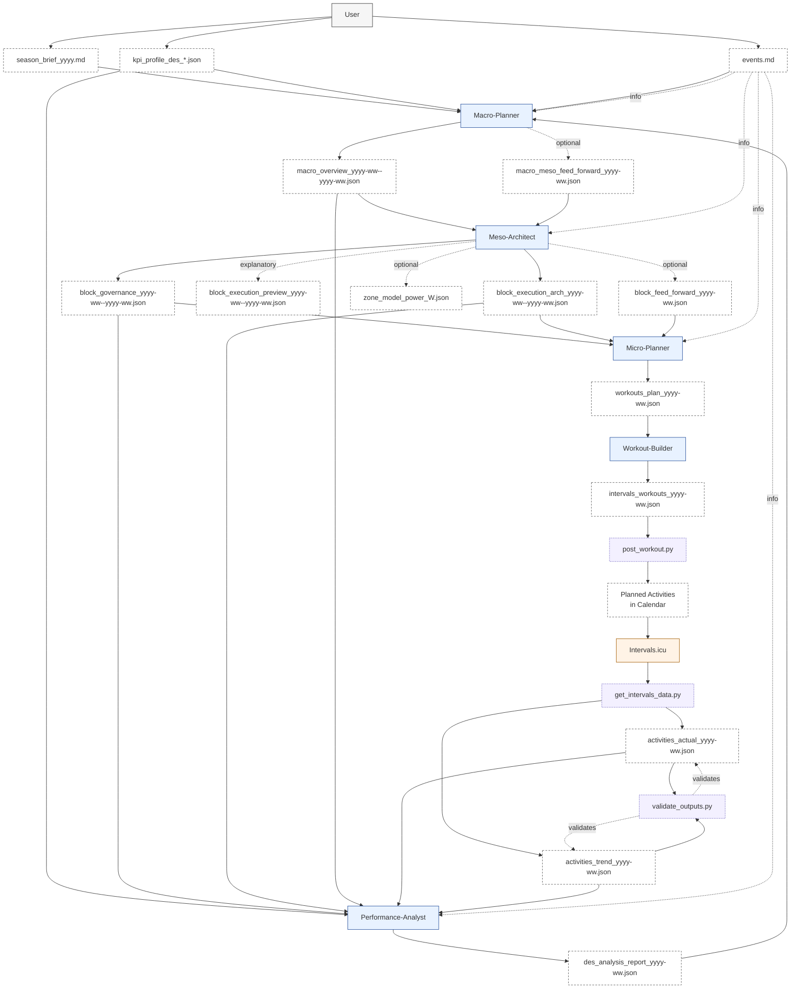
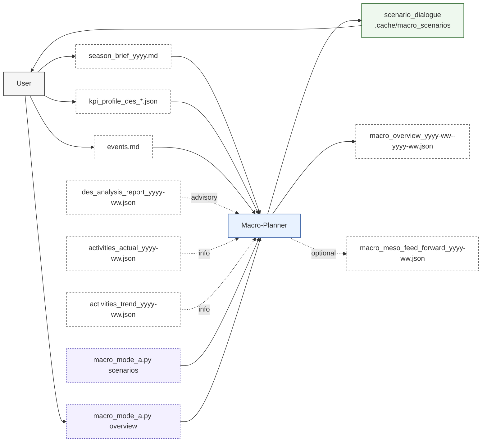
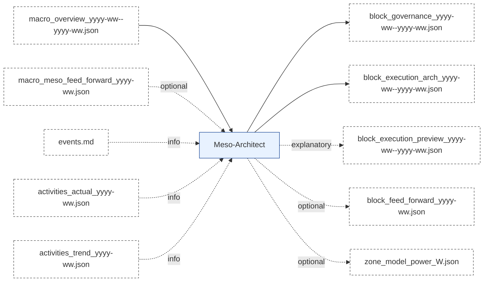
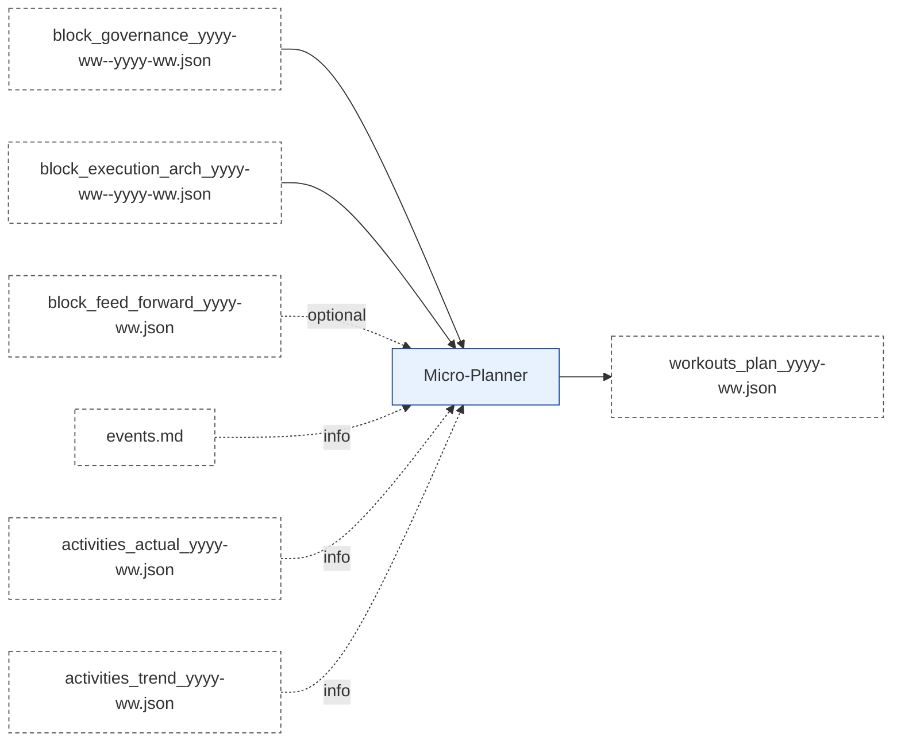
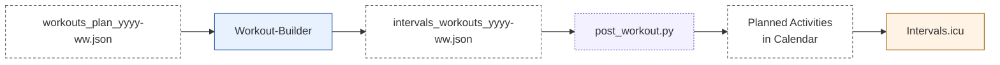
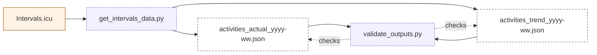
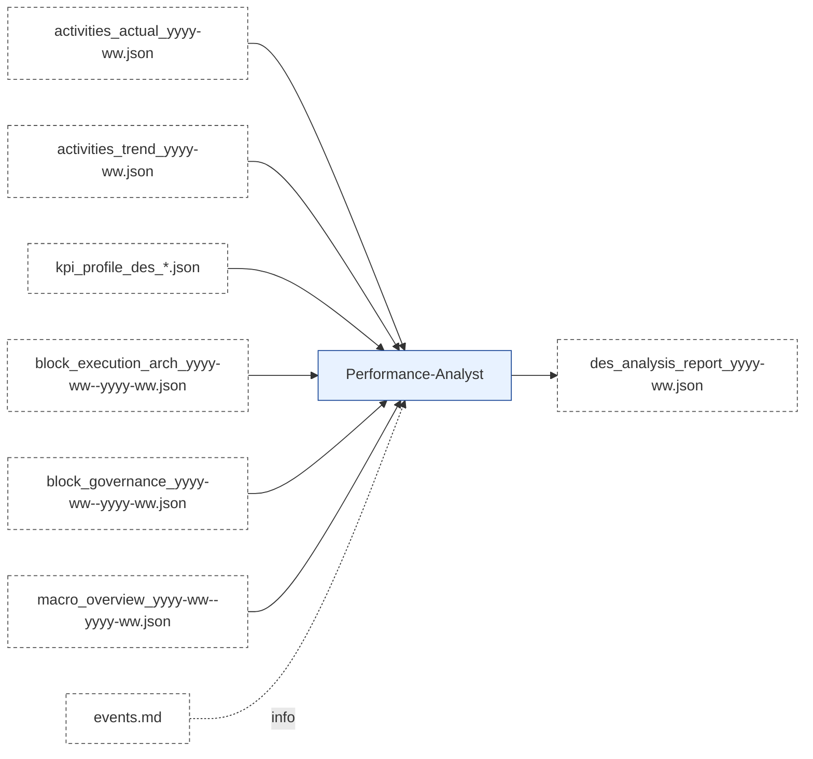

# ARTEFACT_FLOW_OVERVIEW_AND_DETAIL.md

Version: 2.0  
Status: Updated  
Last-Updated: 2026-01-20  
Format: GitHub-renderable Markdown + Mermaid

---

## 1. Flow Overview (End-to-End)

---

## 2. Detail Flows

### 2.1 Macro-Planner Detail Flow

**Inputs (Artefacts)**
- `season_brief_yyyy.md` (user-authored)
- `kpi_profile_des_*.json`
- `events.md` (contextual)
- `des_analysis_report_yyyy-ww.json` (advisory)
- `activities_actual_yyyy-ww.json` / `activities_trend_yyyy-ww.json` (informational, if available)

**Processing (Conceptual)**
- Determine season intent, priorities, and constraints (8-32 weeks horizon).
- Define phase structure and load corridors.
- Emit optional feed-forward if the next block needs explicit guidance.
- Mode A (CLI) is a two-step flow:
  1) `scripts/macro_mode_a.py scenarios` (scenario dialogue saved to `.cache/macro_scenarios/<run-id>.md`)
  2) `scripts/macro_mode_a.py overview` (writes `macro_overview_yyyy-ww--yyyy-ww.json`)

**Outputs (Artefacts)**
- `macro_overview_yyyy-ww--yyyy-ww.json` (binding)
- `macro_meso_feed_forward_yyyy-ww.json` (optional)

---

### 2.2 Meso-Architect Detail Flow

**Inputs (Artefacts)**
- `macro_overview_yyyy-ww--yyyy-ww.json` (binding)
- `macro_meso_feed_forward_yyyy-ww.json` (optional, binding if present)
- `events.md` (informational)
- `activities_actual_yyyy-ww.json` / `activities_trend_yyyy-ww.json` (informational)

**Processing (Conceptual)**
- Convert macro phase intent into a block (governance + execution architecture).
- Block range is derived from macro phase boundaries (not calendar-aligned).
- Optional preview, feed-forward, or zone model on explicit request.

**Outputs (Artefacts)**
- `block_governance_yyyy-ww--yyyy-ww.json` (binding)
- `block_execution_arch_yyyy-ww--yyyy-ww.json` (binding)
- `block_execution_preview_yyyy-ww--yyyy-ww.json` (optional, informational)
- `block_feed_forward_yyyy-ww.json` (optional)
- `zone_model_power_<FTP>W.json` (optional)

---

### 2.3 Micro-Planner Detail Flow

**Inputs (Artefacts)**
- `block_governance_yyyy-ww--yyyy-ww.json`
- `block_execution_arch_yyyy-ww--yyyy-ww.json`
- `block_feed_forward_yyyy-ww.json` (optional)
- `events.md` (informational)
- Optional factual data for context

**Processing (Conceptual)**
- Create a weekly agenda aligned to governance and execution architecture.
- Define sessions and constraints; avoid violating block rules.

**Outputs (Artefacts)**
- `workouts_plan_yyyy-ww.json`

---

### 2.4 Workout-Builder + Posting Detail Flow

**Inputs (Artefacts)**
- `workouts_plan_yyyy-ww.json`

**Processing (Conceptual)**
- Deterministic conversion into Intervals.icu JSON payload.
- Optional posting to Intervals.icu calendar.

**Outputs**
- `intervals_workouts_yyyy-ww.json`
- Planned calendar entries in Intervals.icu

---

### 2.5 Data Pipeline Detail Flow (Fetch + Compile + Validate)

**Inputs**
- Intervals.icu API data (executed activities and related metrics)
- Intervals.icu calendar state (planned + executed)

**Processing (Conceptual)**
- `get_intervals_data.py`: fetch raw activity data, compile `activities_actual` and `activities_trend`
- `validate_outputs.py`: validate JSON outputs against schemas

**Outputs (Artefacts)**
- `activities_actual_yyyy-ww.json`
- `activities_trend_yyyy-ww.json`

---

### 2.6 Artefact Renderer (Sidecars)

**Purpose**
- Produce human-readable `.rendered.md` sidecars from JSON artefacts.

**Inputs**
- Any JSON artefact (e.g., `block_governance_yyyy-ww--yyyy-ww.json`)

**Processing**
- `scripts/artefact_renderer.py`
- Templates in `scripts/renderers/`

**Outputs**
- `<artefact>.rendered.md` (informational only)

---

### 2.7 Performance-Analyst Detail Flow

**Inputs (Artefacts)**
- `activities_actual_yyyy-ww.json`
- `activities_trend_yyyy-ww.json`
- `kpi_profile_des_*.json`
- `events.md` (informational)
- `macro_overview_yyyy-ww--yyyy-ww.json`
- `block_governance_yyyy-ww--yyyy-ww.json`
- `block_execution_arch_yyyy-ww--yyyy-ww.json`

**Processing (Conceptual)**
- Extract diagnostic signals (DES/KPI).
- Produce a single dominant interpretation with explicit confidence.

**Outputs (Artefacts)**
- `des_analysis_report_yyyy-ww.json`

---

## 3. Artefact Index (Quick Reference)

### 3.1 User-Maintained
- `season_brief_yyyy.md`
- `events.md`
- `kpi_profile_des_*.json`

### 3.2 Macro-Planner
- `macro_overview_yyyy-ww--yyyy-ww.json`
- `macro_meso_feed_forward_yyyy-ww.json` (optional)

### 3.3 Meso-Architect
- `block_governance_yyyy-ww--yyyy-ww.json`
- `block_execution_arch_yyyy-ww--yyyy-ww.json`
- `block_execution_preview_yyyy-ww--yyyy-ww.json` (optional)
- `block_feed_forward_yyyy-ww.json` (optional)
- `zone_model_power_<FTP>W.json` (optional)

### 3.4 Micro-Planner
- `workouts_plan_yyyy-ww.json`

### 3.5 Workout-Builder / Posting
- `intervals_workouts_yyyy-ww.json`
- Planned calendar activities (Intervals.icu)

### 3.6 Data Pipeline
- `activities_actual_yyyy-ww.json`
- `activities_trend_yyyy-ww.json`
- Raw CSVs (implementation detail)

### 3.7 Performance-Analyst
- `des_analysis_report_yyyy-ww.json`

---

## 4. Notes on Optionality and Authority

- **Binding:** `macro_overview`, `block_governance`, `block_execution_arch`, `workouts_plan`,
  `activities_actual`, `activities_trend`
- **Informational:** `block_execution_preview`, `zone_model` (when present)
- **Scoped Override:** feed-forward artefacts (use only within their stated scope)
- **Advisory:** `des_analysis_report`

---

## End of Document
