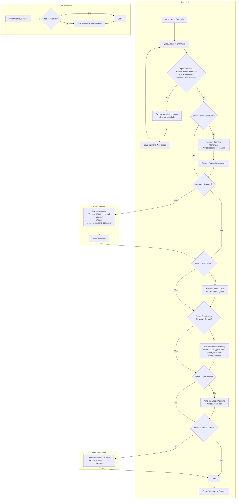

# Automatic Planning Flow (Athlete-First)

This document describes a minimal-friction automatic planning flow aimed at making planning as simple as possible for the athlete. The UI should default to a single primary action, run sensible checks in the background, and only request input when truly required.

## Goals

- One primary action: **“Plan my week”**
- Automatic gating: detect missing inputs and offer fix actions
- Safe defaults: run the full chain if ready; otherwise, run only what’s needed
- Clear feedback: show what happened, what changed, and what still needs input

## Flow Diagram (Mermaid)

## Explanation

### Pages and responsibilities

- **Plan Hub:** readiness checks, primary CTA, and orchestration of automatic planning steps.
- **Plan → Season:** scenario selection UI (if not already selected).
- **Plan → Workouts:** workout export flow.
- **Post Workouts:** posting to Intervals (separate from planning completion).

### 1) Entry point: Plan Hub
- When the athlete opens the Plan Hub, the app automatically loads athlete ID and ISO week.
- The primary CTA remains **“Plan my week”** (or similar). This keeps the interaction simple.

### 2) Input auto-check
- The system checks for Season Brief, Events, KPI profile, Availability, Zone Model, and Wellness.
- If any are missing, the UI shows a short inline form or link to the relevant input page.
- Once completed, the app returns to the planning flow without the athlete needing to navigate.

### 3) Scenario creation + selection
- If scenarios are missing, run the scenario generator automatically.
- Present a compact A/B/C summary and prompt for selection if none exists.
- If selection is already present, skip this step entirely.

### 4) Planning cascade (Season → Phase → Week → Workouts)
- The system checks for freshness of each artifact in order:
  - **Season Scenarios:** `season_scenarios`
  - **Scenario Selection:** `season_scenario_selection`
  - **Season Plan:** `season_plan`
  - **Phase Planning:** `phase_guardrails`, `phase_structure`, `phase_preview`
  - **Week Plan:** `week_plan`
- **Workouts Export:** `workouts_yyyy-ww.json` (Intervals export)
- If an artifact is missing or stale, it is regenerated automatically.
- Each step only runs if it is required (the chain is incremental, not always full).

### 5) Workout export and posting
- Once the week plan is ready, export workouts automatically. **Planning ends here.**
- Posting to Intervals is a **separate Post Workouts flow** and only runs from the Workouts page.

### 6) Completion summary
- The final screen shows:
  - What steps ran
  - Which artifacts were updated
  - Any outstanding issues or blocked items
  - Links to view the results (Plan, Week, Workouts)

## Implementation Notes

- **Readiness evaluation** should be deterministic and based on “latest” artifacts.
- **Stale detection** should compare timestamps and ISO week ranges.
- **Auto-run** should be safe: only write missing or outdated artifacts.
- **Athlete simplicity** comes from a single CTA and minimal decision points.
- **Optional toggles** (advanced panel): auto-post, allow delete, validation only.

## Future Enhancements

- Background job queue for long runs with progress indicators.
- Notification banner when planning is done (email/push optional).
- Auto-retry for transient failures with clear logs.
