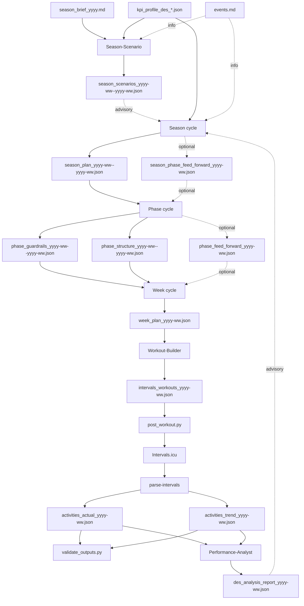

# HOW_TO_PLAN.md

Version: 2.1  
Status: Updated  
Last-Updated: 2026-01-22

---

## Quickstart (1-page)

1) Create `season_brief_yyyy.md`.  
2) Select a `kpi_profile_des_*.json`, copy it to `var/athletes/<athlete_id>/latest/`, and rename to `kpi_profile.json`.  
3) Update `events.md`.  
4) Run **Season-Scenario-Agent** (generates `season_scenarios`).  
5) Select scenario and run **Season** (uses selected scenario).  
6) Run **Phase** -> `phase_guardrails_yyyy-ww--yyyy-ww.json` + `phase_structure_yyyy-ww--yyyy-ww.json`.  
7) Run **Week** -> `week_plan_yyyy-ww.json`.  
8) Run **Workout-Builder** -> `intervals_workouts_yyyy-ww.json`.  
9) Post workouts: `python scripts/data_pipeline/post_workout.py`.  
10) Run data pipeline: `python -m rps.main parse-intervals`.  
11) Validate outputs: `python scripts/validate_outputs.py`.  
12) Run **Performance-Analyst** -> `des_analysis_report_yyyy-ww.json`.  

Season changes are rare (months). Phase every phase. Week weekly. Analysis weekly.

Place `season_brief_yyyy.md` and `events.md` under:

```
var/athletes/<athlete_id>/inputs/
```

Templates (copy and fill):

- `knowledge/_shared/sources/templates/season_brief_yyyy_template.md`
- `knowledge/_shared/sources/templates/events_template.md`

Place the selected KPI profile at:

```
var/athletes/<athlete_id>/latest/kpi_profile.json
```

Predefined KPI profiles live under `kpi_profiles/` at repo root.

Season flow (agent tasks via CLI, or use the Streamlit UI "Create Season Plan"):

```bash
# 1) Create scenarios (SEASON_SCENARIOS)
PYTHONPATH=src python3 -m rps.main run-agent \
  --agent season_scenario \
  --task CREATE_SEASON_SCENARIOS \
  --text "Target ISO week: year=2026, week=6 (ISO 2026-06). Generate pre-decision scenarios."
```

```bash
# 2) Select scenario (SEASON_SCENARIO_SELECTION)
PYTHONPATH=src python3 -m rps.main run-agent \
  --agent season_scenario \
  --task CREATE_SEASON_SCENARIO_SELECTION \
  --text "Select Scenario A for ISO week 2026-06. Use latest SEASON_SCENARIOS. Rationale: chosen for durability-first risk profile."
```

```bash
# 3) Create season plan (SEASON_PLAN)
PYTHONPATH=src python3 -m rps.main run-agent \
  --agent season_planner \
  --task CREATE_SEASON_PLAN \
  --text "Scenario A. Create SEASON_PLAN for ISO week 2026-06. Use the latest SEASON_SCENARIO_SELECTION."
```

Optional KPI moving-time rate band override (affects kJ corridor derivation): add to the season-planner text:
`Moving time rate band: fast_competitive.`

Season, Phase, Week cycles (concrete CLI):

```bash
# Season cycle (agent tasks)
PYTHONPATH=src python3 -m rps.main run-agent \
  --agent season_scenario \
  --athlete ath_001 \
  --task CREATE_SEASON_SCENARIOS \
  --text "Target ISO week: year=2026, week=6 (ISO 2026-06). Generate pre-decision scenarios."

PYTHONPATH=src python3 -m rps.main run-agent \
  --agent season_scenario \
  --athlete ath_001 \
  --task CREATE_SEASON_SCENARIO_SELECTION \
  --text "Select Scenario A for ISO week 2026-06. Use latest SEASON_SCENARIOS."

PYTHONPATH=src python3 -m rps.main run-agent \
  --agent season_planner \
  --athlete ath_001 \
  --task CREATE_SEASON_PLAN \
  --text "Scenario A. Create SEASON_PLAN for ISO week 2026-06. Use latest SEASON_SCENARIO_SELECTION."
```

```bash
# Phase cycle (target ISO week = 2026-06)
PYTHONPATH=src python3 -m rps.main run-agent \
  --agent phase_architect \
  --athlete ath_001 \
  --task CREATE_PHASE_GUARDRAILS CREATE_PHASE_STRUCTURE \
  --text "Target ISO week: year=2026, week=6 (ISO 2026-06). Create phase_guardrails and phase_structure for the phase covering ISO week 2026-06."
```

```bash
# Week cycle (target ISO week = 2026-06)
PYTHONPATH=src python3 -m rps.main run-agent \
  --agent week_planner \
  --athlete ath_001 \
  --task CREATE_WEEK_PLAN \
  --text "Target ISO week: year=2026, week=6 (ISO 2026-06). Create week_plan for ISO week 2026-06."
```

```bash
# Workout-Builder (target ISO week = 2026-06)
PYTHONPATH=src python3 -m rps.main run-agent \
  --agent workout_builder \
  --athlete ath_001 \
  --task CREATE_INTERVALS_WORKOUTS_EXPORT \
  --text "Convert week_plan into Intervals.icu workouts JSON for ISO week 2026-06."
```

```bash
# Performance-Analyst (target ISO week = 2026-06)
PYTHONPATH=src python3 -m rps.main run-agent \
  --agent performance_analysis \
  --athlete ath_001 \
  --task CREATE_DES_ANALYSIS_REPORT \
  --text "Target ISO week: year=2026, week=6 (ISO 2026-06). Create des_analysis_report for ISO week 2026-06."
```

Note: `run-agent` defaults to strict tool mode for JSON-producing agents. Use `--non-strict` only for text-only outputs.

---

## 1. Overview

This guide explains the planning sequence, artefacts, and cadence.

**Governance and cycles**
- **Season-Scenario**: generates advisory A/B/C scenarios from the season brief.
- **Season**: long-horizon intent (8-32 weeks), phases, load corridors.
- **Phase**: phase-aligned phases (default 4 weeks).
- **Week**: weekly plan and sessions.
- **Workout-Builder**: deterministic conversion to Intervals.icu JSON.
- **Performance-Analyst**: diagnostic report (advisory).
- **Data Pipeline**: factual activity data (actual + trend).

**Artefact types**
- **Binding**: must be followed (season, governance, execution arch, week plan).
- **Informational**: context only (season_scenarios, events, previews).
- **Advisory**: analysis report (season may use to adjust later).

**Formats**
- Agent artefacts are JSON and validated by schema.
- User inputs remain Markdown (`season_brief_yyyy.md`, `events.md`).

---

## 2. Planning cycles and cadence

### 2.1 Cadence summary

- Athlete writes season brief first (season input).
- Season: when goals or A/B events change.
- Phase: every phase (default 4 weeks).
- Week: weekly.
- Analysis: weekly after data pipeline outputs exist.

### 2.2 Overview diagram



---

## 3. Season vs Phase boundaries

- `season_plan` defines **season phases** with `iso_week_range`.
- Season must not define phase-artefact outputs (guardrails/structure/preview).
- Phase ranges are derived **inside** the season phase.

Agents resolve the phase and phase range internally via workspace tools
(no user prompt hints required):

- `workspace_get_phase_context({ "year": YYYY, "week": WW })`

---

## 4. Agent modes (summary)

### Season-Planner
- Create or update season plan.
- Optional feed-forward when a phase needs explicit guidance.

### Phase-Architect
- Create phase guardrails + phase structure.
- Optional preview and feed-forward when requested.

### Week-Planner
- Always outputs one `week_plan` per target week.

### Workout-Builder
- Deterministic conversion only.

### Performance-Analyst
- Diagnostic only; advisory report.

---

## 5. Common pitfalls

- Do not create phase-artefact outputs in Season.
- Always set `meta.iso_week` or `meta.iso_week_range`.
- Ensure `latest/` reflects the current version for downstream agents.

---

## End
