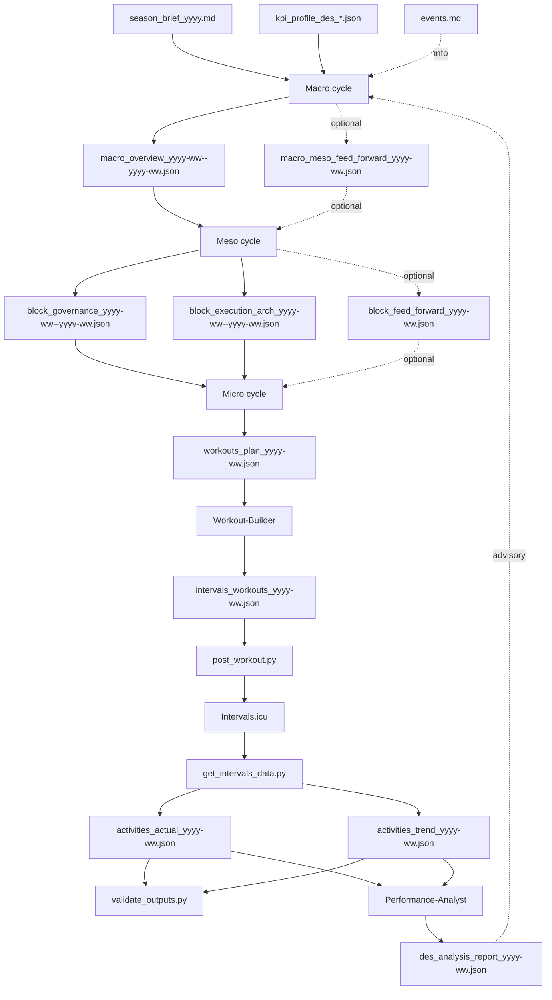

# HOW_TO_PLAN.md

Version: 2.0  
Status: Updated  
Last-Updated: 2026-01-20

---

## Quickstart (1-page)

1) Create `season_brief_yyyy.md`.  
2) Select a `kpi_profile_des_*.json`, copy it to `var/athletes/<athlete_id>/latest/`, and rename to `kpi_profile.json`.  
3) Update `events.md`.  
4) Run **Macro** (Mode A is a two-step scenario + overview flow).  
5) Run **Meso** -> `block_governance_yyyy-ww--yyyy-ww.json` + `block_execution_arch_yyyy-ww--yyyy-ww.json`.  
6) Run **Micro** -> `workouts_plan_yyyy-ww.json`.  
7) Run **Workout-Builder** -> `intervals_workouts_yyyy-ww.json`.  
8) Post workouts: `python scripts/data_pipeline/post_workout.py`.  
9) Run data pipeline: `python scripts/data_pipeline/get_intervals_data.py`.  
10) Validate outputs: `python scripts/validate_outputs.py`.  
11) Run **Performance-Analyst** -> `des_analysis_report_yyyy-ww.json`.  

Macro changes are rare (months). Meso every block. Micro weekly. Analysis weekly.

Place `season_brief_yyyy.md` and `events.md` under:

```
var/athletes/<athlete_id>/inputs/
```

Templates (copy and fill):

- `knowledge/_shared/sources/templates/season_brief_yyyy_template.md`
- `knowledge/_shared/sources/templates/events_template.md`

Place the selected KPI profile at:

```
var/athletes/<athlete_id>/latest/kpi_profile.json
```

Predefined KPI profiles live under `kpi_profiles/` at repo root.

Macro Mode A CLI (two-step):

```bash
python3 scripts/macro_mode_a.py scenarios \
  --year 2026 \
  --week 6 \
  --run-id macro_scenarios_2026_w06
```

```bash
python3 scripts/macro_mode_a.py overview \
  --year 2026 \
  --week 6 \
  --run-id macro_overview_2026_w06 \
  --scenario A \
  --scenario-run-id macro_scenarios_2026_w06
```

Macro, Meso, Micro cycles (concrete CLI):

```bash
# Macro cycle (Mode A, two-step)
python3 scripts/macro_mode_a.py scenarios \
  --year 2026 \
  --week 6 \
  --run-id macro_scenarios_2026_w06 \
  --athlete ath_001

python3 scripts/macro_mode_a.py overview \
  --year 2026 \
  --week 6 \
  --run-id macro_overview_2026_w06 \
  --scenario A \
  --scenario-run-id macro_scenarios_2026_w06 \
  --athlete ath_001
```

```bash
# Meso cycle (target ISO week = 2026-06)
PYTHONPATH=src python3 -m app.main \
  --agent meso_architect \
  --athlete ath_001 \
  --text "Create block_governance and block_execution_arch for the 4-week block covering ISO week 2026-06. Read macro_overview and events via workspace_get_input."
```

```bash
# Micro cycle (target ISO week = 2026-06)
PYTHONPATH=src python3 -m app.main \
  --agent micro_planner \
  --athlete ath_001 \
  --text "Create workouts_plan for ISO week 2026-06. Read block_governance and block_execution_arch; use events via workspace_get_input."
```

```bash
# Workout-Builder (target ISO week = 2026-06)
PYTHONPATH=src python3 -m app.main \
  --agent workout_builder \
  --athlete ath_001 \
  --text "Convert workouts_plan into Intervals.icu workouts JSON for ISO week 2026-06. Read workouts_plan from workspace."
```

```bash
# Performance-Analyst (target ISO week = 2026-06)
PYTHONPATH=src python3 -m app.main \
  --agent performance_analysis \
  --athlete ath_001 \
  --text "Create des_analysis_report for ISO week 2026-06. Read activities_actual, activities_trend, KPI profile, macro overview, and meso artefacts from workspace."
```

---

## 1. Overview

This guide explains the planning sequence, artefacts, and cadence.

**Governance and cycles**
- **Macro**: long-horizon intent (8-32 weeks), phases, load corridors.
- **Meso**: phase-aligned blocks (default 4 weeks).
- **Micro**: weekly plan and sessions.
- **Workout-Builder**: deterministic conversion to Intervals.icu JSON.
- **Performance-Analyst**: diagnostic report (advisory).
- **Data Pipeline**: factual activity data (actual + trend).

**Artefact types**
- **Binding**: must be followed (macro, governance, execution arch, workouts plan).
- **Informational**: context only (events, previews).
- **Advisory**: analysis report (macro may use to adjust later).

**Formats**
- Agent artefacts are JSON and validated by schema.
- User inputs remain Markdown (`season_brief_yyyy.md`, `events.md`).

---

## 2. Planning cycles and cadence

### 2.1 Cadence summary

- Athlete writes season brief first (macro input).
- Macro: when goals or A/B events change.
- Meso: every block (default 4 weeks).
- Micro: weekly.
- Analysis: weekly after data pipeline outputs exist.

### 2.2 Overview diagram



---

## 3. Macro vs Meso boundaries

- `macro_overview` defines **phases** with `iso_week_range`.
- Macro must not define meso blocks.
- Meso block ranges are derived **inside** a macro phase.

Use the workspace tools to resolve the phase and block range when needed:

- `workspace_resolve_macro_phase(year, week)`
- `workspace_resolve_block_range(year, week, block_len=4)`

---

## 4. Agent modes (summary)

### Macro-Planner
- Create or update macro overview.
- Optional feed-forward when a block needs explicit guidance.

### Meso-Architect
- Create block governance + execution architecture.
- Optional preview and feed-forward when requested.

### Micro-Planner
- Always outputs one `workouts_plan` per target week.

### Workout-Builder
- Deterministic conversion only.

### Performance-Analyst
- Diagnostic only; advisory report.

---

## 5. Common pitfalls

- Do not create meso blocks in Macro.
- Always set `meta.iso_week` or `meta.iso_week_range`.
- Ensure `latest/` reflects the current version for downstream agents.

---

## End
