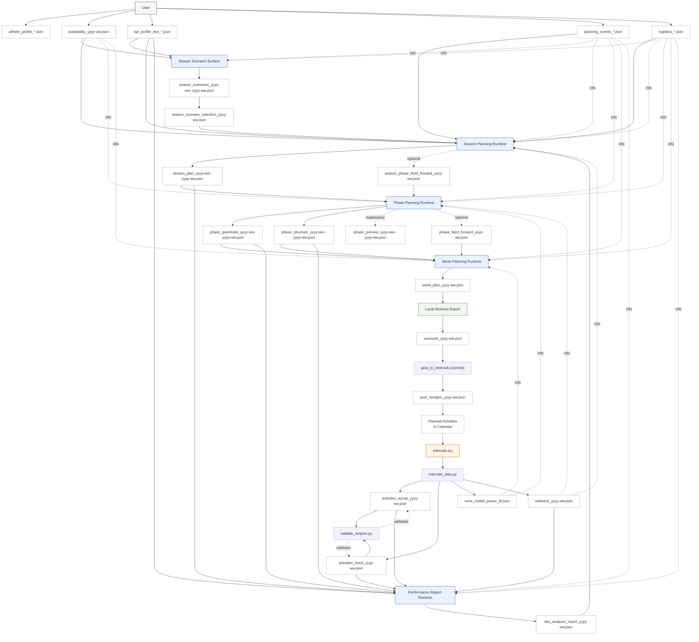
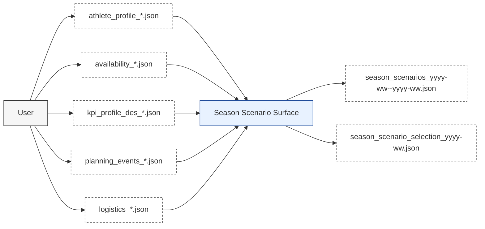
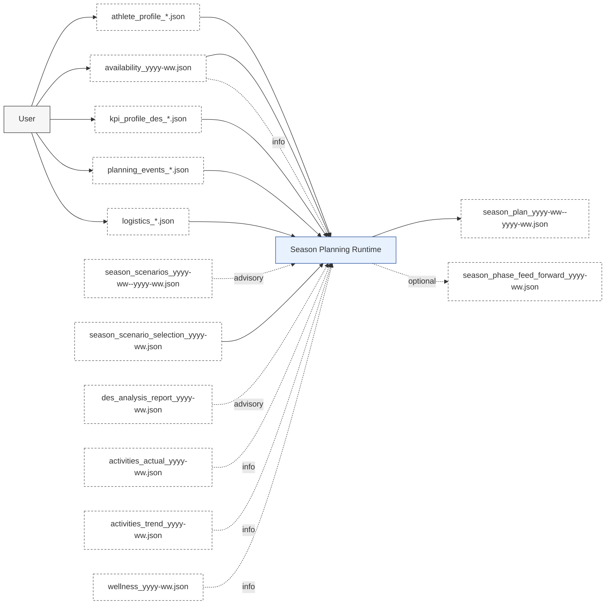
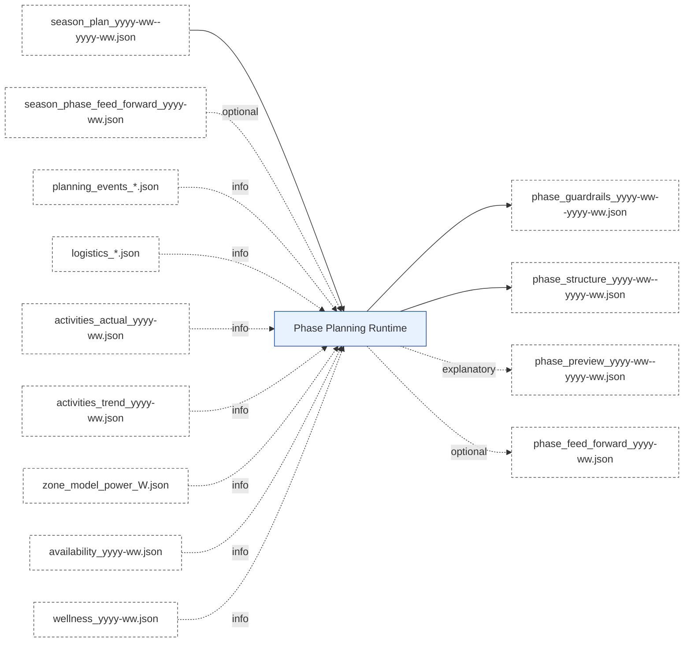
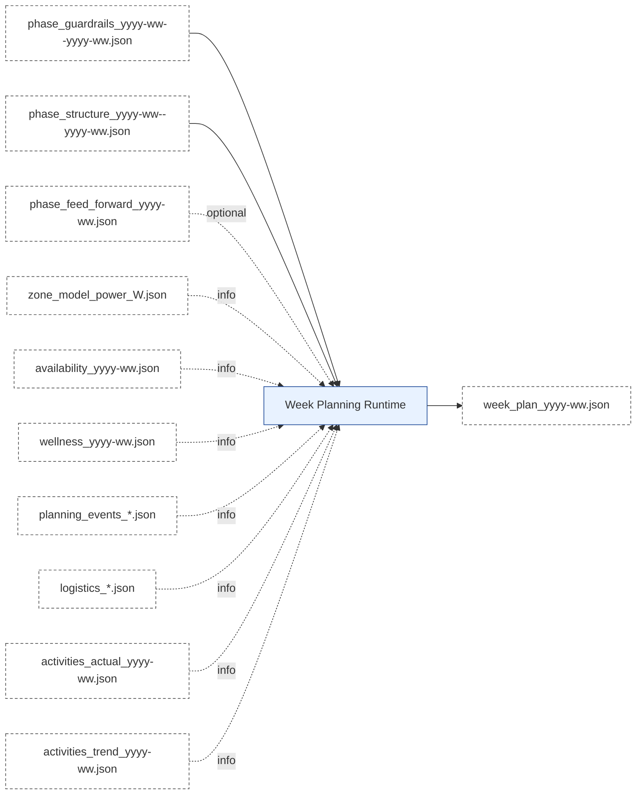
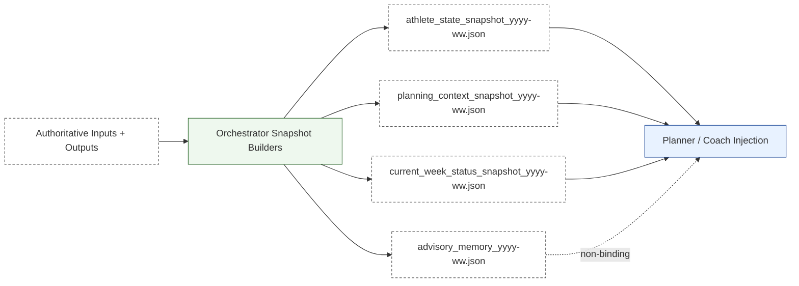
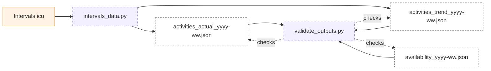
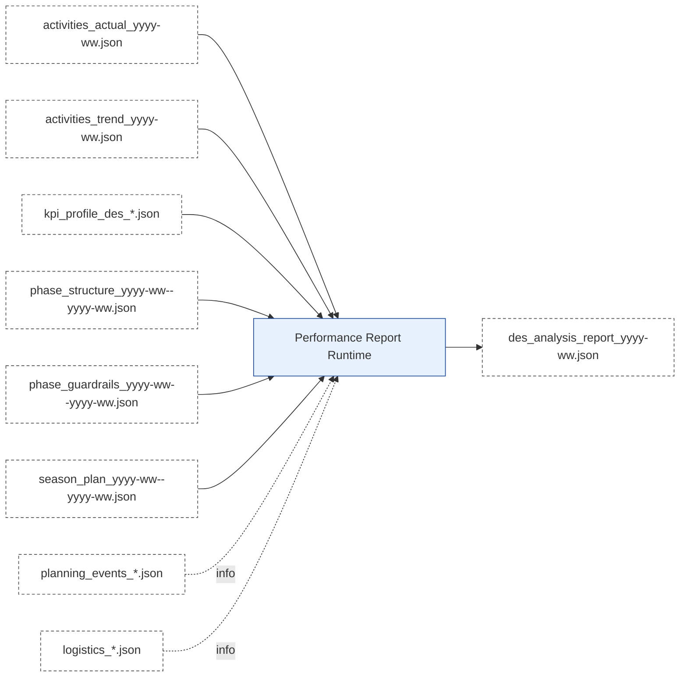
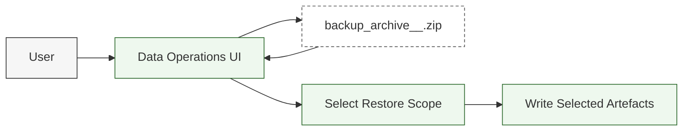

# Artefact Flow

## 1. Flow Overview (End-to-End)

---

## 2. Detail Flows

### 2.1 Season Scenario Detail Flow

**Inputs (Artefacts)**
- `athlete_profile_*.json` (user-authored profile + goals)
- `availability_*.json` (user-managed availability)
- `kpi_profile_des_*.json`
- `planning_events_*.json` (A/B/C events)
- `logistics_*.json` (contextual)

**Processing (Conceptual)**
- Extract season goals, constraints, and event priorities.
- Propose scenario options with clear trade-offs.
- Store scenarios and selected scenario for season-planning consumption.

**Outputs (Artefacts)**
- `season_scenarios_yyyy-ww--yyyy-ww.json` (informational)
- `season_scenario_selection_yyyy-ww.json` (binding selection state for downstream season planning)

### 2.2 Season Planning Detail Flow

**Inputs (Artefacts)**
- `athlete_profile_*.json` (user-authored profile + goals)
- `availability_*.json` (user-managed availability)
- `kpi_profile_des_*.json`
- `planning_events_*.json` (A/B/C events)
- `logistics_*.json` (contextual)
- `season_scenarios_yyyy-ww--yyyy-ww.json` (advisory, if available)
- `season_scenario_selection_yyyy-ww.json` (selected scenario intent)
- `des_analysis_report_yyyy-ww.json` (advisory)
- `activities_actual_yyyy-ww.json` / `activities_trend_yyyy-ww.json` (informational, if available)
- `wellness_yyyy-ww.json` (informational; body_mass_kg used for kJ/kg/h corridor math)

**Processing (Conceptual)**
- Determine season intent, priorities, and constraints (8-32 weeks horizon).
- Define phase structure and load corridors.
- Run the internal planning/review/writer chain:
  1) Season planning crew drafts an internal season bundle
  2) Season review crew approves, rejects, or requests bounded replan
  3) Season writer crew serializes the final `SEASON_PLAN`

**Outputs (Artefacts)**
- `season_plan_yyyy-ww--yyyy-ww.json` (binding)
- `season_phase_feed_forward_yyyy-ww.json` (optional)
- `season_phase_feed_forward_yyyy-ww.json` is authored by the season planning runtime; `des_analysis_report` is advisory input only.

**Version-Key Semantics**
- `season_phase_feed_forward_yyyy-ww.json` is selected-week scoped.
- The `yyyy-ww` key must match the completed analysis / selected source week that triggered the Season -> Phase feed-forward.
- Example: a completed DES analysis for `2026-18` produces `season_phase_feed_forward_2026-18.json`.

---

### 2.3 Phase Planning Detail Flow

**Inputs (Artefacts)**
- `season_plan_yyyy-ww--yyyy-ww.json` (binding)
- `season_phase_feed_forward_yyyy-ww.json` (optional, binding if present)
- `planning_events_*.json` (informational)
- `logistics_*.json` (informational)

**Version-Key Semantics**
- `phase_feed_forward_yyyy-ww.json` is phase-anchored, not selected-week scoped.
- The `yyyy-ww` key must be the first ISO week in the covered phase `iso_week_range`.
- Example: for phase range `2026-17--2026-19`, the stored artefact is `phase_feed_forward_2026-17.json` even if the triggering `season_phase_feed_forward` came from selected week `2026-18`.
- `activities_actual_yyyy-ww.json` / `activities_trend_yyyy-ww.json` (informational)
- `availability_yyyy-ww.json` (informational)
- `wellness_yyyy-ww.json` (informational)

**Processing (Conceptual)**
- Convert season phase intent into one exact-range phase bundle.
- Phase range is derived from season phase boundaries.
- Run the internal planning/review/writer chain before persistence.
- Consumes the latest `ZONE_MODEL` when IF defaults are needed.

**Outputs (Artefacts)**
- `phase_guardrails_yyyy-ww--yyyy-ww.json` (binding)
- `phase_structure_yyyy-ww--yyyy-ww.json` (binding)
- `phase_preview_yyyy-ww--yyyy-ww.json` (optional, informational)
- `phase_feed_forward_yyyy-ww.json` (optional)

---

### 2.4 Week Planning Detail Flow

**Inputs (Artefacts)**
- `phase_guardrails_yyyy-ww--yyyy-ww.json`
- `phase_structure_yyyy-ww--yyyy-ww.json`
- `phase_feed_forward_yyyy-ww.json` (optional)
- `zone_model_power_<FTP>W.json` (informational, from Data-Pipeline)
- `availability_yyyy-ww.json` (informational, user-managed input)
- `wellness_yyyy-ww.json` (informational, from Data-Pipeline)
- `planning_events_*.json` (informational)
- `logistics_*.json` (informational)
- Optional factual data for context

**Processing (Conceptual)**
- Create a weekly agenda aligned to governance and phase structure.
- Build workout-ready week intent.
- Run the internal planning/review/writer chain before persistence.

**Outputs (Artefacts)**
- `week_plan_yyyy-ww.json`

### 2.4a Runtime Memory Snapshot Flow

**Inputs (Authoritative Sources)**
- athlete/profile + availability + logistics + planning events
- KPI / zone model / wellness
- season / phase / week / report / feed-forward artefacts as available

**Processing (Conceptual)**
- Orchestrator resolves deterministic facts into code-owned memory artefacts.
- Binding planner memory is split into:
  - `athlete_state_snapshot_yyyy-ww.json`
  - `planning_context_snapshot_yyyy-ww.json`
- Coach-facing current-week status memory is stored as:
  - `current_week_status_snapshot_yyyy-ww.json`
- Non-binding narrative memory is stored as:
  - `advisory_memory_yyyy-ww.json`
- Planners and Coach consume snapshot memory first and use raw artefacts only for missing detail or traceability.
- Coach-facing advisory memory may include the selected-week objective, planned weekly load, and a compact current-week workout list derived from the latest `WEEK_PLAN`.
- Current-week actuals are fetched separately from Intervals.icu, normalized into the same activity shape as `ACTIVITIES_ACTUAL`, and persisted into `CURRENT_WEEK_STATUS_SNAPSHOT` before Coach consumes them.

**Outputs (Artefacts)**
- `athlete_state_snapshot_yyyy-ww.json` (derived)
- `planning_context_snapshot_yyyy-ww.json` (derived)
- `current_week_status_snapshot_yyyy-ww.json` (derived)
- `advisory_memory_yyyy-ww.json` (advisory)

---

### 2.5 Workout Export + Posting Detail Flow

**Inputs (Artefacts)**
- `week_plan_yyyy-ww.json`

**Processing (Conceptual)**
- Deterministic conversion into Intervals.icu JSON payload.
- Optional commit step writes receipts (idempotency) and posts to Intervals.icu.
- Workouts export is optional in readiness (planning can complete without it).

**Outputs**
- `workouts_yyyy-ww.json`
- `receipts/post_to_intervals/<athlete>/<yyyy-Www>/<uid>.json`
- Planned calendar entries in Intervals.icu

---

### 2.6 Data Pipeline Detail Flow (Fetch + Compile + Validate)

**Inputs**
- Intervals.icu API data (executed activities and related metrics)
- Intervals.icu calendar state (planned + executed)
- `availability_*.json` (user-managed input, validated alongside outputs)

**Processing (Conceptual)**
- `intervals_data.py`: fetch raw activity data, compile `activities_actual` and `activities_trend`
- `validate_outputs.py`: validate JSON outputs against schemas

**Outputs (Artefacts)**
- `activities_actual_yyyy-ww.json`
- `activities_trend_yyyy-ww.json`
- `availability_yyyy-ww.json`

---

### 2.7 Artefact Renderer (Sidecars)

**Purpose**
- Produce human-readable `.md` sidecars from JSON artefacts.

**Inputs**
- Any JSON artefact (e.g., `phase_guardrails_yyyy-ww--yyyy-ww.json`)

**Processing**
- `rps.rendering.renderer.render_json_sidecar`
- Templates in `src/rps/rendering/templates/`

**Outputs**
- `<artefact>.md` (informational only)

---

### 2.8 Performance Report Detail Flow

**Inputs (Artefacts)**
- `activities_actual_yyyy-ww.json`
- `activities_trend_yyyy-ww.json`
- `kpi_profile_des_*.json`
- `planning_events_*.json` (informational)
- `logistics_*.json` (informational)
- `season_plan_yyyy-ww--yyyy-ww.json`
- `phase_guardrails_yyyy-ww--yyyy-ww.json`
- `phase_structure_yyyy-ww--yyyy-ww.json`

**Processing (Conceptual)**
- Extract diagnostic signals (DES/KPI).
- Produce a single dominant interpretation with explicit confidence.

**Outputs (Artefacts)**
- `des_analysis_report_yyyy-ww.json`
- No feed-forward artefact is authored here; feed-forward flows consume this report and then route to the season or phase planning runtime.

---

### 2.9 Data Operations (Backup + Restore)

**Inputs (Artefacts)**
- Athlete workspace directory (`runtime/athletes/<athlete_id>/`)

**Processing (Conceptual)**
- Backup is always **full** (no scope selector).
- Restore applies **only the selected scope** from the uploaded archive.

**Outputs (Artefacts)**
- `backup_archive_<athlete_id>_<timestamp>.zip` (full snapshot)
- `backup_manifest.json` (embedded inside the archive)

---

## 3. Artefact Index (Quick Reference)

### 3.1 User-Maintained
- `athlete_profile_yyyy.json`
- `planning_events_yyyy.json`
- `logistics_yyyy.json`
- `availability_yyyy-ww.json`
- `kpi_profile_des_*.json`

### 3.2 Season Scenario Surface

See [doc/architecture/agents.md](../architecture/agents.md) for the canonical agent registry.
- `season_scenarios_yyyy-ww--yyyy-ww.json`
- `season_scenario_selection_yyyy-ww.json`

### 3.3 Season Planning Runtime
- `season_plan_yyyy-ww--yyyy-ww.json`
- `season_phase_feed_forward_yyyy-ww.json` (optional)

### 3.4 Phase Planning Runtime
- `phase_guardrails_yyyy-ww--yyyy-ww.json`
- `phase_structure_yyyy-ww--yyyy-ww.json`
- `phase_preview_yyyy-ww--yyyy-ww.json` (optional)
- `phase_feed_forward_yyyy-ww.json` (optional)

### 3.5 Week Planning Runtime
- `week_plan_yyyy-ww.json`

### 3.6 Workout Export / Posting
- `workouts_yyyy-ww.json`
- Planned calendar activities (Intervals.icu)

### 3.7 Data Pipeline
- `activities_actual_yyyy-ww.json`
- `activities_trend_yyyy-ww.json`
- `zone_model_power_<FTP>W.json`
- `wellness_yyyy-ww.json`
- Raw CSVs (implementation detail)

### 3.8 Performance Report Runtime
- `des_analysis_report_yyyy-ww.json`
- Diagnostic only; does not own `season_phase_feed_forward` or `phase_feed_forward`

### 3.9 Data Operations
- `backup_archive_<athlete_id>_<timestamp>.zip`
- `backup_manifest.json` (embedded)

---

## 4. Notes on Optionality and Authority

- **Binding:** `season_plan`, `phase_guardrails`, `phase_structure`, `week_plan`,
  `activities_actual`, `activities_trend`
- **Informational:** `season_scenarios`, `phase_preview`, `zone_model`, `wellness` (when present)
- **Scoped Override:** feed-forward artefacts (use only within their stated scope)
- **Advisory:** `des_analysis_report`

---

## End of Document
### 4.1 Week Planning / Workout Export Consistency Rule

- `WEEK_PLAN` store is not based on schema validation alone.
- Before a `WEEK_PLAN` is stored, the guarded store normalizes linked workout metadata from deterministic workout-local data where possible:
  - workout duration from `workout_text`
  - agenda duration from linked workout duration
  - agenda mechanical `planned_kj` from linked workout notes when explicitly present
- After normalization, `WEEK_PLAN` must pass cross-field consistency checks before `INTERVALS_WORKOUTS` export is allowed.
- Examples of blocking inconsistencies:
  - linked `workout_id` with `planned_duration = 00:00`
  - linked `workout_id` with `planned_kj = 0`
  - linked workout `duration = 00:00:01`
  - weekly mechanical total statement in summary notes not matching the agenda sum
