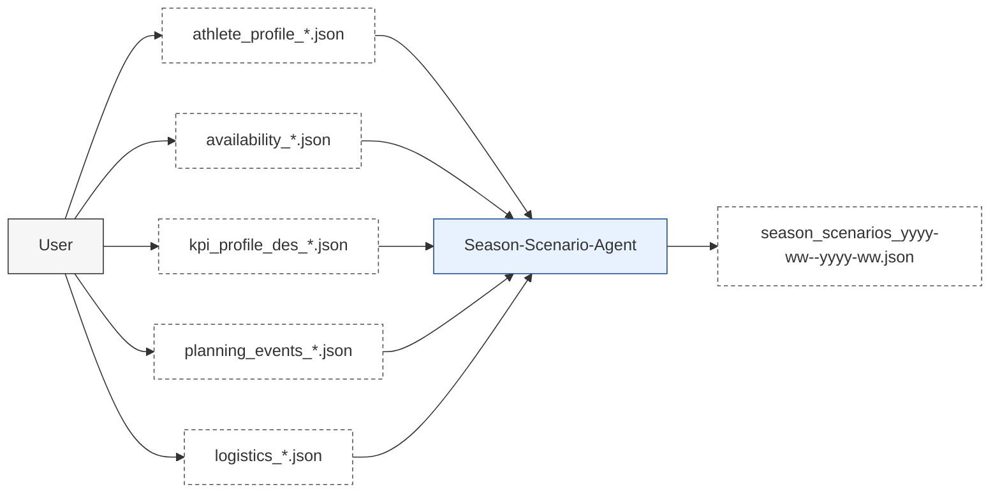
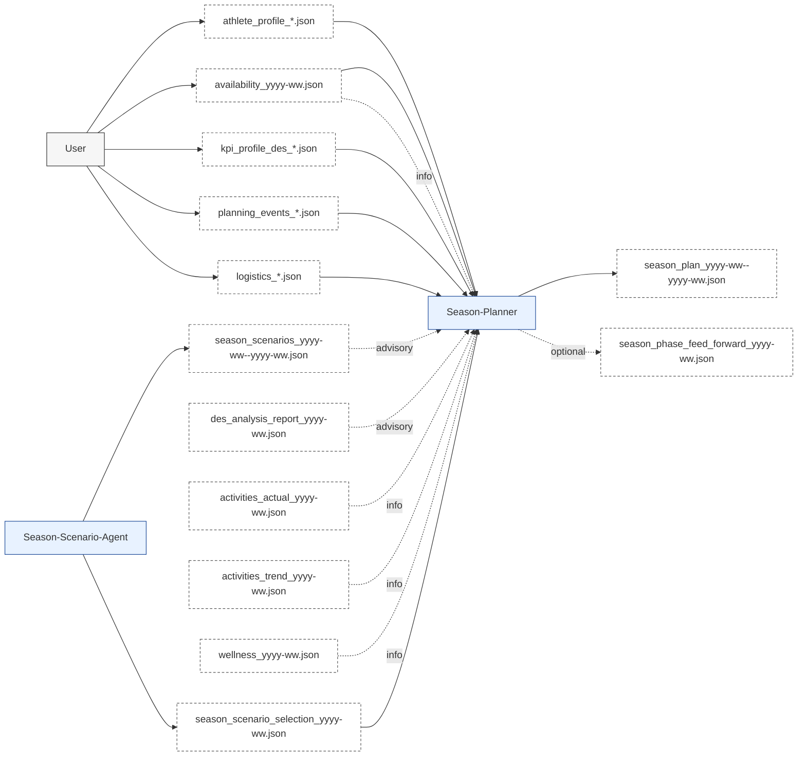
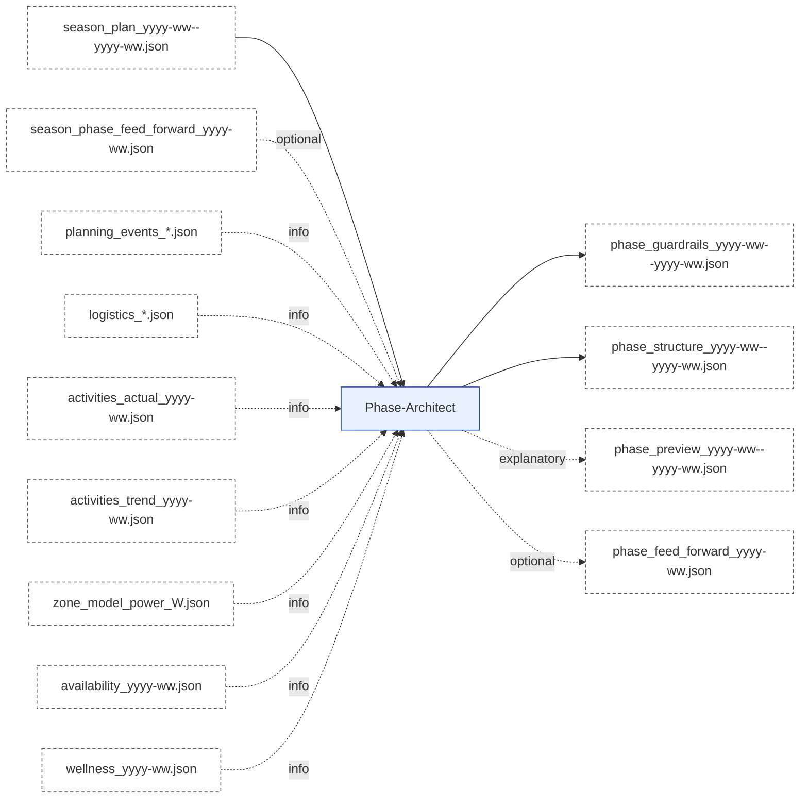
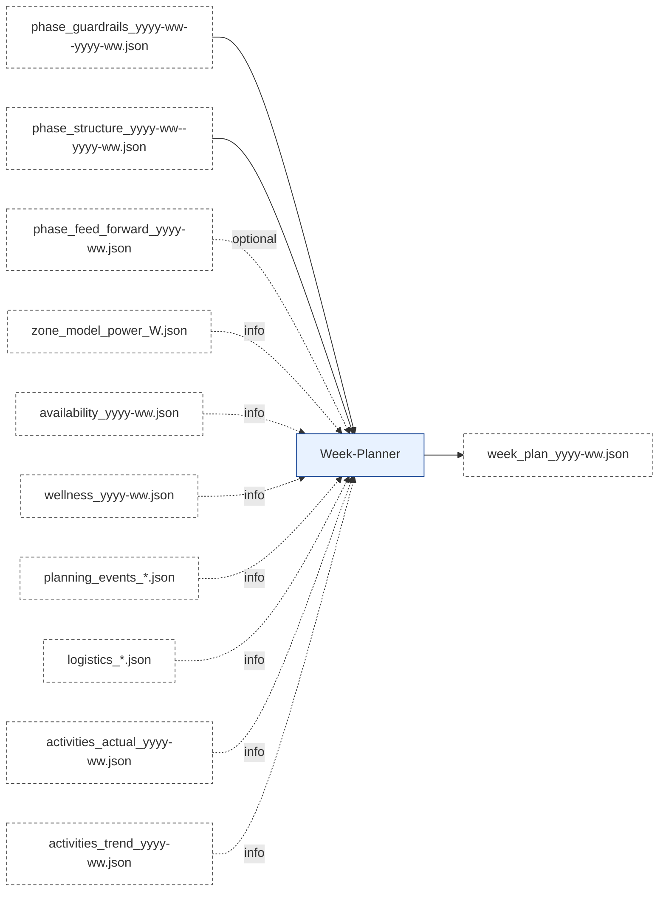
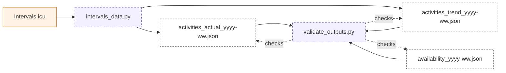
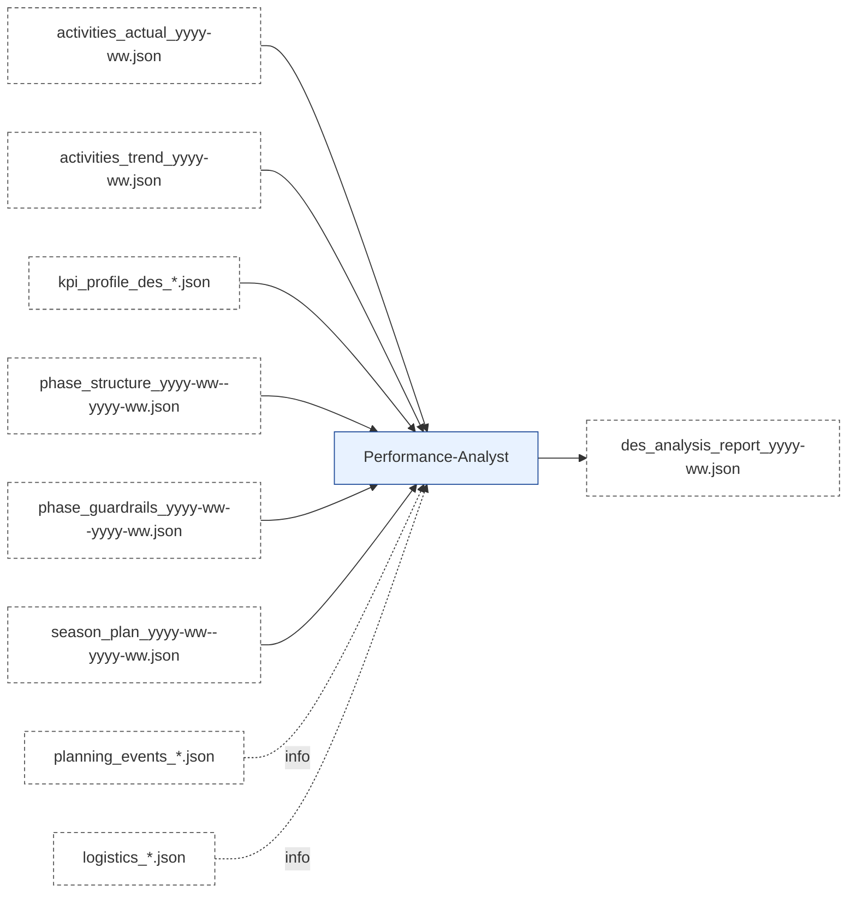
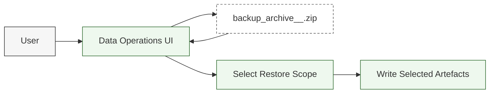

# Artefact Flow

Version: 2.2  
Status: Updated  
Last-Updated: 2026-02-10  
Format: GitHub-renderable Markdown + Mermaid

---

## 1. Flow Overview (End-to-End)

```mermaid
flowchart TD
  %% Actors / Components
  U[User]:::actor
  SS["Season-Scenario-Agent"]:::agent
  MA["Season-Planner"]:::agent
  ME["Phase-Architect"]:::agent
  MI["Week-Planner"]:::agent
  WB["Workout-Builder"]:::agent
  PA["Performance-Analyst"]:::agent
  I["Intervals.icu"]:::external
  EXP["intervals_data.py"]:::script
  VAL["validate_outputs.py"]:::script
  POST[""post_to_intervals (commit")"]:::script
  RCPT["post_receipts_yyyy-ww.json"]:::artefact

  %% Artefacts
  AP["athlete_profile_*.json"]:::artefact
  KP["kpi_profile_des_*.json"]:::artefact
  PE["planning_events_*.json"]:::artefact
  LG["logistics_*.json"]:::artefact
  AV["availability_yyyy-ww.json"]:::artefact
  SC["season_scenarios_yyyy-ww--yyyy-ww.json"]:::artefact
  MO["season_plan_yyyy-ww--yyyy-ww.json"]:::artefact
  SPFF["season_phase_feed_forward_yyyy-ww.json"]:::artefact
  BG["phase_guardrails_yyyy-ww--yyyy-ww.json"]:::artefact
  BEA["phase_structure_yyyy-ww--yyyy-ww.json"]:::artefact
  BEP["phase_preview_yyyy-ww--yyyy-ww.json"]:::artefact
  BFF["phase_feed_forward_yyyy-ww.json"]:::artefact
  ZM["zone_model_power_<FTP>W.json"]:::artefact
  WP["week_plan_yyyy-ww.json"]:::artefact
  WJ["workouts_yyyy-ww.json"]:::artefact
  CAL["Planned Activities<br/>in Calendar"]:::artefact
  AA["activities_actual_yyyy-ww.json"]:::artefact
  AT["activities_trend_yyyy-ww.json"]:::artefact
  WL["wellness_yyyy-ww.json"]:::artefact
  DR["des_analysis_report_yyyy-ww.json"]:::artefact

  %% Planning chain
  U --> AP
  U --> AV
  AV --> SS
  U --> KP --> SS
  SS --> SC --> MA
  KP --> MA
  KP --> PA
  U --> PE --> MA
  U --> LG --> MA
  PE -. info .-> SS
  LG -. info .-> SS
  AV --> MA

  MA --> MO --> ME
  MA -. optional .-> SPFF --> ME

  ME --> BG --> MI
  ME --> BEA --> MI
  ME -. explanatory .-> BEP
  ME -. optional .-> BFF --> MI
  ZM -. info .-> ME
  ZM -. info .-> MI
  AV -. info .-> ME
  AV -. info .-> MI

  MI --> WP --> WB
  WB --> WJ --> POST
  POST --> RCPT --> CAL --> I

  %% Data & analysis loop
  I --> EXP
  EXP --> AA
  EXP --> AT
  EXP --> ZM
  EXP --> WL
  AA --> VAL
  AT --> VAL
  VAL -. validates .-> AA
  VAL -. validates .-> AT
  BG --> PA
  BEA --> PA
  MO --> PA
  AA --> PA
  AT --> PA
  WL --> PA
  WL -. info .-> MA
  WL -. info .-> ME
  PA --> DR --> MA

  %% Events can be used by multiple agents (informational)
  PE -. info .-> MA
  PE -. info .-> ME
  PE -. info .-> MI
  PE -. info .-> PA
  LG -. info .-> MA
  LG -. info .-> ME
  LG -. info .-> MI
  LG -. info .-> PA

  %% Styling
  classDef actor fill:#f6f6f6,stroke:#333,stroke-width:1px;
  classDef agent fill:#e8f2ff,stroke:#1f4b99,stroke-width:1px;
  classDef component fill:#eef8ee,stroke:#2f6b2f,stroke-width:1px;
  classDef external fill:#fff3e6,stroke:#a35b00,stroke-width:1px;
  classDef artefact fill:#ffffff,stroke:#555,stroke-dasharray: 4 3,stroke-width:1px;
  classDef script fill:#f3f0ff,stroke:#5b4db8,stroke-width:1px,stroke-dasharray: 2 2;
```

---

## 2. Detail Flows

### 2.1 Season-Scenario Detail Flow

**Inputs (Artefacts)**
- `athlete_profile_*.json` (user-authored profile + goals)
- `availability_*.json` (user-managed availability)
- `kpi_profile_des_*.json`
- `planning_events_*.json` (A/B/C events)
- `logistics_*.json` (contextual)

**Processing (Conceptual)**
- Extract season goals, constraints, and event priorities.
- Propose three scenario options (A/B/C) with clear trade-offs.
- Store scenarios for Season-Planner consumption (advisory only).

**Outputs (Artefacts)**
- `season_scenarios_yyyy-ww--yyyy-ww.json` (informational)



### 2.2 Season-Planner Detail Flow

**Inputs (Artefacts)**
- `athlete_profile_*.json` (user-authored profile + goals)
- `availability_*.json` (user-managed availability)
- `kpi_profile_des_*.json`
- `planning_events_*.json` (A/B/C events)
- `logistics_*.json` (contextual)
- `season_scenarios_yyyy-ww--yyyy-ww.json` (advisory, if available)
- `des_analysis_report_yyyy-ww.json` (advisory)
- `activities_actual_yyyy-ww.json` / `activities_trend_yyyy-ww.json` (informational, if available)
- `wellness_yyyy-ww.json` (informational; body_mass_kg used for kJ/kg/h corridor math)

**Processing (Conceptual)**
- Determine season intent, priorities, and constraints (8-32 weeks horizon).
- Define phase structure and load corridors (availability weekly hours + wellness body_mass_kg).
- Emit optional feed-forward if the next phase needs explicit guidance.
- Season flow (agent tasks / UI):
  1) **Season-Scenario-Agent** → `CREATE_SEASON_SCENARIOS` (stores `season_scenarios_yyyy-ww--yyyy-ww.json`)
  2) **Season-Scenario-Agent** → `CREATE_SEASON_SCENARIO_SELECTION` (stores `season_scenario_selection_yyyy-ww.json`)
  3) **Season-Planner** → `CREATE_SEASON_PLAN` (writes `season_plan_yyyy-ww--yyyy-ww.json`)

**Outputs (Artefacts)**
- `season_plan_yyyy-ww--yyyy-ww.json` (binding)
- `season_phase_feed_forward_yyyy-ww.json` (optional)



---

### 2.3 Phase-Architect Detail Flow

**Inputs (Artefacts)**
- `season_plan_yyyy-ww--yyyy-ww.json` (binding)
- `season_phase_feed_forward_yyyy-ww.json` (optional, binding if present)
- `planning_events_*.json` (informational)
- `logistics_*.json` (informational)
- `activities_actual_yyyy-ww.json` / `activities_trend_yyyy-ww.json` (informational)
- `availability_yyyy-ww.json` (informational)
- `wellness_yyyy-ww.json` (informational)

**Processing (Conceptual)**
- Convert season phase intent into a phase (governance + phase structure).
- Phase range is derived from season phase boundaries (not calendar-aligned).
- Optional preview or feed-forward on explicit request.
- Consumes the latest `ZONE_MODEL` (Data-Pipeline) when IF defaults are needed.

**Outputs (Artefacts)**
- `phase_guardrails_yyyy-ww--yyyy-ww.json` (binding)
- `phase_structure_yyyy-ww--yyyy-ww.json` (binding)
- `phase_preview_yyyy-ww--yyyy-ww.json` (optional, informational)
- `phase_feed_forward_yyyy-ww.json` (optional)



---

### 2.4 Week-Planner Detail Flow

**Inputs (Artefacts)**
- `phase_guardrails_yyyy-ww--yyyy-ww.json`
- `phase_structure_yyyy-ww--yyyy-ww.json`
- `phase_feed_forward_yyyy-ww.json` (optional)
- `zone_model_power_<FTP>W.json` (informational, from Data-Pipeline)
- `availability_yyyy-ww.json` (informational, user-managed input)
- `wellness_yyyy-ww.json` (informational, from Data-Pipeline)
- `planning_events_*.json` (informational)
- `logistics_*.json` (informational)
- Optional factual data for context

**Processing (Conceptual)**
- Create a weekly agenda aligned to governance and phase structure.
- Define sessions and constraints; avoid violating phase rules.

**Outputs (Artefacts)**
- `week_plan_yyyy-ww.json`



---

### 2.5 Workout-Builder + Posting Detail Flow

**Inputs (Artefacts)**
- `week_plan_yyyy-ww.json`

**Processing (Conceptual)**
- Deterministic conversion into Intervals.icu JSON payload.
- Optional commit step writes receipts (idempotency) and posts to Intervals.icu.
- Workouts export is optional in readiness (planning can complete without it).

**Outputs**
- `workouts_yyyy-ww.json`
- `receipts/post_to_intervals/<athlete>/<yyyy-Www>/<uid>.json`
- Planned calendar entries in Intervals.icu

```mermaid
flowchart LR
  WP["week_plan_yyyy-ww.json"]:::artefact --> WB["Workout-Builder"]:::agent
  WB --> WJ["workouts_yyyy-ww.json"]:::artefact --> POST[""post_to_intervals (commit")"]:::script
  POST --> RCPT["post_receipts_yyyy-ww.json"]:::artefact --> CAL["Planned Activities<br/>in Calendar"]:::artefact --> I["Intervals.icu"]:::external

  classDef agent fill:#e8f2ff,stroke:#1f4b99,stroke-width:1px;
  classDef external fill:#fff3e6,stroke:#a35b00,stroke-width:1px;
  classDef artefact fill:#ffffff,stroke:#555,stroke-dasharray: 4 3,stroke-width:1px;
  classDef script fill:#f3f0ff,stroke:#5b4db8,stroke-width:1px,stroke-dasharray: 2 2;
```

---

### 2.6 Data Pipeline Detail Flow (Fetch + Compile + Validate)

**Inputs**
- Intervals.icu API data (executed activities and related metrics)
- Intervals.icu calendar state (planned + executed)
- `availability_*.json` (user-managed input, validated alongside outputs)

**Processing (Conceptual)**
- `intervals_data.py`: fetch raw activity data, compile `activities_actual` and `activities_trend`
- `validate_outputs.py`: validate JSON outputs against schemas

**Outputs (Artefacts)**
- `activities_actual_yyyy-ww.json`
- `activities_trend_yyyy-ww.json`
- `availability_yyyy-ww.json`



---

### 2.7 Artefact Renderer (Sidecars)

**Purpose**
- Produce human-readable `.md` sidecars from JSON artefacts.

**Inputs**
- Any JSON artefact (e.g., `phase_guardrails_yyyy-ww--yyyy-ww.json`)

**Processing**
- `rps.rendering.renderer.render_json_sidecar`
- Templates in `src/rps/rendering/templates/`

**Outputs**
- `<artefact>.md` (informational only)

---

### 2.8 Performance-Analyst Detail Flow

**Inputs (Artefacts)**
- `activities_actual_yyyy-ww.json`
- `activities_trend_yyyy-ww.json`
- `kpi_profile_des_*.json`
- `planning_events_*.json` (informational)
- `logistics_*.json` (informational)
- `season_plan_yyyy-ww--yyyy-ww.json`
- `phase_guardrails_yyyy-ww--yyyy-ww.json`
- `phase_structure_yyyy-ww--yyyy-ww.json`

**Processing (Conceptual)**
- Extract diagnostic signals (DES/KPI).
- Produce a single dominant interpretation with explicit confidence.

**Outputs (Artefacts)**
- `des_analysis_report_yyyy-ww.json`



---

### 2.9 Data Operations (Backup + Restore)

**Inputs (Artefacts)**
- Athlete workspace directory (`runtime/athletes/<athlete_id>/`)

**Processing (Conceptual)**
- Backup is always **full** (no scope selector).
- Restore applies **only the selected scope** from the uploaded archive.

**Outputs (Artefacts)**
- `backup_archive_<athlete_id>_<timestamp>.zip` (full snapshot)
- `backup_manifest.json` (embedded inside the archive)



---

## 3. Artefact Index (Quick Reference)

### 3.1 User-Maintained
- `athlete_profile_yyyy.json`
- `planning_events_yyyy.json`
- `logistics_yyyy.json`
- `availability_yyyy-ww.json`
- `kpi_profile_des_*.json`

### 3.2 Season-Scenario-Agent

See [doc/architecture/agents.md](../architecture/agents.md) for the canonical agent registry.
- `season_scenarios_yyyy-ww--yyyy-ww.json`

### 3.3 Season-Planner
- `season_plan_yyyy-ww--yyyy-ww.json`
- `season_phase_feed_forward_yyyy-ww.json` (optional)

### 3.4 Phase-Architect
- `phase_guardrails_yyyy-ww--yyyy-ww.json`
- `phase_structure_yyyy-ww--yyyy-ww.json`
- `phase_preview_yyyy-ww--yyyy-ww.json` (optional)
- `phase_feed_forward_yyyy-ww.json` (optional)

### 3.5 Week-Planner
- `week_plan_yyyy-ww.json`

### 3.6 Workout-Builder / Posting
- `workouts_yyyy-ww.json`
- Planned calendar activities (Intervals.icu)

### 3.7 Data Pipeline
- `activities_actual_yyyy-ww.json`
- `activities_trend_yyyy-ww.json`
- `zone_model_power_<FTP>W.json`
- `wellness_yyyy-ww.json`
- Raw CSVs (implementation detail)

### 3.8 Performance-Analyst
- `des_analysis_report_yyyy-ww.json`

### 3.9 Data Operations
- `backup_archive_<athlete_id>_<timestamp>.zip`
- `backup_manifest.json` (embedded)

---

## 4. Notes on Optionality and Authority

- **Binding:** `season_plan`, `phase_guardrails`, `phase_structure`, `week_plan`,
  `activities_actual`, `activities_trend`
- **Informational:** `season_scenarios`, `phase_preview`, `zone_model`, `wellness` (when present)
- **Scoped Override:** feed-forward artefacts (use only within their stated scope)
- **Advisory:** `des_analysis_report`

---

## End of Document
