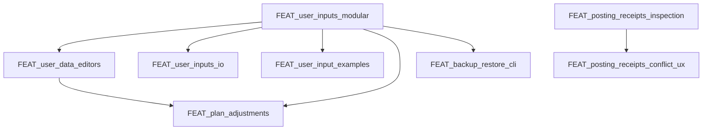

# Feature Backlog

This backlog tracks upcoming features and refactors. Each item should link to a
feature spec (`doc/specs/features/FEAT_<slug>.md`) before implementation.

## Ranked Backlog (with dependencies)

1) **FEAT_user_inputs_modular** — split core profile/goals, race events, availability.  
   Depends on: none
2) **FEAT_user_data_editors** — UI editors for availability, events, logistics.  
   Depends on: FEAT_user_inputs_modular
3) **FEAT_user_inputs_io** — upload/download inputs (Season Brief, events.md).  
   Depends on: FEAT_user_inputs_modular
4) **FEAT_user_input_examples** — example Season Brief + Logistics inputs.  
   Depends on: FEAT_user_inputs_modular
5) **FEAT_plan_adjustments** — adjust Season/Phase plans when constraints change.  
   Depends on: FEAT_user_inputs_modular, FEAT_user_data_editors
6) **FEAT_backup_restore_cli** — CLI for backup/restore.  
   Depends on: FEAT_user_inputs_modular
7) **FEAT_run_scheduler_resilience** — stuck-run detection and recovery.  
   Depends on: none
8) **FEAT_user_management** — auth/login + per-user API keys and athlete ID.  
   Depends on: none (but changes deployment + config)
9) **FEAT_docker_deploy** — image build + registry + deployment workflow.  
   Depends on: none (better after user_management for env clarity)
10) **FEAT_posting_receipts_conflict_ux** — receipts diff + conflict UX.  
    Depends on: FEAT_posting_receipts_inspection

## Implemented / In-Progress

- [x] FEAT_parquet_cache — Parquet cache writes in data pipeline.
- [x] FEAT_parquet_readers — Parquet-first reads in Data & Metrics.
- [x] FEAT_vectorstore_monitor — background monitor + reset behavior.
- [~] FEAT_posting_receipts_inspection — receipt inspection + status (implemented; UX polish ongoing).

## Unlock Graph (dependencies)

## Deferred / Ideas

- [ ] FEAT_parquet_rollups — precomputed analytics rollups for long ranges.
- [ ] FEAT_archival_policy — archive/restore old athlete data.
