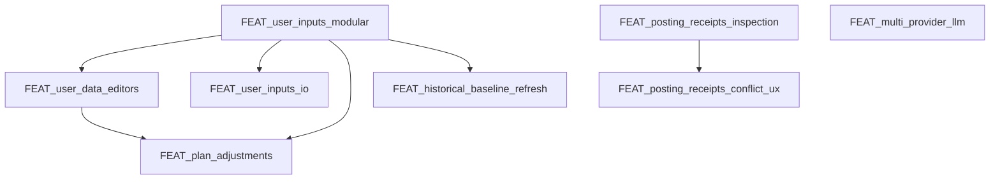

# Feature Backlog

This backlog tracks upcoming features and refactors. Each item should link to a
feature spec ([doc/specs/features/FEAT_<slug>.md](/doc/specs/features/FEAT_<slug>.md)) before implementation.

## Ranked Backlog (with dependencies)

1) **FEAT_run_scheduler_resilience** — stuck-run detection and recovery.  
   Depends on: none
2) **FEAT_user_inputs_io** — upload/download inputs (new modular inputs).  
   Depends on: FEAT_user_inputs_modular
3) **FEAT_plan_adjustments** — adjust Season/Phase plans when constraints change.  
   Depends on: FEAT_user_inputs_modular, FEAT_user_data_editors
4) **FEAT_user_management** — auth/login + per-user API keys and athlete ID.  
   Depends on: none (but changes deployment + config)
5) **FEAT_docker_deploy** — image build + registry + deployment workflow.  
   Depends on: none (better after user_management for env clarity)
6) **FEAT_posting_receipts_conflict_ux** — receipts diff + conflict UX.  
   Depends on: FEAT_posting_receipts_inspection

## Implemented / In-Progress

- [x] FEAT_parquet_cache — Parquet cache writes in data pipeline.
- [x] FEAT_parquet_readers — Parquet-first reads in Data & Metrics.
- [x] FEAT_vectorstore_monitor — background monitor + reset behavior.
- [~] FEAT_posting_receipts_inspection — receipt inspection + status (implemented; UX polish ongoing).
- [x] FEAT_multi_provider_llm — CrewAI-first runtime with direct provider config and embedded Qdrant.
- [x] FEAT_user_inputs_modular — hard cut-over to modular inputs and new pages.
- [x] FEAT_user_data_editors — editors for profile/goals, availability, events, logistics.
- [x] FEAT_historical_baseline_refresh — refresh baseline from Intervals via UI.
- [x] FEAT_user_input_examples — example Profile/Goals + Logistics + Events inputs.
- [x] FEAT_backup_restore_cli — backup/restore tooling (UI + helper).
- [x] BUG_user_inputs_polish — Events columns/rank/priority, Logistics enums, Availability rounding, guidance.
- [x] FEAT_central_planner_context_snapshots — code-owned planner memory snapshots.
- [x] FEAT_snapshot_memory_expansion — feed-forward + coach snapshot-first memory and advisory memory.
- [x] FEAT_chat_week_plan_edits — bounded write-capable chat edits for existing week plans on the Workouts page.
- [x] FEAT_week_plan_consistency_guards — central `WEEK_PLAN` normalization and consistency guards before store/export.
- [x] FEAT_active_coach_operations — active Coach operations for bounded edits, replans, and advisory triggers with CrewAI foundation/config.
- [x] FEAT_crewai_runtime_cutover — central agent runtime gateway, Python 3.13 container baseline, and initial CrewAI execution backend with explicit `auto|legacy|crewai` selection.
- [x] FEAT_coach_crewai_decoupling — Coach page moved off `rps_chatbot`, with direct CrewAI turn execution and provider config independent of LiteLLM client objects.
- [x] FEAT_litellm_runtime_removal — hard cutover to CrewAI-only runtime, Workout Editor chat migration, direct embedding calls, and removal of legacy LiteLLM/runtime modules.
- [x] FEAT_crewai_agent_responsibility_cleanup — authority cleanup for season/phase/feed-forward ownership plus CrewAI foundation models for Season/Phase specialist roles.
- [x] FEAT_hierarchical_crewai_execution — internal specialist-task execution for Season and Phase, including manager finalization and internal `PhaseBundle` splitting before persistence.
- [x] FEAT_crewai_flow_outer_orchestration — outer Season/Phase Flow wrappers, grouped Phase bundle reuse, and specialist prompt slicing.
- [x] FEAT_crewai_advisory_flows_and_true_hierarchical_crews — outer Week/Report/Feed-Forward Flow wrappers and true hierarchical single-crew execution for Season/Phase specialist work.
- [x] FEAT_coach_flow_router_and_runtime_telemetry — Coach Flow routing for confirm/discard/status turns plus visible Flow/Crew telemetry in Plan Hub, Status, and History.

## Unlock Graph (dependencies)

## Continuation Protocol (for new sessions)

When resuming work, follow this order so context stays consistent:

1) Read `AGENTS.md` (rules, doc placement, feature-first workflow).
2) Review [doc/specs/features/FEAT_user_inputs_modular.md](/doc/specs/features/FEAT_user_inputs_modular.md) for scope and current status.
3) Verify current backlog order and dependencies in this file.
4) Check repo for in-flight changes:
   - `git status`
   - recently modified files in `src/rps/ui/pages/athlete_profile/` and `specs/schemas/`
5) Implement the next backlog item only after the related feature doc is **Reviewed/Approved**.
6) Keep docs in sync:
   - [doc/ui/ui_spec.md](/doc/ui/ui_spec.md), [doc/architecture/workspace.md](/doc/architecture/workspace.md), [doc/overview/artefact_flow.md](/doc/overview/artefact_flow.md)
   - update [doc/README.md](/doc/README.md) index if files move
7) Run required checks:
   - `python -m py_compile $(git ls-files '*.py')`
   - one relevant smoke run (UI/CLI)
8) Update `CHANGELOG.md`, then commit and push.

## Deferred / Ideas

- [ ] Manual smoke pass for `Workout Editor` — verify preview/apply flows for move, start-time change, and workout-text replacement against a real athlete week in the UI.
- [ ] FEAT_workout_editor_swap_days — support bounded swap of two occupied workout days instead of move-to-empty-day only.
- [ ] FEAT_workout_editor_agenda_adjustments — support bounded agenda-level edits such as `planned_kj`, `planned_duration`, and selected day-role adjustments without full week re-plan.
- [ ] Manual active `Coach` smoke pass — verify context read, bounded edit preview/apply, scoped replan preview/apply, report preview/apply, and feed-forward preview/apply against a real athlete week in the UI.
- [ ] FEAT_parquet_rollups — precomputed analytics rollups for long ranges.
- [ ] FEAT_archival_policy — archive/restore old athlete data.
- [ ] FEAT_run_progress_ui — progress indicators for long-running planning jobs.
- [ ] FEAT_planning_done_notification — optional banner/email/push when planning completes.
- [ ] FEAT_auto_retry_transient — auto-retry transient failures with clear logs.
