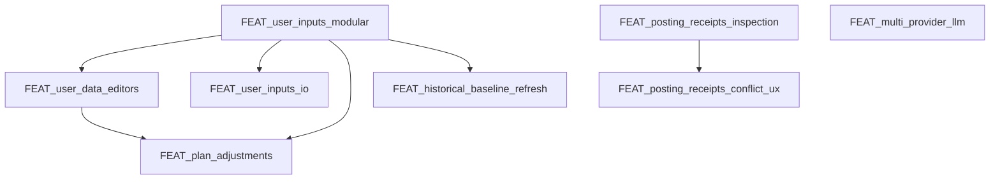

# Feature Backlog

This backlog tracks upcoming features and refactors. Each item should link to a
feature spec ([doc/specs/features/FEAT_<slug>.md](/doc/specs/features/FEAT_<slug>.md)) before implementation.

## Ranked Backlog (with dependencies)

1) **FEAT_run_scheduler_resilience** — stuck-run detection and recovery.  
   Depends on: none
2) **FEAT_user_inputs_io** — upload/download inputs (new modular inputs).  
   Depends on: FEAT_user_inputs_modular
3) **FEAT_plan_adjustments** — adjust Season/Phase plans when constraints change.  
   Depends on: FEAT_user_inputs_modular, FEAT_user_data_editors
4) **FEAT_user_management** — auth/login + per-user API keys and athlete ID.  
   Depends on: none (but changes deployment + config)
5) **FEAT_docker_deploy** — image build + registry + deployment workflow.  
   Depends on: none (better after user_management for env clarity)
6) **FEAT_posting_receipts_conflict_ux** — receipts diff + conflict UX.  
   Depends on: FEAT_posting_receipts_inspection
7) **[FEAT_plan_week_testability_and_resolution_refactor](/doc/specs/features/FEAT_plan_week_testability_and_resolution_refactor.md)** — refactor `plan_week` test setup, resolver boundaries, and deterministic context typing for maintainability and lower regression risk.  
   Depends on: none

## Implemented / In-Progress

- [x] FEAT_parquet_cache — Parquet cache writes in data pipeline.
- [x] FEAT_parquet_readers — Parquet-first reads in Data & Metrics.
- [x] FEAT_vectorstore_monitor — superseded by vectorstore runtime removal.
- [~] FEAT_posting_receipts_inspection — receipt inspection + status (implemented; UX polish ongoing).
- [x] FEAT_multi_provider_llm — CrewAI-first runtime with direct provider config; local vectorstore portion superseded.
- [x] FEAT_user_inputs_modular — hard cut-over to modular inputs and new pages.
- [x] FEAT_user_data_editors — editors for profile/goals, availability, events, logistics.
- [x] FEAT_historical_baseline_refresh — refresh baseline from Intervals via UI.
- [x] FEAT_user_input_examples — example Profile/Goals + Logistics + Events inputs.
- [x] FEAT_backup_restore_cli — backup/restore tooling (UI + helper).
- [x] BUG_user_inputs_polish — Events columns/rank/priority, Logistics enums, Availability rounding, guidance.
- [x] FEAT_central_planner_context_snapshots — code-owned planner memory snapshots.
- [x] FEAT_snapshot_memory_expansion — feed-forward + coach snapshot-first memory and advisory memory.
- [x] FEAT_chat_week_plan_edits — bounded write-capable chat edits for existing week plans on the Workouts page.
- [x] FEAT_week_plan_consistency_guards — central `WEEK_PLAN` normalization and consistency guards before store/export.
- [x] FEAT_active_coach_operations — active Coach operations for bounded edits, replans, and advisory triggers with CrewAI foundation/config.
- [x] FEAT_crewai_runtime_cutover — central agent runtime gateway, Python 3.13 container baseline, and initial CrewAI execution backend with explicit `auto|legacy|crewai` selection.
- [x] FEAT_coach_crewai_decoupling — Coach page moved off `rps_chatbot`, with direct CrewAI turn execution and provider config independent of LiteLLM client objects.
- [x] FEAT_litellm_runtime_removal — hard cutover to CrewAI-only runtime, Workout Editor chat migration, direct embedding calls, and removal of legacy LiteLLM/runtime modules.
- [x] FEAT_crewai_agent_responsibility_cleanup — authority cleanup for season/phase/feed-forward ownership plus CrewAI foundation models for Season/Phase specialist roles.
- [x] FEAT_hierarchical_crewai_execution — internal specialist-task execution for Season and Phase, including manager finalization and internal `PhaseBundle` splitting before persistence.
- [x] FEAT_crewai_flow_outer_orchestration — outer Season/Phase Flow wrappers, grouped Phase bundle reuse, and specialist prompt slicing.
- [x] FEAT_crewai_advisory_flows_and_true_hierarchical_crews — outer Week/Report/Feed-Forward Flow wrappers and true hierarchical single-crew execution for Season/Phase specialist work.
- [x] FEAT_coach_flow_router_and_runtime_telemetry — Coach Flow routing for confirm/discard/status turns plus visible Flow/Crew telemetry in Plan Hub, Status, and History.
- [x] FEAT_crewai_event_listener_runtime_telemetry — CrewAI-native event listener adapter for Flow/Crew/Task/Tool telemetry into the existing run-store.
- [x] FEAT_crewai_runtime_event_payload_cleanup — compact normalized crew/task/tool labels in CrewAI runtime telemetry to keep `events.jsonl` and UI history readable.
- [x] FEAT_coach_week_plan_memory_and_intro — enrich Coach memory with current week plan detail and show a one-time startup summary for each athlete/week context.
- [x] FEAT_crewai_skill_package_validation — validate configured CrewAI skill packages for local references, positive action guidance, and explicit output-format guidance.

## Unlock Graph (dependencies)

## Continuation Protocol (for new sessions)

When resuming work, follow this order so context stays consistent:

1) Read `.clinerules` for operative Cline rules.
2) Read `AGENTS.md` as the agent entry/source map.
3) Review [doc/specs/features/FEAT_user_inputs_modular.md](/doc/specs/features/FEAT_user_inputs_modular.md) for scope and current status.
4) Verify current backlog order and dependencies in this file.
5) Check repo for in-flight changes:
   - `git status`
   - recently modified files in `src/rps/ui/pages/athlete_profile/` and `specs/schemas/`
6) Implement the next backlog item only after the related feature doc is **Reviewed/Approved**.
7) Keep docs in sync:
   - [doc/ui/ui_spec.md](/doc/ui/ui_spec.md), [doc/architecture/workspace.md](/doc/architecture/workspace.md), [doc/overview/artefact_flow.md](/doc/overview/artefact_flow.md)
   - update [doc/README.md](/doc/README.md) index if files move
8) Run required checks:
   - `python -m py_compile $(git ls-files '*.py')`
   - one relevant smoke run (UI/CLI)
9) Update `CHANGELOG.md`, then commit and push.

## Deferred / Ideas

- [ ] Full-run observation follow-up — before fixing the remaining Phase artifact quality gaps, rerun one complete Season→Phase→Week chain in the real runtime and analyze the resulting artefacts for: (a) canonical Season lineage `run_id` quality in Phase `trace_upstream`, (b) empty inherited `selection_rationale`, and (c) duplicated / partially rephrased `PHASE_STRUCTURE.upstream_intent.constraints`. Treat this as a post-run analysis gate, not an immediate code patch.
- [ ] Manual smoke pass for `Workout Editor` — verify preview/apply flows for move, start-time change, and workout-text replacement against a real athlete week in the UI.
- [ ] FEAT_workout_editor_swap_days — support bounded swap of two occupied workout days instead of move-to-empty-day only.
- [ ] FEAT_workout_editor_agenda_adjustments — support bounded agenda-level edits such as `planned_kj`, `planned_duration`, and selected day-role adjustments without full week re-plan.
- [ ] Manual active `Coach` smoke pass — verify context read, bounded edit preview/apply, scoped replan preview/apply, report preview/apply, and feed-forward preview/apply against a real athlete week in the UI.
- [ ] Manual CrewAI-compatible end-to-end smoke pass — run Season, Phase, Week, Coach, and Workout Editor in a CrewAI-capable Python 3.13/container runtime and validate flow persistence, memory/knowledge wiring, and preview/apply paths.
- [ ] FEAT_mandatory_output_audit_and_structured_output_migration — audit remaining `mandatory_output_*` families and migrate safe artifact/task families to `output_json` / `output_pydantic` plus guardrails; retain prompt-level contracts only where structured outputs remain unsafe.
- [ ] FEAT_parquet_rollups — precomputed analytics rollups for long ranges.
- [ ] FEAT_archival_policy — archive/restore old athlete data.
- [ ] FEAT_run_progress_ui — progress indicators for long-running planning jobs.
- [ ] FEAT_planning_done_notification — optional banner/email/push when planning completes.
- [ ] FEAT_auto_retry_transient — auto-retry transient failures with clear logs.
- [ ] FEAT_season_scenarios_tool_read_dedup — reduce redundant `workspace_get_input` / `workspace_get_latest` calls in `season_scenarios`, enforce consistent artifact/input type casing, and prefer one-pass minimal context reads per task run so guardrail retries do not amplify log noise and token/tool cost.
- [ ] FEAT_planner_positive_frontloading_rollout — apply the documented positive-frontloading template from `FEAT_season_scenario_positive_frontloading` to Season/Phase/Week planner chains with a mandatory 3-pass model (Pass 1 structural draft, Pass 2 semantic finalization, Pass 3 planner self-audit), explicit Pass 1 vs Pass 2 loopback rules, formal review classification, and copy-only writer preconditions.
- [x] FEAT_selected_scenario_contract_chain — bind athlete-selected scenario posture once at Season, propagate it through Season->Phase->Week contracts, deterministic context, snapshots, workspace tools, validation, renderer summaries, and positive-frontloaded active planning files.
- [x] FEAT_phase_authority_realignment_and_shared_week_skeleton — persist exact Season phase authority, project exact legality and role-week load bands into Phase context, keep legacy Season bands readable, and align Phase Preview and Week through one shared deterministic skeleton.
- [x] FEAT_strict_season_selection_binding — require latest `SEASON_SCENARIO_SELECTION` to bind to the exact latest `SEASON_SCENARIOS`, block stale selections before `SEASON_PLAN`, unify UI/runtime readiness, and hard-abort Season planning before CrewAI task preparation when selection binding fails.
- [x] FEAT_season_scenarios_complete_selection_contract — require `SEASON_SCENARIOS.scenario_guidance` to emit complete operational posture (`recovery_margin`, `fatigue_exposure`, `specificity_density`, structured contract notes), harden active scenario-generation files to stay front-loaded/self-contained, and preserve canonical list/string shapes through normalization, guardrails, and selected-scenario contract extraction.
- [x] FEAT_contract_validation_assembly_fix — fix synthetic Season/Phase contract assembly, correct Week payload-vs-authority posture validation, and add regression coverage for code-owned contract-assembly failures.
- [x] FEAT_phase_writer_guardrail_pre_normalization — normalize `PHASE_STRUCTURE` / `PHASE_PREVIEW` writer candidates against exact persisted authority before task guardrails run, while keeping guarded-store normalization as second-line protection.
- [x] FEAT_phase_bundle_nested_intent_normalization — normalize nested internal `phase_intent` fields in `PhaseDraftBundle` before review-readiness validation and fail closed during bundle normalization when canonical deterministic phase intent is unavailable.
- [x] FEAT_selected_scenario_contract_schema_alignment — align the full selected-scenario contract schema across `SEASON_PLAN`, `PHASE_GUARDRAILS`, and `PHASE_STRUCTURE`, keep `WEEK_PLAN` on the reduced inherited posture shape, and keep `PHASE_PREVIEW` derivation-only.
- [x] FEAT_plan_hub_runtime_progress_visibility — surface active flow/crew/task progress and `x/y` task counts in Plan Hub from existing runtime telemetry, without adding new event types.
- [x] FEAT_run_event_telemetry_enrichment — enrich Run Events with parent-step metadata, merge direct child run telemetry, and keep Plan Hub / System Status / History on one shared event-loading path.
- [x] FEAT_season_finalize_raw_bundle_boundary — move `season_plan_finalize` to a raw JSON boundary, coerce misplaced season audit-slot items before strict internal bundle validation, and keep later Season normalization/contract checks unchanged.
- [x] FEAT_season_preview_trace_consistency — derive Season average weekly kJ envelope from authoritative role-week bands, keep Preview informational while aligned to Week through the shared skeleton, and canonicalize immediate Phase trace lineage.
- [x] FEAT_week_constraint_metadata_housekeeping_closure — persist effective week-local legality separately from scenario posture, make week objectives truthful to actual planned load, persist canonical artifact `version_key` and direct trace lineage, and scope housekeeping to real athlete workspaces only.
- [x] FEAT_repo_metadata_trace_workspace_cleanup — unify repo-internal trace metadata typing around canonical dict references, normalize trace fields on local-store writes, and keep legacy trace-string support read-only through explicit local-store normalization.
- [x] FEAT_runtime_compat_boundary_reduction — move active CrewAI runtime availability checks onto a repo-owned `runtime_status` boundary and reduce `compat.py` to a legacy shim.
- [x] FEAT_runtime_flow_listener_adapter_hardening — harden the active CrewAI Flow and event-listener adapter boundary by dynamically constructing runtime-loaded Flow/listener classes inside repo-owned adapter code, while keeping active runtime entrypoints and telemetry behavior unchanged.
- [x] FEAT_full_typecheck_and_test_harness_closure — close the remaining full-repo mypy debt across active planning/runtime/store helpers and the high-friction test harness clusters, without relaxing repo-wide typing rules.
- [x] FEAT_active_prompt_skill_doc_debt_cleanup — close the remaining active prompt/skill/doc drift by defining residual operative variables, upgrading the shared durability skill to the current self-contained standard, and marking historical migration docs as non-operative runtime sources in active planner/finalizer/review surfaces.
- [ ] FEAT_crewai_memory_policy_tuning — tune CrewAI memory scoring/retention, add athlete-scoped forget/cleanup helpers, and keep Coach-confirmed preferences separate from planning artifacts.
- [ ] FEAT_crewai_files_evaluation — evaluate CrewAI Files only for PDF evidence, charts, screenshots, or external feedback; keep plan artifacts Workspace/Schema-owned.
- [ ] FEAT_crewai_planning_profile_tuning — refine where CrewAI planning is enabled, keeping deterministic Load/S5/Cadence outside planning LLM authority.
- [ ] FEAT_crewai_mcp_apps_policy — define conservative MCP/App usage for evidence search and external integrations with RPS preview/confirm/apply boundaries.
- [ ] FEAT_prompt_caching_investigation — no explicit LLM prompt-caching support exists today (no `cache_control`/`ephemeral` breakpoints anywhere; the only `cache` config, `cache: false` in `config/crewai/agents.yaml`, is CrewAI's unrelated tool-result cache). Default model is `openai/gpt-5-mini` (`src/rps/crewai_runtime/provider.py:41`), which OpenAI caches automatically server-side for prefixes over ~1024 tokens, no code required. Task-description building (`src/rps/agents/crewai_task_execution.py`) already places static content (agent instructions, tool-first rules) before dynamic content (user input, runtime context blocks), a structure favorable to caching, though this appears incidental rather than deliberate. Needs runtime observation (telemetry/logs on real calls) to confirm actual cache-hit behavior before deciding whether prefix-structure changes are worth making — not yet investigated at that depth.
- [x] [FEAT_crewai_backend_module_split](/doc/specs/features/FEAT_crewai_backend_module_split.md) — split `src/rps/agents/crewai_backend.py` into focused modules per [ADR-059](/doc/adr/ADR-059-crewai-backend-module-split.md) and [ADR-060](/doc/adr/ADR-060-crewai-backend-context-and-execution-split.md). Phase 1: structured-output extraction/parsing moved to `src/rps/agents/crewai_output_extraction.py`. Phase 2: bundle/artifact validation and meta normalization moved to `src/rps/agents/crewai_validation.py`. Phase 3: CrewAI agent/crew/LLM construction and tool resolution (14 functions) moved to `src/rps/agents/crewai_builders.py`. Phase 4: season/phase bundle normalization (25 functions) moved to `src/rps/agents/crewai_bundle_normalization.py`. Phase 5 (ADR-060): context/contract-block building (5 functions) moved to `src/rps/agents/crewai_context_blocks.py`. Phase 6 (ADR-060, final): task execution orchestration (23 functions, all 4 remaining public entry points, 13 exclusive constants) moved to `src/rps/agents/crewai_task_execution.py`. `crewai_backend.py` retained only a pre-existing dead function after Phase 6 and has since been deleted entirely. All phases complete.
- [x] FEAT_intervals_data_module_split — split `src/rps/data_pipeline/intervals_data.py` (2890 lines, the repo's largest file) into focused modules; no ADR needed (pure internal reorganization, doesn't touch persistence strategy/orchestration/authority/telemetry boundaries — only 4 names consumed externally). Phase 1 (done): date/time utilities + CLI parsing moved to `src/rps/data_pipeline/intervals_date_utils.py`; Intervals.icu HTTP API client moved to `src/rps/data_pipeline/intervals_api_client.py`. Phase 2 (done): zone-model/wellness/historical-baseline output stages moved to `intervals_zone_model.py`/`intervals_wellness.py`/`intervals_historical_baseline.py`; shared schema utilities moved early to `intervals_schema_utils.py` once the audit showed all three needed it. Phase 3 (done): formatting/unit-conversion helpers moved to `intervals_formatting.py`; JSON-safe normalization/formatting helpers moved to `intervals_json_formatters.py`. Phase 4 (done): export DataFrame building moved to `intervals_export.py`. Phase 5 (done): activities-actual schema transformation moved to `intervals_activities_actual.py`; `src/rps/orchestrator/context_snapshots.py`'s import of `fetch_current_week_activities_actual_payload` repointed to the new module (first external-consumer import-path change in this split). Phase 6 (done, split complete): activities-trend weekly aggregation (`compile_activities_trend` and its 13 nested helpers) moved to `intervals_activities_trend.py`, along with the export-configuration constants block that was exclusively used by it; two genuinely dead constants (`PERCENT_SCALE_THRESHOLD`, `PERCENT_INTEGER_EPSILON`, already duplicated in `intervals_zone_model.py`) were deleted rather than moved. `intervals_data.py` is now a 139-line orchestration entrypoint (down from 2890).
- [ ] FEAT_guardrails_module_split — split `src/rps/crewai_runtime/guardrails.py` (2346 lines) into 7 new modules under `src/rps/crewai_runtime/`, per `doc/adr/ADR-061-crewai-guardrails-module-split.md` (written; ADR touches orchestration/authority boundaries per ADR-035, and confirms neither the `ContextVar`-based runtime-context mechanism nor the `REGISTRY` string-resolution pattern blocks a same-behavior split — same finding ADR-060 made for `crewai_backend.py`). Full 7-phase plan tracked in `doc/specs/features/FEAT_guardrails_module_split.md`. Phase 1 (done): context core (`_GUARDRAIL_CONTEXT`, `guardrail_runtime_context`, `current_guardrail_runtime_context`, shared type aliases) moved to `guardrails_context.py`; 7 production files + 11 test files repointed to the new import path. Phase 2 (done): generic output-shape validators moved to `guardrails_generic.py`; artifact-envelope/JSON-Schema validators moved to `guardrails_schema.py`; the payload-coercion helpers (`_coerce_payload`/`_coerce_mapping`) both new modules needed were pulled forward from the not-yet-started Phase 3 into a new `guardrails_utilities.py`, to avoid a circular import with `guardrails.py`'s `REGISTRY`. Phase 3 (done): remaining 22 cross-domain utilities moved to `guardrails_utilities.py` (AST-based extraction due to interleaving); repointed 1 external production consumer and fixed 2 test files whose monkeypatches on the old module silently stopped intercepting the moved `_with_guardrail_telemetry`'s internal calls. Phase 4 (done): 7 phase-artifact validators + exclusive ISO-week helpers moved to `guardrails_phase.py`; `_next_iso_week` (physically adjacent but exclusively season-used) left behind for Phase 6. Phase 5 (done): 14 week-artifact validators + exclusive helpers moved to `guardrails_week.py`; `_repair_season_plan_for_contract_validation` (physically adjacent but exclusively season-used) left behind for Phase 6. Remaining: season domain validators (highest risk, ~700 lines including a 440-line function), registry.
- [x] Consolidate the exact-duplicate `_load_latest_payload` in `src/rps/ui/pages/coach.py` and `src/rps/orchestrator/advisory_actions.py` behind `LocalArtifactStore.load_latest_payload(...)` in `src/rps/workspace/local_store.py`.
- [x] Audit and consolidate the remaining `_load_latest_payload`-family variants: `src/rps/orchestrator/plan_week.py`, `src/rps/orchestrator/season_flow.py` (a fourth copy this audit found, not originally tracked), `src/rps/planning/week_engine.py`'s `_load_latest_optional`, and `src/rps/ui/pages/plan/season.py` all now route through `LocalArtifactStore.load_latest_payload(...)`, confirmed safe by tracing every consumption point (all treat `None` and `{}` identically). `week_engine.py`'s `_load_latest_required` (raises `ValueError`, fail-closed, single use for the mandatory `SEASON_PLAN`) is intentionally different and stays file-local.
- [x] Consolidate the exact-duplicate `_load_selected_week_artifact` in `src/rps/ui/pages/coach.py`, `src/rps/ui/pages/performance/feed_forward.py`, and `src/rps/orchestrator/advisory_actions.py` behind `LocalArtifactStore.load_selected_week_payload(...)`.
- [x] Fixed 3 test-hygiene issues found during the review: `tests/test_evidence_library.py` no longer writes to the real tracked `skills/shared/durability-methodology/references/...` files (isolation fixture on 6 mutating tests, which also fixed 5 tests broken by real scheduled-refresh state drift); `tests/test_skill_references.py` no longer rejects legitimate `skills/`-prefixed cross-skill composition references; `tests/test_week_plan_edits.py`'s sample fixture now matches the current `week_plan.schema.json`.
- [x] Split `tests/test_plan_pages.py` (3941 lines, 58 tests) into 7 domain-focused files: `test_plan_season_page.py`, `test_plan_hub_page.py`, `test_season_planning_orchestration.py`, `test_plan_week_orchestration.py`, `test_athlete_profile_pages.py`, `test_performance_report_page.py`, `test_feed_forward_page.py`.
- [x] Split `tests/test_crewai_runtime.py` (8177 lines, 201 tests) into 12 domain-focused files: `test_crewai_config_and_builders.py`, `test_crewai_season_semantics_normalization.py`, `test_crewai_output_extraction_and_audit.py`, `test_crewai_phase_week_review_guardrails.py`, `test_crewai_season_phase_bundle_normalization.py`, `test_crewai_phase_writer_guardrails.py`, `test_crewai_review_readiness_and_load_context.py`, `test_crewai_scenario_profile_quality.py`, `test_crewai_week_planning_guardrails.py`, `test_crewai_runtime_config_and_status.py`, `test_crewai_flow_and_event_orchestration.py`, `test_crewai_multi_output_execution.py`. Done after ADR-060 Phases 5-6 settled the final `crewai_backend.py`/`crewai_context_blocks.py`/`crewai_task_execution.py` import paths, so it only needed updating once. This closes out the oversized-test-file backlog item.
