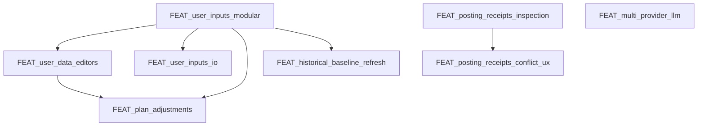

# Feature Backlog

This backlog tracks upcoming features and refactors. Each item should link to a
feature spec (`doc/specs/features/FEAT_<slug>.md`) before implementation.

## Ranked Backlog (with dependencies)

1) **FEAT_multi_provider_llm** — LiteLLM-only runtime + embedded Chroma (CrewAI phase-2).  
   Depends on: none
2) **FEAT_user_inputs_io** — upload/download inputs (new modular inputs).  
   Depends on: FEAT_user_inputs_modular
3) **FEAT_plan_adjustments** — adjust Season/Phase plans when constraints change.  
   Depends on: FEAT_user_inputs_modular, FEAT_user_data_editors
4) **FEAT_run_scheduler_resilience** — stuck-run detection and recovery.  
   Depends on: none
5) **FEAT_user_management** — auth/login + per-user API keys and athlete ID.  
   Depends on: none (but changes deployment + config)
6) **FEAT_docker_deploy** — image build + registry + deployment workflow.  
   Depends on: none (better after user_management for env clarity)
7) **FEAT_posting_receipts_conflict_ux** — receipts diff + conflict UX.  
   Depends on: FEAT_posting_receipts_inspection

## Implemented / In-Progress

- [x] FEAT_parquet_cache — Parquet cache writes in data pipeline.
- [x] FEAT_parquet_readers — Parquet-first reads in Data & Metrics.
- [x] FEAT_vectorstore_monitor — background monitor + reset behavior.
- [~] FEAT_posting_receipts_inspection — receipt inspection + status (implemented; UX polish ongoing).
- [x] FEAT_user_inputs_modular — hard cut-over to modular inputs and new pages.
- [x] FEAT_user_data_editors — editors for profile/goals, availability, events, logistics.
- [x] FEAT_historical_baseline_refresh — refresh baseline from Intervals via UI.
- [x] FEAT_user_input_examples — example Profile/Goals + Logistics + Events inputs.
- [x] FEAT_backup_restore_cli — backup/restore tooling (UI + helper).
- [x] BUG_user_inputs_polish — Events columns/rank/priority, Logistics enums, Availability rounding, guidance.

## Unlock Graph (dependencies)

## Continuation Protocol (for new sessions)

When resuming work, follow this order so context stays consistent:

1) Read `AGENTS.md` (rules, doc placement, feature-first workflow).
2) Review `doc/specs/features/FEAT_user_inputs_modular.md` for scope and current status.
3) Verify current backlog order and dependencies in this file.
4) Check repo for in-flight changes:
   - `git status`
   - recently modified files in `src/rps/ui/pages/athlete_profile/` and `schemas/`
5) Implement the next backlog item only after the related feature doc is **Reviewed/Approved**.
6) Keep docs in sync:
   - `doc/ui/ui_spec.md`, `doc/architecture/workspace.md`, `doc/overview/artefact_flow.md`
   - update `doc/README.md` index if files move
7) Run required checks:
   - `python -m py_compile $(git ls-files '*.py')`
   - one relevant smoke run (UI/CLI)
8) Update `CHANGELOG.md`, then commit and push.

## Deferred / Ideas

- [ ] FEAT_parquet_rollups — precomputed analytics rollups for long ranges.
- [ ] FEAT_archival_policy — archive/restore old athlete data.
