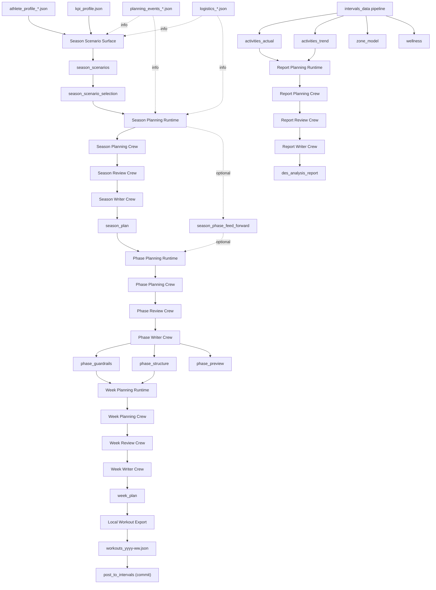

# How to Plan

## Quickstart (UI-first)

1) Add inputs in Athlete Profile pages (stored in the athlete workspace):
   - `athlete_profile_*.json`
   - `planning_events_*.json`
   - `logistics_*.json`
   - `availability_*.json`
2) Select a KPI profile (UI: Athlete Profile → KPI Profile).
3) Ensure Intervals data is fresh (zone model + wellness + activities) via
   UI auto-refresh or `PYTHONPATH=src python3 src/rps/data_pipeline/intervals_data.py`.
4) Open the **Plan Hub** and confirm Context (athlete, ISO year/week, phase).
5) Run **Season Scenarios** from Plan Hub if missing.
6) Select a scenario on **Plan -> Season** (manual decision).
7) Run **Season Plan** from Plan Hub once scenarios/selection are ready.
8) Run **Plan Week** from Plan Hub, or use direct **Run Phase** / **Run Week** / **Run Workouts** actions when you need a targeted rerun.
8) Use **Plan → Workouts** for targeted current-week changes after planning when you only need to move or adjust specific workouts instead of replanning the full week.
9) Optional: **Post to Intervals** from **Plan → Workouts** (commit step) after Export.
10) Optional: **Performance Report** on Performance pages once activities are available.

Plan Hub is the default orchestration surface. Season/Phase/Week pages remain
available for manual, step-by-step runs.

---

## 1. Screens and Responsibilities

### Home
- Marketing summary + system state table.
- Links into plan/performance pages.

### Plan Hub (primary orchestration)
- Context expander (athlete, ISO year/week, phase).
- Readiness checklist with reasons + fix CTAs.
- Direct-action-first UI:
  - `Run Phase` generates Phase Guardrails, Phase Structure, and Phase Preview together
  - `Run Week` / `Run Workouts` remain direct actions on readiness cards
- Advanced manual run keeps generic Orchestrated/Scoped execution for diagnostics and custom reruns.
- Run Execution table (steps, statuses, outputs, events).
- Latest Outputs + Run History.
- Orchestrates planning only (posting happens on Workouts page).
- Targeted post-plan edits happen on Workouts page via the bounded `Workout Editor`.

### Plan -> Season
- Manual scenario selection (user decision).
- Season page is the scenario/selection surface.
- Season Plan creation is triggered from Plan Hub after selection is ready.

### Plan -> Phase
- View phase guardrails/structure/preview.

### Plan -> Week
- Weekly agenda + per-day expanders.
 - No planning actions; week planning is initiated from Plan Hub.

### Plan -> Workouts
- Intervals export view (per-day expanders, descriptions).
- Posting actions (post/delete), revise week plan, unposted/conflict status.
- History grouped by month → week → workouts.

### System
- Status (running processes + latest artefacts).
- History (artefacts grouped by time with validity).
- Log (log output).

---

## 2. Planning Flow (Conceptual)

---

## 3. Readiness & Run Details

Readiness rules, run execution details, and commit-step behavior are defined in:
- [doc/ui/pages/plan_hub.md](../ui/pages/plan_hub.md)
- [doc/architecture/workspace.md](../architecture/workspace.md)
- [doc/architecture/subsystems/intervals_posting.md](../architecture/subsystems/intervals_posting.md)

---

## 4. Notes

- Inputs are Markdown; artifacts are JSON validated by schema.
- Phase artifacts are derived from season phase ranges (no manual range guessing).
- Exports use `workouts_yyyy-ww.json` version keys.
- Skills are now the canonical planning-method source.
- Prompts are runtime-local only; they no longer carry the primary planning logic.
- Season, Phase, Week, and Report all use explicit planning/review/writer staging under the CrewAI runtime.
