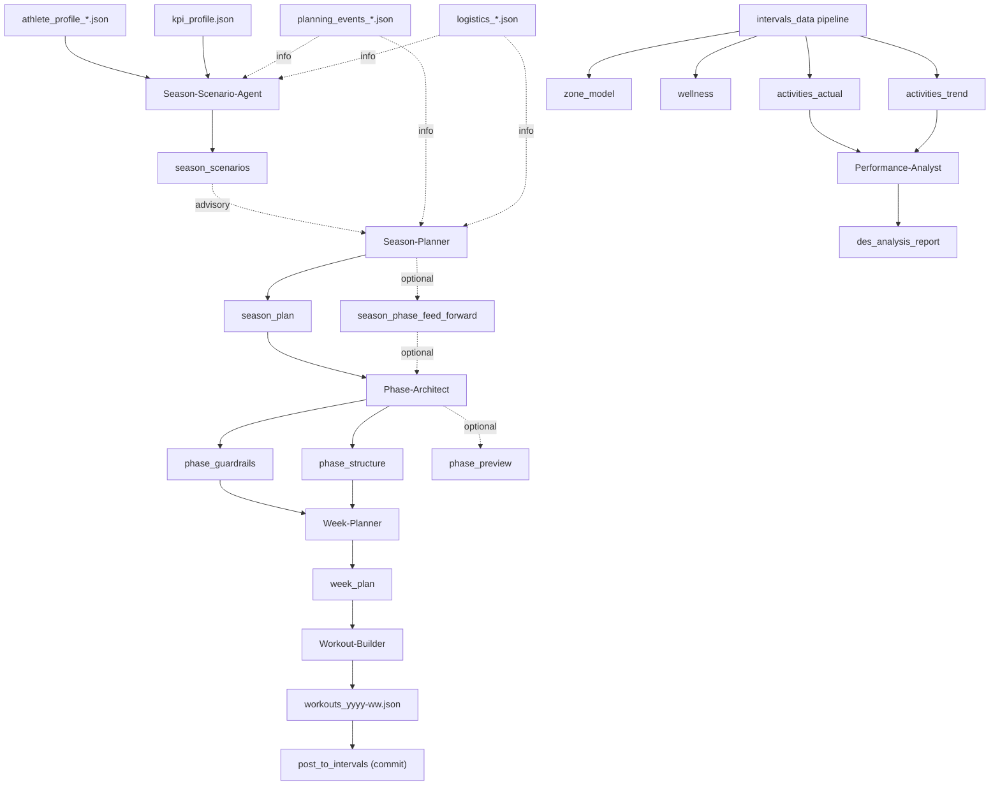

# How to Plan

Version: 2.3
Status: Updated
Last-Updated: 2026-02-10

---

## Quickstart (UI-first)

1) Add inputs in Athlete Profile pages (stored under `var/athletes/<athlete_id>/inputs/`):
   - `athlete_profile_*.json`
   - `planning_events_*.json`
   - `logistics_*.json`
   - `availability_*.json`
2) Select a KPI profile (UI: Athlete Profile → KPI Profile) to copy it into
   `var/athletes/<athlete_id>/latest/kpi_profile.json` and `inputs/kpi_profile.json`.
3) Ensure Intervals data is fresh (zone model + wellness + activities) via
   UI auto-refresh or `PYTHONPATH=src python3 src/rps/data_pipeline/intervals_data.py`.
4) Open the **Plan Hub** and confirm Scope (athlete, ISO year/week, phase).
5) Run **Season Scenarios** from Plan Hub if missing.
6) Select a scenario on **Plan -> Season** (manual decision).
7) Run **Plan Week** from Plan Hub (or run scoped steps).
8) Optional: **Post to Intervals** from **Plan → Workouts** (commit step) after Export.
9) Optional: **Performance Report** on Performance pages once activities are available.

Plan Hub is the default orchestration surface. Season/Phase/Week pages remain
available for manual, step-by-step runs.

---

## 1. Screens and Responsibilities

### Home
- Marketing summary + system state table.
- Links into plan/performance pages.

### Plan Hub (primary orchestration)
- Scope panel in header (athlete, ISO year/week, phase).
- Readiness checklist with reasons + fix CTAs.
- Run Planning with Orchestrated or Scoped runs (Scoped requires an override input).
- Run Execution table (steps, statuses, outputs, events).
- Latest Outputs + Run History.
- Orchestrates planning only (posting happens on Workouts page).

### Plan -> Season
- Manual scenario selection (user decision).
- Season Plan creation happens in Plan Hub (Season page only selects scenario + KPI segment).
  - Mode A scenario generation + selection are already integrated here (no separate script needed).

### Plan -> Phase
- View phase guardrails/structure/preview.

### Plan -> Week
- Weekly agenda + per-day expanders.
 - No planning actions; week planning is initiated from Plan Hub.

### Plan -> Workouts
- Intervals export view (per-day expanders, descriptions).
- Posting actions (post/delete), revise week plan, unposted/conflict status.
- History grouped by month → week → workouts.

### System
- Status (running processes + latest artefacts).
- History (artefacts grouped by time with validity).
- Log (log output + log level selector persisted to `.env`, plus live log tail).

---

## 2. Planning Flow (Conceptual)

---

## 3. Readiness Rules (Plan Hub)

Plan Hub maps readiness to execution steps. Steps become QUEUED if missing or
stale, SKIPPED if fresh, and BLOCKED when upstream fails.

### Required chain (core)
- Season Scenarios -> Selected Scenario -> Season Plan
- Season Plan -> Phase Guardrails + Phase Structure
- Phase Guardrails/Structure -> Week Plan
- Week Plan -> Build Workouts (optional)

### Optional chain
- Phase Preview (optional)
- Workouts posting (commit step) from Plan → Workouts

Scenario selection is always manual; Plan Hub will stop and require user action
if selection is missing.

---

## 4. Run Execution Model

Each run stores:
- `runs/<run_id>/run.json`
- `runs/<run_id>/steps.json`
- `runs/<run_id>/events.jsonl`

Plan Hub displays step status, outputs, and events. Runs are append-only; failed
runs can be superseded by a new run.

Statuses:
- `QUEUED`, `RUNNING`, `DONE`, `FAILED`, `SKIPPED`, `BLOCKED`, `SUPERSEDED`

---

## 5. Intervals Posting (Commit Step)

Export is a build step. Posting is a commit step.

Idempotency is enforced by receipts:
- `receipts/post_to_intervals/<athlete>/<yyyy-Www>/<uid>.json`

Behavior:
- If receipt exists and payload hash matches -> SKIP
- If hash changed -> conflict (manual resolution)

Week page shows unposted count + conflicts and provides a manual resolution
button. Post/commit runs from the Workouts page.

---

## 6. Notes

- Inputs are Markdown; artifacts are JSON validated by schema.
- Phase artifacts are derived from season phase ranges (no manual range guessing).
- Exports use `workouts_yyyy-ww.json` version keys.
- Commit steps should be manual or explicitly toggled to avoid unintended side effects.
