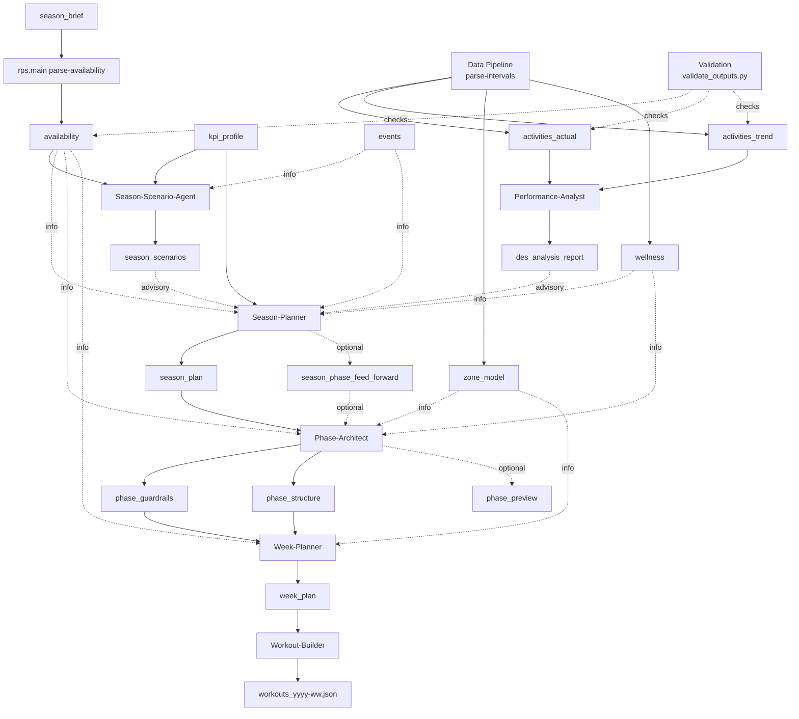

# Planner Workflow

Version: 2.2  
Status: Updated  
Last-Updated: 2026-01-23

---

## 1. Quickstart

Typical weekly flow:

1. Ensure inputs: season brief (including weekday availability table), KPI profile (copied to `var/athletes/<athlete_id>/latest/kpi_profile.json`), events, and fresh data pipeline outputs (zone model + wellness with body mass).
2. Run availability parser to generate `availability_yyyy-ww.json` from the Season Brief.
3. Run **Season-Scenario-Agent** when a new season plan is needed.
4. Store a scenario selection (A/B/C).
5. Run **Season** (scenario optional if selection exists).
6. Run **Phase** for the current phase (phase-aligned).
7. Run **Week** for the target ISO week.
8. Run **Workout-Builder** to export Intervals JSON.
9. Run **Performance-Analyst** after factual data is available.

### Availability Parser

```bash
python -m rps.main parse-availability --year 2026
```

### 1.1 Flow Overview



---

## 2. Core Concepts

### 2.1 Season Plan Phases vs Phase Artefacts

- `season_plan` defines **season phases** with `iso_week_range`.
- Season **must not** define phase-artefact outputs (guardrails/structure/preview).
- Phase artefacts are derived **inside** the season phase that contains the target ISO week:
  - Phase start = anchor (season phase start or explicit `iso_week_range`)
  - Phase length default = 4 weeks (unless overridden)
  - Phase end is clamped to the season phase end

The system includes helpers and tools that resolve phase ranges from the season
phase automatically.

### 2.2 Workspace Storage

Artifacts are stored under `var/athletes/<athlete_id>/` with an index:

```
var/athletes/<athlete_id>/
  data/
    plans/season/
    plans/phase/
    plans/week/
    analysis/
    exports/
    YYYY/WW/
  latest/
  index.json
```

`index.json` enables exact range lookups and routing decisions.

The data pipeline is expected to write factual artifacts (e.g. `activities_actual`,
`activities_trend`, `zone_model`, `wellness`) into the athlete workspace and update `latest/` accordingly.
The pipeline entrypoint is `python -m rps.main parse-intervals`, which
writes CSV+JSON outputs to `var/athletes/<athlete_id>/data/` plus mirrored
`latest/` copies. Use `scripts/validate_outputs.py` to validate JSON outputs
against the local schemas.

---

## 3. Agent Responsibilities

### Season-Scenario-Agent
- Outputs: `season_scenarios` (advisory).
- Inputs: season brief, KPI profile, events (optional).

### Season-Planner
- Outputs: `season_plan` (+ optional `season_phase_feed_forward`).
- Inputs: season brief, KPI profile, season scenarios (advisory), events, analysis (advisory), wellness (informational).

### Phase-Architect
- Outputs: `phase_guardrails`, `phase_structure` (+ optional preview/feed-forward).
- Inputs: season plan, optional season→phase feed-forward, events, factual data, zone model (latest), wellness (informational).
- Phase range **must** use season-phase alignment.

### Week-Planner
- Outputs: `week_plan` (weekly).
- Inputs: phase guardrails + phase structure (+ optional feed-forward, zone model).

### Workout-Builder
- Outputs: `INTERVALS_WORKOUTS` (raw Intervals JSON export, stored as `workouts_yyyy-ww.json`).
- Inputs: `week_plan`.

### Performance-Analyst
- Outputs: `des_analysis_report` (advisory).
- Inputs: `activities_actual`, `activities_trend`, planning context.

---

## 4. Artifact Types (Selected)

- `season_plan` → `season_plan.schema.json`
- `phase_guardrails` → `phase_guardrails.schema.json`
- `phase_structure` → `phase_structure.schema.json`
- `week_plan` → `week_plan.schema.json`
- `INTERVALS_WORKOUTS` → `workouts.schema.json` (raw payload)
- `activities_actual` → `activities_actual.schema.json`
- `activities_trend` → `activities_trend.schema.json`
- `des_analysis_report` → `des_analysis_report.schema.json`

---

## 5. Tooling for Agents

Agents resolve phases and phase ranges internally via workspace tools (no user
prompt hints required):

- `workspace_get_phase_context({ "year": YYYY, "week": WW })`
- `workspace_get_input("season_brief")` and `workspace_get_input("events")`

This avoids manual version-key guessing and ensures season-phase alignment.

---

## 6. Running the Flow

### CLI: Orchestrated planning

```bash
PYTHONPATH=src python3 -m rps.main plan-week \
  --year 2026 \
  --week 6 \
  --run-id run_2026_06
```

### CLI: Season flow (agent tasks)

```bash
# 1) Create scenarios (SEASON_SCENARIOS)
PYTHONPATH=src python3 -m rps.main run-agent \
  --agent season_scenario \
  --task CREATE_SEASON_SCENARIOS \
  --text "Target ISO week: year=2026, week=6 (ISO 2026-06). Generate pre-decision scenarios."
```

```bash
# 2) Select scenario (SEASON_SCENARIO_SELECTION)
PYTHONPATH=src python3 -m rps.main run-agent \
  --agent season_scenario \
  --task CREATE_SEASON_SCENARIO_SELECTION \
  --text "Select Scenario A for ISO week 2026-06. Use latest SEASON_SCENARIOS."
```

```bash
# 3) Create season plan (SEASON_PLAN)
PYTHONPATH=src python3 -m rps.main run-agent \
  --agent season_planner \
  --task CREATE_SEASON_PLAN \
  --text "Scenario A. Create SEASON_PLAN for ISO week 2026-06. Use latest SEASON_SCENARIO_SELECTION."
```

Optional KPI moving-time rate band override (affects kJ corridor derivation): add to the season-planner text:
`Moving time rate band: fast_competitive.`

### CLI: Single agent

```bash
PYTHONPATH=src python3 -m rps.main run-agent \
  --agent week_planner \
  --task CREATE_WEEK_PLAN \
  --text "Target ISO week: year=2026, week=6 (ISO 2026-06). Create week_plan for ISO week 2026-06."
```

If `ATHLETE_ID` is set in `.env`, the `--athlete` flag is optional.
`run-agent` defaults to strict tool mode for JSON-producing agents; use `--non-strict` for text-only outputs.

---

## 7. Notes & Best Practices

- **One artifact per task** is the default. The multi-output runner is used
  when a single agent must emit multiple artifacts in one run (e.g., Phase).
- Authority values must follow schema enums (Binding/Derived/Informational/Factual).
- Always set `meta.iso_week` or `meta.iso_week_range` correctly; this drives
  index resolution and phase matching.
- Raw exports (`INTERVALS_WORKOUTS`) now use `version_key = yyyy-ww` based on the workout ISO week.
  If you need week-specific keys, pass an explicit version key via the workspace API.

---

## End
