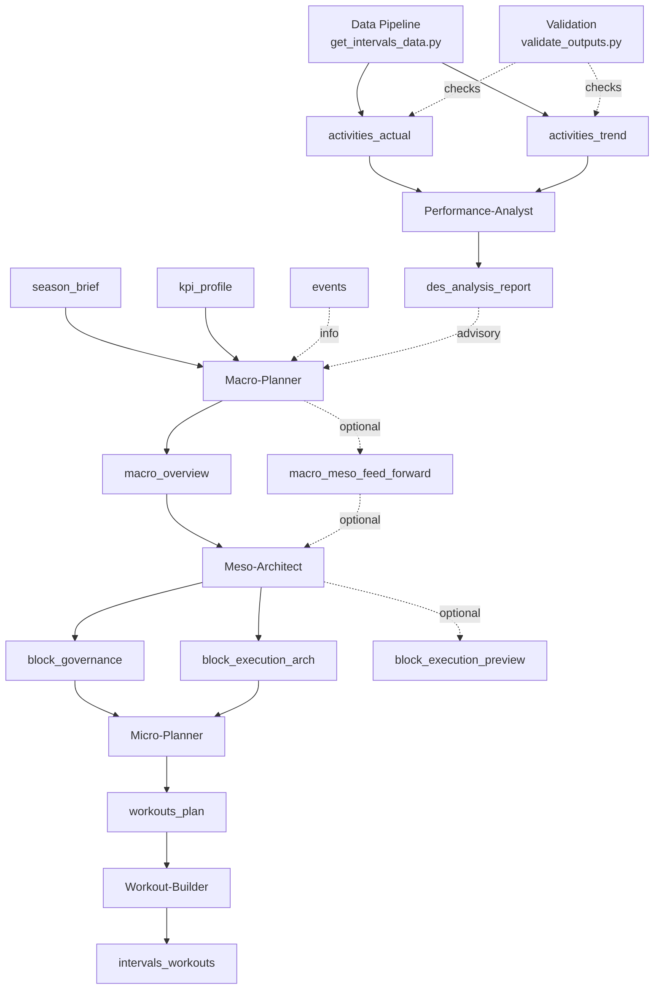

# Planner Workflow

Version: 2.0  
Status: Updated  
Last-Updated: 2026-01-20

---

## 1. Quickstart

Typical weekly flow:

1. Ensure inputs: season brief, KPI profile, events.
2. Run **Macro** if goals or A/B events changed.
3. Run **Meso** for the current block (phase-aligned).
4. Run **Micro** for the target ISO week.
5. Run **Workout-Builder** to export Intervals JSON.
6. Run **Performance-Analyst** after factual data is available.

### 1.1 Flow Overview



---

## 2. Core Concepts

### 2.1 Macro Phases vs Meso Blocks

- `macro_overview` defines **phases** with `iso_week_range`.
- Macro **must not** define meso blocks.
- Meso blocks are derived **inside** the macro phase:
  - Phase start = anchor
  - Block length default = 4 weeks
  - Block end is clamped to phase end

The system includes helpers and tools that resolve block ranges from the macro
phase automatically.

### 2.2 Workspace Storage

Artifacts are stored under `var/athletes/<athlete_id>/` with an index:

```
var/athletes/<athlete_id>/
  plans/macro/
  plans/meso/
  plans/micro/
  workouts/
  analysis/
  exports/
  data/
  latest/
  index.json
```

`index.json` enables exact range lookups and routing decisions.

The data pipeline is expected to write factual artifacts (e.g. `activities_actual`,
`activities_trend`) into the athlete workspace and update `latest/` accordingly.
The pipeline entrypoint is `scripts/data_pipeline/get_intervals_data.py`, which
writes CSV+JSON outputs to `var/athletes/<athlete_id>/data/` plus mirrored
`latest/` copies. Use `scripts/validate_outputs.py` to validate JSON outputs
against the local schemas.

---

## 3. Agent Responsibilities

### Macro-Planner
- Outputs: `macro_overview` (+ optional `macro_meso_feed_forward`).
- Inputs: season brief, KPI profile, events, analysis (advisory).

### Meso-Architect
- Outputs: `block_governance`, `block_execution_arch` (+ optional preview/feed-forward/zone model).
- Inputs: macro overview, optional macro feed-forward, events, factual data.
- Block range **must** use macro-phase alignment.

### Micro-Planner
- Outputs: `workouts_plan` (weekly).
- Inputs: block governance + execution architecture (+ optional feed-forward).

### Workout-Builder
- Outputs: `intervals_workouts` (raw Intervals JSON export).
- Inputs: `workouts_plan`.

### Performance-Analyst
- Outputs: `des_analysis_report` (advisory).
- Inputs: `activities_actual`, `activities_trend`, planning context.

---

## 4. Artifact Types (Selected)

- `macro_overview` → `macro_overview.schema.json`
- `block_governance` → `block_governance.schema.json`
- `block_execution_arch` → `block_execution_arch.schema.json`
- `workouts_plan` → `workouts_plan.schema.json`
- `intervals_workouts` → `workouts.schema.json` (raw payload)
- `activities_actual` → `activities_actual.schema.json`
- `activities_trend` → `activities_trend.schema.json`
- `des_analysis_report` → `des_analysis_report.schema.json`

---

## 5. Tooling for Agents

Agents can resolve phases and block ranges directly via tools:

- `workspace_resolve_macro_phase(year, week)`
- `workspace_resolve_block_range(year, week, block_len=4)`
- `workspace_find_best_block_artefact(artifact_type, year, week)`
- `workspace_get_input(input_type, year)` for athlete-specific markdown inputs

This avoids manual version-key guessing and ensures macro-phase alignment.

---

## 6. Running the Flow

### CLI: Orchestrated planning

```bash
PYTHONPATH=src python3 -m app.main plan-week \
  --year 2026 \
  --week 6 \
  --run-id run_2026_06
```

### CLI: Macro Mode A (two-step)

Scenarios first (pre-decision), then the selected scenario:

```bash
python3 scripts/macro_mode_a.py scenarios \
  --year 2026 \
  --week 6 \
  --run-id macro_scenarios_2026_w06
```

```bash
python3 scripts/macro_mode_a.py overview \
  --year 2026 \
  --week 6 \
  --run-id macro_overview_2026_w06 \
  --scenario A \
  --scenario-run-id macro_scenarios_2026_w06
```

By default, scenarios are written to `.cache/macro_scenarios/<run-id>.md`.

### CLI: Single agent

```bash
PYTHONPATH=src python3 -m app.main \
  --agent micro_planner \
  --text "Create workouts plan for ISO week 2026-06"
```

If `ATHLETE_ID` is set in `.env`, the `--athlete` flag is optional.

---

## 7. Notes & Best Practices

- **One artifact per task** is the default. The multi-output runner is used
  when a single agent must emit multiple artifacts in one run (e.g., Meso).
- Authority values must follow schema enums (Binding/Derived/Informational/Factual).
- Always set `meta.iso_week` or `meta.iso_week_range` correctly; this drives
  index resolution and block matching.
- Raw exports (`intervals_workouts`) default to `version_key = raw` in strict runs.
  If you need week-specific keys, pass an explicit version key via the workspace API.

---

## End
