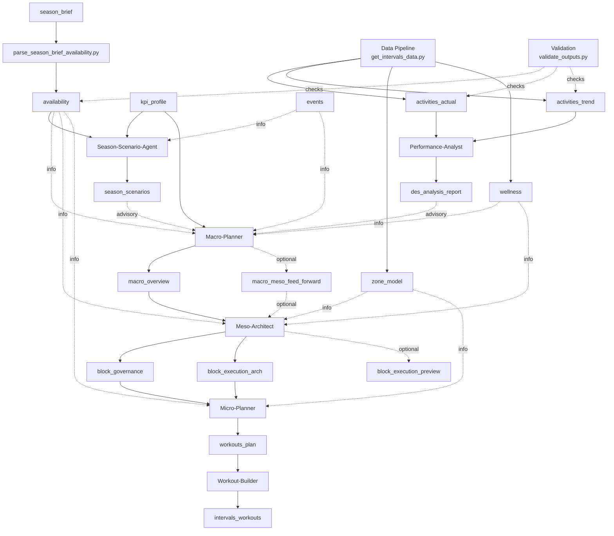

# Planner Workflow

Version: 2.2  
Status: Updated  
Last-Updated: 2026-01-23

---

## 1. Quickstart

Typical weekly flow:

1. Ensure inputs: season brief (including weekday availability table), KPI profile (copied to `var/athletes/<athlete_id>/latest/kpi_profile.json`), events, and fresh data pipeline outputs (zone model + wellness with body mass).
2. Run availability parser to generate `availability_yyyy-ww.json` from the Season Brief.
3. Run **Season-Scenario-Agent** when a new macro plan is needed.
4. Store a scenario selection (A/B/C).
5. Run **Macro** (scenario optional if selection exists).
6. Run **Meso** for the current block (phase-aligned).
7. Run **Micro** for the target ISO week.
8. Run **Workout-Builder** to export Intervals JSON.
9. Run **Performance-Analyst** after factual data is available.

### Availability Parser

```bash
python scripts/data_pipeline/parse_season_brief_availability.py --year 2026
```

### 1.1 Flow Overview



---

## 2. Core Concepts

### 2.1 Macro Phases vs Meso Blocks

- `macro_overview` defines **phases** with `iso_week_range`.
- Macro **must not** define meso blocks.
- Meso blocks are derived **inside** the macro phase:
  - Phase start = anchor
  - Block length default = 4 weeks
  - Block end is clamped to phase end

The system includes helpers and tools that resolve block ranges from the macro
phase automatically.

### 2.2 Workspace Storage

Artifacts are stored under `var/athletes/<athlete_id>/` with an index:

```
var/athletes/<athlete_id>/
  data/
    plans/macro/
    plans/meso/
    plans/micro/
    analysis/
    exports/
    YYYY/WW/
  latest/
  index.json
```

`index.json` enables exact range lookups and routing decisions.

The data pipeline is expected to write factual artifacts (e.g. `activities_actual`,
`activities_trend`, `zone_model`, `wellness`) into the athlete workspace and update `latest/` accordingly.
The pipeline entrypoint is `scripts/data_pipeline/get_intervals_data.py`, which
writes CSV+JSON outputs to `var/athletes/<athlete_id>/data/` plus mirrored
`latest/` copies. Use `scripts/validate_outputs.py` to validate JSON outputs
against the local schemas.

---

## 3. Agent Responsibilities

### Season-Scenario-Agent
- Outputs: `season_scenarios` (advisory).
- Inputs: season brief, KPI profile, events (optional).

### Macro-Planner
- Outputs: `macro_overview` (+ optional `macro_meso_feed_forward`).
- Inputs: season brief, KPI profile, season scenarios (advisory), events, analysis (advisory), wellness (informational).

### Meso-Architect
- Outputs: `block_governance`, `block_execution_arch` (+ optional preview/feed-forward).
- Inputs: macro overview, optional macro feed-forward, events, factual data, zone model (latest), wellness (informational).
- Block range **must** use macro-phase alignment.

### Micro-Planner
- Outputs: `workouts_plan` (weekly).
- Inputs: block governance + execution architecture (+ optional feed-forward, zone model).

### Workout-Builder
- Outputs: `intervals_workouts` (raw Intervals JSON export).
- Inputs: `workouts_plan`.

### Performance-Analyst
- Outputs: `des_analysis_report` (advisory).
- Inputs: `activities_actual`, `activities_trend`, planning context.

---

## 4. Artifact Types (Selected)

- `macro_overview` → `macro_overview.schema.json`
- `block_governance` → `block_governance.schema.json`
- `block_execution_arch` → `block_execution_arch.schema.json`
- `workouts_plan` → `workouts_plan.schema.json`
- `intervals_workouts` → `workouts.schema.json` (raw payload)
- `activities_actual` → `activities_actual.schema.json`
- `activities_trend` → `activities_trend.schema.json`
- `des_analysis_report` → `des_analysis_report.schema.json`

---

## 5. Tooling for Agents

Agents resolve phases and block ranges internally via workspace tools (no user
prompt hints required):

- `workspace_get_block_context({ "year": YYYY, "week": WW })`
- `workspace_get_input("season_brief")` and `workspace_get_input("events")`

This avoids manual version-key guessing and ensures macro-phase alignment.

---

## 6. Running the Flow

### CLI: Orchestrated planning

```bash
PYTHONPATH=src python3 -m rps.main plan-week \
  --year 2026 \
  --week 6 \
  --run-id run_2026_06
```

### CLI: Macro Mode A (two-step)

Scenarios first (pre-decision), then the selected scenario:

```bash
python3 scripts/macro_mode_a.py scenarios \
  --year 2026 \
  --week 6 \
  --run-id macro_scenarios_2026_w06
```

```bash
python3 scripts/macro_mode_a.py overview \
  --year 2026 \
  --week 6 \
  --run-id macro_overview_2026_w06 \
  --scenario A \
  --scenario-run-id macro_scenarios_2026_w06
```

Optional KPI moving-time rate band override (affects kJ corridor derivation):

```bash
python3 scripts/macro_mode_a.py overview \
  --year 2026 \
  --week 6 \
  --run-id macro_overview_2026_w06 \
  --scenario A \
  --scenario-run-id macro_scenarios_2026_w06 \
  --moving-time-rate-band fast_competitive
```

Available bands are read from the KPI profile (`data.durability.moving_time_rate_guidance.bands`):
`brevet_ultra_sustainable`, `fast_competitive`, `top_record_oriented`.
The override selects the W/kg and kJ/kg/h window used to derive weekly planned_Load_kJ corridors.

By default, scenarios are written to `.cache/macro_scenarios/<run-id>.md`.

### CLI: Single agent

```bash
PYTHONPATH=src python3 -m rps.main run-agent \
  --agent micro_planner \
  --task CREATE_WORKOUTS_PLAN \
  --text "Target ISO week: year=2026, week=6 (ISO 2026-06). Create workouts_plan for ISO week 2026-06."
```

If `ATHLETE_ID` is set in `.env`, the `--athlete` flag is optional.
`run-agent` defaults to strict tool mode for JSON-producing agents; use `--non-strict` for text-only outputs.

---

## 7. Notes & Best Practices

- **One artifact per task** is the default. The multi-output runner is used
  when a single agent must emit multiple artifacts in one run (e.g., Meso).
- Authority values must follow schema enums (Binding/Derived/Informational/Factual).
- Always set `meta.iso_week` or `meta.iso_week_range` correctly; this drives
  index resolution and block matching.
- Raw exports (`intervals_workouts`) default to `version_key = raw` in strict runs.
  If you need week-specific keys, pass an explicit version key via the workspace API.

---

## End
