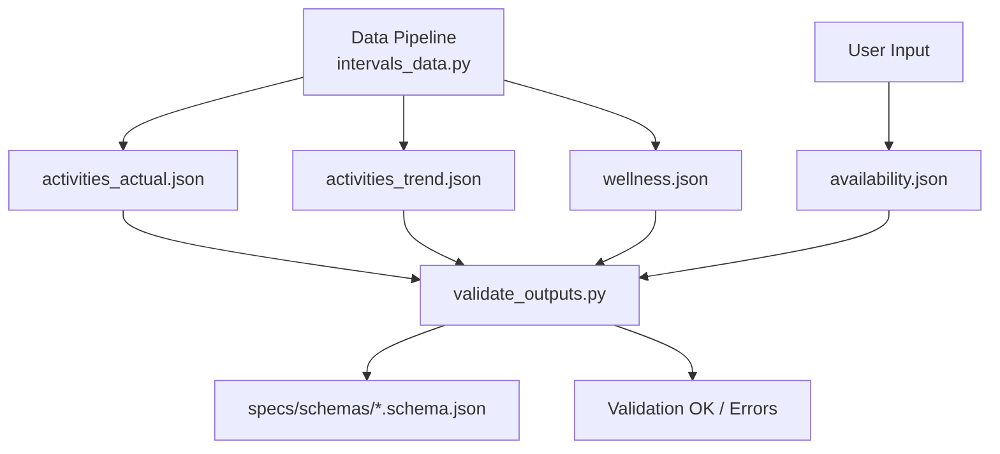

# Validation

Version: 1.1  
Status: Updated  
Last-Updated: 2026-02-10

---

## Purpose

The data pipeline writes factual artefacts (`activities_actual`, `activities_trend`, `wellness`)
into the athlete workspace. Availability is a user-managed input and is validated
alongside pipeline outputs. This document explains how to validate those artefacts
against the local JSON schemas before they are consumed by planners.



---

## CLI: Validate Latest Outputs

```bash
python scripts/validate_outputs.py
```

This validates:

- `runtime/athletes/<athlete_id>/latest/activities_actual.json`
- `runtime/athletes/<athlete_id>/latest/activities_trend.json`
- `runtime/athletes/<athlete_id>/latest/availability.json`
- `runtime/athletes/<athlete_id>/latest/wellness.json`

The athlete ID is read from `.env` (`ATHLETE_ID`).

---

## CLI: Validate a Specific ISO Week

```bash
python scripts/validate_outputs.py --year 2026 --week 6
```

This validates the JSON files under:

```
runtime/athletes/<athlete_id>/data/2026/06/
```

---

## CLI: Validate Explicit Paths

```bash
python scripts/validate_outputs.py \
  --actual-path runtime/athletes/<athlete_id>/data/2026/06/activities_actual_2026-06.json \
  --trend-path runtime/athletes/<athlete_id>/data/2026/06/activities_trend_2026-06.json \
  --availability-path runtime/athletes/<athlete_id>/data/2026/06/availability_2026-06.json \
  --wellness-path runtime/athletes/<athlete_id>/data/2026/06/wellness_2026-06.json
```

---

## Notes

- Schemas live in `specs/schemas/` and are loaded with `$ref` resolution.
- The validator reports all schema errors with JSON paths.
- Output is non-destructive; it does not modify files.

---

## Per-Artifact Checklists

Manual validation checklists live under `doc/specs/contracts/validation/`:

- [[doc/specs/contracts/validation/athlete_profile_validation.md](doc/specs/contracts/validation/athlete_profile_validation.md)](doc/[specs/contracts/validation/athlete_profile_validation.md](specs/contracts/validation/athlete_profile_validation.md))
- [[doc/specs/contracts/validation/planning_events_validation.md](doc/specs/contracts/validation/planning_events_validation.md)](doc/[specs/contracts/validation/planning_events_validation.md](specs/contracts/validation/planning_events_validation.md))
- [[doc/specs/contracts/validation/logistics_validation.md](doc/specs/contracts/validation/logistics_validation.md)](doc/[specs/contracts/validation/logistics_validation.md](specs/contracts/validation/logistics_validation.md))
- [[doc/specs/contracts/validation/season_scenarios_validation.md](doc/specs/contracts/validation/season_scenarios_validation.md)](doc/[specs/contracts/validation/season_scenarios_validation.md](specs/contracts/validation/season_scenarios_validation.md))
- [[doc/specs/contracts/validation/kpi_profile_validation.md](doc/specs/contracts/validation/kpi_profile_validation.md)](doc/[specs/contracts/validation/kpi_profile_validation.md](specs/contracts/validation/kpi_profile_validation.md))
- [[doc/specs/contracts/validation/season_plan_validation.md](doc/specs/contracts/validation/season_plan_validation.md)](doc/[specs/contracts/validation/season_plan_validation.md](specs/contracts/validation/season_plan_validation.md))
- [[doc/specs/contracts/validation/season_phase_feed_forward_validation.md](doc/specs/contracts/validation/season_phase_feed_forward_validation.md)](doc/[specs/contracts/validation/season_phase_feed_forward_validation.md](specs/contracts/validation/season_phase_feed_forward_validation.md))
- [[doc/specs/contracts/validation/phase_guardrails_validation.md](doc/specs/contracts/validation/phase_guardrails_validation.md)](doc/[specs/contracts/validation/phase_guardrails_validation.md](specs/contracts/validation/phase_guardrails_validation.md))
- [[doc/specs/contracts/validation/phase_structure_validation.md](doc/specs/contracts/validation/phase_structure_validation.md)](doc/[specs/contracts/validation/phase_structure_validation.md](specs/contracts/validation/phase_structure_validation.md))
- [[doc/specs/contracts/validation/phase_preview_validation.md](doc/specs/contracts/validation/phase_preview_validation.md)](doc/[specs/contracts/validation/phase_preview_validation.md](specs/contracts/validation/phase_preview_validation.md))
- [[doc/specs/contracts/validation/phase_feed_forward_validation.md](doc/specs/contracts/validation/phase_feed_forward_validation.md)](doc/[specs/contracts/validation/phase_feed_forward_validation.md](specs/contracts/validation/phase_feed_forward_validation.md))
- [[doc/specs/contracts/validation/zone_model_validation.md](doc/specs/contracts/validation/zone_model_validation.md)](doc/[specs/contracts/validation/zone_model_validation.md](specs/contracts/validation/zone_model_validation.md))
- [[doc/specs/contracts/validation/week_plan_validation.md](doc/specs/contracts/validation/week_plan_validation.md)](doc/[specs/contracts/validation/week_plan_validation.md](specs/contracts/validation/week_plan_validation.md))
- [[doc/specs/contracts/validation/intervals_workouts_validation.md](doc/specs/contracts/validation/intervals_workouts_validation.md)](doc/[specs/contracts/validation/intervals_workouts_validation.md](specs/contracts/validation/intervals_workouts_validation.md))
- [[doc/specs/contracts/validation/availability_validation.md](doc/specs/contracts/validation/availability_validation.md)](doc/[specs/contracts/validation/availability_validation.md](specs/contracts/validation/availability_validation.md))
- [[doc/specs/contracts/validation/activities_actual_validation.md](doc/specs/contracts/validation/activities_actual_validation.md)](doc/[specs/contracts/validation/activities_actual_validation.md](specs/contracts/validation/activities_actual_validation.md))
- [[doc/specs/contracts/validation/activities_trend_validation.md](doc/specs/contracts/validation/activities_trend_validation.md)](doc/[specs/contracts/validation/activities_trend_validation.md](specs/contracts/validation/activities_trend_validation.md))
- [[doc/specs/contracts/validation/wellness_validation.md](doc/specs/contracts/validation/wellness_validation.md)](doc/[specs/contracts/validation/wellness_validation.md](specs/contracts/validation/wellness_validation.md))
- [[doc/specs/contracts/validation/des_analysis_report_validation.md](doc/specs/contracts/validation/des_analysis_report_validation.md)](doc/[specs/contracts/validation/des_analysis_report_validation.md](specs/contracts/validation/des_analysis_report_validation.md))
