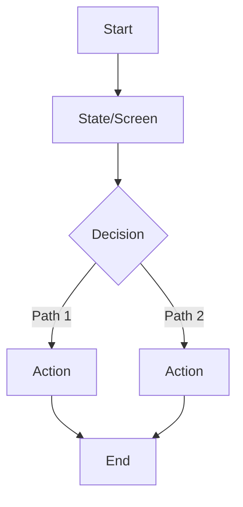

# FEAT: <Title>

* **ID:** FEAT_<slug>
* **Status:** Draft | Reviewed | Approved | Implemented | Superseded
* **Owner/Area:** <team or component owner>
* **Last-Updated:** YYYY-MM-DD
* **Related:** <issue/PR links if any>

---

## 1) Context / Problem

**Current behavior**

* <what happens today>

**Problem**

* <what is wrong / missing>

**Constraints**

* <hard constraints: performance, storage, offline, schema rules, etc.>

---

## 2) Goals & Non-Goals

**Goals**

* [ ] <goal 1>
* [ ] <goal 2>

**Non-Goals**

* [ ] <explicitly not addressed>
* [ ] <explicitly not addressed>

---

## 3) Proposed Behavior

**User/System behavior**

* <high level narrative>

**UI impact**

* UI affected: Yes/No
* If Yes: where (page/flow) + key states

### UI Flow (Mermaid)

> If UI is affected, include a diagram.

**Non-UI behavior (if applicable)**

* Components involved: <list>
* Contracts touched: <list>

---

## 4) Implementation Analysis

**Components / Modules**

* <component 1>: <role/change>
* <component 2>: <role/change>

**Data flow**

* Inputs: <artefacts, params, run-store entries>
* Processing: <steps>
* Outputs: <artefacts, status changes, sidecars>

**Schema / Artefacts**

* New artefacts: <name + schema version>
* Changed artefacts: <name + version bump strategy>
* Validator implications: <what must pass>

---

## 5) Impact Analysis (complete)

**Compatibility**

* Backward compatible: Yes/No
* Breaking changes: <what breaks and why>
* Fallback behavior: <defaults / feature gates>

**Conflicts with ADRs / Principles**

* Potential conflicts: <list>
* Resolution: <link ADR or explain>

**Impacted areas**

* UI: <what changes>
* Pipeline/data: <what changes>
* Renderer: <what changes>
* Workspace/run-store: <what changes>
* Validation/tooling: <what changes>
* Deployment/config: <what changes>

**Required refactoring**

* <refactor item 1>
* <refactor item 2>

---

## 6) Options & Recommendation

### Option A (recommended?) — <name>

**Summary**

* <what it does>

**Pros**

* <...>

**Cons**

* <...>

**Risk**

* <...>

### Option B — <name>

**Summary**

* <...>

**Pros**

* <...>

**Cons**

* <...>

### Recommendation

* Choose: Option <A/B>
* Rationale: <short, decisive>

---

## 7) Acceptance Criteria (Definition of Done)

* [ ] <criterion 1 — testable>
* [ ] <criterion 2 — testable>
* [ ] Validation passes: <which commands/checks>
* [ ] No regressions in: <areas>
* [ ] Performance guardrail: <if any>

---

## 8) Migration / Rollout

**Migration strategy**

* <schema bump rules, one-time migrations, none?>

**Rollout / gating**

* Feature flag / config: <name + default>
* Safe rollback: <how>

---

## 9) Risks & Failure Modes

* Failure mode: <what>

  * Detection: <logs/validation/symptoms>
  * Safe behavior: <what the system should do>
  * Recovery: <operator steps or fallback>

---

## 10) Observability / Logging

**New/changed events**

* <event name>: <when emitted> (fields: <...>)
* <event name>: <...>

**Diagnostics**

* <where to look: run-store/workspace/logs>

---

## 11) Documentation Updates

Update these docs as part of implementation:

* [ ] <doc link> — <what to change>
* [ ] <doc link> — <what to change>

---

## 12) Link Map (no duplication; links only)

* UI flows/actions: `doc/ui/ui_spec.md#...`
* UI contract (Streamlit): `doc/ui/streamlit_contract.md#...`
* Architecture: `doc/architecture/system_architecture.md#...`
* Workspace: `doc/architecture/workspace.md#...`
* Schema versioning: `doc/architecture/schema_versioning.md#...`
* Logging policy: `doc/specs/contracts/logging_policy.md#...` (or wherever it lives)
* Validation / runbooks: `doc/runbooks/validation.md#...`
* ADRs: `doc/adr/000x-....md`

---

## Open Questions (max 5) — optional

* <question 1>
* <question 2>

---

## Out of Scope / Deferred — optional

* <not included now>
* <follow-up idea>
