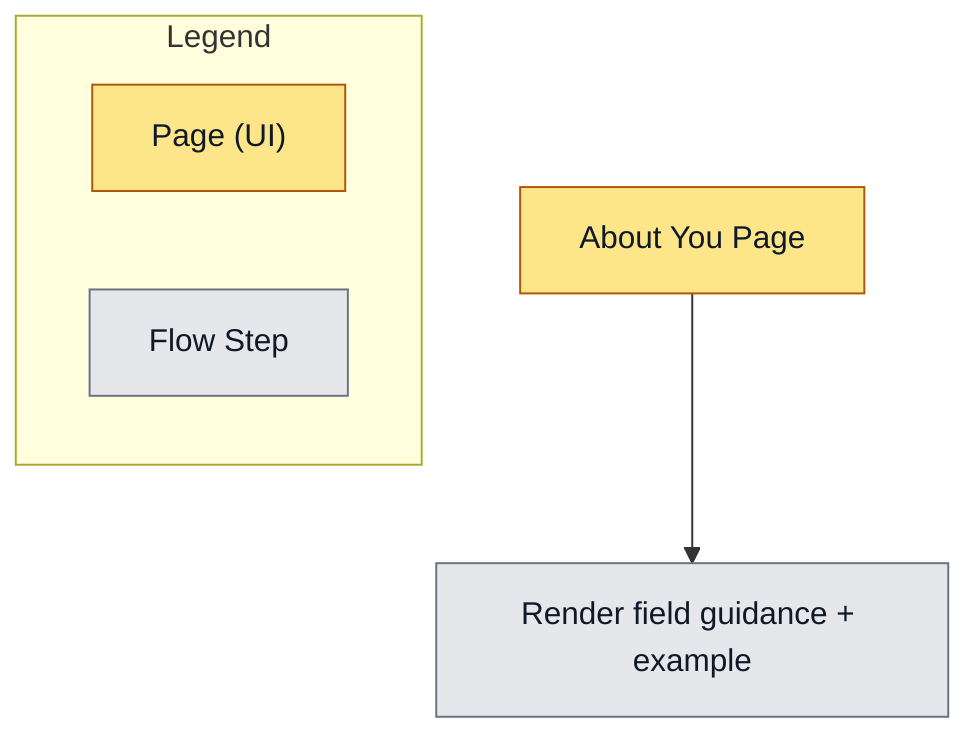

# FEAT: About You Guidance Copy

* **ID:** FEAT_about_you_guidance
* **Status:** Implemented
* **Owner/Area:** Athlete Profile UI
* **Last-Updated:** 2026-02-08
* **Related:** —

---

## 1) Context / Problem

**Current behavior**

* Athlete Profile → About You shows short labels like “Primary Objective” without explanatory guidance.

**Problem**

* Users are unsure what to enter and in what format; guidance is requested to clarify expectations and provide examples.

**Constraints**

* No new dependencies.
* Streamlit UI patterns must stay consistent.

---

## 2) Goals & Non-Goals

**Goals**

* [ ] Replace ambiguous labels with explanatory headings/subheaders and short examples.
* [ ] Keep the underlying stored fields unchanged (no schema changes).

**Non-Goals**

* [ ] No changes to validation rules or storage schemas.
* [ ] No new onboarding flow.

---

## 3) Proposed Behavior

**User/System behavior**

* The About You page displays descriptive headings for key fields (e.g., Primary Objective) with a one‑line explanation and an example.

**UI impact**

* UI affected: Yes
* Page: Athlete Profile → About You
* States: Static copy only.

### UI Flow (Mermaid)

**Non-UI behavior (if applicable)**

* Components involved: none.
* Contracts touched: none.

---

## 4) Implementation Analysis

**Components / Modules**

* `src/rps/ui/pages/athlete_profile/about_you.py`: update headings, helper text, and examples.

**Data flow**

* Inputs: existing athlete profile payload.
* Processing: UI text only.
* Outputs: unchanged payload on save.

**Schema / Artefacts**

* New artefacts: none.
* Changed artefacts: none.
* Validator implications: none.

---

## 5) Impact Analysis (complete)

**Compatibility**

* Backward compatible: Yes
* Breaking changes: none.
* Fallback behavior: not needed.

**Conflicts with ADRs / Principles**

* Potential conflicts: none.
* Resolution: n/a.

**Impacted areas**

* UI: About You page copy.
* Pipeline/data: none.
* Renderer: none.
* Workspace/run-store: none.
* Validation/tooling: none.
* Deployment/config: none.

**Required refactoring**

* none.

---

## 6) Options & Recommendation

### Option A — Inline help text under headings

**Summary**

* Replace short labels with explanatory headings + example line(s).

**Pros**

* Clear guidance without extra UI complexity.

**Cons**

* More vertical space.

**Risk**

* Minor layout expansion.

### Option B — Tooltip-only guidance

**Summary**

* Keep labels, add tooltip/hover help.

**Pros**

* Minimal layout changes.

**Cons**

* Less discoverable; weaker for new users.

### Recommendation

* Choose: Option A
* Rationale: Most direct guidance and aligns with user request.

---

## 7) Acceptance Criteria (Definition of Done)

* [ ] About You page shows explanatory headings and examples for key fields.
* [ ] No schema or payload changes.
* [ ] Validation passes: `python -m py_compile $(git ls-files '*.py')`
* [ ] UI AppTest updated if needed.

---

## 8) Migration / Rollout

**Migration strategy**

* None.

**Rollout / gating**

* None.

---

## 9) Risks & Failure Modes

* Failure mode: Guidance text becomes inconsistent with validation rules.
  * Detection: UI review.
  * Safe behavior: Users can still save; copy should be updated.
  * Recovery: Adjust copy to match validation.

---

## 10) Observability / Logging

**New/changed events**

* None.

**Diagnostics**

* n/a.

---

## 11) Documentation Updates

* [ ] [[doc/ui/ui_spec.md](doc/ui/ui_spec.md)](doc/ui/ui_spec.md) — note About You guidance copy update (if needed).

---

## 12) Link Map (no duplication; links only)

* UI flows/actions: [[doc/ui/ui_spec.md](doc/ui/ui_spec.md)](doc/ui/ui_spec.md)
* UI contract (Streamlit): [[doc/ui/streamlit_contract.md](doc/ui/streamlit_contract.md)](doc/ui/streamlit_contract.md)
* Architecture: [[doc/architecture/system_architecture.md](doc/architecture/system_architecture.md)](doc/architecture/system_architecture.md)
* Workspace: [[doc/architecture/workspace.md](doc/architecture/workspace.md)](doc/architecture/workspace.md)
* Schema versioning: [[doc/architecture/schema_versioning.md](doc/architecture/schema_versioning.md)](doc/architecture/schema_versioning.md)
* Logging policy: [[doc/specs/contracts/logging_policy.md](doc/specs/contracts/logging_policy.md)](doc/[specs/contracts/logging_policy.md](specs/contracts/logging_policy.md))
* Validation / runbooks: [[doc/runbooks/validation.md](doc/runbooks/validation.md)](doc/runbooks/validation.md)
* ADRs: n/a
