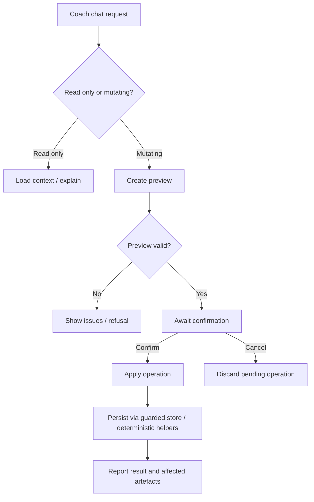

# FEAT: Active Coach Operations and CrewAI Foundation

* **ID:** FEAT_active_coach_operations
* **Status:** Implemented
* **Owner/Area:** Planning / Coach / Runtime
* **Last-Updated:** 2026-05-12
* **Related:** ADR-031

---

## 1) Context / Problem

**Current behavior**

* The `Coach` page is conversational but read-only.
* Tactical plan changes are split between a read-only coach and a bounded `Workout Editor`.
* Advisory actions such as report/feed-forward generation are page-bound and not exposed as reusable coach operations.
* CrewAI runtime adoption is blocked in the current app runtime because upstream CrewAI currently requires Python `<3.14`.

**Problem**

* Users cannot use one dialog surface to inspect, adjust, and re-run planning work.
* The repo lacks a canonical operation layer for chat-driven edits/replans.
* The repo also lacks the first concrete CrewAI-facing config/model foundation needed for a later runtime cutover.

**Constraints**

* Current repo runtime is Python `3.14`.
* Persisted artifacts must remain schema-valid and flow through guarded store.
* Preview + confirm remains mandatory for chat-driven mutations.
* No arbitrary filesystem writes from chat are allowed.

---

## 2) Goals & Non-Goals

**Goals**

* [x] Turn the `Coach` page into an active plan-adjustment chat surface.
* [x] Expose bounded edit and scoped week-replan operations directly in coach chat.
* [x] Expose report/feed-forward trigger actions through reusable orchestrator helpers.
* [x] Introduce initial CrewAI config/model foundation without breaking the current Python `3.14` runtime.

**Non-Goals**

* [ ] Complete Big Bang cutover to CrewAI runtime in this change.
* [ ] Replace the existing OpenAI chat transport in `rps_chatbot.py` in this change.
* [ ] Introduce arbitrary direct artifact writes from chat.

---

## 3) Proposed Behavior

**User/System behavior**

* The `Coach` page becomes an active planning assistant.
* Users can ask the coach to:
  * inspect the current selected-week plan context
  * preview workout moves, start-time changes, and workout-text replacements
  * preview and apply a scoped week replan
  * preview and run performance report generation
  * preview and run the feed-forward chain
* All mutating coach actions remain preview-first and require explicit confirmation before apply.

**UI impact**

* UI affected: Yes
* If Yes: `Coach` page becomes an active planning page with pending-operation banners and operation tools.

### UI Flow (Mermaid)

**Non-UI behavior**

* Components involved:
  * `src/rps/ui/pages/coach.py`
  * `src/rps/orchestrator/coach_operations.py`
  * `src/rps/orchestrator/advisory_actions.py`
  * `src/rps/crewai_runtime/*`
* Contracts touched:
  * `WEEK_PLAN`
  * `INTERVALS_WORKOUTS`
  * `DES_ANALYSIS_REPORT`
  * `SEASON_PHASE_FEED_FORWARD`
  * `PHASE_FEED_FORWARD`

---

## 4) Implementation Analysis

**Components / Modules**

* `coach.py`: active coach tools + pending operation state.
* `coach_operations.py`: typed operation previews/applies for edits and replans.
* `advisory_actions.py`: reusable report/feed-forward actions lifted out of page-local logic.
* `crewai_runtime/models.py`: typed preview/result and future artifact-envelope foundation.
* `crewai_runtime/config.py`: YAML config loader/validator for future CrewAI wiring.

**Data flow**

* Inputs: selected athlete/week, workspace artifacts, coach message, preview/apply tool args.
* Processing:
  * existing bounded edit helpers produce normalized week-plan previews
  * scoped replan uses Week Planner + deterministic workout export rebuild
  * advisory actions use existing report/feed-forward orchestration
* Outputs:
  * typed preview/result payloads for coach tools
  * persisted artifacts only through existing guarded store paths

**Schema / Artefacts**

* New artifacts: none
* Changed artifacts: none
* Validator implications: existing week-plan/export/report/feed-forward validators remain authoritative

---

## 5) Impact Analysis (complete)

**Compatibility**

* Backward compatible: Yes, at artifact level
* Breaking changes:
  * Coach is no longer described as read-only
* Fallback behavior:
  * CrewAI runtime remains non-activated while Python `3.14` is in use

**Conflicts with ADRs / Principles**

* Conflicts:
  * ADR-029 stated that `Coach` remains read-only
* Resolution:
  * supersede that boundary with a new operation-based active coach decision in ADR-031

**Impacted areas**

* UI: Coach page becomes active
* Pipeline/data: no schema changes; more reusable orchestration helpers
* Renderer: unchanged
* Workspace/run-store: unchanged persistence rules
* Validation/tooling: operation previews now reuse week-plan consistency/guarded-store rules
* Deployment/config: add CrewAI YAML config foundation; no CrewAI dependency activation under Python `3.14`

**Required refactoring**

* Lift report/feed-forward actions out of page-local code
* Centralize coach mutation logic into an orchestrator helper

---

## 6) Options & Recommendation

### Option A — Active coach on current runtime plus CrewAI foundation

**Summary**

* Activate coach operations now while adding CrewAI-facing config/model scaffolding.

**Pros**

* Delivers the product behavior immediately.
* Keeps artifact safety and deterministic boundaries intact.
* Avoids breaking the app on Python `3.14`.

**Cons**

* Full CrewAI runtime cutover remains deferred.

**Risk**

* Users may interpret the foundation as a completed CrewAI migration if docs are unclear.

### Option B — Wait for full CrewAI runtime cutover first

**Summary**

* Delay active coach until CrewAI can run natively in the repo runtime.

**Pros**

* Cleaner single-step runtime story.

**Cons**

* Blocks a valuable user-facing capability behind an upstream Python compatibility issue.

### Recommendation

* Choose: Option A
* Rationale: the active coach product capability is independently valuable and should not wait on upstream CrewAI Python support.

---

## 7) Acceptance Criteria (Definition of Done)

* [x] Coach page exposes bounded edit previews and applies for current-week workouts.
* [x] Coach page exposes scoped week-replan preview/apply behavior.
* [x] Coach page exposes report and feed-forward preview/apply actions.
* [x] Pending mutating operations require explicit confirmation before apply.
* [x] New coach operation results are typed and serializable.
* [x] CrewAI YAML config files exist and validate structurally.
* [x] Validation passes: `py_compile`, targeted pytest, lint, typecheck.

---

## 8) Migration / Rollout

**Migration strategy**

* No artifact schema migration required.
* Coach prompt and page behavior switch in-place.

**Rollout / gating**

* Feature flag / config: none
* Safe rollback: restore prior coach prompt/page tool list; operation helpers are isolated

---

## 9) Risks & Failure Modes

* Failure mode: coach preview/apply mismatch
  * Detection: targeted tests and pending-operation banner behavior
  * Safe behavior: do not persist until apply succeeds
  * Recovery: discard pending operation and retry

* Failure mode: feed-forward trigger path fails in coach
  * Detection: typed apply result with error payload
  * Safe behavior: no partial success is claimed
  * Recovery: run from Feed Forward page or inspect logs

* Failure mode: CrewAI package expectation mismatch
  * Detection: runtime compatibility helper reports unsupported Python version
  * Safe behavior: current runtime remains active
  * Recovery: move to Python `<3.14` before activating CrewAI runtime

---

## 10) Observability / Logging

**New/changed events**

* coach operation preview created
* coach operation apply started/completed/failed
* advisory action report/feed-forward started/completed/failed

**Diagnostics**

* UI status panel
* system log
* guarded-store logs
* planner run records

---

## 11) Documentation Updates

Update these docs as part of implementation:

* [x] `doc/ui/pages/coach.md` — describe active coach behaviors and preview/apply semantics
* [x] `doc/architecture/agents.md` — update coach role
* [x] `doc/overview/feature_backlog.md` — track feature status
* [x] `CHANGELOG.md` — record feature delivery and CrewAI compatibility note

---

## 12) Link Map (no duplication; links only)

* UI flows/actions: `doc/ui/flows.md`
* UI contract (Streamlit): `doc/ui/streamlit_contract.md`
* Architecture: `doc/architecture/system_architecture.md`
* Workspace: `doc/architecture/workspace.md`
* Schema versioning: `doc/architecture/schema_versioning.md`
* ADRs: `doc/adr/ADR-029-bounded-chat-week-plan-edits.md`, `doc/adr/ADR-031-active-coach-and-crewai-foundation.md`
