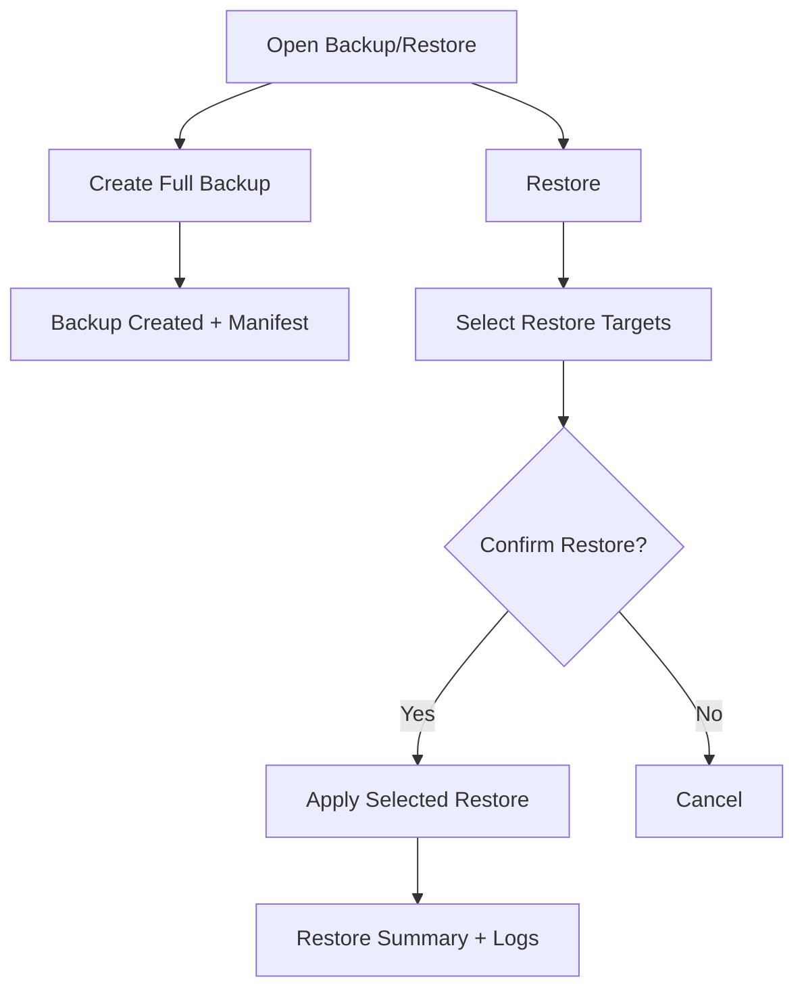

# FEAT: Backup/Restore — Full Backup + Selective Restore

* **ID:** FEAT_backup_restore_selection
* **Status:** Implemented
* **Owner/Area:** Platform / Workspace
* **Last-Updated:** 2026-02-10
* **Related:** N/A

---

## 1) Context / Problem

**Current behavior**

* Backup/restore behavior is not clearly defined here, and may be partial or tied
  to specific inputs/artefacts.

**Problem**

* The desired UX is: always create a **full backup**, and during restore present
  a **selection of what to re‑import** (granular restore).

**Constraints**

* No new dependencies.
* Preserve data integrity and avoid partial/corrupt restore states.
* Backups should be reproducible and verifiable.

---

## 2) Goals & Non-Goals

**Goals**

* [x] Always generate a full backup (all workspace artefacts + inputs).
* [x] Restore flow allows selecting which categories/items to re‑apply.
* [ ] Restore is deterministic and logged with clear provenance.
* [x] UX clearly communicates what will be restored.

**Non-Goals**

* [ ] Changing artefact schemas or storage formats (unless needed for restore metadata).
* [ ] Introducing new storage backends.

---

## 3) Proposed Behavior

**User/System behavior**

* Backup:
  * Always captures the full workspace snapshot for an athlete.
  * Produces one bundle with a manifest (what’s inside).
* Restore:
* UI shows a restore scope selector (inputs, plans, metrics, receipts, rendered, full).
* User selects which sections to restore (restore scope only).
  * Restore applies only the selected sections.

**UI impact**

* UI affected: Yes
* Pages: wherever backup/restore is exposed (likely System / Data Operations).

### UI Flow (Mermaid)

**Non-UI behavior (if applicable)**

* Components involved:
  * Workspace backup/restore helpers
  * UI page(s) for Backup/Restore
  * Run-store logging (optional)
* Contracts touched: none (unless manifest schema is introduced)

---

## 4) Implementation Analysis

**Components / Modules**

* Backup service: produce bundle + manifest (full snapshot).
* Restore service: read bundle, filter selected sections, apply atomically.
* UI: selection checklist + confirm.

**Data flow**

* Inputs: workspace snapshot + user selection.
* Processing: copy/extract subset to workspace.
* Outputs: restored files + restore log entry.

**Schema / Artefacts**

* Optional: backup manifest JSON (new artefact type).

---

## 5) Impact Analysis (complete)

**Compatibility**

* Backward compatible: Yes (restore can accept existing full backups).
* Breaking changes: None intended.
* Fallback behavior: If restore selection is empty, no changes applied.

**Conflicts with ADRs / Principles**

* Potential conflicts: none identified.
* Resolution: N/A.

**Impacted areas**

* UI: backup/restore flows
* Workspace/run-store: restore logging
* Validation/tooling: optional manifest validation

**Required refactoring**

* Backup and restore helpers to support manifest + selection.

---

## 6) Options & Recommendation

### Option A (recommended) — Full backup + selective restore

**Summary**

* Always back up everything; restore filters by user selection.

**Pros**

* Clear, safe, user‑controlled restore.

**Cons**

* Slightly larger backups.

### Option B — Partial backup + partial restore

**Summary**

* User chooses what to back up and restore.

**Pros**

* Smaller backups.

**Cons**

* Easy to miss critical data.

### Recommendation

* Choose: Option A
* Rationale: safest and simplest UX.

---

## 7) Acceptance Criteria (Definition of Done)

* [x] Full backups always include all workspace sections.
* [x] Restore UI lets user choose what to restore.
* [ ] Selected restore is applied atomically and logged.
* [x] Validation passes: `python -m py_compile $(git ls-files '*.py')`.
* [ ] UI smoke run verifies backup/restore flows.

---

## 8) Migration / Rollout

**Migration strategy**

* Support existing backup bundles; add manifest for new bundles.

**Rollout / gating**

* Feature flag if needed; default enabled.

---

## 9) Risks & Failure Modes

* Failure mode: partial restore leaves inconsistent state.
  * Detection: restore log + validation step.
  * Safe behavior: abort without applying changes if validation fails.
  * Recovery: re‑run restore or revert from backup.

---

## 10) Observability / Logging

**New/changed events**

* `backup.created`: bundle path, manifest count.
* `restore.requested`: selected sections.
* `restore.completed`: files restored, duration.
* `restore.failed`: error reason.

**Diagnostics**

* `runtime/athletes/<id>/logs/rps.log`
* restore summary in UI

---

## 11) Documentation Updates

* [x] [doc/runbooks/data_ops.md](../../runbooks/data_ops.md) — update backup/restore UX behavior.
* [ ] [doc/overview/artefact_flow.md](../../overview/artefact_flow.md) — include backup/restore nodes.
* [ ] `CHANGELOG.md` — record behavior change.

---

## 12) Link Map (no duplication; links only)

* Architecture: [doc/architecture/system_architecture.md](../../architecture/system_architecture.md)
* Workspace: [doc/architecture/workspace.md](../../architecture/workspace.md)
* Logging policy: [doc/specs/contracts/logging_policy.md](../contracts/logging_policy.md))
* Validation / runbooks: [doc/runbooks/validation.md](../../runbooks/validation.md)
* ADRs: [doc/adr/README.md](../../adr/README.md)
