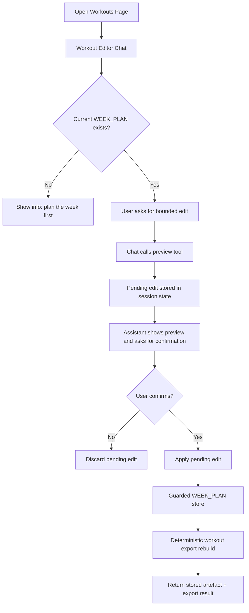

# FEAT: Chat Week Plan Edits

* **ID:** FEAT_chat_week_plan_edits
* **Status:** Implemented
* **Owner/Area:** UI / Planning
* **Last-Updated:** 2026-04-30
* **Related:** `src/rps/ui/pages/plan/workouts.py`, `src/rps/orchestrator/week_plan_edits.py`, `prompts/agents/workout_editor.md`

---

## 1) Context / Problem

**Current behavior**

* The `Coach` chat is explicitly read-only.
* The `Workouts` page supports posting/deleting exports and a free-text `revise_week_plan` request that re-invokes the `week_planner` agent.
* Users cannot directly use chat to move a workout, change a start time, or replace workout text in a bounded deterministic way.

**Problem**

* Users want to make targeted week-level changes from chat such as moving a workout or adjusting one workout definition.
* Re-running the full planner for these micro-edits is slower, less predictable, and may change more than the user asked for.
* Allowing generic write access from chat would weaken validation, traceability, and artefact authority.

**Constraints**

* `WEEK_PLAN` remains a binding artefact and must still pass guarded schema + workout-subset validation.
* `INTERVALS_WORKOUTS` must be rebuilt deterministically after a successful change.
* The existing `Coach` must remain read-only.
* No new dependencies.

---

## 2) Goals & Non-Goals

**Goals**

* [x] Add a write-capable chat surface for bounded `WEEK_PLAN` edits on the `Workouts` page.
* [x] Support deterministic preview/apply flows for common micro-edits.
* [x] Reuse guarded validation and deterministic workout export rebuild.
* [x] Keep source-of-truth boundaries explicit and auditable.

**Non-Goals**

* [x] Editing `SEASON_PLAN`, `PHASE_*`, or arbitrary workspace artefacts from chat.
* [x] Free-form generic JSON writes from chat.
* [x] Direct posting to Intervals from the edit chat itself.
* [x] Multi-week batch editing.

---

## 3) Proposed Behavior

**User/System behavior**

* The `Workouts` page gains a dedicated `Workout Editor` chat.
* The editor is limited to the currently selected ISO week and current `WEEK_PLAN`.
* The chat first previews a deterministic edit and stores it as pending state.
* The user must confirm in chat before the system applies the pending edit.
* Apply writes a new `WEEK_PLAN` version through the guarded store and rebuilds `INTERVALS_WORKOUTS` once.
* Unsupported requests are rejected with a concise explanation of supported operations.

**UI impact**

* UI affected: Yes
* If Yes: `Plan -> Workouts` gains a `Workout Editor` section with chat-based preview/confirm editing.

### UI Flow (Mermaid)

**Non-UI behavior (if applicable)**

* Components involved: `workouts.py`, `week_plan_edits.py`, `workout_export.py`, `guarded_store.py`
* Contracts touched: `WEEK_PLAN`, `INTERVALS_WORKOUTS`

---

## 4) Implementation Analysis

**Components / Modules**

* `src/rps/orchestrator/week_plan_edits.py`: deterministic edit helpers, preview generation, guarded apply.
* `src/rps/ui/pages/plan/workouts.py`: editor chat UI, session-state pending edit management, tool wiring.
* `prompts/agents/workout_editor.md`: bounded editor rules for the chat surface.

**Data flow**

* Inputs: latest/current `WEEK_PLAN`, selected ISO week, user chat instruction.
* Processing: list week workouts -> preview deterministic edit -> confirm -> guarded store -> deterministic export rebuild.
* Outputs: new `WEEK_PLAN` version, refreshed `INTERVALS_WORKOUTS`, session-state preview status.

**Schema / Artefacts**

* New artefacts: none.
* Changed artefacts: none; existing `WEEK_PLAN` / `INTERVALS_WORKOUTS` paths are reused.
* Validator implications: edited week plans must still pass `week_plan.schema.json` and workout subset validation.

---

## 5) Impact Analysis (complete)

**Compatibility**

* Backward compatible: Yes.
* Breaking changes: none.
* Fallback behavior: if no current `WEEK_PLAN` exists, the editor remains unavailable and the user must plan the week first.

**Conflicts with ADRs / Principles**

* Potential conflicts: generic write-capable chat would conflict with UI delegation and data-ownership principles.
* Resolution: edits are bounded, deterministic, page-local, and still validated through the existing guarded store.

**Impacted areas**

* UI: new `Workout Editor` chat on `Plan -> Workouts`.
* Pipeline/data: deterministic rebuild of `INTERVALS_WORKOUTS` after successful apply.
* Renderer: no change.
* Workspace/run-store: new `WEEK_PLAN` versions are created via existing guarded write path.
* Validation/tooling: existing validators are reused; preview now surfaces likely exportability issues before apply.
* Deployment/config: optional dedicated model env var for the editor.

**Required refactoring**

* Factor deterministic week-plan edit logic out of page code.
* Add a dedicated prompt for the editor instead of overloading `Coach`.

---

## 6) Options & Recommendation

### Option A — Bounded chat editor with deterministic tools

**Summary**

* Use an LLM chat only for intent parsing and user interaction.
* All edits happen in deterministic code via narrow tools.

**Pros**

* Preserves validation and traceability.
* Predictable scope and safer failure modes.
* Reuses existing `WEEK_PLAN` and export infrastructure.

**Cons**

* Supports only a small set of operations initially.
* Requires explicit preview/apply tool choreography.

**Risk**

* Session-state pending edits can become stale if the user changes week/athlete mid-session.

### Option B — Generic writable coach or workspace JSON writer

**Summary**

* Give chat broad write access and let it edit artefacts directly.

**Pros**

* Fast to prototype.

**Cons**

* Weak scope control.
* Higher risk of invalid or inconsistent artefacts.
* Harder to audit and recover.

### Recommendation

* Choose: Option A
* Rationale: it gives the user the requested editing capability without turning chat into a second uncontrolled planner or source of truth.

---

## 7) Acceptance Criteria (Definition of Done)

* [x] `Plan -> Workouts` exposes a dedicated bounded `Workout Editor` chat.
* [x] The editor can preview a workout move, start-time change, and workout-text replacement for the selected week.
* [x] Apply creates a new guarded `WEEK_PLAN` version and rebuilds `INTERVALS_WORKOUTS` once.
* [x] The editor never writes when no explicit apply/confirm happens.
* [x] The `Coach` page remains read-only.
* [x] Validation passes: `python3 -m py_compile $(git ls-files '*.py')`, targeted `pytest`, `./scripts/run_lint.sh`, `./scripts/run_typecheck.sh`.
* [x] No regressions in: Workouts page render and existing planning/export flows.
* [x] Performance guardrail: edit preview/apply remains local workspace IO plus one chat surface; no extra agent orchestration round-trip.

---

## 8) Migration / Rollout

**Migration strategy**

* No schema migration.
* Existing week plans remain editable as long as they load through the current schema.

**Rollout / gating**

* Feature flag / config: none in MVP.
* Safe rollback: remove the `Workout Editor` section; existing forms and export flow remain intact.

---

## 9) Risks & Failure Modes

* Failure mode: user previews an invalid workout-text change.
  * Detection: preview issues show subset/exportability violations; guarded store rejects on apply.
  * Safe behavior: no workspace write.
  * Recovery: user revises or discards the pending edit.

* Failure mode: user tries to move a workout onto an occupied day.
  * Detection: preview tool rejects the operation.
  * Safe behavior: no pending edit applied.
  * Recovery: choose an empty target day or use a future swap-specific feature.

* Failure mode: session-state pending edit becomes stale after week/athlete change.
  * Detection: page context key changes.
  * Safe behavior: clear pending edit and rebuild chat instance.
  * Recovery: create a new preview in the new context.

---

## 10) Observability / Logging

**New/changed events**

* `Workout editor preview created`: when a deterministic preview is stored in session state.
* `Workout editor apply started`: before guarded store + export rebuild.
* `Workout editor apply completed`: after successful `WEEK_PLAN` store + export rebuild.
* `Workout editor apply failed`: on guarded validation/store/export failure.

**Diagnostics**

* Page status banner and chat transcript.
* `rps.log` entries from the workouts page, guarded store, and workout export.

---

## 11) Documentation Updates

Update these docs as part of implementation:

* [x] `doc/ui/ui_spec.md` — mention bounded edit chat on `Plan -> Workouts`.
* [x] `doc/ui/pages/plan_workouts.md` — describe editor actions and confirm/apply semantics.
* [x] `doc/architecture/agents.md` — document the new write-capable editor surface separately from read-only `Coach`.
* [x] `doc/overview/how_to_plan.md` — note that `Plan -> Workouts` can do targeted current-week edits after planning.
* [x] `CHANGELOG.md` — record the new bounded edit capability.

---

## 12) Link Map (no duplication; links only)

* UI flows/actions: `doc/ui/ui_spec.md`
* UI contract (Streamlit): `doc/ui/streamlit_contract.md`
* Architecture: `doc/architecture/system_architecture.md`
* Workspace: `doc/architecture/workspace.md`
* Schema versioning: `doc/architecture/schema_versioning.md`
* Validation / runbooks: `doc/runbooks/validation.md`
* ADRs: `doc/adr/ADR-029-bounded-chat-week-plan-edits.md`
