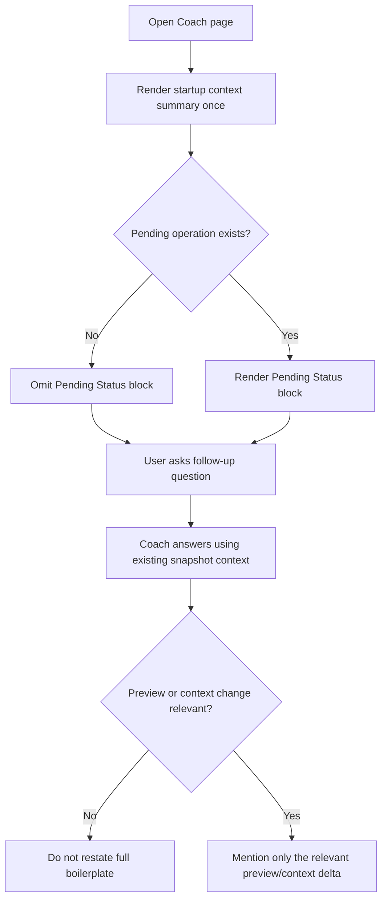

# FEAT: Reduce Repetitive Coach Context Boilerplate

* **ID:** FEAT_coach_context_repetition_reduction
* **Status:** Implemented
* **Owner/Area:** UI / Coach
* **Last-Updated:** 2026-05-13
* **Related:** `doc/specs/features/FEAT_coach_week_plan_memory_and_intro.md`, `doc/specs/features/FEAT_coach_current_week_status_snapshot.md`

---

## 1) Context / Problem

**Current behavior**

* Coach shows a deterministic startup summary when a fresh athlete/week context is opened.
* Subsequent Coach replies can still repeat athlete-context boilerplate because the system prompt mandates `Athlete Snapshot` / `Unknowns & Assumptions` sections for athlete-specific coaching.
* The startup summary also always appends a `Pending Status` section, even when no pending operation exists.

**Problem**

* Repeating the same profile/context framing on later turns is noisy.
* Repeating `No pending coach operation.` as a dedicated section adds clutter without decision value.

**Constraints**

* The startup summary must remain available once per athlete/week context.
* Coach must still surface preview/confirmation state whenever it is relevant to the current answer.
* Snapshot-first context behavior must remain unchanged.

---

## 2) Goals & Non-Goals

**Goals**

* [x] Reduce repeated athlete/context boilerplate in normal follow-up Coach replies.
* [x] Show pending/preview status only when it affects the current interaction.

**Non-Goals**

* [x] No removal of the initial deterministic startup summary.
* [x] No change to preview/apply safety semantics.

---

## 3) Proposed Behavior

**User/System behavior**

* The startup summary is still rendered once for a fresh athlete/week context.
* If there is no pending operation, the startup summary omits the dedicated `Pending Status` section.
* Coach prompt guidance explicitly tells the model not to restate full athlete snapshot / unknowns boilerplate when the same context was already shown earlier in the chat and nothing material changed.
* Coach still mentions preview/confirmation status when a preview exists, when a pending operation exists, or when the current answer created/depends on one.

**UI impact**

* UI affected: Yes
* If Yes: Coach page startup summary and conversational answer style

### UI Flow (Mermaid)

**Non-UI behavior (if applicable)**

* Components involved: `prompts/agents/coach.md`, `src/rps/crewai_runtime/coach_chat.py`, `src/rps/ui/pages/coach.py`
* Contracts touched: none

---

## 4) Implementation Analysis

**Components / Modules**

* `prompts/agents/coach.md`: relax repetition rules after cached snapshot/startup context is already present.
* `src/rps/crewai_runtime/coach_chat.py`: add an explicit turn-level instruction to avoid repeating full boilerplate unless needed.
* `src/rps/ui/pages/coach.py`: render `Pending Status` only when a pending operation exists.

**Data flow**

* Inputs: existing Coach snapshots, pending operation state, chat history
* Processing: prompt rules decide when to suppress redundant framing
* Outputs: quieter startup summary and follow-up replies

**Schema / Artefacts**

* New artefacts: none
* Changed artefacts: none
* Validator implications: none

---

## 5) Impact Analysis (complete)

**Compatibility**

* Backward compatible: Yes
* Breaking changes: none
* Fallback behavior: if prompt guidance is ignored by the model, existing safety rules still apply

**Conflicts with ADRs / Principles**

* Potential conflicts: none
* Resolution: n/a

**Impacted areas**

* UI: Coach startup summary is less noisy
* Pipeline/data: none
* Renderer: none
* Workspace/run-store: none
* Validation/tooling: Coach page tests updated
* Deployment/config: none

**Required refactoring**

* narrow startup summary rendering of pending state
* clarify non-repetition rule in Coach prompt/runtime instruction

---

## 6) Options & Recommendation

### Option A — prompt and UI suppression only

**Summary**

* Keep snapshot flow unchanged and reduce noise through prompt guidance plus small UI suppression.

**Pros**

* Minimal risk
* No schema or orchestration changes
* Directly addresses the complaint

**Cons**

* Model can still occasionally over-repeat

**Risk**

* Low

### Option B — add response post-processing

**Summary**

* Strip repeated sections from Coach model output in code.

**Pros**

* Stronger enforcement

**Cons**

* Brittle string surgery on user-visible answers
* Harder to maintain across prompt evolutions

### Recommendation

* Choose: Option A
* Rationale: enough control for the observed issue without introducing response mangling.

---

## 7) Acceptance Criteria (Definition of Done)

* [x] Coach startup summary no longer shows a dedicated `Pending Status` section when no pending operation exists.
* [x] Coach runtime instructions explicitly tell the model not to restate full context boilerplate on normal follow-up turns.
* [x] Validation passes: `python3 -m py_compile $(git ls-files '*.py')`, `PYTHONPATH=src python3 -m pytest -q tests/test_coach_app.py`, `./scripts/run_lint.sh`, `./scripts/run_typecheck.sh`
* [x] No regressions in: Coach startup summary rendering

---

## 8) Migration / Rollout

**Migration strategy**

* None

**Rollout / gating**

* Feature flag / config: none
* Safe rollback: revert prompt/UI changes

---

## 9) Risks & Failure Modes

* Failure mode: model still repeats context in some answers
  * Detection: manual Coach smoke pass
  * Safe behavior: content remains correct, only verbose
  * Recovery: tighten prompt further or add targeted post-processing later

---

## 10) Observability / Logging

**New/changed events**

* none

**Diagnostics**

* Coach page transcript
* existing run logs / `events.jsonl`

---

## 11) Documentation Updates

* [x] `CHANGELOG.md` — record reduced Coach repetition
* [x] `prompts/agents/coach.md` — clarify repetition suppression after cached startup context

---

## 12) Link Map (no duplication; links only)

* Architecture: `doc/architecture/system_architecture.md`
* Artefact flow: `doc/overview/artefact_flow.md`
* ADRs: `doc/adr/ADR-044-coach-current-week-status-snapshot.md`
