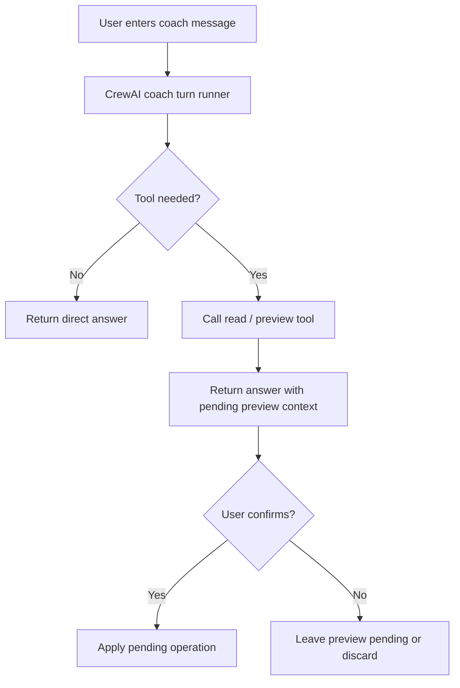

# FEAT: Coach CrewAI Decoupling and Direct Provider Config

* **ID:** FEAT_coach_crewai_decoupling
* **Status:** Implemented
* **Owner/Area:** Coach / Runtime
* **Last-Updated:** 2026-05-12
* **Related:** ADR-033

---

## 1) Context / Problem

**Current behavior**

* The `Coach` page still used `rps.ui.rps_chatbot` for conversational turns.
* The new CrewAI backend still built its LLM config indirectly from the old LiteLLM client object.
* This left the runtime in a hybrid state even after the Python 3.13 / CrewAI activation baseline work.

**Problem**

* LiteLLM remained on the active Coach path.
* CrewAI was active for persisted planning tasks, but the user-facing Coach chat still depended on the old transport stack.
* CrewAI provider config was not yet a first-class, direct runtime concern.

**Constraints**

* The active Coach must keep preview/apply semantics and operation safety.
* Persisted writes must continue to pass through guarded store and deterministic validators.
* The page must remain renderable in unsupported interpreters by degrading safely.

---

## 2) Goals & Non-Goals

**Goals**

* [x] Remove `rps_chatbot` usage from `src/rps/ui/pages/coach.py`.
* [x] Add a direct CrewAI provider-config resolver that does not depend on `LiteLLMClient`.
* [x] Move the active Coach chat turn execution onto a CrewAI-native one-turn runner.
* [x] Reuse the same active coach operations and read tools through CrewAI tools.

**Non-Goals**

* [ ] Remove all LiteLLM code from the repo.
* [ ] Delete `rps.ui.rps_chatbot.py` in this change.
* [ ] Remove the legacy runtime fallback for non-CrewAI interpreters.

---

## 3) Proposed Behavior

**User/System behavior**

* The `Coach` page uses Streamlit-native chat UI plus a CrewAI-backed turn runner.
* The Coach can still:
  * read context
  * preview bounded edits
  * preview scoped replans
  * preview/apply report and feed-forward operations
* Pending operations remain explicit and require confirmation before apply.
* In unsupported runtimes, the page degrades safely and explains that conversational Coach execution is unavailable.

**UI impact**

* UI affected: Yes
* If Yes: `Coach` no longer relies on the old chatbot implementation; chat transcript is rendered directly in the page.

### UI Flow (Mermaid)

**Non-UI behavior**

* Components involved:
  * `src/rps/ui/pages/coach.py`
  * `src/rps/crewai_runtime/coach_chat.py`
  * `src/rps/crewai_runtime/provider.py`
  * `src/rps/agents/crewai_backend.py`
* Contracts touched:
  * no artefact contract changes

---

## 4) Implementation Analysis

**Components / Modules**

* `provider.py`: direct CrewAI provider/env resolution.
* `coach_chat.py`: one-turn CrewAI chat runner with tool binding.
* `coach.py`: Streamlit-native chat transcript and input handling.
* `crewai_backend.py`: switch off legacy client-config dependency.

**Data flow**

* Inputs: current athlete/week context, coach message, tool registry, env/provider config.
* Processing:
  * resolve provider config directly from `RPS_LLM_*`
  * build CrewAI LLM/Agent/Task/Crew
  * execute one chat turn with tool access
* Outputs:
  * assistant chat text
  * unchanged pending preview/apply state

**Schema / Artefacts**

* New artefacts: none
* Changed artefacts: none
* Validator implications: unchanged

---

## 5) Impact Analysis (complete)

**Compatibility**

* Backward compatible: Yes at artefact level
* Breaking changes:
  * `Coach` no longer uses `rps_chatbot`
* Fallback behavior:
  * unsupported interpreters show a clear non-executable Coach-turn warning instead of failing import-time

**Conflicts with ADRs / Principles**

* Potential conflicts:
  * none; this is the intended next step after ADR-032
* Resolution:
  * formalized in ADR-033

**Impacted areas**

* UI: Coach page chat runtime changes
* Pipeline/data: none
* Renderer: none
* Workspace/run-store: none
* Validation/tooling: new CrewAI coach/provider tests
* Deployment/config: direct CrewAI provider config now active

**Required refactoring**

* Remove `rps_chatbot` imports from Coach page
* Create a provider-config module independent of LiteLLM runtime objects

---

## 6) Options & Recommendation

### Option A — Coach and CrewAI backend decoupled now

**Summary**

* Move the Coach page and CrewAI backend off the old chat/client stack immediately.

**Pros**

* Removes the highest-visibility LiteLLM dependency from the active UX.
* Simplifies the remaining LiteLLM exit work.

**Cons**

* Requires a second chat implementation in-repo during migration.

### Option B — Keep Coach on old stack until everything else is migrated

**Summary**

* Leave the Coach page on `rps_chatbot` longer.

**Pros**

* Less immediate UI refactor.

**Cons**

* Leaves the most visible user path on the legacy runtime.

### Recommendation

* Choose: Option A
* Rationale: the Coach was the largest remaining active dependency on the old path.

---

## 7) Acceptance Criteria (Definition of Done)

* [x] `src/rps/ui/pages/coach.py` no longer imports `rps.ui.rps_chatbot`.
* [x] CrewAI backend no longer reads LLM config from `LiteLLMClient.config`.
* [x] Coach page renders a direct Streamlit chat transcript and input box.
* [x] Pending operation preview/apply semantics are preserved.
* [x] Validation passes: `py_compile`, targeted pytest, lint, typecheck.

---

## 8) Migration / Rollout

**Migration strategy**

* No artefact migration required.
* Coach runtime swaps in-place.

**Rollout / gating**

* Feature flag / config: existing `RPS_AGENT_RUNTIME`
* Safe rollback: revert Coach page to prior commit or force legacy runtime

---

## 9) Risks & Failure Modes

* Failure mode: Coach turn runner cannot execute in current interpreter
  * Detection: runtime status / explicit message in page
  * Safe behavior: page renders and explains the limitation
  * Recovery: run in Python 3.13 / CrewAI-capable container

* Failure mode: Coach tools return malformed preview payloads
  * Detection: pending preview render or tool output inspection
  * Safe behavior: no apply without valid pending preview
  * Recovery: inspect tool output and rerun with corrected arguments

---

## 10) Observability / Logging

**New/changed events**

* `rps.crewai_runtime.coach_chat`: one-turn Coach execution logging
* existing pending preview/apply logs remain unchanged

**Diagnostics**

* Coach runtime status caption
* Streamlit chat transcript
* existing app logs

---

## 11) Documentation Updates

* [x] `CHANGELOG.md` — record Coach decoupling and direct provider config
* [x] `doc/overview/feature_backlog.md` — mark this decoupling step complete
* [x] `doc/adr/README.md` — add ADR-033

---

## 12) Link Map (no duplication; links only)

* Architecture: `doc/architecture/system_architecture.md`
* ADRs: `doc/adr/ADR-031-active-coach-and-crewai-foundation.md`, `doc/adr/ADR-032-crewai-runtime-gateway-and-staged-activation.md`, `doc/adr/ADR-033-coach-crewai-decoupling-and-direct-provider-config.md`

