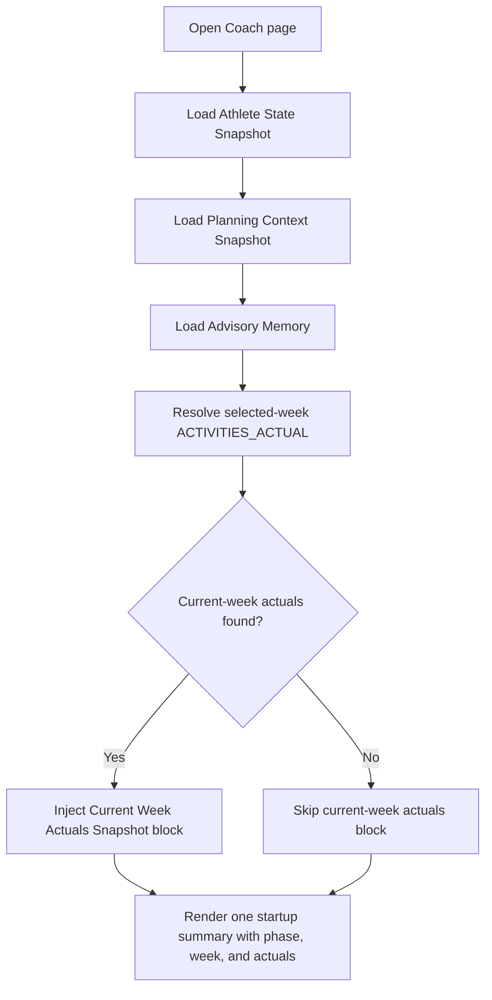

# FEAT: Coach Current Week Actuals Context

* **ID:** `FEAT_coach_current_week_actuals_context`
* **Status:** Implemented
* **Owner/Area:** Coach / Workspace / UI
* **Last-Updated:** 2026-05-13
* **Related:** `FEAT_snapshot_memory_expansion`, `ADR-028-snapshot-based-planner-memory`, `ADR-042-coach-week-plan-memory-and-intro`

## 1) Context / Problem

Coach already receives snapshot-based phase/week memory plus advisory week-plan memory. That context still omitted one operational fact pattern: completed sessions in the current target week up to now.

As a result:

* Coach could summarize planned work for the week.
* Coach could summarize the last complete historical reference week.
* Coach could not reliably answer questions about "yesterday" or "what I already did this week" without extra tool calls.

The gap is structural: historical `ACTIVITIES_ACTUAL` / `ACTIVITIES_TREND` context is intentionally based on the last complete week and should remain stable. The missing piece is a second, explicitly partial current-week actuals view for conversational coaching.

## 2) Goals & Non-Goals

**Goals**
* [x] Preserve the existing historical reference-week activity context for planning stability.
* [x] Inject a separate coach-visible block with completed sessions in the current target week up to now.
* [x] Surface the current-week actuals in the deterministic Coach startup summary.
* [x] Keep the current-week actuals block clearly marked as partial and non-authoritative for planning guardrails.

**Non-Goals**
* [x] Replacing the historical reference-week activity block in `PLANNING_CONTEXT_SNAPSHOT`.
* [x] Creating a new persisted workspace artefact just for current-week actuals.
* [x] Changing `ACTIVITIES_TREND` semantics away from full-week historical aggregates.

## 3) Proposed Behavior

Coach now receives three distinct activity-related context layers:

1. Historical reference-week activity context from `PLANNING_CONTEXT_SNAPSHOT`
2. Current-week plan context from `ADVISORY_MEMORY`
3. Current-week actuals context built directly from selected-week `ACTIVITIES_ACTUAL`

The current-week actuals block is labeled `Current Week Actuals Snapshot` and contains:

* target ISO week
* resolved `ACTIVITIES_ACTUAL` version
* completed session count
* completed moving time
* completed work kJ
* completed session bullets

Coach startup summary now includes a `Current Week Actuals` section when such data exists.

**UI impact**
* UI affected: Yes
* Area: `Coach` page startup summary and injected memory blocks

### UI Flow (Mermaid)

**Non-UI behavior**
* Components involved:
  * `src/rps/orchestrator/context_snapshots.py`
  * `src/rps/ui/pages/coach.py`
* Contracts touched:
  * Coach memory injection contract
  * No schema changes to authoritative artefacts

## 4) Implementation Analysis

**Components / Modules**
* `src/rps/orchestrator/context_snapshots.py`
  * adds a helper that derives a current-week actuals prompt block from selected-week `ACTIVITIES_ACTUAL`
* `src/rps/ui/pages/coach.py`
  * injects the new block directly into Coach memory
  * extends the one-time intro summary with a `Current Week Actuals` section
* `tests/test_context_snapshots.py`
  * verifies the derived block content
* `tests/test_coach_app.py`
  * verifies the Coach intro shows current-week actuals exactly once

**Data flow**
* Inputs:
  * selected athlete
  * selected target ISO week
  * selected-week `ACTIVITIES_ACTUAL`
  * existing snapshots/advisory memory
* Processing:
  * resolve current selected-week `ACTIVITIES_ACTUAL`
  * build a partial completed-sessions summary
  * inject the block into Coach context and intro message
* Outputs:
  * no new persisted artefacts
  * richer Coach prompt context
  * richer deterministic startup summary

**Schema / Artefacts**
* New artefacts: none
* Changed artefacts: none
* Validator implications: none

## 5) Impact Analysis

**Compatibility**
* Backward compatible: Yes
* Breaking changes: none
* Fallback behavior: if selected-week `ACTIVITIES_ACTUAL` does not exist, the new block is omitted

**Conflicts with ADRs / Principles**
* Potential conflict: snapshot-based memory prefers code-owned derived context over agent rediscovery
* Resolution: this change extends that pattern without altering authoritative planning snapshots

**Impacted areas**
* UI: Coach intro text becomes more informative when current-week actuals exist
* Pipeline/data: none
* Renderer: none
* Workspace/run-store: reads selected-week `ACTIVITIES_ACTUAL`, no write-path change
* Validation/tooling: adds unit/AppTest coverage
* Deployment/config: none

**Required refactoring**
* Separate stable historical activity context from partial current-week actuals
* Extend Coach memory payload assembly with a dynamic block

## 6) Options & Recommendation

### Option A — Dynamic coach-only current-week actuals block

**Summary**
* Build the current-week actuals block directly from `ACTIVITIES_ACTUAL` at Coach load time.

**Pros**
* No new artefact class
* Fresh whenever current-week data changes
* Keeps historical planning context untouched

**Cons**
* The block is not persisted as its own memory artefact
* Coach page still performs one deterministic workspace read for actuals

**Risk**
* If selected-week actuals are absent, users still only see historical context

### Option B — Persist current-week actuals into advisory memory

**Summary**
* Refresh `ADVISORY_MEMORY` whenever `ACTIVITIES_ACTUAL` changes

**Pros**
* Everything comes from persisted memory artefacts

**Cons**
* More refresh hooks
* Tighter coupling between data-pipeline writes and conversational memory

### Recommendation
* Choose: Option A
* Rationale: it gives Coach the missing real-time context without changing the persisted memory model or the historical planning snapshot contract.

## 7) Acceptance Criteria (Definition of Done)

* [x] Coach still receives historical reference-week activity context through `PLANNING_CONTEXT_SNAPSHOT`.
* [x] Coach additionally receives a `Current Week Actuals Snapshot` block when selected-week actuals exist.
* [x] The current-week actuals block explicitly says that it is partial and covers completed sessions up to now.
* [x] The deterministic Coach intro summary includes a `Current Week Actuals` section when data exists.
* [x] `tests/test_context_snapshots.py` and `tests/test_coach_app.py` cover the new behavior.
* [x] Validation passes:
  * `python3 -m py_compile $(git ls-files '*.py')`
  * `PYTHONPATH=src python3 -m pytest -q tests/test_context_snapshots.py tests/test_coach_app.py`
  * `./scripts/run_lint.sh`
  * `./scripts/run_typecheck.sh`

## 8) Migration / Rollout

**Migration strategy**
* None required

**Rollout / gating**
* No feature flag
* Safe rollback: remove the dynamic block injection and intro section

## 9) Risks & Failure Modes

* Failure mode: selected-week `ACTIVITIES_ACTUAL` does not exist yet
  * Detection: empty block / no intro section
  * Safe behavior: Coach falls back to historical reference week plus week plan memory
  * Recovery: run the Intervals pipeline or wait for current-week actuals to sync

* Failure mode: current-week actuals are stale or incomplete
  * Detection: actuals block is present but does not match user expectation
  * Safe behavior: block remains explicitly partial and conversational only
  * Recovery: refresh the pipeline and reload Coach

## 10) Observability / Logging

**New/changed events**
* None. Existing Coach/UI logs remain sufficient because this is a deterministic read-only memory expansion.

**Diagnostics**
* Check `ACTIVITIES_ACTUAL` selected-week presence in the workspace
* Check Coach intro text and injected memory block content

## 11) Documentation Updates

* [x] `doc/adr/ADR-043-coach-current-week-actuals-context.md`
* [x] `doc/adr/README.md`
* [x] `doc/architecture/agents.md`
* [x] `CHANGELOG.md`

## 12) Link Map

* `doc/adr/ADR-028-snapshot-based-planner-memory.md`
* `doc/adr/ADR-042-coach-week-plan-memory-and-intro.md`
* `doc/architecture/agents.md`
* `doc/overview/artefact_flow.md`
* `doc/specs/contracts/logging_policy.md`
