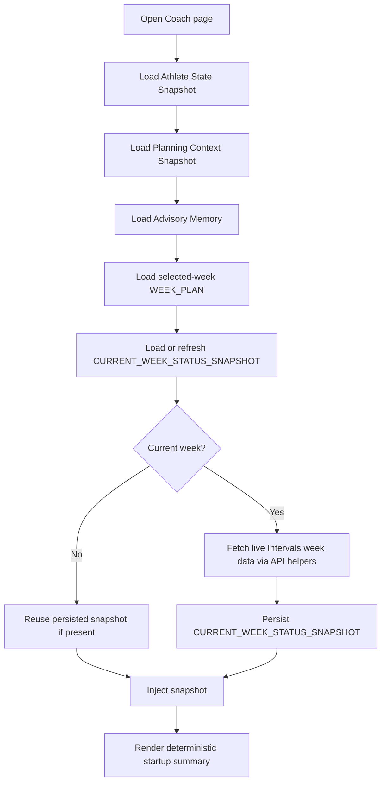

# FEAT: Coach Current Week Status Snapshot

* **ID:** `FEAT_coach_current_week_status_snapshot`
* **Status:** Implemented
* **Owner/Area:** Coach / Workspace / UI / Intervals
* **Last-Updated:** 2026-05-13
* **Related:** `FEAT_snapshot_memory_expansion`, `FEAT_coach_current_week_actuals_context`, `ADR-028-snapshot-based-planner-memory`, `ADR-042-coach-week-plan-memory-and-intro`

## 1) Context / Problem

Coach needs a usable view of the current selected week:

* planned workouts for the week
* completed sessions so far
* simple plan-vs-actual gap information

The previous approach injected current-week actuals by reading selected-week `ACTIVITIES_ACTUAL` directly inside Coach. That is not correct for the current week because `ACTIVITIES_ACTUAL` is compiled for completed historical weeks and does not serve as a stable source for partial current-week data.

The current-week view must instead be:

* fetched separately from Intervals.icu through the existing API helpers
* normalized into the same activity shape as the rest of the pipeline
* persisted as code-owned memory before Coach consumes it

## 2) Goals & Non-Goals

**Goals**
* [x] Remove direct current-week `ACTIVITIES_ACTUAL` reads from the Coach memory path.
* [x] Introduce a persisted `CURRENT_WEEK_STATUS_SNAPSHOT` artefact under `data/context/`.
* [x] Build that snapshot from live Intervals.icu current-week data using existing API/formatting helpers.
* [x] Include both current-week actuals and a simple deterministic plan-vs-actual comparison.
* [x] Keep the historical `Resolved Activity Context` in `PLANNING_CONTEXT_SNAPSHOT` unchanged.

**Non-Goals**
* [x] Replacing historical planner activity context with partial-week data.
* [x] Creating a new binding planning artefact.
* [x] Adding model-authored comparison logic for startup summaries.

## 3) Proposed Behavior

Coach now consumes four memory layers:

1. `ATHLETE_STATE_SNAPSHOT`
2. `PLANNING_CONTEXT_SNAPSHOT`
3. `CURRENT_WEEK_STATUS_SNAPSHOT`
4. `ADVISORY_MEMORY`

`CURRENT_WEEK_STATUS_SNAPSHOT` contains two prompt blocks:

* `current_week_actuals`
  * completed sessions in current target week up to now
  * completed moving time
  * completed work kJ
* `plan_vs_actual`
  * planned workouts count
  * completed sessions count
  * matched planned days
  * open planned days
  * unplanned completed days
  * completed work so far vs planned weekly load

Coach startup summary now includes:

* `Current Week Actuals`
* `Plan vs Actual`

**UI impact**
* UI affected: Yes
* Area: `Coach` startup summary and memory injection

### UI Flow (Mermaid)

**Non-UI behavior**
* Components involved:
  * `src/rps/data_pipeline/intervals_data.py`
  * `src/rps/orchestrator/context_snapshots.py`
  * `src/rps/ui/pages/coach.py`
  * workspace type/path/schema registries

## 4) Implementation Analysis

**Components / Modules**
* `src/rps/data_pipeline/intervals_data.py`
  * exposes in-memory export dataframe building
  * exposes `ACTIVITIES_ACTUAL` payload normalization from exported dataframes
  * adds a live current-week payload fetch helper
* `src/rps/orchestrator/context_snapshots.py`
  * introduces `CURRENT_WEEK_STATUS_SNAPSHOT`
  * builds `current_week_actuals` and `plan_vs_actual` blocks
  * refreshes current-week snapshot with a short TTL plus `WEEK_PLAN` version match
* `src/rps/ui/pages/coach.py`
  * consumes the persisted snapshot instead of direct `ACTIVITIES_ACTUAL`
* `src/rps/workspace/*`
  * registers the new artefact type, path, schema, and week-scoped versioning

**Data flow**
* Inputs:
  * selected-week `WEEK_PLAN`
  * live current-week Intervals.icu activity data
* Processing:
  * fetch live week data
  * normalize into the same activity shape as `ACTIVITIES_ACTUAL`
  * derive deterministic current-week status blocks
  * persist snapshot
* Outputs:
  * `CURRENT_WEEK_STATUS_SNAPSHOT`
  * richer Coach startup/context blocks

**Schema / Artefacts**
* New artefacts:
  * `CURRENT_WEEK_STATUS_SNAPSHOT` v1.0
* Changed artefacts:
  * none
* Validator implications:
  * new schema file + bundled copy

## 5) Impact Analysis

**Compatibility**
* Backward compatible: Yes
* Breaking changes: none
* Fallback behavior:
  * if live current-week fetch fails, Coach can still use any existing persisted snapshot
  * if no snapshot exists, Coach falls back to phase/week/advisory memory only

**Conflicts with ADRs / Principles**
* Potential conflict:
  * direct ad-hoc reads in Coach would violate the snapshot-first direction
* Resolution:
  * the current-week view is now persisted as code-owned memory before Coach consumes it

**Impacted areas**
* UI: richer startup summary
* Pipeline/data: adds reusable in-memory export normalization helpers
* Renderer: none
* Workspace/run-store: new derived context artefact
* Validation/tooling: new schema, tests
* Deployment/config: optional TTL env `RPS_CURRENT_WEEK_STATUS_MAX_AGE_HOURS`

**Required refactoring**
* split export/normalize logic in `intervals_data.py`
* remove direct current-week actuals read from Coach
* add snapshot freshness logic using TTL + `WEEK_PLAN` version

## 6) Options & Recommendation

### Option A — Persist a dedicated current-week status snapshot

**Summary**
* Build and store a dedicated current-week status artefact from live Intervals data plus the selected `WEEK_PLAN`.

**Pros**
* Consistent with snapshot-first architecture
* Coach reads only code-owned memory
* plan-vs-actual logic stays deterministic

**Cons**
* Adds another derived context artefact
* Requires live fetch + TTL logic

**Risk**
* stale snapshot if TTL is too loose

### Option B — Keep direct Coach-side live read

**Summary**
* Coach fetches and formats current-week actuals on every load without persisting a snapshot

**Pros**
* fewer artefact types

**Cons**
* violates snapshot-first direction
* harder to debug and inspect in workspace history
* duplicates logic between data prep and UI

### Recommendation
* Choose: Option A
* Rationale: it preserves the architectural rule that Coach consumes code-owned memory, while still solving the current-week visibility gap.

## 7) Acceptance Criteria (Definition of Done)

* [x] Coach no longer injects direct current-week `ACTIVITIES_ACTUAL` data.
* [x] `CURRENT_WEEK_STATUS_SNAPSHOT` exists as a week-scoped derived context artefact.
* [x] Snapshot refresh for the current week uses live Intervals.icu data through existing code helpers.
* [x] Snapshot includes both actuals-so-far and plan-vs-actual fields.
* [x] Coach startup summary renders current-week actuals and plan-vs-actual from the snapshot.
* [x] `tests/test_context_snapshots.py` and `tests/test_coach_app.py` cover the new behavior.
* [x] Validation passes:
  * `python3 -m py_compile $(git ls-files '*.py')`
  * `PYTHONPATH=src python3 -m pytest -q tests/test_context_snapshots.py tests/test_coach_app.py`
  * `./scripts/run_lint.sh`
  * `./scripts/run_typecheck.sh`

## 8) Migration / Rollout

**Migration strategy**
* None required

**Rollout / gating**
* No feature flag
* Fresh current-week snapshots are created on demand when Coach loads the selected current week
* Rollback: stop creating/reading `CURRENT_WEEK_STATUS_SNAPSHOT` and revert to existing memory layers

## 9) Risks & Failure Modes

* Failure mode: Intervals API unavailable
  * Detection: snapshot refresh fails or logs an exception
  * Safe behavior: reuse existing persisted snapshot if one exists
  * Recovery: restore API access and reload Coach

* Failure mode: snapshot stale after new current-week activity
  * Detection: startup summary lags behind actual day history
  * Safe behavior: TTL forces periodic refresh
  * Recovery: lower TTL or manually reload after refresh window

* Failure mode: week plan changed after snapshot build
  * Detection: stored `week_plan` source version differs from latest selected-week `WEEK_PLAN`
  * Safe behavior: snapshot refreshes before Coach injection
  * Recovery: automatic on next Coach load

## 10) Observability / Logging

**New/changed events**
* no new custom log event type
* existing artefact write logging now includes `CURRENT_WEEK_STATUS_SNAPSHOT`

**Diagnostics**
* inspect `data/context/current_week_status_snapshot_*.json`
* inspect Coach startup summary
* inspect `rps.log` for Intervals fetch errors

## 11) Documentation Updates

* [x] `doc/adr/ADR-044-coach-current-week-status-snapshot.md`
* [x] `doc/adr/README.md`
* [x] `doc/architecture/agents.md`
* [x] `doc/overview/artefact_flow.md`
* [x] `CHANGELOG.md`

## 12) Link Map

* `doc/adr/ADR-028-snapshot-based-planner-memory.md`
* `doc/adr/ADR-042-coach-week-plan-memory-and-intro.md`
* `doc/architecture/agents.md`
* `doc/overview/artefact_flow.md`
* `src/rps/data_pipeline/intervals_data.py`
* `src/rps/orchestrator/context_snapshots.py`
* `src/rps/ui/pages/coach.py`
