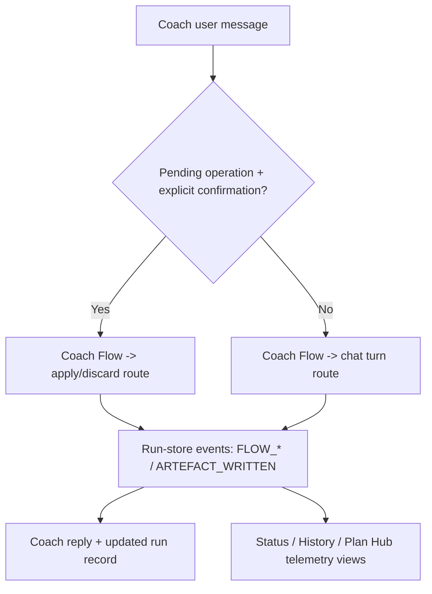

# FEAT: Coach Flow Router and Runtime Telemetry

* **ID:** FEAT_coach_flow_router_and_runtime_telemetry
* **Status:** Implemented
* **Owner/Area:** UI / CrewAI Runtime
* **Last-Updated:** 2026-05-12
* **Related:** ADR-039

---

## 1) Context / Problem

**Current behavior**

* The Coach page executes a direct one-turn CrewAI task and keeps confirmation/apply orchestration mostly in page-local logic.
* CrewAI outer flows and hierarchical crews run, but run-store telemetry does not expose Flow/Crew step visibility clearly on Coach, Plan Hub, Status, or History.

**Problem**

* The Coach is not yet a real Flow-routed orchestration surface.
* Runtime activity is hard to inspect when debugging Flow routing, hierarchical crews, or direct UI-triggered runs.

**Constraints**

* No direct agent filesystem writes.
* Guarded store remains the persistence boundary.
* Run-store remains file-backed and must stay backward compatible for existing Plan Hub runs.
* Streamlit pages must stay deterministic and readable.

---

## 2) Goals & Non-Goals

**Goals**

* [x] Route Coach turns through an explicit CrewAI Flow wrapper.
* [x] Make confirmation/apply/discard behavior part of Flow routing rather than scattered page conditionals.
* [x] Emit Flow/Crew telemetry into the existing run-store events log for foreground and direct UI runs.
* [x] Surface Flow/Crew events in Plan Hub, System Status, and System History.

**Non-Goals**

* [ ] Replace all Coach tool reasoning with a fully deterministic intent classifier.
* [ ] Introduce a new persistence store or a separate observability backend.

---

## 3) Proposed Behavior

**User/System behavior**

* Every Coach turn is wrapped in a `coach_turn` run record.
* The Coach Flow routes explicit confirmation/discard/pending-status messages before falling back to the general Coach tool-based turn.
* Flow and Crew execution emits typed run-store events such as `FLOW_STARTED`, `FLOW_ROUTED`, `CREW_STARTED`, `CREW_TASK_FINISHED`, and `ARTEFACT_WRITTEN`.
* System Status and History show readable runtime telemetry for selected runs.

**UI impact**

* UI affected: Yes
* If Yes: `Coach`, `Plan Hub`, `System -> Status`, `System -> History`

### UI Flow (Mermaid)

**Non-UI behavior (if applicable)**

* Components involved: `crewai_runtime.flows`, `crewai_runtime.coach_chat`, `agents.crewai_backend`, `ui.run_store`, UI pages.
* Contracts touched: run-store events, coach foreground run records.

---

## 4) Implementation Analysis

**Components / Modules**

* `src/rps/crewai_runtime/flows.py`: add explicit Coach Flow routing and reusable Flow event emission.
* `src/rps/crewai_runtime/telemetry.py`: centralize run-store Flow/Crew event emission.
* `src/rps/agents/crewai_backend.py`: emit Crew and artefact telemetry for direct CrewAI runs.
* `src/rps/ui/pages/coach.py`: create foreground run records and call the Coach Flow router.
* `src/rps/ui/shared.py`: add reusable event-table rendering.
* `src/rps/ui/pages/system/status.py`, `src/rps/ui/pages/system/history.py`, `src/rps/ui/pages/plan/hub.py`: render runtime telemetry.

**Data flow**

* Inputs: user message, pending operation state, run id, athlete id, runtime outputs.
* Processing: Coach Flow routing, CrewAI task/crew execution, event emission, run updates.
* Outputs: assistant reply, updated run-store records, readable event tables.

**Schema / Artefacts**

* New artefacts: none.
* Changed artefacts: none.
* Validator implications: none beyond existing artefact validation path.

---

## 5) Impact Analysis (complete)

**Compatibility**

* Backward compatible: Yes
* Breaking changes: none intended; existing event readers ignore new event types.
* Fallback behavior: if no run exists or telemetry write fails, page functionality still completes.

**Conflicts with ADRs / Principles**

* Potential conflicts: none; this strengthens the CrewAI Flow direction and preserves guarded persistence.
* Resolution: documented in ADR-039.

**Impacted areas**

* UI: Coach/Plan Hub/Status/History gain richer telemetry views.
* Pipeline/data: direct CrewAI runs now append run events.
* Renderer: unchanged.
* Workspace/run-store: additional event types in `events.jsonl`; new foreground Coach runs.
* Validation/tooling: test coverage extended for flow routing and telemetry.
* Deployment/config: none.

**Required refactoring**

* Move Coach turn dispatch behind a Flow wrapper.
* Centralize Flow/Crew telemetry writes.
* Replace duplicated event-table rendering with shared helper logic.

---

## 6) Options & Recommendation

### Option A — Coach Flow wrapper + run-store telemetry

**Summary**

* Keep the current Coach tool contract but route turns through a Flow and emit explicit runtime events.

**Pros**

* Minimal churn on Coach tools.
* Immediate observability gain.
* Compatible with current Flow/Crew runtime shape.

**Cons**

* Intent routing remains partly heuristic for explicit confirmation/discard paths.

**Risk**

* Event noise if too many low-value events are emitted.

### Option B — Full deterministic Coach intent graph before telemetry

**Summary**

* Rebuild Coach intent handling first, add telemetry later.

**Pros**

* Cleaner future-state routing model.

**Cons**

* Slower delivery.
* Leaves runtime visibility poor during the refactor.

### Recommendation

* Choose: Option A
* Rationale: it delivers the requested Coach Flow router and observability now without destabilizing the active Coach operations.

---

## 7) Acceptance Criteria (Definition of Done)

* [x] Coach turns run through a `run_coach_flow(...)` wrapper.
* [x] Explicit confirm/discard/pending-status messages route through dedicated Flow paths.
* [x] Direct CrewAI runs emit Flow/Crew telemetry events into `events.jsonl`.
* [x] Plan Hub, Status, and History can render Flow/Crew event details for a run.
* [x] Validation passes: `py_compile`, `pytest`, `run_lint.sh`, `run_typecheck.sh`.
* [x] No regressions in direct Coach operations and CrewAI runtime smoke tests.

---

## 8) Migration / Rollout

**Migration strategy**

* No schema migration required.
* Existing run records remain valid; new event types are additive.

**Rollout / gating**

* Feature flag / config: none.
* Safe rollback: revert Coach Flow wrapper and telemetry helper additions.

---

## 9) Risks & Failure Modes

* Failure mode: event write fails during direct run execution.
  * Detection: runtime logs.
  * Safe behavior: assistant/flow result still returns.
  * Recovery: inspect filesystem permissions or run-store path health.
* Failure mode: confirmation heuristic routes incorrectly.
  * Detection: unexpected Coach response with route visible in events.
  * Safe behavior: apply path still revalidates pending state and refuses unsafe mutation.
  * Recovery: refine route matcher.

---

## 10) Observability / Logging

**New/changed events**

* `FLOW_STARTED`: when a Flow wrapper begins.
* `FLOW_ROUTED`: when a Flow chooses a route.
* `FLOW_STEP_STARTED`: before a Flow step callback executes.
* `FLOW_STEP_FINISHED`: after a Flow step callback completes.
* `FLOW_FAILED`: on Flow exception.
* `FLOW_FINISHED`: when a Flow completes.
* `CREW_STARTED`: before a CrewAI task/crew kickoff.
* `CREW_TASK_FINISHED`: after a typed Crew task completes.
* `CREW_FINISHED`: after final crew output is produced.

**Diagnostics**

* `runtime/athletes/<athlete>/runs/<run_id>/events.jsonl`
* System Status / History run telemetry tables
* Plan Hub run event expander

---

## 11) Documentation Updates

Update these docs as part of implementation:

* [x] `doc/architecture/system_architecture.md` — document Coach Flow router and Flow/Crew telemetry.
* [x] `doc/architecture/agents.md` — clarify Coach orchestration role and telemetry visibility.
* [x] `doc/overview/feature_backlog.md` — mark this integration block completed.
* [x] `CHANGELOG.md` — record runtime telemetry and Coach Flow routing.

---

## 12) Link Map (no duplication; links only)

* UI contract (Streamlit): `doc/ui/streamlit_contract.md`
* Architecture: `doc/architecture/system_architecture.md`
* Artefact flow: `doc/overview/artefact_flow.md`
* Logging policy: `doc/specs/contracts/logging_policy.md`
* ADRs: `doc/adr/ADR-039-coach-flow-router-and-runtime-telemetry.md`
