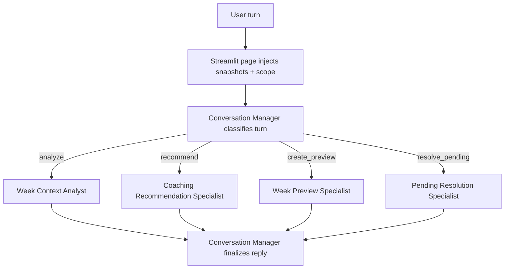

# FEAT: Coach Hierarchical Crew Small Sliced

* **ID:** FEAT_coach_hierarchical_crew_small_sliced
* **Status:** Implemented
* **Owner/Area:** Coach Runtime / Streamlit Chat Surfaces
* **Last-Updated:** 2026-05-13
* **Related:** `/doc/adr/ADR-045-coach-hierarchical-conversational-crew.md`

---

## 1) Context / Problem

**Current behavior**

* Coach and Workout Editor used broad single-agent turns plus page/flow bridge logic for preview/apply/discard/pending behavior.
* Coach-specific planning knowledge was attached to one broad `coach` agent.
* Tool visibility was too broad, which led to wrong tool selection and contradictory pending-state replies.

**Problem**

* The chat surfaces mixed UI state handling, intent routing, preview lifecycle, and coaching advice.
* Broad tool visibility made the agent path unstable for change requests and pending-preview follow-up turns.

**Constraints**

* Preview before apply remains mandatory.
* Apply still requires explicit confirmation.
* No arbitrary writes outside the existing bounded operation helpers.
* The Streamlit pages must stay thin and stable.

---

## 2) Goals & Non-Goals

**Goals**

* [x] Move Coach and Workout Editor chat onto one shared manager-plus-specialist runtime.
* [x] Assign knowledge and tools per specialist instead of one broad chat agent.
* [x] Remove page-level preview/apply/discard heuristics from Coach.
* [x] Keep preview/apply safety semantics intact.

**Non-Goals**

* [x] Do not redesign the bounded coach-operation tool schemas.
* [x] Do not bring report/feed-forward specialist families into this first shared conversational crew cut.

---

## 3) Proposed Behavior

**User/System behavior**

* Coach and Workout Editor now route each turn through the same shared conversational runtime.
* A thin manager classifies the turn and hands it to one narrow specialist.
* Specialists own one closed task each: context analysis, coaching recommendation, preview creation, or pending resolution.

**UI impact**

* UI affected: Yes
* If Yes: `Coach` and `Plan -> Workouts` chat surfaces no longer interpret intent locally for preview/apply/discard routing.

### UI Flow (Mermaid)

**Non-UI behavior**

* Components involved: `src/rps/crewai_runtime/coach_chat.py`, `src/rps/crewai_runtime/flows.py`, `src/rps/ui/pages/coach.py`, `src/rps/ui/pages/plan/workouts.py`
* Contracts touched: CrewAI YAML config, knowledge injection config, typed runtime output models

---

## 4) Implementation Analysis

**Components / Modules**

* `src/rps/crewai_runtime/coach_chat.py`: shared manager-plus-specialist runner and strict toolset profile.
* `config/crewai/agents.yaml`: new small conversational specialists.
* `config/crewai/tasks.yaml`: new small internal conversational tasks.
* `config/agent_knowledge_injection.yaml`: per-specialist knowledge bundles.
* `src/rps/ui/pages/coach.py`: removed local preview heuristics, now uses the shared runner.
* `src/rps/ui/pages/plan/workouts.py`: moved to the same shared runner with bounded editor toolsets.

**Data flow**

* Inputs: user turn, chat history, snapshot memory blocks, current pending state, bounded operation tools.
* Processing: manager classification -> selected specialist -> manager finalization.
* Outputs: one assistant reply, optional updated pending state via existing bounded operation tools.

**Schema / Artefacts**

* New artefacts: none.
* Changed artefacts: none.
* Validator implications: none beyond existing bounded preview/apply models.

---

## 5) Impact Analysis (complete)

**Compatibility**

* Backward compatible: mostly yes at the page contract level.
* Breaking changes: Coach page no longer uses the old `coach_turn_helpers` bridge path.
* Fallback behavior: legacy single-agent `run_coach_turn(...)` wrapper remains available for non-migrated callers.

**Conflicts with ADRs / Principles**

* Potential conflicts: prior Coach flow phrase-routing approach in ADR-039.
* Resolution: superseded at the conversational intent layer; runtime telemetry and outer flow remain intact.

**Impacted areas**

* UI: Coach and Workout Editor chat behavior.
* Pipeline/data: none.
* Renderer: none.
* Workspace/run-store: pending state remains tool-owned; page state is passive.
* Validation/tooling: new structured internal output models and test coverage.
* Deployment/config: new agent/task/prompt/knowledge entries.

**Required refactoring**

* Remove page-level preview heuristics.
* Split tool visibility by specialist responsibility.
* Split Coach knowledge injection by specialist responsibility.

---

## 6) Options & Recommendation

### Option A — Page/Flow heuristics

**Summary**

* Keep one broad coach and solve pending/preview routing in Streamlit and outer flows.

**Pros**

* Smaller code diff initially.

**Cons**

* State logic stays duplicated across UI, flow, and agent.
* Tool selection remains unstable.

### Option B — Shared manager-plus-specialist crew

**Summary**

* Move all conversational routing into one shared manager-led runtime with small specialists.

**Pros**

* Smaller tool surfaces per specialist.
* One authoritative conversational path across Coach and Workout Editor.
* Per-specialist knowledge bundles are explicit and testable.

**Cons**

* Larger initial refactor.

### Recommendation

* Choose: Option B
* Rationale: it removes duplicated bridge logic and aligns tool/knowledge scope with actual responsibilities.

---

## 7) Acceptance Criteria (Definition of Done)

* [x] Coach and Workout Editor use the shared conversational runtime.
* [x] Knowledge injection is specialist-specific.
* [x] Tool visibility is specialist-specific.
* [x] Coach page no longer imports or uses `coach_turn_helpers`.
* [x] Validation passes: `py_compile`, targeted `pytest`, `ruff`, curated `mypy`.
* [x] No regressions in current-week startup summary or pending banner rendering.

---

## 8) Migration / Rollout

**Migration strategy**

* Hard cutover on the two chat surfaces.

**Rollout / gating**

* Feature flag / config: none.
* Safe rollback: restore the old page-level routing and single-agent page wiring.

---

## 9) Risks & Failure Modes

* Failure mode: manager misclassifies a turn.
  * Detection: runtime logs, wrong specialist tool usage, wrong reply shape.
  * Safe behavior: no direct arbitrary writes; preview/apply still go through bounded tools.
  * Recovery: adjust specialist prompts or classification guidance.

* Failure mode: specialist gets the wrong tool subset.
  * Detection: tests on runtime profile and source wiring.
  * Safe behavior: operation fails boundedly via tool contract.
  * Recovery: fix toolset composition in page/runtime wiring.

---

## 10) Observability / Logging

**New/changed events**

* No new event type added in this cut.
* Existing flow/crew/task/tool telemetry remains active while conversational routing moved out of phrase-based outer-flow branching.

**Diagnostics**

* `events.jsonl` for flow/crew/task/tool sequence
* `rps.log` for page/runtime initialization and bounded operation outcomes

---

## 11) Documentation Updates

* [x] `/doc/specs/features/FEAT_coach_hierarchical_crew_small_sliced.md` — canonical feature doc
* [x] `/doc/adr/ADR-045-coach-hierarchical-conversational-crew.md` — architecture decision
* [x] `/doc/adr/README.md` — ADR index
* [x] `/CHANGELOG.md` — unreleased summary

---

## 12) Link Map

* `/doc/adr/ADR-031-active-coach-operations-and-crewai-foundation.md`
* `/doc/adr/ADR-039-coach-flow-router-and-runtime-telemetry.md`
* `/doc/adr/ADR-044-coach-current-week-status-snapshot.md`
* `/doc/architecture/system_architecture.md`
* `/doc/overview/artefact_flow.md`
