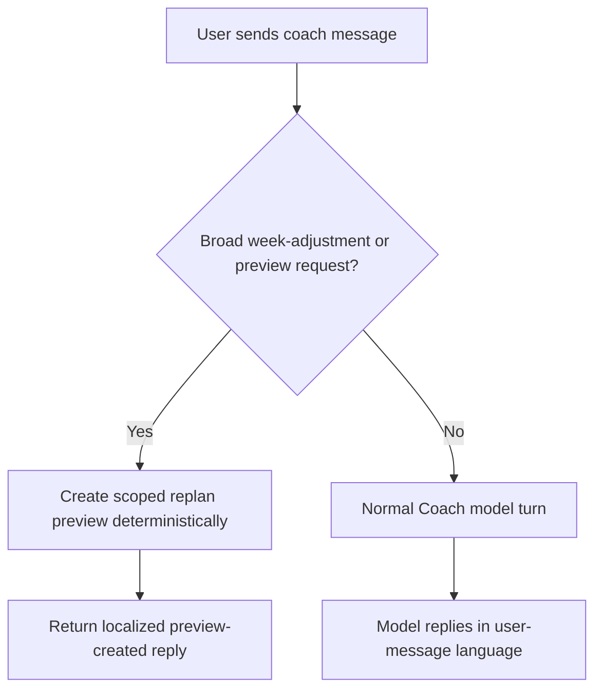

# FEAT: Coach Language Alignment and Preview Fallback

* **ID:** FEAT_coach_language_and_preview_fallback
* **Status:** Implemented
* **Owner/Area:** UI / Coach
* **Last-Updated:** 2026-05-13
* **Related:** `doc/specs/features/FEAT_coach_context_repetition_reduction.md`, `doc/specs/features/FEAT_coach_current_week_status_snapshot.md`

## 1) Context / Problem

**Current behavior**

* Coach replies can switch language even when the athlete asked in German.
* When the user asks for a broad week adjustment (for example `bitte den Wochenplan entsprechend anpassen`), the Coach sometimes fails to create a preview because the model tries to choose a low-level edit tool without the required exact parameters.

**Problem**

* Language drift degrades trust and usability.
* A broad week-adjustment request should reliably become a `preview_scoped_week_replan(...)` instead of stalling on missing workout-level arguments.

**Constraints**

* Preview-before-apply semantics must remain intact.
* Low-level edit tools remain available for explicit workout-level changes.
* No schema changes are required.

## 2) Goals & Non-Goals

**Goals**

* [x] Coach replies in the language of the current user message by default.
* [x] Broad week-adjustment requests create a scoped week-replan preview deterministically.
* [x] Follow-up requests such as `ja, preview erstellen` can create a preview when no pending operation exists yet.

**Non-Goals**

* [x] No full multilingual UI localization.
* [x] No removal of explicit low-level workout edit tools.

## 3) Proposed Behavior

**User/System behavior**

* If the user asks in German, Coach answers in German unless the user explicitly requests another language.
* If the user asks for a broad weekly adjustment, the page creates a `preview_scoped_week_replan` directly instead of waiting for the model to discover low-level tool parameters.
* If the user explicitly asks to create a preview and there is no pending operation, the page creates a scoped replan preview from recent conversation context.

**UI impact**

* UI affected: Yes
* If Yes: Coach page conversational turn handling

### UI Flow (Mermaid)

**Non-UI behavior (if applicable)**

* Components involved: `src/rps/ui/pages/coach.py`, `src/rps/ui/coach_turn_helpers.py`, `src/rps/crewai_runtime/coach_chat.py`, `prompts/agents/coach.md`
* Contracts touched: none

## 4) Implementation Analysis

**Components / Modules**

* `src/rps/ui/coach_turn_helpers.py`: pure helpers for language detection and preview-request heuristics.
* `src/rps/ui/pages/coach.py`: deterministic preview fallback before the model call.
* `src/rps/crewai_runtime/coach_chat.py`: explicit same-language turn instruction.
* `prompts/agents/coach.md`: explicit same-language rule and scoped-replan preference for broad adjustments.

**Data flow**

* Inputs: current user message, recent chat history, selected-week scope
* Processing: heuristic classification -> optional scoped replan preview creation
* Outputs: pending coach operation preview or normal model response

**Schema / Artefacts**

* New artefacts: none
* Changed artefacts: none
* Validator implications: none

## 5) Impact Analysis (complete)

**Compatibility**

* Backward compatible: Yes
* Breaking changes: none
* Fallback behavior: if heuristics do not match, Coach falls back to normal model execution

**Conflicts with ADRs / Principles**

* Potential conflicts: none
* Resolution: n/a

**Impacted areas**

* UI: Coach turn handling and reply language
* Pipeline/data: none
* Renderer: none
* Workspace/run-store: pending coach previews can now be created without a model step for broad adjustments
* Validation/tooling: new helper tests
* Deployment/config: none

**Required refactoring**

* extract language/preview helpers from page logic
* add deterministic scoped replan fallback path

## 6) Options & Recommendation

### Option A — prompt-only guidance

**Summary**

* Tell the model to keep language and prefer `preview_scoped_week_replan`.

**Pros**

* Minimal code

**Cons**

* Not reliable enough for broad adjustment requests

### Option B — prompt guidance plus deterministic UI fallback

**Summary**

* Add explicit prompt rules and a page-level fallback for broad adjustments and explicit preview requests.

**Pros**

* Reliable behavior for the observed failure mode
* Keeps low-level tools available

**Cons**

* Small heuristic layer in the UI

### Recommendation

* Choose: Option B
* Rationale: the failure is operational, not merely stylistic; deterministic fallback is appropriate.

## 7) Acceptance Criteria (Definition of Done)

* [x] Coach turn instructions explicitly require reply language to match the current user message.
* [x] Broad week-adjustment requests can create a pending `preview_scoped_week_replan` without a model turn.
* [x] Explicit preview-creation follow-ups can create a pending scoped preview when none exists yet.
* [x] Validation passes: `python3 -m py_compile $(git ls-files '*.py')`, `PYTHONPATH=src python3 -m pytest -q tests/test_coach_turn_helpers.py tests/test_coach_app.py`, `./scripts/run_lint.sh`, `./scripts/run_typecheck.sh`

## 8) Migration / Rollout

**Migration strategy**

* None

**Rollout / gating**

* Feature flag / config: none
* Safe rollback: remove helper fallback and prompt guidance

## 9) Risks & Failure Modes

* Failure mode: heuristic falsely classifies a message as a broad preview request
  * Detection: manual Coach smoke pass
  * Safe behavior: only a preview is created, not an applied change
  * Recovery: discard pending operation or tighten heuristics

## 10) Observability / Logging

**New/changed events**

* none

**Diagnostics**

* Coach chat transcript
* existing run-store / pending operation state

## 11) Documentation Updates

* [x] `CHANGELOG.md` — note language alignment and preview fallback
* [x] `prompts/agents/coach.md` — language and scoped-replan guidance

## 12) Link Map (no duplication; links only)

* Architecture: `doc/architecture/system_architecture.md`
* Artefact flow: `doc/overview/artefact_flow.md`
* ADRs: `doc/adr/ADR-044-coach-current-week-status-snapshot.md`
