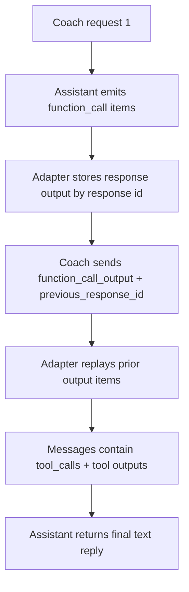

# FEAT: Coach Previous Response Tool Replay

* **ID:** FEAT_coach_previous_response_tool_replay
* **Status:** Implemented
* **Owner/Area:** LiteLLM runtime / Coach UI
* **Last-Updated:** 2026-03-23
* **Related:** `src/rps/openai/litellm_runtime.py`, `src/rps/ui/rps_chatbot.py`

---

## 1) Context / Problem

**Current behavior**

* The Coach uses a two-step Responses flow: initial model call, then tool outputs with `previous_response_id`.
* The LiteLLM adapter converts Responses-style input into chat-completion messages.

**Problem**

* The adapter ignored `previous_response_id` and rebuilt the second request from tool outputs alone.
* Tool outputs therefore arrived without their original tool-call messages, producing `no matching tool_call_id` warnings and empty coach replies.

**Constraints**

* No OpenAI-hosted response retrieval is available in the LiteLLM path.
* The adapter must stay compatible with the current Responses-like surface.

---

## 2) Goals & Non-Goals

**Goals**

* [x] Preserve prior response output items for follow-up calls that use `previous_response_id`.
* [x] Ensure tool outputs are paired with the corresponding tool calls in the second Coach request.
* [x] Add regression coverage for the adapter.

**Non-Goals**

* [x] Implementing full remote `responses.retrieve` support.
* [x] Changing Coach tool definitions or prompts.

---

## 3) Proposed Behavior

**User/System behavior**

* When the LiteLLM adapter receives `previous_response_id`, it replays the stored output items from that response before appending the new input items.
* This lets the second request include both the original `function_call` items and the new `function_call_output` items.
* The Coach can then continue normally and produce a final assistant reply.

**UI impact**

* UI affected: Yes
* If Yes: Coach chat no longer stalls after tool execution due to unmatched tool outputs.

### UI Flow (Mermaid)

**Non-UI behavior (if applicable)**

* Components involved: `LiteLLMResponses.create(...)`
* Contracts touched: `previous_response_id` handling in the local adapter

---

## 4) Implementation Analysis

**Components / Modules**

* `src/rps/openai/litellm_runtime.py`: store completed response outputs in-memory and replay them when `previous_response_id` is supplied.
* `tests/test_litellm_runtime.py`: verify tool-call replay in the second request.

**Data flow**

* Inputs: initial response output items, follow-up `previous_response_id`, tool outputs
* Processing: prepend cached output items to new input before message conversion
* Outputs: correctly paired assistant tool-call + tool-response messages

**Schema / Artefacts**

* New artefacts: none
* Changed artefacts: none
* Validator implications: none

---

## 5) Impact Analysis

**Compatibility**

* Backward compatible: Yes
* Breaking changes: none
* Fallback behavior: if a response id is unknown, the adapter behaves as before

**Conflicts with ADRs / Principles**

* Potential conflicts: none
* Resolution: local replay is the minimal emulation required for Responses compatibility

**Impacted areas**

* UI: Coach final response resumes after tool execution
* Pipeline/data: none
* Renderer: none
* Workspace/run-store: none
* Validation/tooling: runtime regression test added
* Deployment/config: none

**Required refactoring**

* None beyond adapter state management

---

## 6) Options & Recommendation

### Option A — Cache and replay prior response output items

**Summary**

* Keep a small in-memory response map inside the LiteLLM adapter and reuse it for follow-up calls.

**Pros**

* Directly addresses the Responses semantic gap.
* Minimal surface area.
* Keeps Coach logic unchanged.

**Cons**

* In-memory only within the process.

### Option B — Make callers resend the full prior response output

**Summary**

* Push replay responsibility to every caller.

**Pros**

* Less adapter state.

**Cons**

* Duplicates logic at call sites.
* Easy to get wrong again.

### Recommendation

* Choose: Option A
* Rationale: `previous_response_id` is adapter-level behavior and should be handled there.

---

## 7) Acceptance Criteria (Definition of Done)

* [x] Follow-up LiteLLM requests with `previous_response_id` replay prior output items.
* [x] Tool outputs are matched to prior tool calls in the second request.
* [x] Validation passes: `python3 -m py_compile $(git ls-files '*.py')`
* [x] Regression test covers the adapter behavior.

---

## 8) Migration / Rollout

**Migration strategy**

* None required.

**Rollout / gating**

* Feature flag / config: none
* Safe rollback: revert adapter replay cache changes

---

## 9) Risks & Failure Modes

* Failure mode: prior response id missing from cache
* Detection: tool-output skipped warnings reappear
* Safe behavior: adapter falls back to current input only
* Recovery: inspect response cache handling in `LiteLLMResponses`

---

## 10) Observability / Logging

**New/changed events**

* No new event types

**Diagnostics**

* `rps.openai.litellm_runtime` warning logs for tool-call/tool-output matching

---

## 11) Documentation Updates

* [x] `doc/specs/features/FEAT_coach_previous_response_tool_replay.md` - feature record

---

## 12) Link Map (no duplication; links only)

* UI flows/actions: `doc/ui/flows.md`
* UI contract (Streamlit): `doc/ui/streamlit_contract.md`
* Architecture: `doc/architecture/system_architecture.md`
* Workspace: `doc/architecture/workspace.md`
* Schema versioning: `doc/architecture/schema_versioning.md`
* Logging policy: `doc/specs/contracts/logging_policy.md`
* Validation / runbooks: `doc/runbooks/validation.md`
* ADRs: `doc/adr/ADR-025-multi-provider-runtime-and-local-vectorstore.md`
