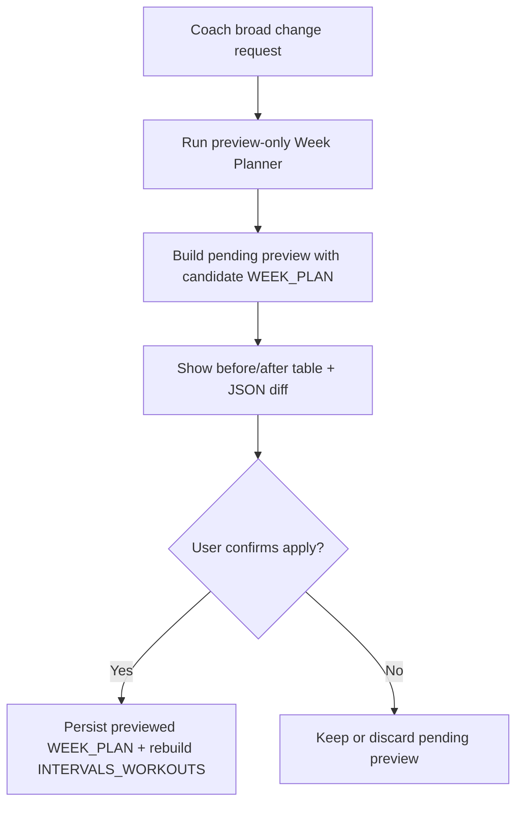

# FEAT: Coach Scoped Week Replan True Preview

* **ID:** FEAT_coach_scoped_week_replan_true_preview
* **Status:** Implemented
* **Owner/Area:** Coach Runtime
* **Last-Updated:** 2026-05-13
* **Related:** `src/rps/orchestrator/coach_operations.py`, `src/rps/orchestrator/week_revision.py`, `src/rps/ui/pages/coach.py`

---

## 1) Context / Problem

**Current behavior**

* `preview_scoped_week_replan` only stores a preview intent and summary.
* `Zeig mir die Preview` cannot show a real before/after change set.
* `Ja, anwenden` may rerun the planner and drift away from what the preview implied.

**Problem**

* The preview UX is not trustworthy because it does not materialize the candidate `WEEK_PLAN`.
* Users need a real selected-week diff before confirming apply.

**Constraints**

* Preview-before-apply remains mandatory.
* The week preview must not persist artifacts during preview generation.
* The applied result should match the previewed `WEEK_PLAN` document whenever possible.

---

## 2) Goals & Non-Goals

**Goals**

* [x] Generate a real dry-run `WEEK_PLAN` document during scoped week preview creation.
* [x] Store before/after preview metadata so `show_pending_coach_operation` can expose concrete changes.
* [x] Apply the previewed document directly instead of re-running the planner when the pending preview already contains a valid document.

**Non-Goals**

* [x] Redesigning the week planner itself.
* [x] Extending the same true-preview behavior to report or feed-forward operations in this change.

---

## 3) Proposed Behavior

**User/System behavior**

* A broad coach week-adjustment request runs the Week Planner in preview-only mode.
* The resulting pending operation contains the candidate `WEEK_PLAN`, a workout-level before/after table, and a unified JSON diff.
* `Zeig mir die Preview` can show the concrete changes.
* `Ja, anwenden` stores exactly the previewed `WEEK_PLAN` document and rebuilds `INTERVALS_WORKOUTS`.

**UI impact**

* UI affected: Yes
* If Yes: `Coach` pending preview display and apply flow

### UI Flow (Mermaid)

**Non-UI behavior (if applicable)**

* Components involved: `week_revision`, `crewai_runtime.flows`, `agents.runtime`, `coach_operations`
* Contracts touched: pending coach preview metadata only

---

## 4) Implementation Analysis

**Components / Modules**

* `src/rps/agents/runtime.py`: add preview-only runtime entrypoint.
* `src/rps/agents/crewai_backend.py`: return normalized artifact documents without persisting them.
* `src/rps/crewai_runtime/flows.py`: allow preview-only week runs.
* `src/rps/orchestrator/week_revision.py`: expose preview-only week revision helper.
* `src/rps/orchestrator/coach_operations.py`: build true scoped week preview payload, diff metadata, and direct apply from preview document.
* `src/rps/ui/pages/coach.py`: use the new preview builder and richer pending payload.

**Data flow**

* Inputs: current `WEEK_PLAN`, coach message, injected planner context
* Processing: preview-only week planner run -> normalized candidate `WEEK_PLAN` -> diff against current plan -> pending preview payload
* Outputs: pending preview with `document`, `change_rows`, `change_table_markdown`, `diff_text`; on apply, persisted `WEEK_PLAN` and rebuilt `INTERVALS_WORKOUTS`

**Schema / Artefacts**

* New artefacts: none
* Changed artefacts: none
* Validator implications: previewed `WEEK_PLAN` must pass the same schema validation path before apply

---

## 5) Impact Analysis (complete)

**Compatibility**

* Backward compatible: Yes
* Breaking changes: none
* Fallback behavior: if preview generation cannot materialize a valid document, the pending preview returns a failure with issues instead of a misleading intent-only preview

**Conflicts with ADRs / Principles**

* Potential conflicts: none
* Resolution: aligns with ADR-045 by keeping preview/apply state inside the coach runtime and narrowing tool semantics

**Impacted areas**

* UI: richer preview rendering potential from pending metadata
* Pipeline/data: preview-only planner path added
* Renderer: none
* Workspace/run-store: preview runs no longer persist artifacts; apply stores the previewed document
* Validation/tooling: week preview now validates candidate `WEEK_PLAN`
* Deployment/config: none

**Required refactoring**

* Split week revision into preview-only and apply paths
* Reuse the previewed document on apply

---

## 6) Options & Recommendation

### Option A — Preview-only planner run with direct apply of previewed document

**Summary**

* Build the preview by running the planner without persistence and apply the exact previewed document later.

**Pros**

* Preview and apply stay aligned.
* Concrete before/after diff becomes deterministic.
* Minimal UX ambiguity.

**Cons**

* Adds a second code path for planner execution.

**Risk**

* Medium; preview-only path must stay normalized and validated like persisted runs.

### Option B — Keep intent-only preview and fabricate a textual summary

**Summary**

* Continue storing only the message and have the model explain likely changes.

**Pros**

* Smaller implementation.

**Cons**

* Does not solve trustworthiness.
* Apply can still diverge from preview.

### Recommendation

* Choose: Option A
* Rationale: the preview must be a real candidate plan, not a narrative guess.

---

## 7) Acceptance Criteria (Definition of Done)

* [x] Scoped coach week preview materializes a candidate `WEEK_PLAN` document without persisting it.
* [x] Pending preview contains concrete before/after metadata and a unified diff.
* [x] Applying a scoped week preview with a pending `document` stores that exact document and rebuilds `INTERVALS_WORKOUTS`.
* [x] Validation passes: `python3 -m py_compile $(git ls-files '*.py')`, `./scripts/run_lint.sh`, `./scripts/run_typecheck.sh`, targeted pytest
* [x] No regressions in: coach chat preview/apply flow, week flow dispatch tests

---

## 8) Migration / Rollout

**Migration strategy**

* None required.

**Rollout / gating**

* Feature flag / config: none
* Safe rollback: revert preview-only week flow and coach preview metadata changes

---

## 9) Risks & Failure Modes

* Failure mode: preview-only planner output is invalid
  * Detection: schema validation or consistency issues in pending preview
  * Safe behavior: return `ok=false` preview with issues; do not set a misleading pending document
  * Recovery: inspect week planner output and preview-only runtime logs

* Failure mode: apply path still reruns the planner instead of persisting the previewed document
  * Detection: preview diff does not match applied result
  * Safe behavior: fall back to existing scoped replan apply only when pending document is absent
  * Recovery: inspect `COACH_PENDING_KEY` payload and apply branch in `coach.py`

---

## 10) Observability / Logging

**New/changed events**

* No new event types
* Week preview runs now use the same week flow telemetry but in preview-only mode

**Diagnostics**

* Coach pending snapshot in session state
* Week flow runtime events
* `rps.log` apply/preview failure messages

---

## 11) Documentation Updates

* [x] `doc/specs/features/FEAT_coach_scoped_week_replan_true_preview.md` — add feature record for true preview behavior
* [x] `CHANGELOG.md` — note true scoped week preview and aligned apply path

---

## 12) Link Map (no duplication; links only)

* Architecture: `doc/architecture/system_architecture.md`
* UI: `doc/ui/pages/plan_hub.md`
* Logging policy: `doc/specs/contracts/logging_policy.md`
* ADRs: `doc/adr/ADR-045-coach-hierarchical-conversational-crew.md`
