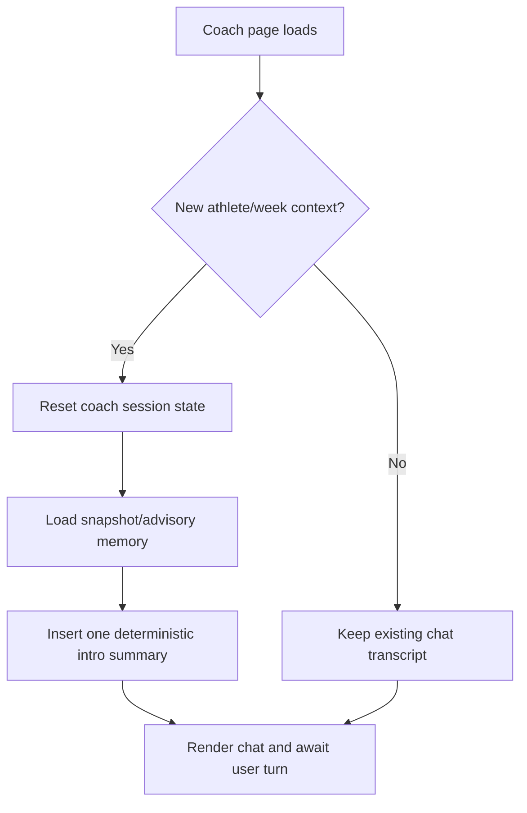

# FEAT: Coach Week-Plan Memory and Intro Summary

* **ID:** FEAT_coach_week_plan_memory_and_intro
* **Status:** Implemented
* **Owner/Area:** Coach / Workspace / UI
* **Last-Updated:** 2026-05-13
* **Related:** ADR-042, ADR-028

---

## 1) Context / Problem

**Current behavior**

* Coach already receives `Athlete State Snapshot`, `Planning Context Snapshot`, and `Advisory Memory` before raw fallback preload.
* `Advisory Memory` only carries a minimal week summary (`week_objective`, `planned_weekly_load_kj`).
* On a new chat context, Coach starts with an empty transcript and only responds after the first user turn.

**Problem**

* Coach lacks the concrete selected-week workout list in its preloaded memory, so it may re-query tools or answer week-context requests incompletely.
* Users cannot immediately verify which phase/week context the Coach actually loaded.

**Constraints**

* Reuse the existing snapshot/advisory-memory architecture instead of adding a parallel context system.
* Keep memory code-owned and derived from authoritative artefacts.
* Avoid a separate model call just to generate a startup summary.

---

## 2) Goals & Non-Goals

**Goals**

* [x] Extend existing Coach-preferred memory with the concrete selected-week plan summary.
* [x] Add a one-time startup summary message in the Coach chat when the active week/athlete context changes.
* [x] Refresh advisory memory after Coach-applied week-plan changes so memory follows the latest artefacts.

**Non-Goals**

* [ ] Introduce a second mutable memory file for Coach.
* [ ] Force a dedicated LLM turn at page load.
* [ ] Remove Coach tools for detailed follow-up inspection.

---

## 3) Proposed Behavior

**User/System behavior**

* `ADVISORY_MEMORY` now includes a `Current Week Plan Snapshot` block derived from the latest `WEEK_PLAN`.
* When Coach opens a fresh athlete/week context, the chat receives one deterministic assistant intro message summarizing:
  * current phase
  * active week objective/load
  * current planned workouts
  * pending preview status
* The intro message appears once per context key and is not regenerated on ordinary reruns.

**UI impact**

* UI affected: Yes
* If Yes: `src/rps/ui/pages/coach.py` chat transcript initialization and first visible assistant message.

### UI Flow (Mermaid)

**Non-UI behavior (if applicable)**

* Components involved: `context_snapshots.py`, `coach_operations.py`, `coach.py`.
* Contracts touched: derived `ADVISORY_MEMORY` payload content only.

---

## 4) Implementation Analysis

**Components / Modules**

* `src/rps/orchestrator/context_snapshots.py`
  * expand advisory memory with a detailed current-week plan block
* `src/rps/orchestrator/coach_operations.py`
  * refresh advisory memory after successful week-plan mutations
* `src/rps/ui/pages/coach.py`
  * synthesize and insert one startup summary from loaded memory + pending state
* `tests/test_context_snapshots.py`
  * verify new week-plan memory block
* `tests/test_coach_app.py`
  * verify startup summary behavior in the UI

**Data flow**

* Inputs: latest `WEEK_PLAN`, `PLANNING_CONTEXT_SNAPSHOT`, `ADVISORY_MEMORY`, pending coach operation state.
* Processing: derive compact text blocks and a deterministic intro summary.
* Outputs: enriched advisory-memory prompt block and one assistant chat message.

**Schema / Artefacts**

* New artefacts: none.
* Changed artefacts: `ADVISORY_MEMORY` payload content only; schema remains compatible because `prompt_blocks` already allows additional string keys.
* Validator implications: none.

---

## 5) Impact Analysis (complete)

**Compatibility**

* Backward compatible: Yes
* Breaking changes: none.
* Fallback behavior: if memory artefacts are absent, Coach still falls back to the existing raw preload path and no intro is inserted.

**Conflicts with ADRs / Principles**

* Potential conflicts: none; the change strengthens ADR-028 by reusing existing code-owned memory.
* Resolution: captured in ADR-042.

**Impacted areas**

* UI: Coach shows a one-time startup summary.
* Pipeline/data: advisory-memory content becomes richer.
* Renderer: unchanged.
* Workspace/run-store: advisory-memory refresh also follows Coach-applied week-plan changes.
* Validation/tooling: added snapshot + AppTest coverage.
* Deployment/config: none.

**Required refactoring**

* Centralize current-week plan summary generation in snapshot code.
* Move Coach startup summary generation to a deterministic helper rather than a free-form agent turn.

---

## 6) Options & Recommendation

### Option A — extend existing memory + deterministic intro

**Summary**

* Add concrete week-plan summary to existing memory artefacts and render one intro message from them.

**Pros**

* Reuses accepted snapshot architecture.
* No extra model call.
* Makes Coach context visible and inspectable.

**Cons**

* Startup intro is deterministic, not model-authored prose.

**Risk**

* Advisory-memory refresh must also cover Coach-applied edits.

### Option B — add prompt instruction for Coach to summarize itself on startup

**Summary**

* Keep memory unchanged and ask the model to produce a startup summary.

**Pros**

* Smaller code change.

**Cons**

* Adds model cost.
* Still leaves the concrete week plan outside memory.
* Harder to guarantee one-time-only behavior under reruns.

### Recommendation

* Choose: Option A
* Rationale: deterministic and aligned with the existing memory model.

---

## 7) Acceptance Criteria (Definition of Done)

* [x] `ADVISORY_MEMORY` includes a current-week plan block with workout rows when `WEEK_PLAN` exists.
* [x] Coach shows one startup summary on a fresh athlete/week context.
* [x] The startup summary is not duplicated on ordinary reruns.
* [x] Advisory memory refreshes after successful Coach week-plan apply/replan operations.
* [x] Validation passes: `py_compile`, targeted `pytest`, `run_lint.sh`, `run_typecheck.sh`.

---

## 8) Migration / Rollout

**Migration strategy**

* No migration; enriched memory appears on the next successful advisory-memory refresh.

**Rollout / gating**

* Feature flag / config: none.
* Safe rollback: remove the new advisory block and startup intro helper.

---

## 9) Risks & Failure Modes

* Failure mode: advisory memory is stale after a direct week-plan change.
  * Detection: startup summary disagrees with latest `WEEK_PLAN`.
  * Safe behavior: summary remains informational; authoritative artefacts still govern.
  * Recovery: refresh advisory memory after successful Coach writes.
* Failure mode: startup intro duplicates on rerun.
  * Detection: repeated identical assistant message at top of chat.
  * Safe behavior: no data corruption, only UI noise.
  * Recovery: gate intro insertion on empty message history per context.

---

## 10) Observability / Logging

**New/changed events**

* No new run-store event types.
* Advisory-memory writes occur after successful Coach-applied week-plan changes.

**Diagnostics**

* `runtime/athletes/<athlete_id>/latest/advisory_memory.json`
* Coach page transcript on first render for a fresh context

---

## 11) Documentation Updates

Update these docs as part of implementation:

* [x] `doc/overview/artefact_flow.md` — clarify that coach-facing memory can include current week plan summary.
* [x] `doc/specs/features/FEAT_snapshot_memory_expansion.md` — linked follow-up via changelog/backlog only, no canonical duplication.
* [x] `doc/adr/README.md` — index ADR-042.
* [x] `CHANGELOG.md` — record the enriched Coach memory and intro summary.
* [x] `doc/overview/feature_backlog.md` — mark implemented.

---

## 12) Link Map (no duplication; links only)

* Architecture: `doc/overview/artefact_flow.md`
* ADRs: `doc/adr/ADR-028-snapshot-based-planner-memory.md`
* ADRs: `doc/adr/ADR-042-coach-week-plan-memory-and-intro.md`
