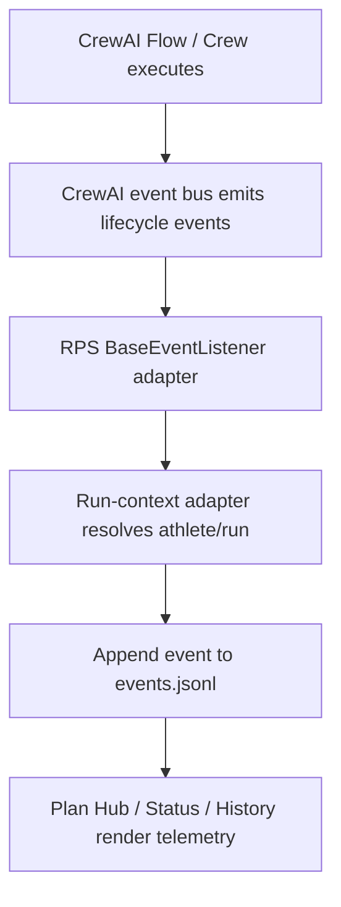

# FEAT: CrewAI Event Listener Runtime Telemetry

* **ID:** FEAT_crewai_event_listener_runtime_telemetry
* **Status:** Implemented
* **Owner/Area:** Runtime / UI
* **Last-Updated:** 2026-05-12
* **Related:** ADR-040

---

## 1) Context / Problem

**Current behavior**

* RPS writes runtime telemetry into the run-store with manual `emit_runtime_event(...)` calls spread across Flow, Crew, and Coach execution paths.

**Problem**

* This is not aligned with CrewAI's native observability model.
* It duplicates lifecycle semantics that CrewAI already emits centrally through its event bus and listeners.
* It increases maintenance cost whenever Flow/Crew execution changes.

**Constraints**

* Run-store remains the UI-facing source of truth.
* No dependency on CrewAI AMP/cloud tracing for core local observability.
* Telemetry must remain best-effort and must not block planning execution.

---

## 2) Goals & Non-Goals

**Goals**

* [x] Replace most manual Flow/Crew telemetry with a central CrewAI `BaseEventListener` adapter.
* [x] Preserve the existing run-store as the persistence target for telemetry.
* [x] Keep additive custom RPS events only where CrewAI has no equivalent event (`ARTEFACT_WRITTEN`, optional route markers).

**Non-Goals**

* [ ] Adopt CrewAI AMP as a required telemetry backend.
* [ ] Redesign the run-store schema.

---

## 3) Proposed Behavior

**User/System behavior**

* CrewAI Flow/Crew/Task/Tool lifecycle events are captured through one central listener.
* A per-run context adapter maps those events into the current athlete/run `events.jsonl` file.
* UI pages continue to render the same run-store telemetry, but the source is now CrewAI-native lifecycle events.

**UI impact**

* UI affected: Yes
* If Yes: Plan Hub, System Status, System History continue to show runtime telemetry without behavioral change, but event coverage now includes native CrewAI task/tool timing.

### UI Flow (Mermaid)

**Non-UI behavior (if applicable)**

* Components involved: `crewai_runtime.telemetry`, `crewai_runtime.flows`, `crewai_runtime.coach_chat`, `agents.crewai_backend`.
* Contracts touched: run-store event emission only.

---

## 4) Implementation Analysis

**Components / Modules**

* `src/rps/crewai_runtime/telemetry.py`: central listener, context manager, run-store adapter.
* `src/rps/crewai_runtime/flows.py`: stop emitting most manual Flow events; scope execution with listener context.
* `src/rps/agents/crewai_backend.py`: stop emitting manual Crew lifecycle events; keep only RPS-specific artefact-write events.
* `src/rps/crewai_runtime/coach_chat.py`: stop manual Crew lifecycle emission; rely on listener context.

**Data flow**

* Inputs: CrewAI lifecycle events, run context `(workspace_root, athlete_id, run_id)`.
* Processing: listener maps event classes into stable run-store event types.
* Outputs: additive JSONL telemetry in existing run directories.

**Schema / Artefacts**

* New artefacts: none.
* Changed artefacts: none.
* Validator implications: none.

---

## 5) Impact Analysis (complete)

**Compatibility**

* Backward compatible: Yes
* Breaking changes: none; event type set stays additive and compatible.
* Fallback behavior: if CrewAI event listener import fails, execution still works and explicit RPS custom events still append where used.

**Conflicts with ADRs / Principles**

* Potential conflicts: none; this moves telemetry toward CrewAI-first architecture while keeping RPS UI contracts stable.
* Resolution: ADR-040.

**Impacted areas**

* UI: no layout change required.
* Pipeline/data: lifecycle telemetry source changes from manual emission to CrewAI listener.
* Renderer: unchanged.
* Workspace/run-store: same files, fewer manual write call sites.
* Validation/tooling: unit tests updated for listener registration/context.
* Deployment/config: none.

**Required refactoring**

* Introduce a singleton listener with explicit registration.
* Add context propagation around Flow/Crew kickoff boundaries.
* Remove duplicated manual lifecycle event emission.

---

## 6) Options & Recommendation

### Option A — CrewAI listener + run-store adapter

**Summary**

* Use CrewAI's documented `BaseEventListener` and event bus, then translate events into run-store rows.

**Pros**

* Matches CrewAI architecture.
* Reduces duplicated lifecycle instrumentation.
* Automatically gains broader event coverage.

**Cons**

* Requires careful context propagation because CrewAI events do not know our athlete/run ids.

**Risk**

* If context is missing, events are dropped.

### Option B — keep manual telemetry

**Summary**

* Continue emitting all events manually from Flow/Crew code.

**Pros**

* No dependency on CrewAI internals.

**Cons**

* Not CrewAI-first.
* Duplicates lifecycle semantics and drifts over time.

### Recommendation

* Choose: Option A
* Rationale: this is the correct CrewAI-first observability integration while preserving our existing UI/run-store model.

---

## 7) Acceptance Criteria (Definition of Done)

* [x] A central CrewAI event listener is registered and used.
* [x] Flow/Crew lifecycle writes no longer rely primarily on manual `emit_runtime_event(...)` calls.
* [x] Run-store telemetry still appears for Coach/Season/Phase/Week/Report/Feed-Forward runs.
* [x] Validation passes: `py_compile`, `pytest`, `run_lint.sh`, `run_typecheck.sh`.

---

## 8) Migration / Rollout

**Migration strategy**

* No data migration.
* Existing events remain readable; new runs simply source more lifecycle rows from the listener.

**Rollout / gating**

* Feature flag / config: none.
* Safe rollback: restore manual lifecycle emission and remove listener registration.

---

## 9) Risks & Failure Modes

* Failure mode: CrewAI package/API differs from documented event names.
  * Detection: unit tests and runtime import warnings.
  * Safe behavior: listener setup becomes no-op; core execution continues.
  * Recovery: adjust event-class import map.
* Failure mode: run context missing for nested execution.
  * Detection: missing events in UI/logs.
  * Safe behavior: no crash; event is skipped.
  * Recovery: extend context scope around kickoff boundary.

---

## 10) Observability / Logging

**New/changed events**

* Same run-store event families are preserved, but now mostly sourced from CrewAI lifecycle events.
* `ARTEFACT_WRITTEN` remains RPS-specific and manual.

**Diagnostics**

* `runtime/athletes/<athlete>/runs/<run_id>/events.jsonl`
* listener import/setup warnings in application logs

---

## 11) Documentation Updates

Update these docs as part of implementation:

* [x] `doc/architecture/system_architecture.md` — clarify listener-based telemetry.
* [x] `doc/architecture/agents.md` — note central CrewAI event listener adapter.
* [x] `CHANGELOG.md` — record listener migration.
* [x] `doc/overview/feature_backlog.md` — mark implemented.

---

## 12) Link Map (no duplication; links only)

* Architecture: `doc/architecture/system_architecture.md`
* Agents: `doc/architecture/agents.md`
* ADRs: `doc/adr/ADR-040-crewai-event-listener-runtime-telemetry.md`
