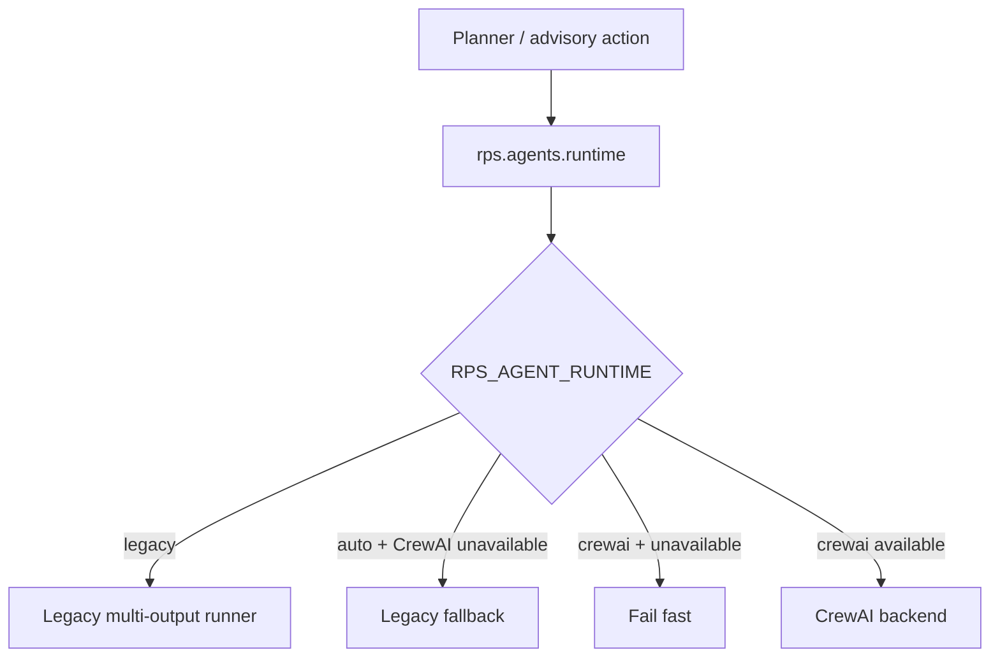

# FEAT: CrewAI Runtime Gateway and Staged Cutover

* **ID:** FEAT_crewai_runtime_cutover
* **Status:** Implemented
* **Owner/Area:** Runtime / Planning
* **Last-Updated:** 2026-05-12
* **Related:** ADR-032

---

## 1) Context / Problem

**Current behavior**

* Planning/advisory orchestrators import `rps.agents.multi_output_runner` directly.
* The repo now contains CrewAI YAML/config foundations, but no single runtime switch point.
* Upstream CrewAI `1.14.4` requires Python `<3.14`, while this repo runs on Python `3.14`.

**Problem**

* Runtime cutover cannot be staged safely while orchestrators are hard-coupled to the legacy runner.
* There is no explicit backend selector or fallback policy.
* Any future CrewAI activation would require another broad refactor before the actual runtime switch.

**Constraints**

* The app must remain runnable on Python `3.14`.
* Existing artefact contracts and guarded-store semantics must remain unchanged.
* User-visible planning/report flows must not regress while the CrewAI execution path remains blocked upstream.

---

## 2) Goals & Non-Goals

**Goals**

* [x] Introduce one canonical runtime gateway for planner/advisory execution.
* [x] Remove direct orchestrator/UI imports of `multi_output_runner`.
* [x] Add explicit backend selection via configuration with safe auto fallback behavior.
* [x] Surface the effective runtime state clearly in the Coach UI and repo docs.

**Non-Goals**

* [ ] Implement a production CrewAI execution bridge in this change.
* [ ] Remove LiteLLM/runtime code paths while CrewAI remains blocked by Python support.
* [ ] Change persisted artefact schemas or workflow semantics.

---

## 3) Proposed Behavior

**User/System behavior**

* All planner/advisory flows route through `rps.agents.runtime`.
* Backend selection is controlled by `RPS_AGENT_RUNTIME`:
  * `auto` (default): use CrewAI only when fully executable; otherwise fall back to legacy.
  * `legacy`: force the current LiteLLM/multi-output runner.
  * `crewai`: require CrewAI and fail fast when it cannot execute.
* While the repo remains on Python `3.14`, `auto` resolves to legacy fallback with an explicit reason.

**UI impact**

* UI affected: Yes
* If Yes: Coach page now shows the effective runtime state (`CrewAI` or `legacy fallback` with reason).

### UI Flow (Mermaid)

**Non-UI behavior**

* Components involved:
  * `src/rps/agents/runtime.py`
  * orchestrators under `src/rps/orchestrator/`
  * `src/rps/ui/shared.py`
  * `src/rps/ui/pages/coach.py`
* Contracts touched:
  * runtime selection only; artefact contracts remain unchanged

---

## 4) Implementation Analysis

**Components / Modules**

* `rps.agents.runtime`: new unified runtime gateway and backend selector.
* Orchestrators/UI helpers: now import the gateway instead of the legacy runner directly.
* Coach UI: shows the effective runtime and fallback reason.

**Data flow**

* Inputs: backend env var, CrewAI compatibility status, existing runtime args.
* Processing:
  * resolve backend selection
  * run legacy backend in `auto` fallback / `legacy`
  * fail fast for explicit unsupported `crewai`
* Outputs:
  * unchanged planner/advisory result payloads
  * explicit runtime status for UI and diagnostics

**Schema / Artefacts**

* New artefacts: none
* Changed artefacts: none
* Validator implications: none

---

## 5) Impact Analysis (complete)

**Compatibility**

* Backward compatible: Yes
* Breaking changes:
  * direct imports of `multi_output_runner` are replaced in orchestrators/UI helpers
* Fallback behavior:
  * `auto` falls back to legacy with an explicit reason when CrewAI cannot execute

**Conflicts with ADRs / Principles**

* Potential conflicts:
  * ADR-025 described CrewAI as phase-2 after LiteLLM/Qdrant abstraction work
* Resolution:
  * this change keeps that constraint and only introduces the switch point needed for staged activation

**Impacted areas**

* UI: Coach now exposes runtime status
* Pipeline/data: unchanged
* Renderer: unchanged
* Workspace/run-store: unchanged
* Validation/tooling: new runtime selector tests
* Deployment/config: new `RPS_AGENT_RUNTIME` env var

**Required refactoring**

* Replace orchestrator/UI imports of `multi_output_runner`
* Centralize runtime selection/fallback policy

---

## 6) Options & Recommendation

### Option A — Runtime gateway with staged activation

**Summary**

* Introduce a central runtime gateway now, keep legacy execution as the effective backend until CrewAI can run.

**Pros**

* Removes broad call-site coupling immediately.
* Keeps the repo runnable on Python `3.14`.
* Makes later CrewAI activation a smaller, contained change.

**Cons**

* Not a full production CrewAI cutover yet.

**Risk**

* Users may overestimate current CrewAI execution readiness if the fallback state is not shown clearly.

### Option B — Wait for Python baseline change, then cut over directly

**Summary**

* Defer all refactoring until the interpreter changes.

**Pros**

* Less intermediate architecture.

**Cons**

* Leaves current runtime coupling in place and increases future cutover cost.

### Recommendation

* Choose: Option A
* Rationale: it moves the codebase to a single switch point now without breaking the active app.

---

## 7) Acceptance Criteria (Definition of Done)

* [x] All planner/advisory orchestrators import the unified runtime gateway instead of `multi_output_runner`.
* [x] `RPS_AGENT_RUNTIME` supports `auto|legacy|crewai`.
* [x] `auto` falls back to legacy on Python `3.14` with an explicit reason.
* [x] Coach page shows the effective runtime state.
* [x] Validation passes: `py_compile`, targeted pytest, lint, typecheck.

---

## 8) Migration / Rollout

**Migration strategy**

* No artefact migration required.
* Runtime selection defaults to `auto`, which preserves current behavior on Python `3.14`.

**Rollout / gating**

* Feature flag / config: `RPS_AGENT_RUNTIME`
* Safe rollback: set `RPS_AGENT_RUNTIME=legacy`

---

## 9) Risks & Failure Modes

* Failure mode: explicit `RPS_AGENT_RUNTIME=crewai` on Python `3.14`
  * Detection: startup/runtime error with clear reason
  * Safe behavior: fail fast rather than silently switching backends
  * Recovery: use `auto` or `legacy`, or move to Python `<3.14`

* Failure mode: hidden call sites still import legacy runtime directly
  * Detection: search/tests
  * Safe behavior: none; this is a code hygiene failure
  * Recovery: move remaining imports to the gateway

---

## 10) Observability / Logging

**New/changed events**

* `rps.agents.runtime` now centralizes runtime selection and fallback reason.

**Diagnostics**

* Coach page caption shows effective backend and fallback reason.
* `RPS_AGENT_RUNTIME=crewai` surfaces explicit incompatibility instead of silent fallback.

---

## 11) Documentation Updates

Update these docs as part of implementation:

* [x] `doc/overview/feature_backlog.md` — note the runtime gateway state and deferred Python-baseline activation work
* [x] `doc/adr/README.md` — add ADR-032
* [x] `CHANGELOG.md` — record the gateway/cutover step

---

## 12) Link Map (no duplication; links only)

* Architecture: `doc/architecture/system_architecture.md`
* Workspace: `doc/architecture/workspace.md`
* Validation / runbooks: `AGENTS.md`
* ADRs: `doc/adr/ADR-025-multi-provider-runtime-and-local-vectorstore.md`, `doc/adr/ADR-031-active-coach-and-crewai-foundation.md`, `doc/adr/ADR-032-crewai-runtime-gateway-and-staged-activation.md`

---

## Out of Scope / Deferred

* Production CrewAI execution bridge
* Python baseline move to `<3.14`
* Removal of legacy LiteLLM/runtime modules
