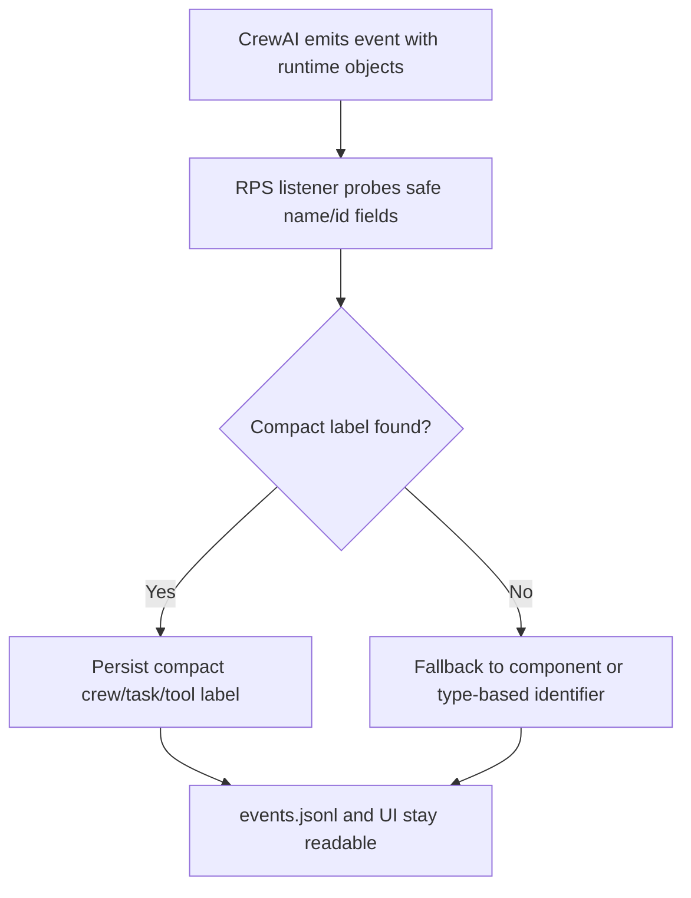

# FEAT: CrewAI Runtime Event Payload Cleanup

* **ID:** FEAT_crewai_runtime_event_payload_cleanup
* **Status:** Implemented
* **Owner/Area:** Runtime / UI
* **Last-Updated:** 2026-05-12
* **Related:** ADR-041

---

## 1) Context / Problem

**Current behavior**

* RPS now persists CrewAI-native Flow/Crew/Task/Tool events into `events.jsonl`.
* Event rows use direct event/object stringification for some payload fields.

**Problem**

* `CREW_TASK_*` can store the full injected task prompt instead of a compact identifier.
* `CREW_*` can collapse to a generic `crew` label.
* Telemetry becomes noisy in Plan Hub, Status, History, and direct `events.jsonl` inspection.

**Constraints**

* Keep the current run-store file format and event types.
* Do not depend on provider-specific CrewAI internals beyond safe attribute probing.
* Telemetry must remain best-effort and must never block execution.

---

## 2) Goals & Non-Goals

**Goals**

* [x] Normalize `crew`, `task`, and `tool` payload labels into compact, human-usable values.
* [x] Prevent prompt-sized task descriptions from being persisted into run telemetry.
* [x] Preserve compatibility with the existing `events.jsonl` UI rendering.

**Non-Goals**

* [ ] Redesign event ordering semantics.
* [ ] Change run-store schema or add new persisted telemetry files.

---

## 3) Proposed Behavior

**User/System behavior**

* Runtime telemetry keeps the same event families.
* `CREW_*` prefers a meaningful crew label and falls back to the current run component when CrewAI only exposes a generic `crew` token.
* `CREW_TASK_*` stores a compact identifier such as `Task#<id>` or a short task name instead of full prompt text.
* `TOOL_*` stores a compact tool name resolved from safe name/id fields.

**UI impact**

* UI affected: Yes
* If Yes: Plan Hub, System Status, and System History now show compact event labels instead of prompt dumps.

### UI Flow (Mermaid)

**Non-UI behavior (if applicable)**

* Components involved: `src/rps/crewai_runtime/telemetry.py`, `tests/test_crewai_runtime.py`.
* Contracts touched: run-store event payload quality only.

---

## 4) Implementation Analysis

**Components / Modules**

* `src/rps/crewai_runtime/telemetry.py`: add compact-label helpers for CrewAI runtime objects.
* `tests/test_crewai_runtime.py`: add regression coverage for generic crew names and giant task descriptions.

**Data flow**

* Inputs: CrewAI event objects and optional source objects.
* Processing: safe attribute probing, whitespace compaction, length capping, generic-name fallback.
* Outputs: unchanged event rows with better `crew`, `task`, and `tool` field values.

**Schema / Artefacts**

* New artefacts: none.
* Changed artefacts: none.
* Validator implications: none.

---

## 5) Impact Analysis (complete)

**Compatibility**

* Backward compatible: Yes
* Breaking changes: none; event rows stay additive and field names do not change.
* Fallback behavior: unresolved labels fall back to component name, object id, or type name.

**Conflicts with ADRs / Principles**

* Potential conflicts: none.
* Resolution: aligned with ADR-040 and clarified in ADR-041.

**Impacted areas**

* UI: telemetry tables become readable again.
* Pipeline/data: unchanged.
* Renderer: unchanged.
* Workspace/run-store: same event files, cleaner payload content.
* Validation/tooling: unit tests add regression coverage.
* Deployment/config: none.

**Required refactoring**

* Stop stringifying arbitrary CrewAI task objects for telemetry.
* Centralize compact label resolution in the listener adapter.

---

## 6) Options & Recommendation

### Option A — compact safe attribute probing

**Summary**

* Read a narrow set of stable attrs (`name`, `id`, `role`, `tool_name`) and fall back to component/type labels.

**Pros**

* Fixes the observed payload issue directly.
* Keeps the current schema and listener design.
* Avoids prompt leakage into telemetry.

**Cons**

* Some runs may still show generic type-based fallback labels if CrewAI exposes little metadata.

**Risk**

* Attribute coverage may need small follow-up tuning if CrewAI changes object shape.

### Option B — keep raw event payloads and trim only in UI

**Summary**

* Persist current raw values and rely on renderer truncation.

**Pros**

* Minimal runtime change.

**Cons**

* Raw `events.jsonl` remains polluted.
* Prompt-sized payloads still hit storage and diagnostics.

### Recommendation

* Choose: Option A
* Rationale: the problem is in persistence quality, not only display.

---

## 7) Acceptance Criteria (Definition of Done)

* [x] `CREW_TASK_*` no longer stores full prompt text when only a task object is available.
* [x] Generic crew labels can resolve to a meaningful component fallback.
* [x] Existing event types and file layout remain unchanged.
* [x] Validation passes: `py_compile`, targeted `pytest`, `run_lint.sh`, `run_typecheck.sh`.

---

## 8) Migration / Rollout

**Migration strategy**

* No migration; only newly written events get cleaner payloads.

**Rollout / gating**

* Feature flag / config: none.
* Safe rollback: restore prior stringification behavior.

---

## 9) Risks & Failure Modes

* Failure mode: CrewAI event/source objects expose none of the probed attributes.
  * Detection: fallback labels like `Task` or type names in `events.jsonl`.
  * Safe behavior: compact generic fallback, never full prompt text.
  * Recovery: extend attribute probe list.
* Failure mode: tool/crew labels exceed practical UI width.
  * Detection: noisy telemetry rows.
  * Safe behavior: whitespace compaction and max-length truncation.
  * Recovery: adjust caps centrally in telemetry helper.

---

## 10) Observability / Logging

**New/changed events**

* No new event types.
* `CREW_*`, `CREW_TASK_*`, and `TOOL_*` now persist normalized compact labels.

**Diagnostics**

* `runtime/athletes/<athlete_id>/runs/<run_id>/events.jsonl`
* Plan Hub / System Status / System History telemetry tables

---

## 11) Documentation Updates

Update these docs as part of implementation:

* [x] `doc/architecture/system_architecture.md` — mention compact normalized runtime labels.
* [x] `doc/architecture/agents.md` — note listener payload normalization.
* [x] `doc/overview/feature_backlog.md` — mark implemented.
* [x] `doc/adr/README.md` — index ADR-041.
* [x] `CHANGELOG.md` — record telemetry payload cleanup.

---

## 12) Link Map (no duplication; links only)

* Architecture: `doc/architecture/system_architecture.md`
* Agents: `doc/architecture/agents.md`
* ADRs: `doc/adr/ADR-040-crewai-event-listener-runtime-telemetry.md`
* ADRs: `doc/adr/ADR-041-crewai-runtime-event-payload-cleanup.md`
