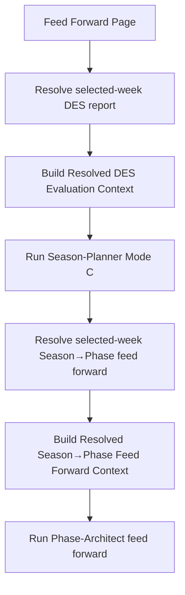

# FEAT: Feed-Forward Resolved Context Injection

* **ID:** FEAT_feed_forward_resolved_context
* **Status:** Implemented
* **Owner/Area:** UI / Performance / Agent orchestration
* **Last-Updated:** 2026-04-27

---

## 1) Context / Problem

**Current behavior**

* The Feed Forward page triggers:
  * `SEASON_PHASE_FEED_FORWARD`
  * `PHASE_FEED_FORWARD`
* The agents are told which selected-week artefacts to use, but they still need to rediscover key facts through workspace tools.

**Problem**

* `season_planner` Mode C could STOP even though the selected-week `DES_ANALYSIS_REPORT` exists, because the prompt did not bind an explicit load step for that artefact.
* `phase_architect` feed-forward runs depended on `SEASON_PHASE_FEED_FORWARD` being found through prompt/tool interpretation instead of receiving resolved selected-week context directly.

**Constraints**

* No schema changes.
* Selected-week artefacts remain authoritative.
* Workspace tools stay available for traceability and fallback detail reads.

---

## 2) Goals & Non-Goals

**Goals**

* [x] Inject a resolved selected-week DES evaluation context into Feed Forward agent runs.
* [x] Inject a resolved selected-week Season→Phase Feed Forward context into Phase→Week Feed Forward runs.
* [x] Make the Mode C prompt load order explicitly include selected-week `DES_ANALYSIS_REPORT`.

**Non-Goals**

* [x] No redesign of feed-forward schemas.
* [x] No changes to DES analysis generation itself.

---

## 3) Proposed Behavior

**User/System behavior**

* The Feed Forward page resolves the selected-week DES report and Season→Phase feed-forward payloads in code.
* The page injects compact authoritative context blocks into the agent input.
* Agents may still use workspace tools, but they no longer need to guess or reconstruct obvious selected-week feed-forward facts.

**UI impact**

* UI affected: Yes
* If Yes: `Analyse -> Feed Forward`

### UI Flow (Mermaid)

**Non-UI behavior (if applicable)**

* Components involved:
  * `src/rps/ui/pages/performance/feed_forward.py`
  * `src/rps/ui/feed_forward_context.py`
  * `prompts/agents/season_planner.md`
  * `prompts/agents/phase_architect.md`

---

## 4) Implementation Analysis

**Components / Modules**

* `feed_forward_context.py`: pure helper functions for resolved context blocks
* Feed Forward page: selected-week artefact resolution + block injection
* Prompts: explicit Mode C / feed-forward load-order clarification

**Data flow**

* Inputs:
  * selected-week `DES_ANALYSIS_REPORT`
  * selected-week `SEASON_PHASE_FEED_FORWARD`
  * latest `SEASON_PLAN`
* Processing:
  * resolve selected-week version keys
  * extract authoritative context
  * inject text blocks into agent user input
* Outputs:
  * more deterministic feed-forward agent runs

---

## 5) Impact Analysis (complete)

**Compatibility**

* Backward compatible: Yes
* Breaking changes: none
* Fallback behavior:
  * if selected-week artefact is missing, existing readiness/STOP behavior remains

**Conflicts with ADRs / Principles**

* None

**Impacted areas**

* UI: Feed Forward page run inputs
* Pipeline/data: none
* Renderer: none
* Workspace/run-store: read-only use of existing artefacts
* Validation/tooling: prompt/source tests + pure helper tests

**Required refactoring**

* Move feed-forward context extraction into a pure helper module

---

## 6) Options & Recommendation

### Option A — prompt-only fix

**Pros**

* Minimal diff

**Cons**

* Leaves the agent to rediscover already-known selected-week facts

### Option B — prompt fix plus resolved-context injection

**Pros**

* More deterministic
* Aligns with existing resolved-context direction in the planner stack
* Reduces avoidable STOPs

**Cons**

* Slightly larger change

### Recommendation

* Choose: Option B
* Rationale: selected-week feed-forward context is deterministic and should be resolved in code.

---

## 7) Acceptance Criteria (Definition of Done)

* [x] Feed Forward page injects a resolved DES evaluation block for Season→Phase runs.
* [x] Feed Forward page injects a resolved Season→Phase feed-forward block for Phase→Week runs.
* [x] `season_planner` prompt explicitly loads selected-week `DES_ANALYSIS_REPORT` in Mode C.
* [x] Tests cover resolved block generation and Feed Forward page source assertions.

---

## 8) Migration / Rollout

**Migration strategy**

* None required.

**Rollout / gating**

* No feature flag.

---

## 9) Risks & Failure Modes

* Failure mode: selected-week payload exists but lacks expected fields
  * Detection: helper tests / visible summary degradation
  * Safe behavior: inject partial context and keep workspace tool fallback available

---

## 10) Observability / Logging

**New/changed events**

* None required

**Diagnostics**

* Feed Forward page run logs
* Selected-week artefact tables on the same page

---

## 11) Documentation Updates

* [x] `CHANGELOG.md`
* [x] `doc/specs/features/FEAT_feed_forward_resolved_context.md`

---

## 12) Link Map (no duplication; links only)

* UI flows/actions: `doc/ui/ui_spec.md`
* Architecture: `doc/architecture/system_architecture.md`
* Artefact flow: `doc/overview/artefact_flow.md`
* Validation / runbooks: `doc/runbooks/validation.md`

