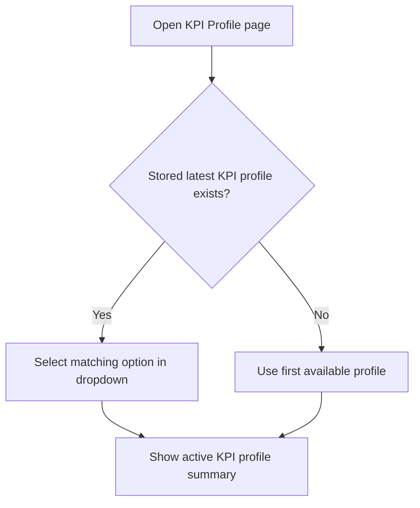

# FEAT: KPI Profile Page Selection Sync

* **ID:** FEAT_kpi_profile_page_selection_sync
* **Status:** Implemented
* **Owner/Area:** Athlete Profile UI
* **Last-Updated:** 2026-03-16
* **Related:** `src/rps/ui/pages/athlete_profile/kpi_profile.py`

---

## 1) Context / Problem

**Current behavior**

* The KPI Profile page lists available profiles in a dropdown.
* The dropdown default is derived from the file list order.

**Problem**

* The page does not reflect the KPI profile currently selected in the athlete workspace.
* Users reopen the page and see an arbitrary profile selected instead of the active one.

**Constraints**

* The stored KPI profile remains the source of truth.
* The page must stay lightweight and avoid new dependencies.

---

## 2) Goals & Non-Goals

**Goals**

* [x] Initialize the KPI Profile dropdown from the stored latest KPI profile when available.
* [x] Show the active KPI profile explicitly on the page.
* [x] Add UI test coverage for the initial selection behavior.

**Non-Goals**

* [x] Changing KPI profile schema or storage layout.
* [x] Introducing a multi-profile comparison workflow.

---

## 3) Proposed Behavior

**User/System behavior**

* When the page loads, the dropdown defaults to the currently selected KPI profile from the workspace.
* The page also shows which KPI profile is currently active.
* If no stored KPI profile exists, the page falls back to the first available bundled profile.

**UI impact**

* UI affected: Yes
* If Yes: `Athlete Profile -> KPI Profile`

### UI Flow (Mermaid)

**Non-UI behavior (if applicable)**

* Components involved: KPI Profile page, `LocalArtifactStore`
* Contracts touched: none

---

## 4) Implementation Analysis

**Components / Modules**

* `src/rps/ui/pages/athlete_profile/kpi_profile.py`: resolve current profile from workspace and initialize the selectbox state.
* `tests/test_plan_pages.py`: verify the saved KPI profile appears as selected on first render.

**Data flow**

* Inputs: bundled KPI profile files, latest stored KPI profile version key
* Processing: map stored version key to selectbox option and render active status text
* Outputs: synchronized dropdown and summary state

**Schema / Artefacts**

* New artefacts: none
* Changed artefacts: none
* Validator implications: none

---

## 5) Impact Analysis

**Compatibility**

* Backward compatible: Yes
* Breaking changes: none
* Fallback behavior: first available KPI profile remains the default when no stored selection exists

**Conflicts with ADRs / Principles**

* Potential conflicts: none
* Resolution: aligns with workspace-as-source-of-truth behavior

**Impacted areas**

* UI: KPI Profile page reflects the current saved selection
* Pipeline/data: none
* Renderer: none
* Workspace/run-store: reads latest KPI profile version key
* Validation/tooling: AppTest coverage added
* Deployment/config: none

**Required refactoring**

* None

---

## 6) Options & Recommendation

### Option A — Initialize from latest stored version key

**Summary**

* Read the stored KPI profile version key and map it to the dropdown option.

**Pros**

* Minimal change surface.
* Uses existing workspace APIs.
* Matches user expectation.

**Cons**

* Requires a small amount of selectbox state synchronization.

### Option B — Persist dropdown choice only in session state

**Summary**

* Restore the last UI choice without reading workspace state.

**Pros**

* Simple local UI implementation.

**Cons**

* Wrong source of truth across sessions and devices.

### Recommendation

* Choose: Option A
* Rationale: the saved KPI profile must drive the page state.

---

## 7) Acceptance Criteria (Definition of Done)

* [x] The KPI Profile dropdown defaults to the saved latest KPI profile on first render.
* [x] The active KPI profile is visible on the page.
* [x] Validation passes: `python3 -m py_compile $(git ls-files '*.py')`
* [x] UI test covers initial selection sync.

---

## 8) Migration / Rollout

**Migration strategy**

* None required.

**Rollout / gating**

* Feature flag / config: none
* Safe rollback: revert page initialization logic

---

## 9) Risks & Failure Modes

* Failure mode: stored version key no longer matches a bundled KPI profile file
* Detection: page falls back to the first available option
* Safe behavior: UI remains usable and selection can be re-saved
* Recovery: resave a valid KPI profile selection

---

## 10) Observability / Logging

**New/changed events**

* No new events

**Diagnostics**

* KPI Profile page render plus workspace `latest/kpi_profile.json`

---

## 11) Documentation Updates

* [x] `doc/specs/features/FEAT_kpi_profile_page_selection_sync.md` - feature record
* [x] `doc/ui/pages/athlete_profile.md` - clarify saved KPI profile is shown as active on page load

---

## 12) Link Map (no duplication; links only)

* UI flows/actions: `doc/ui/flows.md`
* UI contract (Streamlit): `doc/ui/streamlit_contract.md`
* Architecture: `doc/architecture/system_architecture.md`
* Workspace: `doc/architecture/workspace.md`
* Schema versioning: `doc/architecture/schema_versioning.md`
* Logging policy: `doc/specs/contracts/logging_policy.md`
* Validation / runbooks: `doc/runbooks/validation.md`
* ADRs: `doc/adr/ADR-001-ui-delegates-orchestrators.md`
