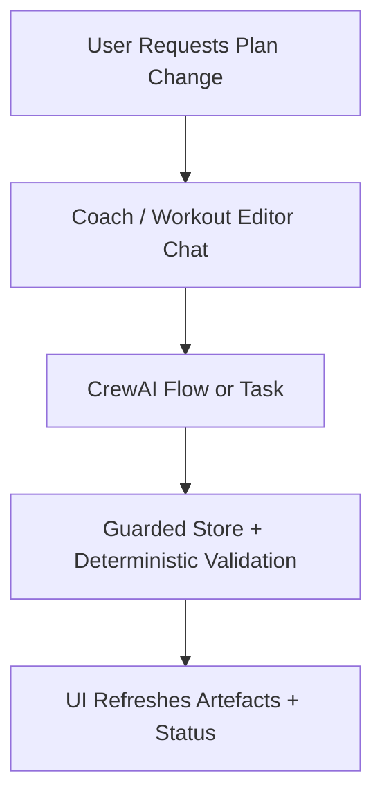

# FEAT: Hard CrewAI Cutover and LiteLLM Runtime Removal

* **ID:** FEAT_litellm_runtime_removal
* **Status:** Implementing
* **Owner/Area:** Runtime / UI / Vectorstore
* **Last-Updated:** 2026-05-12
* **Related:** `doc/specs/features/FEAT_crewai_runtime_cutover.md`, `doc/specs/features/FEAT_coach_crewai_decoupling.md`, `doc/adr/ADR-032-crewai-runtime-gateway-and-staged-activation.md`, `doc/adr/ADR-033-coach-crewai-decoupling-and-direct-provider-config.md`

## 1) Context / Problem

**Current behavior**

* CrewAI is active in the container runtime.
* Active Coach already uses CrewAI.
* Product/runtime code still contains legacy LiteLLM and runner modules.
* Workout Editor still depended on the old `rps_chatbot` transport.
* Qdrant embeddings still depended on `litellm.embedding(...)`.

**Problem**

* The runtime is still hybrid.
* Legacy modules increase maintenance and hide accidental fallback behavior.
* The user requested a hard cutover with no remaining legacy LiteLLM runtime path.

**Constraints**

* No new dependencies.
* Keep artifact contracts strict.
* Keep Streamlit UI stable.
* Persisted planning/advisory tasks must remain typed CrewAI task outputs.

## 2) Goals & Non-Goals

**Goals**

* [ ] Remove product/runtime dependence on LiteLLM.
* [ ] Remove the legacy multi-output runner and old chat transport from active code.
* [ ] Make `rps.agents.runtime` CrewAI-only.
* [ ] Move Workout Editor chat to the same CrewAI-native pattern as Coach.
* [ ] Replace Qdrant embedding calls with direct provider calls.
* [ ] Remove the `litellm` dependency from packaging.

**Non-Goals**

* [ ] Redesign artifact schemas.
* [ ] Change guarded store semantics.
* [ ] Rebuild the full Planner flow topology again.

## 3) Proposed Behavior

* `RPS_AGENT_RUNTIME` supports only CrewAI semantics.
* Planner/advisory execution always routes through CrewAI.
* Workout Editor no longer imports or uses `rps.ui.rps_chatbot`.
* No active module imports `rps.openai.litellm_runtime`.
* No active module imports `rps.agents.multi_output_runner`.
* Vector embeddings use direct provider access via the `openai` package.

### UI Flow (Mermaid)

## 4) Implementation Analysis

* `src/rps/agents/runtime.py`: remove legacy backend selection and fallback.
* `src/rps/agents/crewai_backend.py`: stop importing legacy runner helpers.
* `src/rps/agents/output_normalization.py`: extract reusable deterministic normalization helpers from the old runner.
* `src/rps/ui/pages/plan/workouts.py`: replace `rps_chatbot` with direct CrewAI chat runner.
* `src/rps/vectorstores/qdrant_local.py`: replace `litellm.embedding(...)` with direct OpenAI embeddings calls.
* Remove obsolete modules after imports are gone.

## 5) Impact Analysis

**Compatibility**

* Backward compatible: No.
* Breaking changes: legacy `legacy` runtime mode and LiteLLM-only paths disappear.
* Fallback behavior: none.

**Impacted areas**

* UI: Coach already migrated; Workout Editor now follows.
* Runtime: `multi_output_runner` and old runners removed.
* Vectorstore: embeddings no longer route through LiteLLM.
* Config: `RPS_AGENT_RUNTIME` no longer accepts `legacy` as a valid production mode.

## 6) Options & Recommendation

### Option A (recommended) — Hard cutover now

* Remove legacy runtime code and dependency immediately.
* Pros: clean architecture, no hidden fallback.
* Cons: larger refactor in one change.

### Option B — Keep legacy as hidden backup

* Pros: easier rollback.
* Cons: contradicts the requested architecture and preserves drift.

### Recommendation

* Choose: Option A.

## 7) Acceptance Criteria

* [ ] No active runtime/UI code imports `rps.openai.litellm_runtime`.
* [ ] No active runtime/UI code imports `rps.agents.multi_output_runner`.
* [ ] Workout Editor chat no longer imports `rps.ui.rps_chatbot`.
* [ ] `litellm` removed from dependency manifests.
* [ ] Syntax, lint, typecheck, and targeted CrewAI/UI tests pass.

## 8) Migration / Rollout

* No feature flag.
* Hard cutover only.
* Rollback is by git revert.

## 9) Risks & Failure Modes

* Risk: CrewAI-only paths expose hidden assumptions previously covered by the old runner.
* Detection: failing targeted plan/report/editor tests and container smoke runs.
* Safe behavior: fail fast; do not silently fall back.

## 10) Observability / Logging

* Runtime selection must log only CrewAI activation or explicit failure.
* Worker polling must not imply legacy response retrieval support.

## 11) Documentation Updates

* [ ] `CHANGELOG.md`
* [ ] `doc/overview/feature_backlog.md`
* [ ] `doc/adr/README.md`
* [ ] `doc/specs/features/FEAT_crewai_runtime_cutover.md`

## 12) Link Map

* UI contract: `doc/ui/streamlit_contract.md`
* Architecture: `doc/architecture/system_architecture.md`
* Artefact flow: `doc/overview/artefact_flow.md`
* Runtime cutover feature: `doc/specs/features/FEAT_crewai_runtime_cutover.md`
