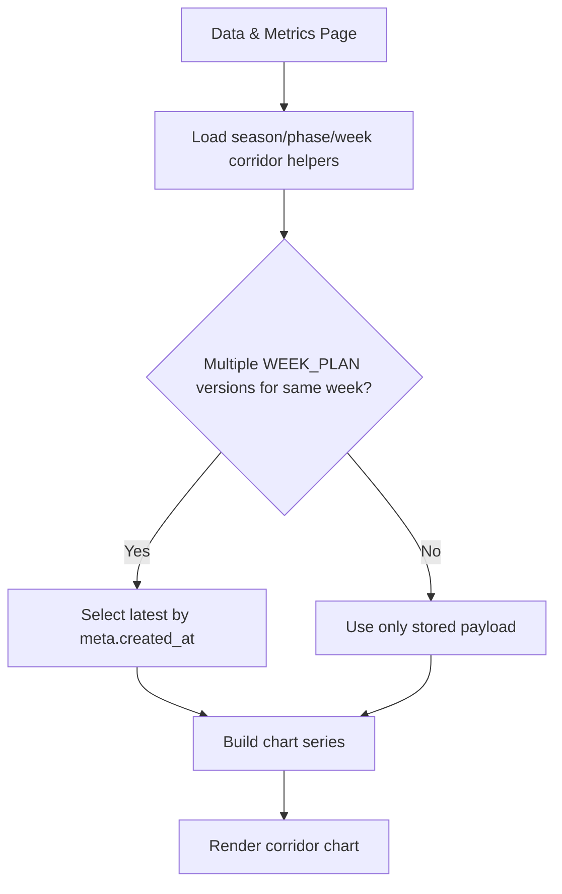

# FEAT: Performance Corridor Latest Week Versions

* **ID:** FEAT_performance_corridor_latest_week_versions
* **Status:** Implemented
* **Owner/Area:** UI / Performance
* **Last-Updated:** 2026-04-24
* **Related:** `doc/specs/features/FEAT_resolved_planner_context_expansion.md`

---

## 1) Context / Problem

**Current behavior**

* The Performance corridor chart reads week-scoped plan series from all stored `WEEK_PLAN` versions.
* When multiple reruns exist for the same ISO week, later reads overwrite earlier ones only by incidental file/version iteration order.

**Problem**

* The chart can surface stale week-plan corridors or stale planned kJ values for a week when multiple historical `WEEK_PLAN` versions exist.
* This makes the chart less trustworthy even when artefact creation is correct.

**Constraints**

* No schema changes.
* Must remain backward compatible with older payloads missing `created_at`.
* Logic should stay deterministic and testable outside Streamlit page code.

---

## 2) Goals & Non-Goals

**Goals**

* [x] Use only the latest relevant `WEEK_PLAN` version per ISO week for chart series.
* [x] Keep `planned_weekly_kj` and `week_plan_corridor` derived from the same authoritative week payload.

**Non-Goals**

* [x] No changes to planning artefact generation.
* [x] No changes to chart styling or rendering semantics beyond source selection.

---

## 3) Proposed Behavior

**User/System behavior**

* The corridor chart always uses the newest stored `WEEK_PLAN` payload per ISO week when plotting:
  * week-plan min/max corridor
  * planned weekly kJ

**UI impact**

* UI affected: Yes
* If Yes: `Analyse -> Data & Metrics`, corridor overview chart

### UI Flow (Mermaid)

**Non-UI behavior (if applicable)**

* Components involved: `src/rps/ui/performance_corridors.py`, `src/rps/ui/pages/performance/data_metrics.py`
* Contracts touched: none

---

## 4) Implementation Analysis

**Components / Modules**

* `src/rps/ui/performance_corridors.py`: resolve latest `WEEK_PLAN` payload per ISO week
* `src/rps/ui/pages/performance/data_metrics.py`: consume normalized helper outputs

**Data flow**

* Inputs: stored `WEEK_PLAN` artefacts
* Processing: group by ISO week, pick latest `created_at`, derive corridor/planned-kJ series
* Outputs: chart-ready dicts keyed by canonical `YYYY-Www`

**Schema / Artefacts**

* New artefacts: none
* Changed artefacts: none
* Validator implications: none

---

## 5) Impact Analysis (complete)

**Compatibility**

* Backward compatible: Yes
* Breaking changes: none
* Fallback behavior: payloads without `created_at` sort as oldest

**Conflicts with ADRs / Principles**

* Potential conflicts: none
* Resolution: n/a

**Impacted areas**

* UI: corridor chart data source selection
* Pipeline/data: none
* Renderer: none
* Workspace/run-store: read-only
* Validation/tooling: new regression tests
* Deployment/config: none

**Required refactoring**

* Centralize latest-per-week resolution for week-plan chart inputs

---

## 6) Options & Recommendation

### Option A — latest-per-week resolver

**Summary**

* Resolve the newest `WEEK_PLAN` payload per ISO week using `meta.created_at`.

**Pros**

* Deterministic
* Matches how users interpret “current plan for this week”
* Reusable for multiple chart series

**Cons**

* Requires explicit fallback for legacy payloads missing timestamps

**Risk**

* Low

### Option B — keep current implicit overwrite order

**Summary**

* Continue reading all versions and rely on iteration order.

**Pros**

* No code changes

**Cons**

* Not deterministic enough
* Can show stale data

### Recommendation

* Choose: Option A
* Rationale: chart source selection should be explicit and reproducible.

---

## 7) Acceptance Criteria (Definition of Done)

* [x] `week_plan_corridor_by_week(...)` uses the latest `WEEK_PLAN` payload per ISO week.
* [x] `planned_weekly_kj_by_week(...)` uses the same latest payload set.
* [x] Regression tests cover duplicate week versions and missing `created_at`.
* [x] Validation passes: `py_compile`, `ruff`, targeted pytest.
* [x] No regressions in `Data & Metrics` page render smoke test.

---

## 8) Migration / Rollout

**Migration strategy**

* None; read-path only.

**Rollout / gating**

* Feature flag / config: none
* Safe rollback: revert helper changes

---

## 9) Risks & Failure Modes

* Failure mode: malformed `created_at`
  * Detection: test coverage and logs if page renders unexpected values
  * Safe behavior: treat malformed/missing timestamp as oldest
  * Recovery: fix offending payload or rerun planning

---

## 10) Observability / Logging

**New/changed events**

* None

**Diagnostics**

* Inspect stored `WEEK_PLAN` versions and compare against chart output on `Analyse -> Data & Metrics`

---

## 11) Documentation Updates

Update these docs as part of implementation:

* [x] `CHANGELOG.md` — note latest-per-week corridor source selection
* [x] `doc/specs/features/FEAT_performance_corridor_latest_week_versions.md` — canonical feature note

---

## 12) Link Map (no duplication; links only)

* UI flows/actions: `doc/ui/ui_spec.md`
* UI contract (Streamlit): `doc/ui/streamlit_contract.md`
* Architecture: `doc/architecture/system_architecture.md`
* Workspace: `doc/architecture/workspace.md`
* Schema versioning: `doc/architecture/schema_versioning.md`
* Validation / runbooks: `doc/runbooks/validation.md`

