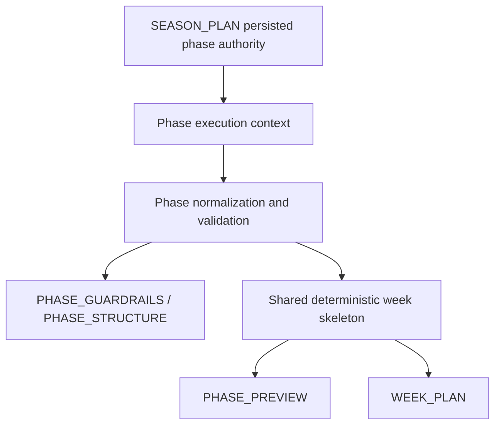

# Feature: Phase Authority Realignment and Shared Week Skeleton

* **ID:** FEAT_phase_authority_realignment_and_shared_week_skeleton
* **Status:** Implemented
* **Owner/Area:** Planning Runtime
* **Last-Updated:** 2026-05-29
* **Related:** ADR-058

---

## 1) Context / Problem

**Current behavior**

* Phase planning inherited the full selected-scenario contract from Season.
* Phase guardrails and structure could re-derive exact weekly kJ bands from S5/load feasibility context.
* Phase preview could emit day-role/domain shapes that were not guaranteed to match Week planning.

**Problem**

* Scenario-level posture was being treated as if it directly authorized exact phase legality.
* Exact phase week bands were silently rewritten downstream.
* Preview and Week could drift semantically even when both looked structurally valid.

**Constraints**

* Fix must remain generic and athlete-independent.
* Objective mismatch remains warning-only.
* Existing Season plans with legacy string `role_week_load_bands` must remain readable.
* No new dependencies.

---

## 2) Goals & Non-Goals

**Goals**

* [x] Make persisted Season phase authority the exact source for downstream Phase legality and week bands.
* [x] Make deterministic Phase execution context expose exact legality, exact role-week load bands, and phase-local objective.
* [x] Align Preview and Week through one shared deterministic week skeleton.
* [x] Keep legacy Season plans readable while new writes use structured `role_week_load_bands`.
* [x] Harden validation, normalization, snapshots, and active planning files to the same authority split.

**Non-Goals**

* [x] No athlete-specific exception logic.
* [x] No objective auto-rewrite; objective mismatch remains warning-only.
* [x] No broad redesign of unrelated artifact schemas or runtime models.

---

## 3) Proposed Behavior

**User/System behavior**

* `selected_scenario_contract` remains a season-wide posture ceiling only.
* `SEASON_PLAN.data.phases[]` now carries exact phase legality and exact structured `role_week_load_bands`.
* `phase_execution_context` projects the persisted Season phase authority directly.
* `PHASE_GUARDRAILS` and `PHASE_STRUCTURE` preserve exact inherited legality and exact inherited week bands.
* `PHASE_PREVIEW` and `WEEK_PLAN` derive day-role/domain shape from the same deterministic week skeleton.
* Preview remains derived and concrete, but it may not add freedom beyond the shared skeleton.

**UI impact**

* UI affected: Yes
* If Yes: rendered Season/Phase/Preview surfaces now consume structured role-week bands and stricter Preview semantics.

### UI Flow (Mermaid)

**Non-UI behavior**

* Components involved:
  * `src/rps/agents/crewai_backend.py`
  * `src/rps/planning/deterministic_context.py`
  * `src/rps/agents/output_normalization.py`
  * `src/rps/planning/week_engine.py`
  * `src/rps/planning/contracts.py`
  * `src/rps/crewai_runtime/guardrails.py`
  * `src/rps/orchestrator/context_snapshots.py`
* Contracts touched:
  * `SEASON_PLAN`
  * `PHASE_GUARDRAILS`
  * `PHASE_STRUCTURE`
  * `PHASE_PREVIEW`
  * `WEEK_PLAN`

---

## 4) Implementation Analysis

**Components / Modules**

* `phase_authority.py`: shared parsing/formatting of role-week load bands plus shared week-skeleton derivation.
* `crewai_backend.py`: Season and Phase normalization now write and inherit exact structured authority.
* `deterministic_context.py`: exact phase legality, exact role-week bands, phase-local objective, warning-only objective mismatch, and target week skeleton.
* `output_normalization.py`: code-owned projection of exact phase authority and shared Preview skeleton semantics.
* `contracts.py` and `guardrails.py`: exact-authority validation and synthetic bundle assembly.
* `week_engine.py`: consumes shared target-week skeleton for day-role/domain allocation.
* prompts/tasks: active Phase files now explicitly distinguish scenario posture ceiling from exact phase authority.

**Data flow**

* Inputs:
  * persisted `SEASON_PLAN`
  * selected/inherited scenario contract
  * phase slot / execution context
  * availability and Phase artifacts
* Processing:
  * normalize legacy or structured role-week bands
  * project exact phase legality and exact week bands into deterministic context
  * derive shared deterministic week skeleton
  * validate persisted Phase and Week outputs against exact authority
* Outputs:
  * structured `role_week_load_bands` in new Season writes
  * exact-authority-aligned Phase artifacts
  * Preview and Week aligned on day-role/domain shape

**Schema / Artefacts**

* Changed artefacts:
  * `SEASON_PLAN`: phase `role_week_load_bands` now structured on new writes
* Validator implications:
  * Phase legality and week bands are now checked against exact phase authority
  * Preview and Week use shared skeleton checks

---

## 5) Impact Analysis (complete)

**Compatibility**

* Backward compatible: Yes, for reads
* Breaking changes: new Season writes now use structured `role_week_load_bands`
* Fallback behavior:
  * legacy string bands are parsed into structured internal form
  * unparsable legacy bands fail clearly; no silent S5 fallback as authority

**Conflicts with ADRs / Principles**

* Potential conflicts:
  * writer-stage repair ownership
  * scenario-level authority widening
* Resolution:
  * aligned with ADR-056 upstream-first planning pipeline
  * formalized further in ADR-058

**Impacted areas**

* UI: Phase/Preview rendering consumes stricter structured data
* Pipeline/data: exact phase authority is persisted and projected deterministically
* Renderer: structured Preview/phase context remains renderable
* Workspace/run-store: snapshots and read surfaces expose exact authority
* Validation/tooling: schema bundling, exact-authority checks, shared skeleton checks
* Deployment/config: no new config or dependency

**Required refactoring**

* central role-week band parsing/formatting helper
* deterministic Phase authority projection
* Preview/Week shared week-skeleton derivation

---

## 6) Options & Recommendation

### Option A — Prompt-only correction

**Summary**

* Keep runtime structures broad and try to teach planners not to widen authority.

**Pros**

* Smaller immediate code diff

**Cons**

* Leaves exact authority ambiguous
* Keeps drift paths in normalization, validation, and writer stages

**Risk**

* Same failure class reappears under different prompt wording

### Option B — Code-owned authority realignment plus prompt hardening

**Summary**

* Persist exact Season phase authority, project it deterministically, and let prompts consume it.

**Pros**

* Deterministic, testable, and generic
* Removes silent authority drift
* Keeps Preview and Week aligned from one source

**Cons**

* Touches schema, runtime models, normalization, validation, prompts, and docs

### Recommendation

* Choose: Option B
* Rationale: the defect was fundamentally an authority-chain bug, not a wording problem.

---

## 7) Acceptance Criteria (Definition of Done)

* [x] New Season writes use structured `role_week_load_bands`.
* [x] Legacy string-band Season plans remain readable through normalization.
* [x] `phase_execution_context` exposes exact legality, exact role-week load bands, phase-local objective, and objective warning.
* [x] Phase normalization and validation preserve exact phase legality and exact week bands instead of re-sourcing them from S5.
* [x] Preview enforces `REST -> NONE/NONE` and `RECOVERY -> RECOVERY`.
* [x] Preview and Week align on day-role/domain shape via shared deterministic week skeleton.
* [x] Validation passes:
  * `python3 scripts/check_schema_required.py`
  * `python3 scripts/bundle_schemas.py`
  * targeted pytest suites
* [x] No regressions in Season/Phase/Preview/Week contract tests.

---

## 8) Migration / Rollout

**Migration strategy**

* Read path supports legacy string `role_week_load_bands`.
* New Season writes always emit structured entries.
* No batch workspace migration required.

**Rollout / gating**

* Feature flag / config: none
* Safe rollback: revert code and schema together; legacy reads remain tolerant

---

## 9) Risks & Failure Modes

* Failure mode: legacy string bands are malformed
  * Detection: deterministic contract/normalization failure
  * Safe behavior: fail clearly; do not infer exact authority from S5
  * Recovery: repair or regenerate the Season plan

* Failure mode: Preview or Week diverges from shared skeleton
  * Detection: validation/test failure
  * Safe behavior: block persistence or replan
  * Recovery: fix planner/normalizer or regenerate downstream artifacts

---

## 10) Observability / Logging

**New/changed events**

* No new event family added.
* Existing deterministic context and guarded-store logs now reflect exact phase authority checks more directly.

**Diagnostics**

* check `phase_execution_context` render blocks
* check normalized Phase artifacts
* check contract-validation failures in guarded-store/runtime logs

---

## 11) Documentation Updates

* [x] `doc/specs/features/FEAT_phase_authority_realignment_and_shared_week_skeleton.md` — canonical feature spec
* [x] `doc/adr/ADR-058-phase-authority-chain-and-shared-week-skeleton.md` — architecture decision
* [x] `doc/overview/feature_backlog.md` — implemented status
* [x] `CHANGELOG.md` — release notes

## 12) Link Map

* [System Architecture](../../architecture/system_architecture.md)
* [Artefact Flow](../../overview/artefact_flow.md)
* [How To Plan](../../overview/how_to_plan.md)
* [ADR-056 Upstream-First Planning Pipeline](../../adr/ADR-056-upstream-first-planning-pipeline.md)
* [Feature Template](./FEAT_TEMPLATE.md)
