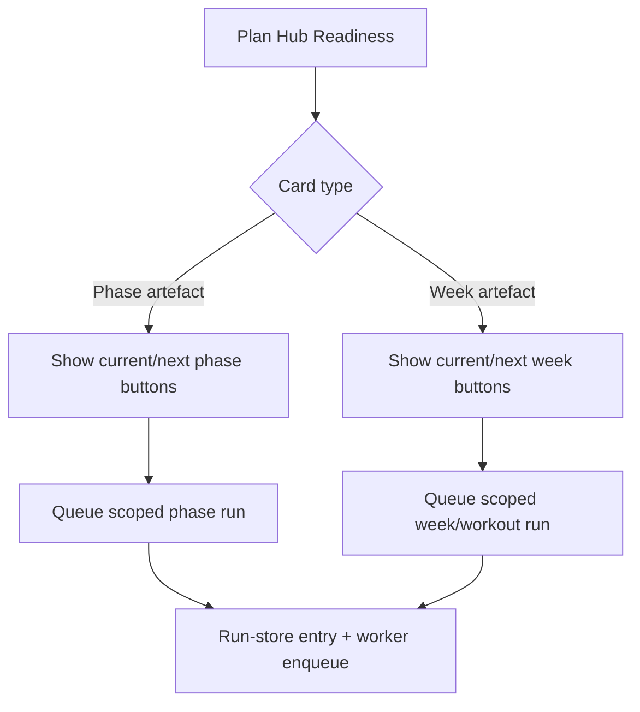

# FEAT: Plan Hub Direct Step Actions

* **ID:** FEAT_plan_hub_direct_step_actions
* **Status:** Implemented
* **Owner/Area:** Plan Hub UI
* **Last-Updated:** 2026-04-13
* **Related:** `src/rps/ui/pages/plan/hub.py`, `tests/test_plan_pages.py`

---

## 1) Context / Problem

**Current behavior**

* Plan Hub shows readiness cards for phase, week, and workout artefacts.
* Action buttons exist only for season-level steps.
* Users must rely on `Run scoped` or `Run orchestrated` to regenerate phase/week/workout outputs.

**Problem**

* `Run scoped` and `Run orchestrated` are not reliable enough for quick corrective actions.
* The readiness cards do not expose direct actions for the current or next relevant planning target.
* Users cannot trigger phase/week-specific reruns from the place where stale or missing state is already visible.

**Constraints**

* Planning must remain limited to the current or next ISO week.
* Direct actions must keep using the run-store and worker pipeline instead of bypassing the orchestrator path.
* Existing override-required semantics for modifying ready artefacts must stay in place for the general scoped-run form.

---

## 2) Goals & Non-Goals

**Goals**

* [x] Add direct action buttons on Plan Hub readiness cards for `Phase Guardrails`, `Phase Structure`, `Phase Preview`, `Week Plan`, and `Build Workouts`.
* [x] Allow users to trigger runs for the current and next valid phase/week target from those cards.
* [x] Reuse the existing queue/worker execution path so behavior stays consistent with other Plan Hub runs.

**Non-Goals**

* [x] Redesigning the full Run Planning panel.
* [x] Expanding planning beyond the current or next ISO week.

---

## 3) Proposed Behavior

**User/System behavior**

* Each affected readiness card exposes one or two direct action buttons:
  * current target
  * next target, when the next ISO week is in scope and maps to a valid season phase
* Phase actions queue the corresponding scoped phase run.
* Week actions queue the corresponding scoped week or workout run.
* Direct card actions act as explicit rerun intent and therefore do not require additional override text.
* Button clicks create regular Plan Hub run records and start the worker through the existing scheduler helper.

**UI impact**

* UI affected: Yes
* If Yes: `Plan -> Plan Hub` readiness expanders for phase/week/workout steps

### UI Flow (Mermaid)

**Non-UI behavior (if applicable)**

* Components involved: `src/rps/ui/pages/plan/hub.py`, run-store worker execution
* Contracts touched: none beyond run-store payload composition

---

## 4) Implementation Analysis

**Components / Modules**

* `src/rps/ui/pages/plan/hub.py`: add target-resolution helpers, shared queue helper, and per-card direct action rendering.
* `tests/test_plan_pages.py`: cover target resolution and direct action visibility.

**Data flow**

* Inputs: selected athlete, selected ISO week, season plan phases, readiness state
* Processing: resolve current/next week targets, derive phase labels, build scoped run steps, append run-store record
* Outputs: queued plan-hub runs for phase/week/workout actions

**Schema / Artefacts**

* New artefacts: none
* Changed artefacts: none
* Validator implications: none

---

## 5) Impact Analysis (complete)

**Compatibility**

* Backward compatible: Yes
* Breaking changes: none
* Fallback behavior: if no valid current/next target is available, the direct action button is not shown

**Conflicts with ADRs / Principles**

* Potential conflicts: none
* Resolution: remains consistent with the rule that UI pages delegate execution to orchestrator/worker helpers

**Impacted areas**

* UI: new direct action buttons on readiness cards
* Pipeline/data: none
* Renderer: none
* Workspace/run-store: more scoped runs can be created directly from card actions
* Validation/tooling: focused UI/helper tests
* Deployment/config: none

**Required refactoring**

* Extract reusable Plan Hub run-queue helper to avoid duplicating record construction

---

## 6) Options & Recommendation

### Option A — Add direct card actions that reuse scoped-run queueing

**Summary**

* Surface explicit buttons on readiness cards and route them through the existing queue/worker path.

**Pros**

* Minimal architectural risk.
* Matches the user intent at the exact point where stale/missing state is shown.
* Keeps execution semantics aligned with the rest of Plan Hub.

**Cons**

* Adds more buttons to the readiness UI.

**Risk**

* Low; actions remain scope-limited and use existing scheduler guardrails.

### Option B — Fix only the existing Run Planning panel

**Summary**

* Keep all actions centralized in the Run Planning section and avoid per-card actions.

**Pros**

* Less UI surface area.

**Cons**

* Does not address the user workflow problem on the readiness cards.
* Slower troubleshooting path when one card is stale or missing.

### Recommendation

* Choose: Option A
* Rationale: it addresses the operational issue directly without introducing a new execution path.

---

## 7) Acceptance Criteria (Definition of Done)

* [x] Plan Hub readiness cards for `Phase Guardrails`, `Phase Structure`, `Phase Preview`, `Week Plan`, and `Build Workouts` show direct actions where a valid target exists.
* [x] Direct actions queue regular run-store entries and reuse the worker scheduler.
* [x] Current and next valid targets are distinguished in button labels.
* [x] Validation passes: `python3 -m py_compile $(git ls-files '*.py')`
* [x] Validation passes: `pytest -q tests/test_plan_pages.py`
* [x] No regressions in: existing Plan Hub page load tests and scoped rerun step selection behavior

---

## 8) Migration / Rollout

**Migration strategy**

* None required.

**Rollout / gating**

* Feature flag / config: none
* Safe rollback: revert Plan Hub direct action helpers and button rendering

---

## 9) Risks & Failure Modes

* Failure mode: a direct action resolves the wrong target phase/week

  * Detection: run id, run-store scope, and selected ISO week do not match the clicked button label
  * Safe behavior: scheduler guardrails still prevent overlapping higher-priority runs
  * Recovery: inspect target-resolution helpers in `src/rps/ui/pages/plan/hub.py`

* Failure mode: direct action silently does nothing

  * Detection: no new run appears in Plan Hub run execution/history after clicking
  * Safe behavior: no destructive artifact mutation occurs
  * Recovery: inspect shared queue helper and button branch conditions

---

## 10) Observability / Logging

**New/changed events**

* No new event families; existing run-store records identify direct actions by subtype, scope, and run id

**Diagnostics**

* Plan Hub run-store entries under `runtime/athletes/<athlete_id>/runs/`
* Application log messages from `src/rps/ui/pages/plan/hub.py`

---

## 11) Documentation Updates

Update these docs as part of implementation:

* [x] `doc/specs/features/FEAT_plan_hub_direct_step_actions.md` — document the new direct-action behavior
* [ ] `CHANGELOG.md` — record the Plan Hub direct action addition

---

## 12) Link Map (no duplication; links only)

* Architecture: `doc/architecture/system_architecture.md`
* Planner overview: `doc/overview/how_to_plan.md`
* Artefact flow: `doc/overview/artefact_flow.md`
* Plan Hub page notes: `doc/ui/pages/plan_hub.md`
* Logging policy: `doc/specs/contracts/logging_policy.md`
* ADRs: `doc/adr/README.md`
