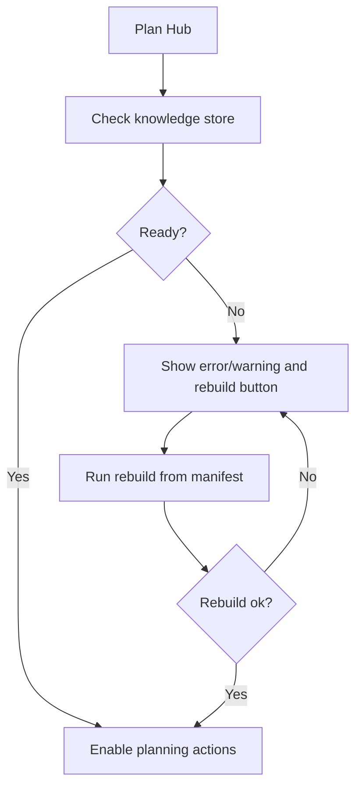

# FEAT: Plan Hub Knowledge Ready Gate

* **ID:** FEAT_plan_hub_knowledge_ready_gate
* **Status:** Implemented
* **Owner/Area:** Plan Hub UI / Knowledge Store
* **Last-Updated:** 2026-04-13
* **Related:** `src/rps/ui/pages/plan/hub.py`, `src/rps/tools/knowledge_search.py`

---

## 1) Context / Problem

**Current behavior**

* Plan Hub can queue planning runs before the local knowledge store is actually ready.
* The startup sync is background-only and may lag behind immediate planning attempts.

**Problem**

* Users see planning fail inside the worker with toolchain STOP messages instead of getting actionable UI feedback before the run starts.

**Constraints**

* The gate should verify the real Qdrant collection, not only local state metadata.
* The UI must offer a rebuild path and clear status feedback.
* Plan Hub runs must be blocked while the required knowledge store is unavailable.

---

## 2) Goals & Non-Goals

**Goals**

* [x] Add a central knowledge-store readiness helper.
* [x] Show knowledge-store status and rebuild feedback in Plan Hub.
* [x] Prevent Plan Hub runs from starting when the knowledge store is not ready.

**Non-Goals**

* [x] Applying the gate to every non-Plan-Hub page in this change.
* [x] Replacing the existing startup vectorstore sync.

---

## 3) Proposed Behavior

**User/System behavior**

* Plan Hub shows `Knowledge Store` status before planning actions.
* If the store is missing or broken, the page shows the problem and a `Rebuild Knowledge Store` action.
* All Plan Hub run buttons are disabled until the store is ready.

**UI impact**

* UI affected: Yes
* If Yes: `Plan -> Plan Hub`

### UI Flow (Mermaid)

---

## 7) Acceptance Criteria (Definition of Done)

* [x] Plan Hub surfaces knowledge-store status in the UI.
* [x] Plan Hub planning actions are disabled when the store is not ready.
* [x] The UI offers a rebuild action and reruns after success.
* [x] Validation passes: `python3 -m py_compile $(git ls-files '*.py')`
