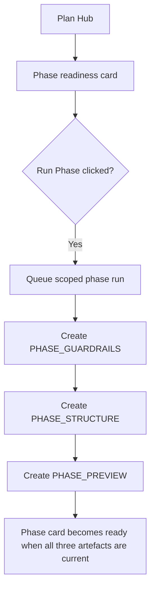

# FEAT: Consolidate Plan Hub Phase Cards

* **ID:** FEAT_plan_hub_phase_card_consolidation
* **Status:** Approved
* **Owner/Area:** Plan Hub UI / Planning
* **Last-Updated:** 2026-04-14
* **Related:** `src/rps/ui/pages/plan/hub.py`, `tests/test_plan_pages.py`, `doc/specs/features/FEAT_plan_hub_phase_step_isolation.md`

---

## 1) Context / Problem

**Current behavior**

* Plan Hub exposes separate readiness cards for `Phase Guardrails`, `Phase Structure`, and `Phase Preview`.
* Direct card actions allow running those phase artefacts individually.
* The advanced manual run area still exposes phase-related scopes individually.

**Problem**

* From the user perspective, these are not three separate planning goals; they are one phase-planning action.
* The current UI forces the user to understand internal artefact boundaries that the system already knows how to orchestrate.
* The page remains more complex than necessary even after the direct-action simplifications.

**Constraints**

* Existing artefact storage remains unchanged: `PHASE_GUARDRAILS`, `PHASE_STRUCTURE`, and `PHASE_PREVIEW` are still separate outputs.
* Direct phase planning must continue to use the existing queue/worker/orchestrator path.
* Week and workout planning dependencies must remain correct.

---

## 2) Goals & Non-Goals

**Goals**

* [x] Replace the three separate phase readiness cards with one `Phase` readiness card in Plan Hub.
* [x] Make the `Run Phase` action generate all three phase artefacts for the selected phase.
* [x] Remove `Phase Guardrails`, `Phase Structure`, and `Phase Preview` as separate user-facing scopes from the advanced manual run UI.
* [x] Preserve internal artefact dependency tracking so week planning still works.

**Non-Goals**

* [x] Changing the underlying artefact model or schemas.
* [x] Removing the internal distinction between guardrails, structure, and preview in the orchestrator.
* [x] Changing week/workout execution semantics.

---

## 3) Proposed Behavior

**User/System behavior**

* Plan Hub shows one `Phase` readiness card instead of three separate phase cards.
* The card status is derived from the combined state of `Phase Guardrails`, `Phase Structure`, and `Phase Preview`.
* Clicking `Run Phase` queues one scoped phase run that produces `PHASE_GUARDRAILS`, `PHASE_STRUCTURE`, and `PHASE_PREVIEW` for the selected phase.
* The advanced manual run section exposes one `Phase` scope instead of separate guardrails/structure/preview scopes.

**UI impact**

* UI affected: Yes
* If Yes: `Plan -> Plan Hub` readiness cards and advanced manual run scope selector

### UI Flow (Mermaid)

**Non-UI behavior (if applicable)**

* Components involved: `src/rps/ui/pages/plan/hub.py`, existing phase execution path via `execute_plan_week`
* Contracts touched: run-step composition for user-facing phase scope only

---

## 4) Implementation Analysis

**Components / Modules**

* `src/rps/ui/pages/plan/hub.py`: replace phase-card rendering with a combined `phase` readiness step and simplify scope options.
* `tests/test_plan_pages.py`: update assertions to reflect the single phase card and single phase scope semantics.
* `doc/specs/features/FEAT_plan_hub_phase_step_isolation.md`: align wording so user-facing phase scope means the combined phase action.

**Data flow**

* Inputs: readiness state of `phase_guardrails`, `phase_structure`, `phase_preview`; selected phase label.
* Processing: derive one combined `phase` readiness step; queue phase scope with all three phase write steps.
* Outputs: unchanged artefacts, simplified user-facing UI.

**Schema / Artefacts**

* New artefacts: none
* Changed artefacts: none
* Validator implications: none

---

## 5) Impact Analysis (complete)

**Compatibility**

* Backward compatible: Yes
* Breaking changes: user-visible Plan Hub scopes and cards become simpler; the separate phase scopes disappear from the UI.
* Fallback behavior: internal readiness keys remain available for dependency evaluation.

**Conflicts with ADRs / Principles**

* Potential conflicts: none identified.
* Resolution: aligns better with the rule that the UI should surface the actual next action rather than internal orchestration details.

**Impacted areas**

* UI: readiness cards, scope selector, summary text
* Pipeline/data: none
* Renderer: none
* Workspace/run-store: run payloads will use the combined `Phase` user-facing scope
* Validation/tooling: tests and docs need updates
* Deployment/config: none

**Required refactoring**

* add a combined readiness projection for phase state
* remove separate user-facing phase scopes from the manual run selector
* update direct card action rendering and associated tests

---

## 6) Options & Recommendation

### Option A — Single user-facing phase card, keep internal artefacts separate

**Summary**

* Consolidate the Plan Hub UI while preserving the existing internal artefact boundaries.

**Pros**

* Simplifies the page for the user.
* Preserves orchestrator and storage model.
* Keeps week/workout dependency logic intact.

**Cons**

* Requires a combined readiness projection on top of the existing internal steps.

### Option B — Keep separate phase cards and only relabel them

**Summary**

* Leave the three cards in place and try to reduce confusion with labels/help text.

**Pros**

* Smaller UI change.

**Cons**

* Does not solve the actual usability problem.

### Recommendation

* Choose: Option A
* Rationale: the page should reflect the planning action the user intends, not the internal implementation split.

---

## 7) Acceptance Criteria (Definition of Done)

* [x] Plan Hub renders one `Phase` readiness card instead of separate `Phase Guardrails`, `Phase Structure`, and `Phase Preview` cards.
* [x] `Run Phase` queues `PHASE_GUARDRAILS`, `PHASE_STRUCTURE`, and `PHASE_PREVIEW` for the selected phase.
* [x] Advanced manual run exposes a single `Phase` scope.
* [x] Validation passes: `python3 -m py_compile` on changed files.
* [x] Validation passes: targeted `pytest` for Plan Hub behavior.
* [x] No regressions in week/workout dependency queueing.

---

## 8) Migration / Rollout

**Migration strategy**

* None required.

**Rollout / gating**

* Feature flag / config: none
* Safe rollback: restore the previous three-card rendering and scope list in `hub.py`

---

## 9) Risks & Failure Modes

* Failure mode: combined phase status hides which internal phase artefact is stale

  * Detection: card summary/reason no longer clearly names the stale internal artefact
  * Safe behavior: combined card must still describe which internal artefact is missing or stale
  * Recovery: improve combined card reason text without restoring separate cards

* Failure mode: `Run Phase` no longer includes all three internal artefacts

  * Detection: queued step list and tests show missing phase steps
  * Safe behavior: run fails visibly instead of silently partial-completing
  * Recovery: restore `SCOPE_STEPS["Phase"]` and related dependency expansion

---

## 10) Observability / Logging

**New/changed events**

* No new event families
* Existing Plan Hub run records should show user-facing scope `Phase`

**Diagnostics**

* `runtime/athletes/<athlete_id>/runs/`
* `runtime/athletes/<athlete_id>/logs/rps.log`

---

## 11) Documentation Updates

* [x] `doc/specs/features/FEAT_plan_hub_phase_card_consolidation.md` — document the UI consolidation
* [ ] `doc/specs/features/FEAT_plan_hub_phase_step_isolation.md` — align user-facing scope wording
* [ ] `CHANGELOG.md` — record the simplified phase card behavior

---

## 12) Link Map (no duplication; links only)

* `doc/specs/features/FEAT_plan_hub_direct_step_actions.md`
* `doc/specs/features/FEAT_plan_hub_simplification.md`
* `doc/specs/features/FEAT_plan_hub_phase_step_isolation.md`
* `doc/ui/pages/plan_hub.md`
* `doc/overview/artefact_flow.md`

