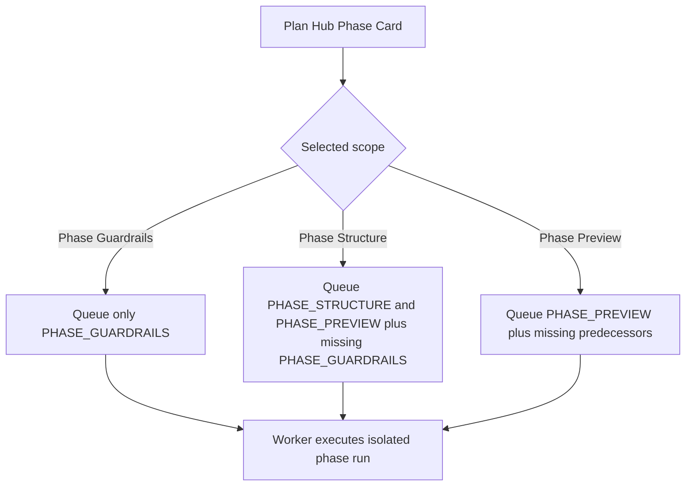

# FEAT: Plan Hub Phase Step Isolation

* **ID:** FEAT_plan_hub_phase_step_isolation
* **Status:** Approved
* **Owner/Area:** Plan Hub UI / Plan Week Orchestrator
* **Last-Updated:** 2026-04-13
* **Related:** `src/rps/ui/pages/plan/hub.py`, `src/rps/orchestrator/plan_week.py`, `tests/test_plan_pages.py`

---

## 1) Context / Problem

**Current behavior**

* Plan Hub direct action buttons for phase artefacts queue regular scoped runs.
* The `Phase Guardrails` scope currently expands into downstream steps (`PHASE_STRUCTURE`, `PHASE_PREVIEW`, `WEEK_PLAN`, `EXPORT_WORKOUTS`).
* `plan_week(...)` also auto-escalates from forced phase steps into later phase/week outputs.

**Problem**

* Clicking `Run Phase` on the `Phase Guardrails` card does not behave as an isolated guardrails rerun.
* The run fails when downstream artefacts cannot be created, even though the user asked only for Guardrails.

**Constraints**

* Direct actions must still use the existing run-store + worker path.
* `Week Plan` and `Build Workouts` may still auto-add required predecessors.
* Orchestrated runs must keep the full cascade semantics.

---

## 2) Goals & Non-Goals

**Goals**

* [x] `Phase Guardrails` direct/scoped runs only rerun Guardrails.
* [x] `Phase Structure` direct/scoped runs rerun Structure and Preview, adding Guardrails only when required.
* [x] `Phase Preview` direct/scoped runs rerun Preview, adding missing predecessors only when required.

**Non-Goals**

* [x] Changing orchestrated full-plan execution semantics.
* [x] Removing prerequisite checks for later phase/week outputs.

---

## 3) Proposed Behavior

**User/System behavior**

* A scoped run for `Phase Guardrails` queues only the `PHASE_GUARDRAILS` step.
* A forced `PHASE_GUARDRAILS` execution inside `plan_week(...)` stops successfully after Guardrails exists for the exact phase range.
* Direct actions for later phase steps remain dependency-aware, but only for prerequisites, not unrelated downstream outputs.
* A scoped `Phase Structure` run also produces `Phase Preview`, because Preview is the immediate dependent phase artefact and should stay aligned with the rerun structure output.

**UI impact**

* UI affected: Yes
* If Yes: `Plan -> Plan Hub` direct action buttons and `Run scoped` step selection behavior

### UI Flow (Mermaid)

**Non-UI behavior (if applicable)**

* Components involved: `src/rps/ui/pages/plan/hub.py`, `src/rps/orchestrator/plan_week.py`
* Contracts touched: run-store step composition only

---

## 4) Implementation Analysis

**Components / Modules**

* `src/rps/ui/pages/plan/hub.py`: narrow phase-scoped step lists and keep `Phase Structure` coupled to `Phase Preview`.
* `src/rps/orchestrator/plan_week.py`: treat isolated forced phase steps as valid terminal runs once their requested artefacts exist, and require Preview for explicit structure reruns.
* `tests/test_plan_pages.py`: add regression tests for both queue composition and isolated plan-week execution.

**Data flow**

* Inputs: scoped run scope, forced step ids, exact-range artefact existence
* Processing: build only necessary steps, execute only requested phase target, short-circuit success before week planning when appropriate
* Outputs: successful isolated phase reruns without downstream failures

**Schema / Artefacts**

* New artefacts: none
* Changed artefacts: none
* Validator implications: none

---

## 5) Impact Analysis (complete)

**Compatibility**

* Backward compatible: Yes
* Breaking changes: scoped phase direct actions become narrower and more correct
* Fallback behavior: downstream planning remains available via explicit later actions or orchestrated runs

**Conflicts with ADRs / Principles**

* Potential conflicts: none identified
* Resolution: aligns better with scoped planning semantics in `AGENTS.md`

**Impacted areas**

* UI: direct/scoped phase action behavior
* Pipeline/data: none
* Renderer: none
* Workspace/run-store: scoped runs contain fewer inappropriate steps
* Validation/tooling: regression coverage added
* Deployment/config: none

**Required refactoring**

* isolate phase scope mappings
* add explicit plan-week early-exit logic for isolated phase force runs

---

## 6) Options & Recommendation

### Option A — Isolate phase direct actions and add orchestrator short-circuit

**Summary**

* Keep the existing worker path, but make phase direct actions represent exactly the chosen phase artefact.

**Pros**

* Matches user intent exactly.
* Keeps worker/orchestrator architecture intact.
* Prevents false failures from unrelated downstream artefacts.

**Cons**

* Adds one more branching case inside `plan_week(...)`.

### Option B — Keep broad scoped queues and only change UI labels

**Summary**

* Preserve current cascade semantics and document them better.

**Pros**

* Minimal code change.

**Cons**

* Still wrong for the reported user workflow.

### Recommendation

* Choose: Option A
* Rationale: the bug is semantic, not cosmetic; the execution path must match the button label.

---

## 7) Acceptance Criteria (Definition of Done)

* [x] `Phase Guardrails` scoped runs queue only `PHASE_GUARDRAILS`.
* [x] `Phase Structure` scoped runs queue `PHASE_STRUCTURE` and `PHASE_PREVIEW`.
* [x] Isolated `force_steps=["PHASE_GUARDRAILS"]` runs can succeed without creating structure/preview/week artefacts.
* [x] Existing `Week Plan` and `Build Workouts` dependency behavior remains intact.
* [x] Validation passes: `python3 -m py_compile $(git ls-files '*.py')`
* [x] Validation passes: `pytest -q tests/test_plan_pages.py -k 'plan_hub or plan_week_force'`

---

## 8) Migration / Rollout

**Migration strategy**

* None required.

**Rollout / gating**

* Feature flag / config: none
* Safe rollback: revert the scope mapping and isolated force-step logic

---

## 9) Risks & Failure Modes

* Failure mode: isolated phase runs stop too early

  * Detection: requested artefact missing after successful completion
  * Safe behavior: run should fail if the requested exact-range artefact still does not exist
  * Recovery: inspect exact-range success check in `plan_week(...)`

* Failure mode: week/workout scoped runs lose predecessor auto-creation

  * Detection: existing `Week Plan` / `Build Workouts` tests fail
  * Safe behavior: validation blocks merge
  * Recovery: restore prerequisite expansion only for week/workout scopes

---

## 10) Observability / Logging

**New/changed events**

* no new event types
* existing `plan_week` logs should show that isolated `Phase Structure` reruns include `Phase Preview`

**Diagnostics**

* `runtime/athletes/<athlete_id>/logs/rps.log`
* Plan Hub run-store entries in `runtime/athletes/<athlete_id>/runs/`

---

## 11) Documentation Updates

* [x] `doc/specs/features/FEAT_plan_hub_phase_step_isolation.md` — document the scoped isolation fix
* [x] `CHANGELOG.md` — record the bug fix

---

## 12) Link Map (no duplication; links only)

* `doc/specs/features/FEAT_plan_hub_direct_step_actions.md`
* `doc/specs/features/FEAT_plan_hub_scoped_force_reruns.md`
* `doc/overview/how_to_plan.md`
* `doc/overview/artefact_flow.md`
