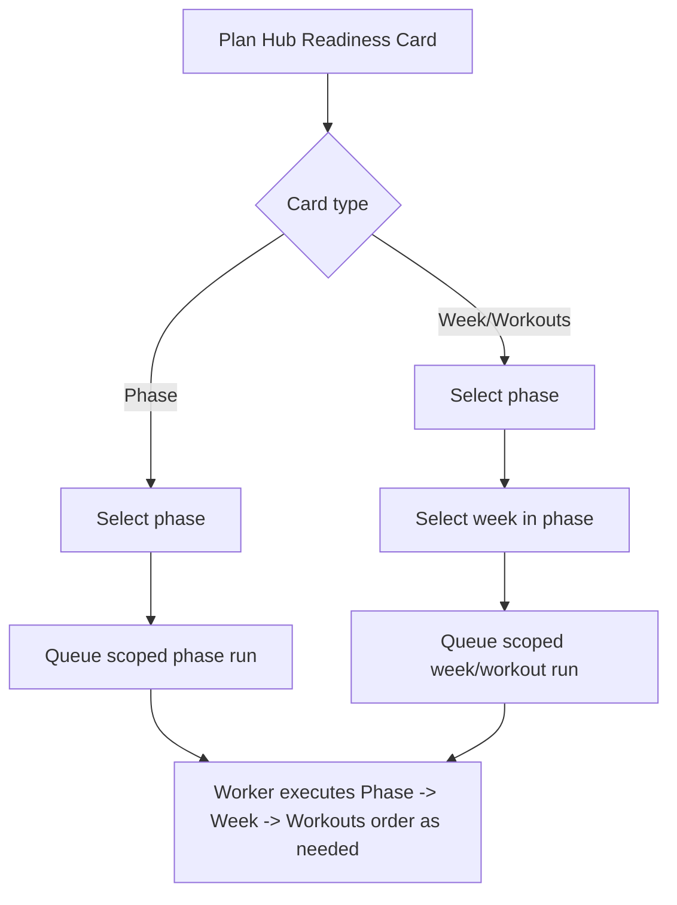

# FEAT: Plan Hub Phase And Week Selectors

* **ID:** FEAT_plan_hub_phase_week_selectors
* **Status:** Implemented
* **Owner/Area:** Plan Hub UI
* **Last-Updated:** 2026-04-13
* **Related:** `src/rps/ui/pages/plan/hub.py`, `tests/test_plan_pages.py`

---

## 1) Context / Problem

**Current behavior**

* Plan Hub direct step actions on phase and week cards were limited to current/next heuristics.
* The Run Planning area also enforced a current/next ISO-week restriction.

**Problem**

* Users need to choose an explicit phase and, for week/workout planning, an explicit week inside that phase.
* Planning should remain possible whenever the selected target is part of the season plan, not only for current/next week.

**Constraints**

* Defaults should point to the phase covering the current ISO week where possible.
* Week choices must stay aligned with the selected phase range.
* Execution must continue to use the normal Plan Hub worker/run-store path.

---

## 2) Goals & Non-Goals

**Goals**

* [x] Add a phase selector to phase readiness cards.
* [x] Add phase and week selectors to week/workout readiness cards.
* [x] Default selectors to the phase and week associated with the current ISO week.
* [x] Remove current/next-only gating from Plan Hub planning actions.

**Non-Goals**

* [x] Redesigning non-Plan-Hub pages.
* [x] Changing planner orchestration order.

---

## 3) Proposed Behavior

**User/System behavior**

* Phase cards expose a `Phase` selector and a single run button for the chosen phase.
* Week and workout cards expose `Phase` and `Week` selectors and a run button for the chosen week.
* The default phase is the phase covering the current ISO week; the default week is the currently selected ISO week if it belongs to the chosen phase, otherwise the phase start week.
* Plan Hub no longer blocks planning purely because the target is outside current/next week.

**UI impact**

* UI affected: Yes
* If Yes: `Plan -> Plan Hub` readiness cards and planning actions

### UI Flow (Mermaid)

---

## 4) Implementation Analysis

**Components / Modules**

* `src/rps/ui/pages/plan/hub.py`: selector helpers, selector-based direct actions, removal of current/next gating.
* `tests/test_plan_pages.py`: selector helper and UI rendering coverage.

**Data flow**

* Inputs: season-plan phases, selected phase, selected week
* Processing: resolve default phase/week, build scoped run for selected target
* Outputs: queued scoped planning run

**Schema / Artefacts**

* New artefacts: none
* Changed artefacts: none
* Validator implications: none

---

## 5) Impact Analysis (complete)

**Compatibility**

* Backward compatible: Yes
* Breaking changes: current/next-only Plan Hub restriction removed
* Fallback behavior: if no season plan phases exist, selectors are not rendered

**Impacted areas**

* UI: richer target selection
* Pipeline/data: no schema change
* Workspace/run-store: more explicit scoped runs
* Validation/tooling: targeted tests

---

## 6) Options & Recommendation

### Option A — Selector-based actions on the cards

**Summary**

* Let the user choose phase/week directly where the stale state is displayed.

**Pros**

* Matches operational troubleshooting flow.
* Removes fragile current/next assumptions.

**Cons**

* Adds a bit more UI control surface.

### Recommendation

* Choose: Option A
* Rationale: it is the minimal change that gives the user deterministic control.

---

## 7) Acceptance Criteria (Definition of Done)

* [x] Phase cards show a phase selector defaulting to the current-week phase.
* [x] Week/workout cards show phase and week selectors with stable defaults.
* [x] Plan Hub actions are no longer blocked by current/next week gating.
* [x] Validation passes: `python3 -m py_compile $(git ls-files '*.py')`
* [x] Validation passes: targeted Plan Hub tests

---

## 8) Migration / Rollout

**Migration strategy**

* None.

**Rollout / gating**

* Feature flag / config: none
* Safe rollback: revert selector UI and gating changes

---

## 9) Risks & Failure Modes

* Failure mode: wrong default phase/week is selected
  * Detection: card selector defaults do not align with the current ISO week
  * Safe behavior: user can manually select the intended phase/week
  * Recovery: inspect selector helper logic

---

## 10) Observability / Logging

**Diagnostics**

* Run records in Plan Hub contain selected `iso_year`, `iso_week`, and `phase_label`

---

## 11) Documentation Updates

* [x] `doc/specs/features/FEAT_plan_hub_phase_week_selectors.md`
* [ ] `CHANGELOG.md`
