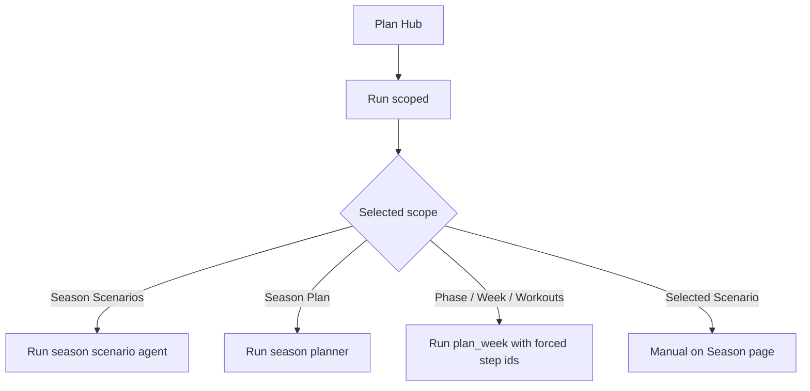

# FEAT: Plan Hub Scoped Force Reruns

* **ID:** FEAT_plan_hub_scoped_force_reruns
* **Status:** Implemented
* **Owner/Area:** Plan Hub UI / Orchestrators
* **Last-Updated:** 2026-03-16
* **Related:** `src/rps/ui/pages/plan/hub.py`, `src/rps/orchestrator/season_flow.py`, `src/rps/orchestrator/plan_week.py`

---

## 1) Context / Problem

**Current behavior**

* Plan Hub supports scoped runs for season, phase, week, and workouts.
* Explicit scoped reruns should recreate the selected scope even when matching artifacts already exist.

**Problem**

* Week/workout scoped reruns previously stopped after detecting current artifacts.
* We need consistent confirmation of rerun semantics across season and phase scoped paths.

**Constraints**

* Manual scenario selection remains a Season page action.
* The current/next ISO-week restriction for planning remains unchanged.

---

## 2) Goals & Non-Goals

**Goals**

* [x] Confirm season scoped runs do not short-circuit on existing artifacts.
* [x] Confirm phase scoped runs force reruns through the plan-week orchestrator.
* [x] Lock the behavior with focused tests.

**Non-Goals**

* [x] Moving manual scenario selection into Plan Hub.
* [x] Changing planning scope rules.

---

## 3) Proposed Behavior

**User/System behavior**

* Scoped `Season Scenarios` and `Season Plan` runs execute even when artifacts already exist.
* Scoped phase/phase-preview/week/workout steps explicitly rerun when selected from Plan Hub.
* Scoped `Selected Scenario` stays manual and redirects to the Season page workflow.

**UI impact**

* UI affected: Yes
* If Yes: Plan Hub scoped run semantics remain explicit and predictable.

### UI Flow (Mermaid)

**Non-UI behavior (if applicable)**

* Components involved: `season_flow`, `plan_week`, Plan Hub worker/action delegates
* Contracts touched: scoped run execution only

---

## 4) Implementation Analysis

**Components / Modules**

* `src/rps/orchestrator/season_flow.py`: season scoped paths already execute directly without reuse gating.
* `src/rps/orchestrator/plan_week.py`: forced-step rerun logic handles phase/week/workout scoped reruns.
* `tests/test_plan_pages.py`: verify season and phase scoped semantics.

**Data flow**

* Inputs: selected scoped run, worker step id
* Processing: dispatch direct season calls or force specific plan-week steps
* Outputs: queued worker steps that actually regenerate requested artifacts

**Schema / Artefacts**

* New artefacts: none
* Changed artefacts: none
* Validator implications: none

---

## 5) Impact Analysis

**Compatibility**

* Backward compatible: Yes
* Breaking changes: none
* Fallback behavior: selected-scenario remains manual

**Conflicts with ADRs / Principles**

* Potential conflicts: none
* Resolution: consistent with UI-only orchestration and scoped-planning principles

**Impacted areas**

* UI: clearer scoped rerun behavior
* Pipeline/data: none
* Renderer: none
* Workspace/run-store: run steps execute as requested
* Validation/tooling: added focused tests
* Deployment/config: none

**Required refactoring**

* None

---

## 6) Options & Recommendation

### Option A — Keep scoped reruns explicit per orchestrator path

**Summary**

* Season calls execute directly; phase/week/workout calls use forced step ids.

**Pros**

* Minimal and explicit.
* Matches existing architecture boundaries.

**Cons**

* Different implementation details per orchestrator path.

### Option B — Introduce one global force-rerun abstraction

**Summary**

* Push one generic force-rerun flag through every planning entrypoint.

**Pros**

* Uniform API.

**Cons**

* More invasive than needed for current scope.

### Recommendation

* Choose: Option A
* Rationale: it matches the current separation between season flow and plan-week flow with less risk.

---

## 7) Acceptance Criteria (Definition of Done)

* [x] Season scoped paths are verified to execute without artifact reuse gating.
* [x] Phase scoped paths are verified to force reruns through `plan_week`.
* [x] `Selected Scenario` is documented as manual-only.
* [x] Validation passes: `python3 -m py_compile $(git ls-files '*.py')`

---

## 8) Migration / Rollout

**Migration strategy**

* None.

**Rollout / gating**

* Feature flag / config: none
* Safe rollback: revert scoped rerun worker/orchestrator changes

---

## 9) Risks & Failure Modes

* Failure mode: a scoped rerun silently reuses an existing artifact
* Detection: logs show `Found ...` instead of rerun execution for an explicitly selected scope
* Safe behavior: no destructive artifact deletion
* Recovery: inspect scoped worker dispatch and force-step routing

---

## 10) Observability / Logging

**New/changed events**

* No new event types

**Diagnostics**

* Per-run logs and run-store steps under `runtime/athletes/<athlete_id>/runs/<run_id>/`

---

## 11) Documentation Updates

* [x] `doc/specs/features/FEAT_plan_hub_scoped_force_reruns.md` - record season/phase scoped rerun semantics

---

## 12) Link Map (no duplication; links only)

* UI flows/actions: `doc/ui/flows.md`
* UI contract (Streamlit): `doc/ui/streamlit_contract.md`
* Architecture: `doc/architecture/system_architecture.md`
* Workspace: `doc/architecture/workspace.md`
* Schema versioning: `doc/architecture/schema_versioning.md`
* Logging policy: `doc/specs/contracts/logging_policy.md`
* Validation / runbooks: `doc/runbooks/validation.md`
* ADRs: `doc/adr/ADR-001-ui-delegates-orchestrators.md`
