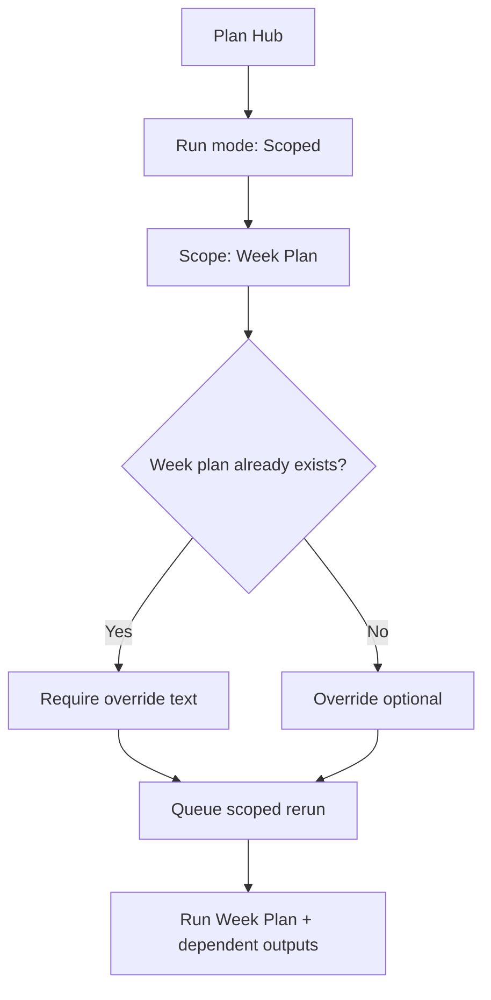

# FEAT: Plan Hub Scoped Week Replan

* **ID:** FEAT_plan_hub_scoped_week_replan
* **Status:** Implemented
* **Owner/Area:** Plan Hub UI
* **Last-Updated:** 2026-03-16
* **Related:** `src/rps/ui/pages/plan/hub.py`

---

## 1) Context / Problem

**Current behavior**

* Plan Hub exposes a scoped `Week Plan` run intended for re-planning an already planned week.
* Existing readiness logic requires an override when a week plan already exists.
* The run record is created, but existing ready steps are marked `SKIPPED`.

**Problem**

* A scoped `Week Plan` rerun does not actually execute when the week plan already exists.
* Users cannot re-plan the current/next week from Plan Hub even though the UI implies that scoped reruns are supported.

**Constraints**

* Planning scope must remain limited to the current or next ISO week.
* Existing override gating must remain in place when modifying existing artifacts.
* UI pages must continue delegating execution to orchestrator/worker helpers.

---

## 2) Goals & Non-Goals

**Goals**

* [x] Allow `Plan Hub -> Run scoped -> Week Plan` to rerun an already planned week.
* [x] Keep override-required behavior when modifying existing planning artifacts.
* [x] Regenerate dependent outputs for the selected scoped run.

**Non-Goals**

* [x] Changing season/phase planning rules outside the scoped rerun flow.
* [x] Expanding planning beyond the current or next ISO week.

---

## 3) Proposed Behavior

**User/System behavior**

* When a user selects `Run scoped` with scope `Week Plan`, the selected scope is treated as an explicit rerun request.
* If the selected scope already exists, the run still queues execution rather than marking the step as already up to date.
* Dependent outputs selected by the scope mapping are rerun as part of the same scoped request.

**UI impact**

* UI affected: Yes
* If Yes: `Plan Hub` scoped execution for `Week Plan` and any dependent selected outputs

### UI Flow (Mermaid)

**Non-UI behavior (if applicable)**

* Components involved: `src/rps/ui/pages/plan/hub.py`, run-store worker execution
* Contracts touched: scoped run step-status generation only

---

## 4) Implementation Analysis

**Components / Modules**

* `src/rps/ui/pages/plan/hub.py`: force queued execution for explicitly selected scoped steps instead of treating them as up to date.
* `tests/test_plan_pages.py`: cover the scoped rerun step selection behavior.

**Data flow**

* Inputs: readiness state, selected run mode, selected scope, optional override text
* Processing: build execution steps for scoped run and mark selected scoped steps as rerun targets
* Outputs: queued run-store steps that the worker actually executes

**Schema / Artefacts**

* New artefacts: none
* Changed artefacts: none
* Validator implications: none

---

## 5) Impact Analysis

**Compatibility**

* Backward compatible: Yes
* Breaking changes: none
* Fallback behavior: scoped steps remain skipped when they are not part of the explicit rerun selection

**Conflicts with ADRs / Principles**

* Potential conflicts: none
* Resolution: aligns with UI-delegates-orchestrators and scoped-planning rules already documented

**Impacted areas**

* UI: scoped run behavior now matches user expectation
* Pipeline/data: no schema or artifact changes
* Renderer: none
* Workspace/run-store: run steps now queue for explicit scoped reruns
* Validation/tooling: test coverage added
* Deployment/config: none

**Required refactoring**

* None beyond targeted run-step logic cleanup

---

## 6) Options & Recommendation

### Option A — Force queued execution for explicitly selected scoped steps

**Summary**

* Treat the selected scope and its dependent outputs as an explicit rerun request.

**Pros**

* Matches UI wording and user expectation.
* Minimal change surface.
* Preserves readiness and override semantics.

**Cons**

* Scoped reruns intentionally bypass "already up to date" optimization for the selected path.

**Risk**

* Low; rerun remains user-triggered and scope-limited.

### Option B — Delete latest artifacts before scoped rerun

**Summary**

* Remove current artifacts so readiness turns `missing`/`stale` before building steps.

**Pros**

* Reuses existing readiness-to-queue logic unchanged.

**Cons**

* More destructive.
* Harder to reason about and recover from.

### Recommendation

* Choose: Option A
* Rationale: explicit rerun intent should be represented in step status, not via artifact deletion.

---

## 7) Acceptance Criteria (Definition of Done)

* [x] Scoped `Week Plan` reruns queue execution even when the current week plan is already `ready`.
* [x] Dependent outputs in the scoped mapping also queue for rerun.
* [x] Override remains required when modifying an existing week plan.
* [x] Validation passes: `python3 -m py_compile $(git ls-files '*.py')`
* [x] No regressions in: Plan Hub page load and plan page tests

---

## 8) Migration / Rollout

**Migration strategy**

* None required.

**Rollout / gating**

* Feature flag / config: none
* Safe rollback: revert the Plan Hub scoped step-status change

---

## 9) Risks & Failure Modes

* Failure mode: a scoped rerun still shows `SKIPPED`
* Detection: run-store step list shows `SKIPPED` for the selected scope during a scoped rerun
* Safe behavior: no artifact deletion occurs
* Recovery: inspect `_build_execution_steps(...)` scoped force-run logic

---

## 10) Observability / Logging

**New/changed events**

* No new event types

**Diagnostics**

* Run-store `steps` entries in `runtime/athletes/<athlete_id>/runs/<run_id>/`

---

## 11) Documentation Updates

* [x] `doc/specs/features/FEAT_plan_hub_scoped_week_replan.md` - add feature record for scoped week rerun behavior
* [x] `doc/ui/pages/plan_hub.md` - clarify scoped rerun behavior for existing week plans

---

## 12) Link Map (no duplication; links only)

* UI flows/actions: `doc/ui/flows.md`
* UI contract (Streamlit): `doc/ui/streamlit_contract.md`
* Architecture: `doc/architecture/system_architecture.md`
* Workspace: `doc/architecture/workspace.md`
* Schema versioning: `doc/architecture/schema_versioning.md`
* Logging policy: `doc/specs/contracts/logging_policy.md`
* Validation / runbooks: `doc/runbooks/validation.md`
* ADRs: `doc/adr/ADR-001-ui-delegates-orchestrators.md`
